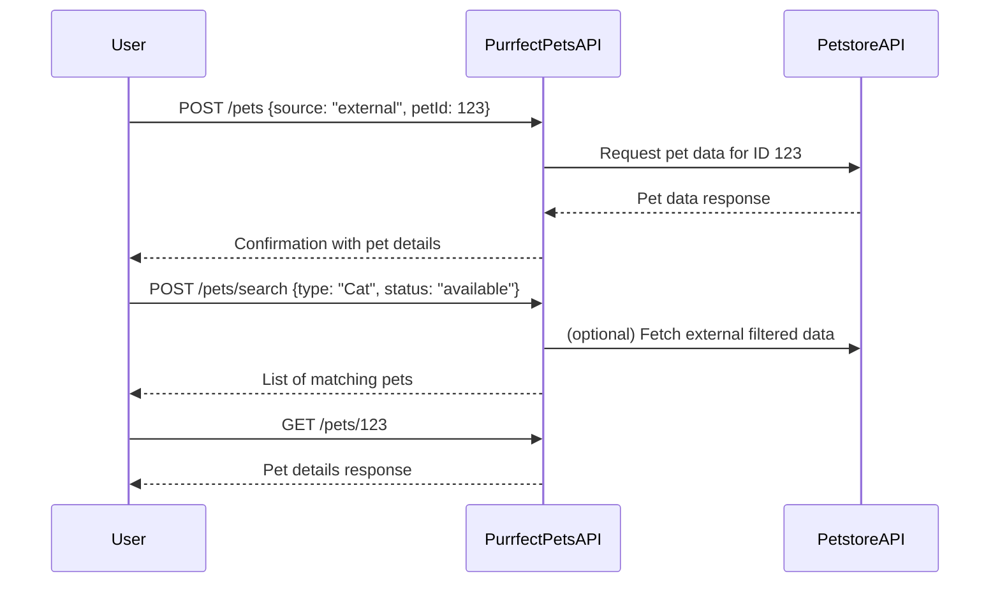
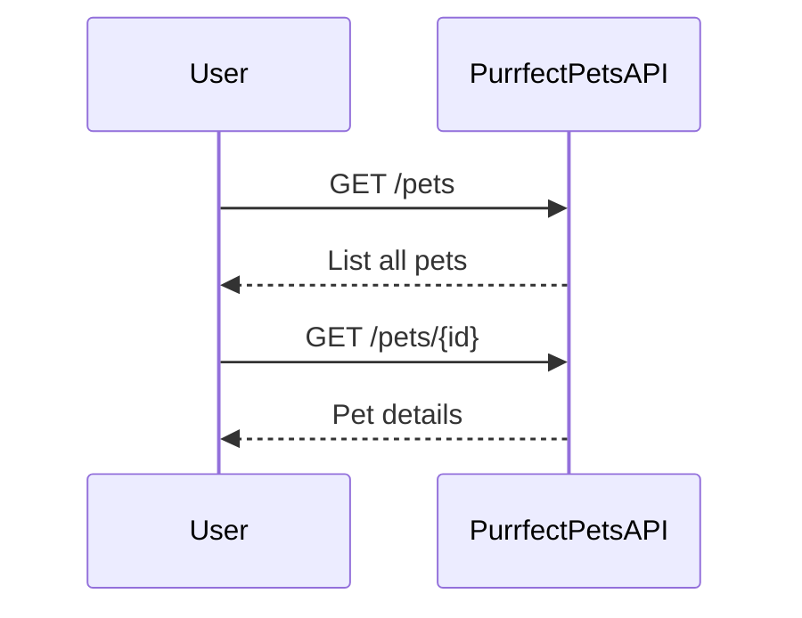

# Purrfect Pets API Functional Requirements

## API Endpoints

### 1. Add or Update Pet Data (POST /pets)
- **Description:** Fetches pet data from the external Petstore API or updates pet information in the app.
- **Request Body:**  
```json
{
  "source": "external", // or "internal"
  "petId": 123,         // optional when adding new pet
  "petData": {          // required if source is "internal"
    "name": "Fluffy",
    "type": "Cat",
    "age": 3,
    "status": "available"
  }
}
```
- **Response:**  
```json
{
  "success": true,
  "pet": {
    "id": 123,
    "name": "Fluffy",
    "type": "Cat",
    "age": 3,
    "status": "available"
  }
}
```

### 2. Search Pets (POST /pets/search)
- **Description:** Searches pets based on filters like type, status, age, etc., possibly combining external Petstore API data and internal data.
- **Request Body:**  
```json
{
  "type": "Cat",           // optional
  "status": "available",   // optional
  "minAge": 1,             // optional
  "maxAge": 5              // optional
}
```
- **Response:**  
```json
{
  "results": [
    {
      "id": 123,
      "name": "Fluffy",
      "type": "Cat",
      "age": 3,
      "status": "available"
    },
    ...
  ]
}
```

### 3. Retrieve Pet Details (GET /pets/{id})
- **Description:** Retrieves stored pet details by pet ID.
- **Response:**  
```json
{
  "id": 123,
  "name": "Fluffy",
  "type": "Cat",
  "age": 3,
  "status": "available"
}
```

### 4. Retrieve All Pets (GET /pets)
- **Description:** Retrieves all stored pets in the system.
- **Response:**  
```json
[
  {
    "id": 123,
    "name": "Fluffy",
    "type": "Cat",
    "age": 3,
    "status": "available"
  },
  ...
]
```

---

## Business Logic Notes
- All external API calls or data processing must be triggered via POST endpoints (`/pets` for add/update, `/pets/search` for searching).
- GET endpoints are strictly for retrieving stored data without invoking external calls.
- POST `/pets` with `"source": "external"` will fetch pet data from Petstore API by the given `petId` and store or update it internally.

---

## User-App Interaction Sequence Diagram


```mermaid
sequenceDiagram
    participant User
    participant PurrfectPetsAPI
    participant PetstoreAPI

    User->>PurrfectPetsAPI: POST /pets {source: "external", petId: 123}
    PurrfectPetsAPI->>PetstoreAPI: Request pet data for ID 123
    PetstoreAPI-->>PurrfectPetsAPI: Pet data response
    PurrfectPetsAPI-->>User: Confirmation with pet details

    User->>PurrfectPetsAPI: POST /pets/search {type: "Cat", status: "available"}
    PurrfectPetsAPI->>PetstoreAPI: (optional) Fetch external filtered data
    PurrfectPetsAPI-->>User: List of matching pets

    User->>PurrfectPetsAPI: GET /pets/123
    PurrfectPetsAPI-->>User: Pet details response
```

---

## User Retrieval Journey Diagram


```mermaid
sequenceDiagram
    participant User
    participant PurrfectPetsAPI

    User->>PurrfectPetsAPI: GET /pets
    PurrfectPetsAPI-->>User: List all pets

    User->>PurrfectPetsAPI: GET /pets/{id}
    PurrfectPetsAPI-->>User: Pet details
```