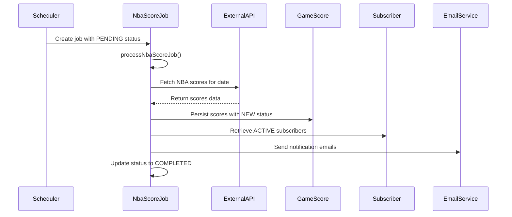
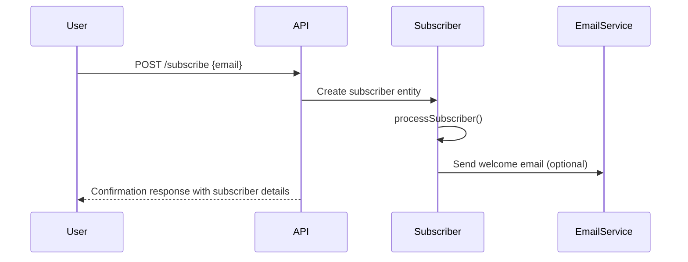

### 1. Entity Definitions

``` 
NbaScoreJob:
- id: UUID (unique identifier for the job)
- date: LocalDate (the date for which NBA scores are fetched)
- status: JobStatusEnum (PENDING, IN_PROGRESS, COMPLETED, FAILED)
- createdAt: DateTime (job creation timestamp)
- completedAt: DateTime (job completion timestamp)

Subscriber:
- id: UUID (unique identifier)
- email: String (subscriber's email address)
- status: SubscriptionStatusEnum (ACTIVE, INACTIVE)
- subscribedAt: DateTime (timestamp of subscription)

GameScore:
- id: UUID (unique identifier for the game score entry)
- gameDate: LocalDate (date of the game)
- homeTeam: String (home team name)
- awayTeam: String (away team name)
- homeScore: Integer (home team score)
- awayScore: Integer (away team score)
- status: ScoreStatusEnum (NEW, PROCESSED)
```

---

### 2. Process Method Flows

``` 
processNbaScoreJob() Flow:
1. Initial State: Job created with PENDING status
2. Start Processing: Update status to IN_PROGRESS
3. Data Fetching: Call external NBA API asynchronously for the job date
4. Data Persistence: Save fetched GameScore entities with NEW status
5. Notification Trigger: Send emails to all ACTIVE Subscribers with game summaries
6. Completion: Update job status to COMPLETED or FAILED depending on outcome

processSubscriber() Flow:
1. Initial State: New subscriber created with ACTIVE status
2. Validation: Verify email format and duplicates
3. Persistence: Save subscriber entity
4. (Optional) Send welcome email notification

processGameScore() Flow:
1. Initial State: GameScore created with NEW status during job processing
2. Processing: Mark score as PROCESSED once included in notification email
3. Persistence: Update status accordingly
```

---

### 3. API Endpoints & Request/Response Formats

- **POST /subscribe**  
  Request:  
  ```json
  {
    "email": "user@example.com"
  }
  ```  
  Response:  
  ```json
  {
    "id": "uuid",
    "email": "user@example.com",
    "status": "ACTIVE",
    "subscribedAt": "2025-03-25T18:00:00Z"
  }
  ```

- **GET /subscribers**  
  Response:  
  ```json
  [
    {
      "id": "uuid",
      "email": "user@example.com",
      "status": "ACTIVE",
      "subscribedAt": "2025-03-25T18:00:00Z"
    }
  ]
  ```

- **GET /games/all?limit=20&offset=0**  
  Response:  
  ```json
  [
    {
      "id": "uuid",
      "gameDate": "2025-03-25",
      "homeTeam": "Lakers",
      "awayTeam": "Warriors",
      "homeScore": 110,
      "awayScore": 108,
      "status": "PROCESSED"
    }
  ]
  ```

- **GET /games/{date}**  
  Response:  
  ```json
  [
    {
      "id": "uuid",
      "gameDate": "2025-03-25",
      "homeTeam": "Lakers",
      "awayTeam": "Warriors",
      "homeScore": 110,
      "awayScore": 108,
      "status": "PROCESSED"
    }
  ]
  ```

- **POST /jobs/nba-score** (Optional, to manually trigger a fetch job)  
  Request:  
  ```json
  {
    "date": "2025-03-25"
  }
  ```  
  Response:  
  ```json
  {
    "id": "uuid",
    "date": "2025-03-25",
    "status": "PENDING",
    "createdAt": "2025-03-25T17:00:00Z"
  }
  ```

---

### 4. Visual Representations

#### Entity Lifecycle State Diagram for NbaScoreJob


```mermaid
stateDiagram-v2
    [*] --> PENDING
    PENDING --> IN_PROGRESS : processNbaScoreJob()
    IN_PROGRESS --> COMPLETED : success
    IN_PROGRESS --> FAILED : error
    COMPLETED --> [*]
    FAILED --> [*]
```

#### Event-Driven Processing Chain


```mermaid
sequenceDiagram
    participant Scheduler
    participant NbaScoreJob
    participant ExternalAPI
    participant GameScore
    participant Subscriber
    participant EmailService

    Scheduler->>NbaScoreJob: Create job with PENDING status
    NbaScoreJob->>NbaScoreJob: processNbaScoreJob()
    NbaScoreJob->>ExternalAPI: Fetch NBA scores for date
    ExternalAPI-->>NbaScoreJob: Return scores data
    NbaScoreJob->>GameScore: Persist scores with NEW status
    NbaScoreJob->>Subscriber: Retrieve ACTIVE subscribers
    NbaScoreJob->>EmailService: Send notification emails
    NbaScoreJob->>NbaScoreJob: Update status to COMPLETED
```

#### User Interaction Sequence Flow for Subscription


```mermaid
sequenceDiagram
    participant User
    participant API
    participant Subscriber
    participant EmailService

    User->>API: POST /subscribe {email}
    API->>Subscriber: Create subscriber entity
    Subscriber->>Subscriber: processSubscriber()
    Subscriber->>EmailService: Send welcome email (optional)
    API-->>User: Confirmation response with subscriber details
```

---

Please let me know if you need any further refinements!