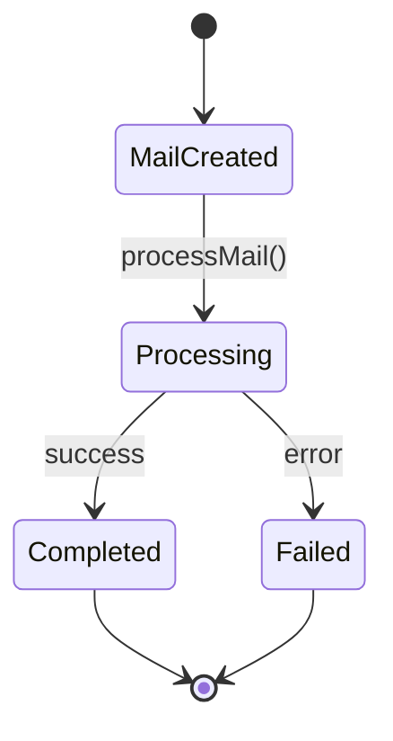
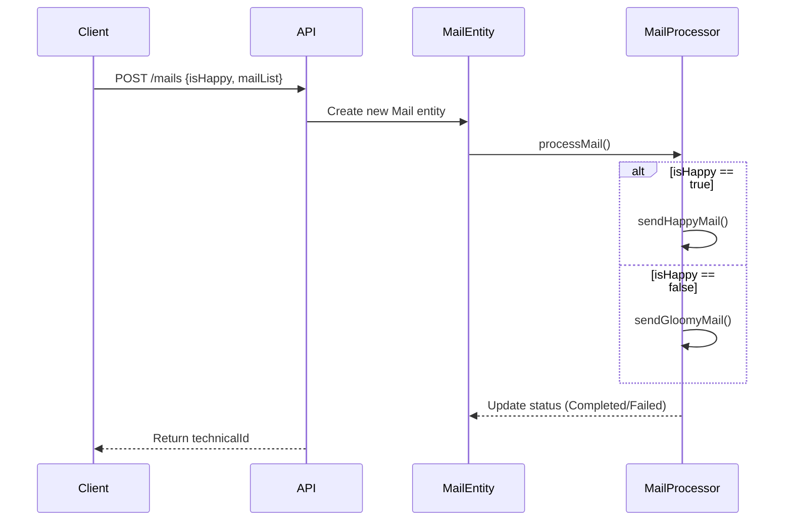
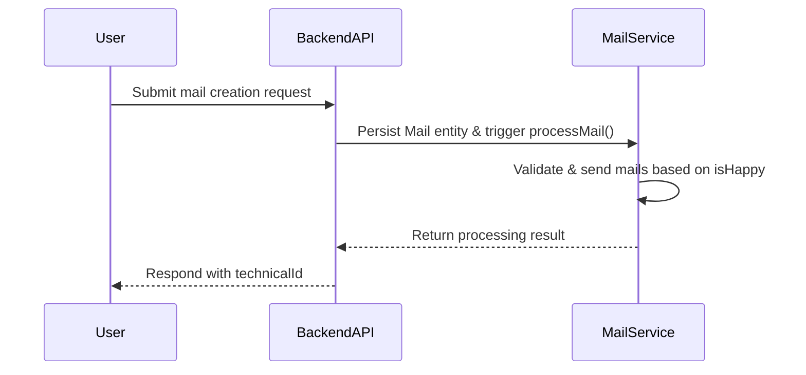

### 1. Entity Definitions

```
Mail:
- isHappy: Boolean (indicates if the mail is happy or gloomy)
- mailList: List<String> (list of recipient email addresses)
```

### 2. Process Method Flows

```
processMail() Flow:
1. Initial State: Mail entity created with isHappy and mailList fields set
2. Validation: Optionally check if mailList is not empty and emails are valid (if validation criteria added later)
3. Processing:
   - If isHappy == true, trigger sendHappyMail processor logic to send happy-themed mails to all recipients in mailList
   - If isHappy == false, trigger sendGloomyMail processor logic to send gloomy-themed mails to all recipients in mailList
4. Completion: Mark mail sending as done (internal state or event emitted)
5. Notification: (Optional) emit event or log success/failure of mail sending
```

---

### 3. API Endpoints Design

- **POST /mails**
  - Description: Create a new Mail entity (triggers `processMail()` event)
  - Request Body:
  ```json
  {
    "isHappy": true,
    "mailList": ["alice@example.com", "bob@example.com"]
  }
  ```
  - Response Body:
  ```json
  {
    "technicalId": "generated-mail-id"
  }
  ```

- **GET /mails/{technicalId}**
  - Description: Retrieve the Mail entity details and status by its technicalId
  - Response Body:
  ```json
  {
    "technicalId": "generated-mail-id",
    "isHappy": true,
    "mailList": ["alice@example.com", "bob@example.com"],
    "status": "COMPLETED"
  }
  ```

- **GET /mails** (Optional)
  - Description: Retrieve all mails (if explicitly requested)

---

### 4. Request/Response Formats

- **POST /mails**

Request:

```json
{
  "isHappy": true,
  "mailList": ["alice@example.com", "bob@example.com"]
}
```

Response:

```json
{
  "technicalId": "mail-12345"
}
```

- **GET /mails/{technicalId}**

Response:

```json
{
  "technicalId": "mail-12345",
  "isHappy": true,
  "mailList": ["alice@example.com", "bob@example.com"],
  "status": "COMPLETED"
}
```

---

### Visual Representations

**Mail Entity Lifecycle State Diagram**


```mermaid
stateDiagram-v2
    [*] --> MailCreated
    MailCreated --> Processing : processMail()
    Processing --> Completed : success
    Processing --> Failed : error
    Completed --> [*]
    Failed --> [*]
```

**Event-Driven Processing Chain**


```mermaid
sequenceDiagram
    participant Client
    participant API
    participant MailEntity
    participant MailProcessor

    Client->>API: POST /mails {isHappy, mailList}
    API->>MailEntity: Create new Mail entity
    MailEntity->>MailProcessor: processMail()
    alt isHappy == true
        MailProcessor->>MailProcessor: sendHappyMail()
    else isHappy == false
        MailProcessor->>MailProcessor: sendGloomyMail()
    end
    MailProcessor-->>MailEntity: Update status (Completed/Failed)
    API-->>Client: Return technicalId
```

**User Interaction Sequence Flow**


```mermaid
sequenceDiagram
    participant User
    participant BackendAPI
    participant MailService

    User->>BackendAPI: Submit mail creation request
    BackendAPI->>MailService: Persist Mail entity & trigger processMail()
    MailService->>MailService: Validate & send mails based on isHappy
    MailService-->>BackendAPI: Return processing result
    BackendAPI-->>User: Respond with technicalId
```

---

This completes the functional requirements specification for your Happy Mail sender application using Event-Driven Architecture principles. If you need any further details or adjustments, please let me know!