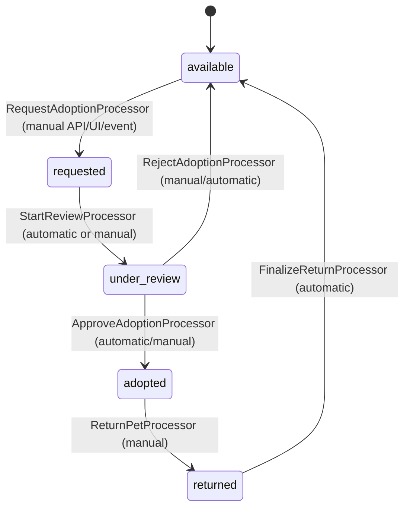
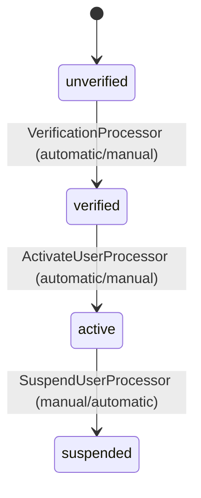
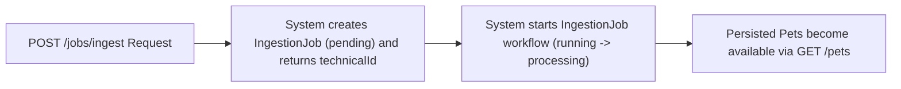

# Functional Requirements

Last updated: 2025-08-15

Purpose: This document defines the domain entities, their workflows, processors, acceptance criteria and API interaction rules for the Pet Adoption prototype. It consolidates and clarifies the logic so the implementation and orchestration processors remain consistent.

---

## 1. High-level assumptions and conventions

- Every persisted entity has a single stable identifier field named `id` (string). This `id` is the technical identifier used in API responses and internal references.
- Where an external / business identifier is supplied by a source, it should be stored in an explicit field `externalId` on the entity (optional).
- Dates/times use ISO-8601 strings (e.g., `2025-08-15T14:00:00Z`).
- Status values are enumerations (strings). Where state transitions are defined, processors should be the single source of truth for changing statuses.
- Only the Ingestion orchestration is invoked via a POST API in this system. Business entities (Pets, Users) are created/changed by processors and events, except for any explicit staff/manual UI actions handled outside these endpoints.

---

## 2. Entity Definitions

Note: Add/modify fields only if needed for workflow clarity.

### Pet

- id: string (technical id)
- externalId: string (optional id from external source)
- name: string
- species: string (cat/dog/etc)
- breed: string
- age: integer (years)
- gender: string (M/F/unknown)
- photos: array[string] (urls)
- status: string (one of: available, requested, under_review, adopted, returned)
- tags: array[string]
- description: string
- requestedBy: string|null (user id who requested adoption, set when status=requested)
- adoptedBy: string|null (user id on adoption)
- adoptedAt: datetime|null
- createdAt: datetime
- updatedAt: datetime

### User

- id: string (technical id)
- externalId: string (optional)
- name: string
- email: string
- phone: string
- address: string
- role: string (customer/staff)
- status: string (one of: unverified, verified, active, suspended)
- favorites: array[string] (pet ids)
- createdAt: datetime
- updatedAt: datetime

### IngestionJob

- id: string (technical id)
- sourceUrl: string
- requestedBy: string (user id)
- requestedAt: datetime
- status: string (pending, running, processing, completed, failed)
- importedCount: integer
- errors: array[string]
- createdAt: datetime
- updatedAt: datetime

---

## 3. Workflows (States & Transitions)

These workflows define canonical state transitions and the processors responsible for them.

### Pet workflow (canonical)

Initial: newly created pets (by ingestion or manual creation) should enter the `available` state unless ingested with a different explicit status.

State values: available -> requested -> under_review -> adopted | available (rejected) -> returned -> available

Mermaid (state diagram):


```mermaid
stateDiagram-v2
    [*] --> available
    available --> requested : RequestAdoptionProcessor (manual API/UI/event)
    requested --> under_review : StartReviewProcessor (automatic or manual)
    under_review --> adopted : ApproveAdoptionProcessor (automatic/manual)
    under_review --> available : RejectAdoptionProcessor (manual/automatic)
    adopted --> returned : ReturnPetProcessor (manual)
    returned --> available : FinalizeReturnProcessor (automatic)
```

Notes on transitions and side effects:
- RequestAdoptionProcessor: sets pet.status=`requested`, sets pet.requestedBy to the requester id, records request timestamp. Validates UniqueRequestCriterion (e.g., user hasn't already requested same pet).
- StartReviewProcessor: may be triggered automatically on `requested` (e.g., when queue processed) or manually by staff — it prepares review context and sets `under_review`.
- ApproveAdoptionProcessor: checks EligibilityCriterion (see Criteria section). If eligible: sets pet.status=`adopted`, sets adoptedBy and adoptedAt, emits AdoptionCompleted event, notifies user and staff, increments adoption metrics. If not eligible, it should fail the review with clear reasons and leave pet in `under_review` or transition to `available` depending on configured policy (see Implementation note below).
- RejectAdoptionProcessor: sets pet.status=`available`, clears requestedBy, notifies the requester with reason.
- ReturnPetProcessor: record return reason, set pet.status=`returned`, clear adoptedBy/adoptedAt as appropriate or keep for audit; create return record.
- FinalizeReturnProcessor: validates returned pet condition, sets pet.status=`available`, resets request/adoption fields as appropriate.

Implementation note: ApproveAdoptionProcessor must explicitly record the decision and reasons. In setups that use an automated approval policy, if EligibilityCriterion fails the processor should either: (a) create a task for manual review and keep state `under_review`, or (b) set `available` and record rejection. The chosen behavior must be consistent and declared in config.

### User workflow

Mermaid:


```mermaid
stateDiagram-v2
    [*] --> unverified
    unverified --> verified : VerificationProcessor (automatic/manual)
    verified --> active : ActivateUserProcessor (automatic/manual)
    active --> suspended : SuspendUserProcessor (manual/automatic)
```

Notes:
- VerificationProcessor performs email/phone verification. A verified account means contact methods validated. Verification may be automatic (email link/SMS code) or manual (staff confirmation).
- ActivateUserProcessor sets status=`active` and makes the user eligible for adoption requests.
- UniqueEmailCriterion must be enforced at user creation time.

### IngestionJob workflow

Mermaid:


```mermaid
stateDiagram-v2
    [*] --> pending
    pending --> running : StartIngestionProcessor (manual/API)
    running --> processing : FetchAndParseProcessor (automatic)
    processing --> completed : PersistPetsProcessor (automatic)
    processing --> failed : ErrorHandlerProcessor (automatic)
    completed --> [*]
    failed --> [*]
```

Notes:
- Jobs are created via API (POST /jobs/ingest). The system returns the technical `id` only in the response body. The job lifecycle is observable via GET /jobs/{id}.
- The job must maintain `importedCount` and `errors` so callers can inspect results.

---

## 4. Processors & Criteria (behavioral contracts)

Each processor should be small, testable and idempotent where possible. They should update entities and emit events for downstream processors.

List of processors and responsibilities:

- RequestAdoptionProcessor
  - Input: (petId, requesterId)
  - Validates: pet.status == available, user.status == active (and UniqueRequestCriterion)
  - Action: set pet.status=`requested`, pet.requestedBy=requesterId, persist, emit event AdoptionRequested(petId, requesterId)

- StartReviewProcessor
  - Input: AdoptionRequested event
  - Action: set pet.status=`under_review`, create review record/context, emit ReviewStarted(petId, requesterId)

- ApproveAdoptionProcessor
  - Input: ReviewApproved event or automated trigger
  - Validates: EligibilityCriterion(user, pet) (user active/verified, no outstanding bans, within adoption limits; pet is still under_review and not already adopted)
  - Action on success: set pet.status=`adopted`, pet.adoptedBy=userId, pet.adoptedAt=now, persist, emit AdoptionCompleted, notify user/staff
  - Action on failure: depending on policy either set `available` (with reason) or keep `under_review` and create manual task. Always record reason.

- RejectAdoptionProcessor
  - Input: ReviewRejected event
  - Action: set pet.status=`available`, clear pet.requestedBy, persist, notify requester with rejection reason

- ReturnPetProcessor
  - Input: return request (petId, reason, requestedBy)
  - Action: set pet.status=`returned`, record return metadata, emit PetReturned event

- FinalizeReturnProcessor
  - Input: PetReturned event
  - Action: validate return condition (may be manual), set pet.status=`available`, clear adoption-related transient fields as per audit rules, persist

- FetchAndParseProcessor (Ingestion)
  - Input: IngestionJob
  - Validates: SourceReachableCriterion(job.sourceUrl)
  - Action: fetch data, parse to pet DTOs, validate DTO shape and required fields, emit PersistPetCandidate events with job reference. Handles transient network errors with retries, records errors on job.

- PersistPetsProcessor
  - Input: PersistPetCandidate event(s)
  - Validates: UniquePetCriterion (externalId OR deduplication by name/species/breed/age heuristics)
  - Action: create or update Pet entities, increment job.importedCount, persist. Emit PetPersisted event per saved Pet. If duplicate, log and append to job.errors with reason.

- ErrorHandlerProcessor
  - Input: Exceptions raised in job processing
  - Action: mark job.status=`failed`, record errors, emit JobFailed event

Criteria (examples):

- EligibilityCriterion(user, pet): returns success if
  - user.status == active
  - user is verified (email/phone)
  - user not suspended/banned
  - user has not exceeded adoption limits (configurable)
  - pet.status is under_review and not adopted

- UniquePetCriterion(petCandidate): returns true if no existing Pet matches by `externalId`. If no externalId, use deterministic fuzzy key: (name, species, breed, age) plus photo checksum optional. Implement as eventually consistent check; duplicates should be logged and not crash ingestion.

- SourceReachableCriterion(url): validates that the source is reachable and returns a plausible payload. If unreachable, ingestion job should move to `failed` with error recorded.

- UniqueEmailCriterion(email): ensure no other active user record uses same email. Enforce at write-time.

---

## 5. Pseudocode (processors) — updated and more robust

FetchAndParseProcessor:

```java
class FetchAndParseProcessor {
  void process(IngestionJob job) {
    try {
      job.status = "running";
      persist(job);

      data = fetch(job.sourceUrl) // with retry/backoff
      petDtos = parse(data)

      if (petDtos.isEmpty()) {
        job.errors.add("no-pets-found");
      }

      for (dto : petDtos) {
        if (validate(dto)) {
          emitEvent(new PersistPetCandidate(job.id, dto));
        } else {
          job.errors.add("validation-failed for dto id=" + dto.externalId);
        }
      }

      job.status = "processing";
      persist(job);

    } catch (Exception e) {
      job.errors.add(e.getMessage());
      job.status = "failed";
      persist(job);
      emitEvent(new JobFailed(job.id, e));
    }
  }
}
```

PersistPetsProcessor:

```java
class PersistPetsProcessor {
  void process(PersistPetCandidate event) {
    if (UniquePetCriterion(event.dto)) {
      Pet pet = toPet(event.dto);
      pet.createdAt = now();
      pet.status = event.dto.status != null ? event.dto.status : "available";
      save(pet);
      emitEvent(new PetPersisted(event.jobId, pet.id));
      incrementJobImportedCount(event.jobId);
    } else {
      log("duplicate: " + event.dto.externalId);
      appendJobError(event.jobId, "duplicate: " + event.dto.externalId);
    }
  }
}
```

ApproveAdoptionProcessor:

```java
class ApproveAdoptionProcessor {
  void process(ReviewApproved event) {
    Pet pet = findPet(event.petId);
    User user = findUser(event.userId);
    if (!EligibilityCriterion(user, pet)) {
      recordReviewDecision(event.reviewId, false, "eligibility-failed");
      // policy-driven: either create manual task or mark available
      revertToAvailableOrCreateManualTask(pet, event);
      notifyStaffAndUser(pet, user, "eligibility-failed");
      return;
    }

    pet.status = "adopted";
    pet.adoptedBy = user.id;
    pet.adoptedAt = now();
    persist(pet);
    emitEvent(new AdoptionCompleted(pet.id, user.id));
    notifyUser(user, "adoption-approved", pet.id);
  }
}
```

Notes:
- All processors must handle idempotency (e.g., repeated events should not create duplicate Pets or overwrite legitimate adoption records).
- Processors that update job.importedCount must do so atomically to avoid race conditions when multiple PersistPetsProcessor instances run in parallel.

---

## 6. API Endpoints Design Rules & JSON Formats

Design principles:
- Minimal public write surface: only Ingestion orchestration is invoked by external clients via POST. Business entity mutations happen via processors and internal events.
- Read endpoints are available for clients to observe state and results.
- Use pagination, filtering and projection on list endpoints.

Endpoints (summary):

- POST /jobs/ingest
  - Purpose: create and start an ingestion job
  - Request body:

```json
{ "sourceUrl": "https://petstore.example/api/pets", "requestedBy": "user123" }
```

  - Response body (200/202):

```json
{ "technicalId": "job-0001" }
```

  - Behavior: Server must create an IngestionJob with status `pending` (or `running` if it starts immediately) and return the `technicalId` only. The caller can poll GET /jobs/{technicalId} to track progress.

- GET /pets
  - Query params: page, size, species, status, tags, search
  - Response: array of Pet DTOs with fields from the Pet entity (id, name, species, breed, age, status, photos, tags, description, createdAt)

- GET /pets/{id}
  - Response: full Pet DTO (including requestedBy, adoptedBy, adoptedAt where applicable)

- GET /users/{id}
  - Response: User DTO (omit sensitive fields as appropriate)

- GET /jobs/{id}
  - Response example:

```json
{ "id": "job-0001", "sourceUrl": "https://...", "status": "completed", "importedCount": 12, "errors": [] }
```

Rules & constraints:
- No POST endpoints exist to create Pets or Users as part of normal business flows. Such creations are the result of processors (ingestion or staff UI actions). If self-registration for users is required, that is an explicit design choice (see Questions below).
- POST responses MUST NOT return full entity payloads for ingestion; only the technical id. This ensures eventual consistency and avoids partial payload returns when ingestion is still processing.
- GET responses must be eventual-consistent views; clients should be aware that newly created resources by ingestion may not appear immediately until PersistPetsProcessor completes.

Flow overview:


```mermaid
flowchart LR
    A["POST /jobs/ingest Request"] --> B["System creates IngestionJob (pending) and returns technicalId"]
    B --> C["System starts IngestionJob workflow (running -> processing)"]
    C --> D["Persisted Pets become available via GET /pets"]
```

---

## 7. Observability, errors and retries

- IngestionJob must record errors array with string messages and optionally structured error objects for debugging.
- Processors should emit domain events for success/failure so orchestration and monitoring tools can subscribe and display progress.
- Transient failures (network/timeouts) should be retried with exponential backoff in FetchAndParseProcessor. Permanent failures should mark job as `failed` with descriptive errors.
- Persist operations should be idempotent and report duplicates as non-fatal job errors (logged and appended to job.errors).

---

## 8. Security & Authorization notes

- POST /jobs/ingest must be authenticated. Authorization determines whether the requesting user may create ingestion jobs.
- Read endpoints may expose public pet listings but sensitive user metadata must be protected.

---

## 9. Questions / Decisions pending

1. User self-registration: do you want to expose a POST /users endpoint to allow direct user sign-up (with VerificationProcessor triggered), or should Users be created only by staff or external systems? If self-registration is enabled, the rules for UniqueEmailCriterion and verification flows must be enforced.

2. Adoption approval policy on EligibilityCriterion failure: prefer automatic rejection (pet -> available) or create a manual task (keep `under_review`) to allow human intervention?

3. Deduplication strategy for ingested pets: is `externalId` mandatory on sources, or must we rely on fuzzy deterministic keys (name/species/breed/age/photos)?

Please answer these questions so the functional requirements can be finalized.

---

End of functional requirements.
