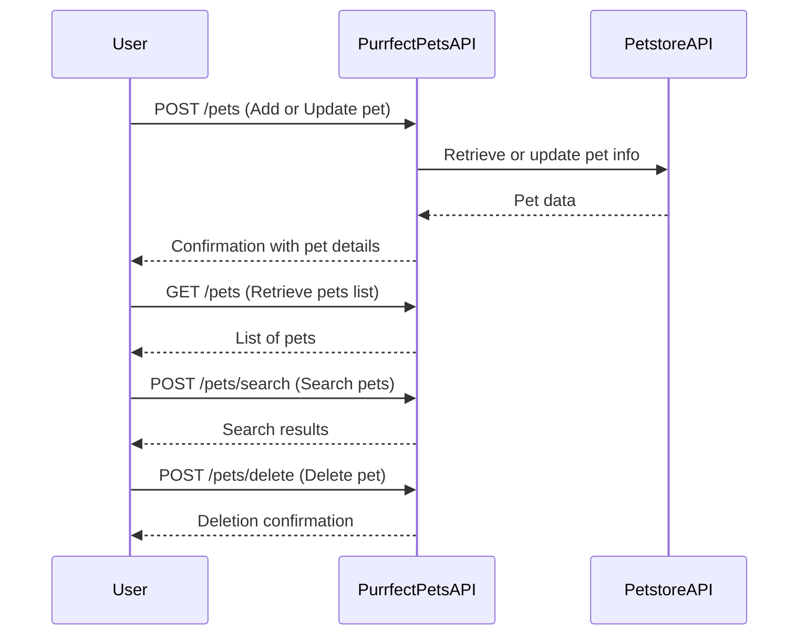

# Purrfect Pets API - Functional Requirements

## API Endpoints

### 1. Add or Update Pets (POST /pets)
- **Purpose:** Add new pets or update existing pet information by invoking Petstore API data and applying any business logic.
- **Request Format:**
```json
{
  "petId": "string",         // optional for new pets, required for updates
  "name": "string",
  "category": "string",
  "status": "available|pending|sold",
  "description": "string"    // fun/playful pet description
}
```
- **Response Format:**
```json
{
  "success": true,
  "pet": {
    "petId": "string",
    "name": "string",
    "category": "string",
    "status": "available|pending|sold",
    "description": "string"
  }
}
```

---

### 2. Retrieve Pets List (GET /pets)
- **Purpose:** Retrieve the list of pets stored in the application.
- **Response Format:**
```json
[
  {
    "petId": "string",
    "name": "string",
    "category": "string",
    "status": "available|pending|sold",
    "description": "string"
  },
  ...
]
```

---

### 3. Search Pets (POST /pets/search)
- **Purpose:** Search pets by category, status, or name with possible partial matches.
- **Request Format:**
```json
{
  "name": "string",          // optional, partial match
  "category": "string",      // optional
  "status": "available|pending|sold" // optional
}
```
- **Response Format:**
```json
[
  {
    "petId": "string",
    "name": "string",
    "category": "string",
    "status": "available|pending|sold",
    "description": "string"
  },
  ...
]
```

---

### 4. Delete Pet (POST /pets/delete)
- **Purpose:** Delete a pet by petId.
- **Request Format:**
```json
{
  "petId": "string"
}
```
- **Response Format:**
```json
{
  "success": true,
  "message": "Pet deleted successfully"
}
```

---

# User-App Interaction Sequence


```mermaid
sequenceDiagram
    participant User
    participant PurrfectPetsAPI
    participant PetstoreAPI

    User->>PurrfectPetsAPI: POST /pets (Add or Update pet)
    PurrfectPetsAPI->>PetstoreAPI: Retrieve or update pet info
    PetstoreAPI-->>PurrfectPetsAPI: Pet data
    PurrfectPetsAPI-->>User: Confirmation with pet details

    User->>PurrfectPetsAPI: GET /pets (Retrieve pets list)
    PurrfectPetsAPI-->>User: List of pets

    User->>PurrfectPetsAPI: POST /pets/search (Search pets)
    PurrfectPetsAPI-->>User: Search results

    User->>PurrfectPetsAPI: POST /pets/delete (Delete pet)
    PurrfectPetsAPI-->>User: Deletion confirmation
```
