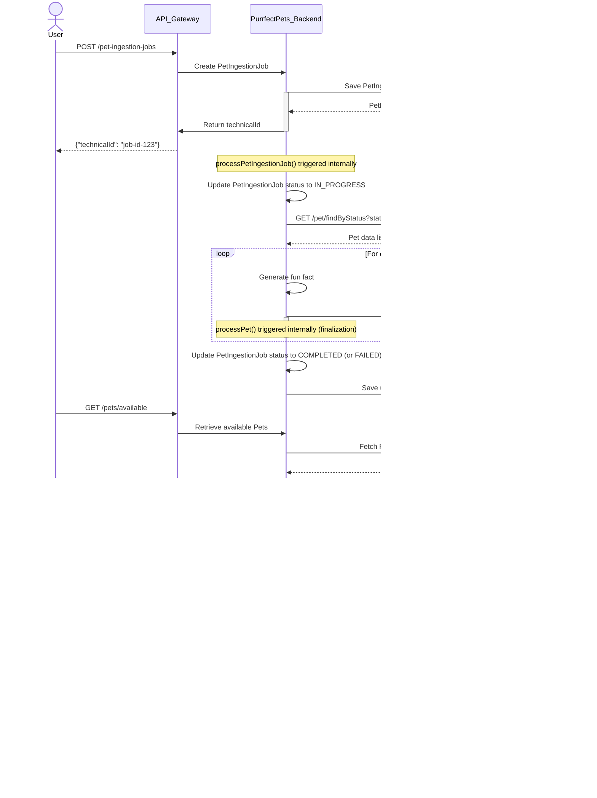

```markdown
### 1. Entity Definitions

```
PetIngestionJob:
- status: String (PENDING, IN_PROGRESS, COMPLETED, FAILED)
- startTime: String (ISO 8601 timestamp, e.g., "2023-10-27T10:00:00Z")
- endTime: String (ISO 8601 timestamp, e.g., "2023-10-27T10:05:00Z")
- ingestedPetCount: Integer (Number of pets successfully imported)
- errorMessage: String (Error details if the job failed)
- sourceApiUrl: String (URL of the Petstore API used for ingestion)
- targetPetStatus: String (Status of pets to import, e.g., "available")

Pet:
- petstoreId: Long (Original ID from the Petstore API)
- name: String
- status: String (e.g., available, pending, sold)
- category: String
- photoUrls: List of String (URLs to pet photos)
- tags: List of String (Descriptive tags for the pet)
- funFact: String (A unique, fun fact generated for the pet)
```

### 2. Process Method Flows

**`processPetIngestionJob()` Flow:**
1.  **Initial State**: `PetIngestionJob` entity is created with `PENDING` status.
2.  **Update Status**: The job status is updated to `IN_PROGRESS`, and `startTime` is recorded.
3.  **Data Fetching**: The application calls the external Petstore API (e.g., `GET /pet/findByStatus?status={targetPetStatus}`) to retrieve pet data based on the `targetPetStatus` specified in the job.
4.  **Data Processing & Entity Creation**: For each pet fetched from the Petstore API:
    *   A unique `funFact` is generated based on the pet's attributes.
    *   A new `Pet` entity is created with the fetched data and the generated `funFact`.
    *   Saving the `Pet` entity automatically triggers `processPet()` for further internal processing/finalization.
5.  **Completion/Failure**: The `PetIngestionJob` status is updated to `COMPLETED` upon success, or `FAILED` if an error occurs. `endTime`, `ingestedPetCount`, and `errorMessage` (if applicable) are recorded.

**`processPet()` Flow:**
1.  **Initial State**: A `Pet` entity is created (typically by `processPetIngestionJob`) with all its attributes, including `funFact`.
2.  **Finalization**: This method serves as a finalization step, ensuring the `Pet` entity is fully prepared and validated for retrieval via API endpoints. For this application, the primary processing (like `funFact` generation) is handled during ingestion, so this method mainly confirms readiness.

### 3. API Endpoints Design

*   **POST /pet-ingestion-jobs**
    *   **Purpose**: Initiates a new pet data ingestion job from the Petstore API.
    *   **Returns**: The `technicalId` of the newly created `PetIngestionJob`.

*   **GET /pet-ingestion-jobs/{technicalId}**
    *   **Purpose**: Retrieves the current status and details of a specific pet ingestion job.
    *   **Returns**: The full `PetIngestionJob` entity.

*   **GET /pets/available**
    *   **Purpose**: Retrieves a list of all pets that have been imported and are marked as "available".
    *   **Returns**: A list of `Pet` entities.

*   **GET /pets/{technicalId}**
    *   **Purpose**: Retrieves the detailed information for a single pet using its internal `technicalId`.
    *   **Returns**: A single `Pet` entity.

*   **GET /pets/search?name={name}**
    *   **Purpose**: Searches for and retrieves pets by their specific `name`.
    *   **Returns**: A list of `Pet` entities matching the provided name.

*   **GET /pets/search?category={category}**
    *   **Purpose**: Searches for and retrieves pets by their specific `category`.
    *   **Returns**: A list of `Pet` entities matching the provided category.

### 4. Request/Response Formats

*   **POST /pet-ingestion-jobs**
    *   **Request Body (JSON)**:
        ```json
        {
          "targetStatus": "available"
        }
        ```
        *(Note: `targetStatus` is optional; if omitted, a default like "available" will be used.)*
    *   **Response Body (JSON)**:
        ```json
        {
          "technicalId": "a1b2c3d4-e5f6-7890-1234-567890abcdef"
        }
        ```

*   **GET /pet-ingestion-jobs/{technicalId}**
    *   **Response Body (JSON)**:
        ```json
        {
          "technicalId": "a1b2c3d4-e5f6-7890-1234-567890abcdef",
          "status": "COMPLETED",
          "startTime": "2023-10-27T10:00:00Z",
          "endTime": "2023-10-27T10:05:00Z",
          "ingestedPetCount": 150,
          "errorMessage": null,
          "sourceApiUrl": "https://petstore.swagger.io/v2",
          "targetPetStatus": "available"
        }
        ```

*   **GET /pets/available, GET /pets/search?name={name}, GET /pets/search?category={category}**
    *   **Response Body (JSON)**:
        ```json
        [
          {
            "technicalId": "pet-uuid-1",
            "petstoreId": 12345,
            "name": "Buddy",
            "status": "available",
            "category": "Dog",
            "photoUrls": ["http://example.com/buddy.jpg"],
            "tags": ["friendly", "playful"],
            "funFact": "Buddy loves chasing squirrels in the park!"
          },
          {
            "technicalId": "pet-uuid-2",
            "petstoreId": 67890,
            "name": "Whiskers",
            "status": "available",
            "category": "Cat",
            "photoUrls": ["http://example.com/whiskers.jpg"],
            "tags": ["cute", "sleepy"],
            "funFact": "Whiskers can sleep up to 16 hours a day!"
          }
        ]
        ```

*   **GET /pets/{technicalId}**
    *   **Response Body (JSON)**:
        ```json
        {
          "technicalId": "pet-uuid-1",
          "petstoreId": 12345,
          "name": "Buddy",
          "status": "available",
          "category": "Dog",
          "photoUrls": ["http://example.com/buddy.jpg"],
          "tags": ["friendly", "playful"],
          "funFact": "Buddy loves chasing squirrels in the park!"
        }
        ```

### 5. Visual Representation


```mermaid
stateDiagram-v2
    [*] --> PENDING
    PENDING --> IN_PROGRESS : processPetIngestionJob()
    IN_PROGRESS --> COMPLETED : success
    IN_PROGRESS --> FAILED : error
    COMPLETED --> [*]
    FAILED --> [*]
```

```mermaid
graph TD
    A[User POST /pet-ingestion-jobs] --> B{Save PetIngestionJob Entity}
    B -- on save --> C[processPetIngestionJob() Triggered]
    C --> D[Fetch Pet Data from External Petstore API]
    D --> E{Loop: For each fetched Pet}
    E --> F[Generate Fun Fact]
    F --> G[Save new Pet Entity]
    G -- on save --> H[processPet() Triggered (Finalization)]
    H --> I[Pet Data Available for Retrieval]
    C --> J[Update PetIngestionJob Status (COMPLETED/FAILED)]
```


```mermaid
sequenceDiagram
    actor User
    participant API_Gateway
    participant PurrfectPets_Backend
    participant Petstore_API
    participant Datastore

    User->>API_Gateway: POST /pet-ingestion-jobs
    API_Gateway->>PurrfectPets_Backend: Create PetIngestionJob
    PurrfectPets_Backend->>Datastore: Save PetIngestionJob (status: PENDING)
    activate PurrfectPets_Backend
    Datastore-->>PurrfectPets_Backend: PetIngestionJob technicalId
    PurrfectPets_Backend->>API_Gateway: Return technicalId
    deactivate PurrfectPets_Backend
    API_Gateway-->>User: {"technicalId": "job-id-123"}

    Note over PurrfectPets_Backend: processPetIngestionJob() triggered internally
    PurrfectPets_Backend->>PurrfectPets_Backend: Update PetIngestionJob status to IN_PROGRESS
    PurrfectPets_Backend->>Petstore_API: GET /pet/findByStatus?status={targetStatus}
    Petstore_API-->>PurrfectPets_Backend: Pet data list
    loop For each pet
        PurrfectPets_Backend->>PurrfectPets_Backend: Generate fun fact
        PurrfectPets_Backend->>Datastore: Save Pet entity
        activate PurrfectPets_Backend
        Note over PurrfectPets_Backend: processPet() triggered internally (finalization)
        deactivate PurrfectPets_Backend
    end
    PurrfectPets_Backend->>PurrfectPets_Backend: Update PetIngestionJob status to COMPLETED (or FAILED)
    PurrfectPets_Backend->>Datastore: Save updated PetIngestionJob

    User->>API_Gateway: GET /pets/available
    API_Gateway->>PurrfectPets_Backend: Retrieve available Pets
    PurrfectPets_Backend->>Datastore: Fetch Pets by status="available"
    Datastore-->>PurrfectPets_Backend: List of Pet data
    PurrfectPets_Backend->>API_Gateway: Return List of Pet data
    API_Gateway-->>User: List of Pet JSON

    User->>API_Gateway: GET /pets/{pet_technicalId}
    API_Gateway->>PurrfectPets_Backend: Retrieve Pet by technicalId
    PurrfectPets_Backend->>Datastore: Fetch Pet
    Datastore-->>PurrfectPets_Backend: Pet data
    PurrfectPets_Backend->>API_Gateway: Return Pet data
    API_Gateway-->>User: Pet JSON

    User->>API_Gateway: GET /pets/search?name=Buddy
    API_Gateway->>PurrfectPets_Backend: Search Pets by name
    PurrfectPets_Backend->>Datastore: Fetch Pets by name="Buddy"
    Datastore-->>PurrfectPets_Backend: List of Pet data
    PurrfectPets_Backend->>API_Gateway: Return List of Pet data
    API_Gateway-->>User: List of Pet JSON
```