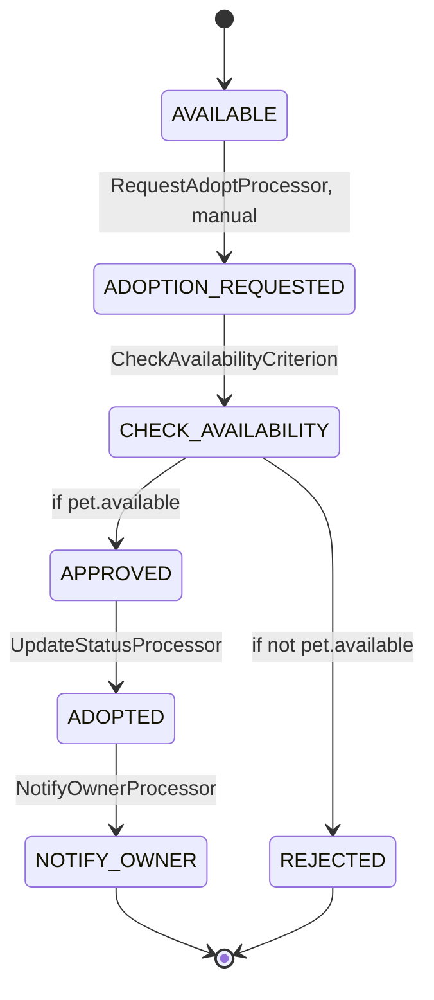
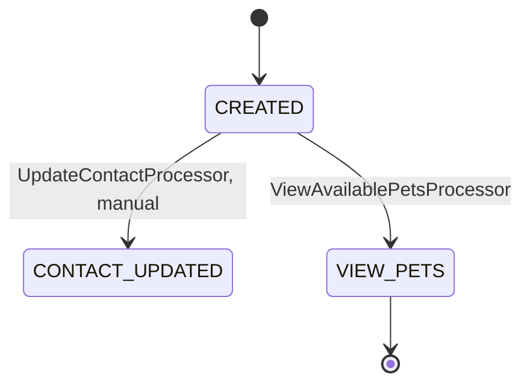
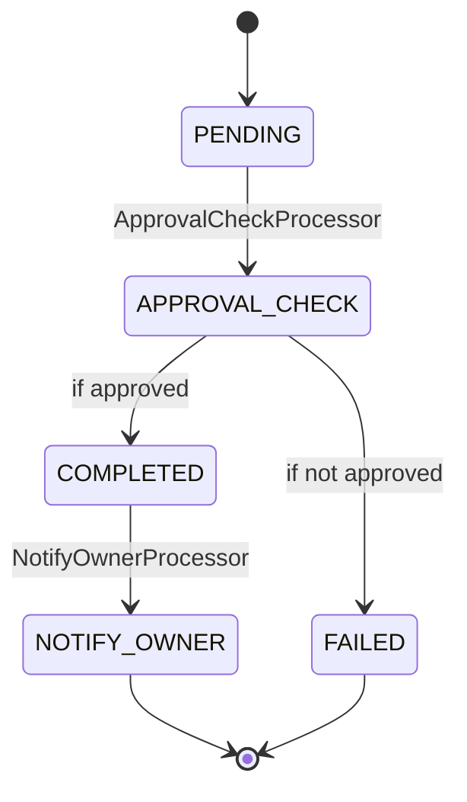

Let's define the functional requirements for your 'Purrfect Pets' API app using an Event-Driven Architecture (EDA) approach. For this application, I will focus on three main entities based on typical functionalities associated with a pet adoption platform.

### 1. Entity Definitions
```
Pet:
- id: String (unique identifier for each pet)
- name: String (name of the pet)
- breed: String (breed of the pet)
- age: Integer (age of the pet in years)
- status: String (current status of the pet, e.g., available, adopted)

Owner:
- id: String (unique identifier for each pet owner)
- name: String (name of the pet owner)
- contactInfo: String (contact information of the owner)
- address: String (address of the owner)

Adoption:
- id: String (unique identifier for each adoption)
- petId: String (ID of the pet being adopted)
- ownerId: String (ID of the owner adopting the pet)
- adoptionDate: Date (date when the adoption occurred)
- status: String (current status of the adoption, e.g., pending, completed)
```

### 2. Entity workflows

**Pet workflow:**
1. Initial State: Pet created with status "available."
2. Adoption Request: Owner requests to adopt the pet.
3. Approval: System checks if the pet is still available.
4. Update Status: If approved, update pet status to "adopted."
5. Notification: Notify the owner about the successful adoption.


```mermaid
stateDiagram-v2
    [*] --> AVAILABLE
    AVAILABLE --> ADOPTION_REQUESTED : RequestAdoptProcessor, manual
    ADOPTION_REQUESTED --> CHECK_AVAILABILITY : CheckAvailabilityCriterion
    CHECK_AVAILABILITY --> APPROVED : if pet.available
    CHECK_AVAILABILITY --> REJECTED : if not pet.available
    APPROVED --> ADOPTED : UpdateStatusProcessor
    ADOPTED --> NOTIFY_OWNER : NotifyOwnerProcessor
    NOTIFY_OWNER --> [*]
    REJECTED --> [*]
```

**Owner workflow:**
1. Initial State: Owner created.
2. Update Contact: Owner can update their contact information.
3. View Pets: Owner can view available pets.
4. Adoption Process: Trigger adoption process for selected pets.


```mermaid
stateDiagram-v2
    [*] --> CREATED
    CREATED --> CONTACT_UPDATED : UpdateContactProcessor, manual
    CREATED --> VIEW_PETS : ViewAvailablePetsProcessor
    VIEW_PETS --> [*]
```

**Adoption workflow:**
1. Initial State: Adoption created with pending status.
2. Approval: Check pet availability and owner eligibility.
3. Completion: Update adoption status to completed.
4. Notification: Notify both owner and system about the finalized adoption.


```mermaid
stateDiagram-v2
    [*] --> PENDING
    PENDING --> APPROVAL_CHECK : ApprovalCheckProcessor
    APPROVAL_CHECK --> COMPLETED : if approved
    APPROVAL_CHECK --> FAILED : if not approved
    COMPLETED --> NOTIFY_OWNER : NotifyOwnerProcessor
    NOTIFY_OWNER --> [*]
    FAILED --> [*]
```

### 3. Pseudo code for each processor class

```java
class RequestAdoptProcessor {
    public void process(Pet pet) {
        // Logic to handle adoption request
    }
}

class CheckAvailabilityCriterion {
    public boolean evaluate(Pet pet) {
        return pet.status.equals("available");
    }
}

class UpdateStatusProcessor {
    public void process(Pet pet) {
        pet.status = "adopted"; // Update pet status
    }
}

class NotifyOwnerProcessor {
    public void process(Owner owner, Pet pet) {
        // Logic to notify owner about the adoption
    }
}

class UpdateContactProcessor {
    public void process(Owner owner, String newContact) {
        owner.contactInfo = newContact; // Update contact info
    }
}

class ViewAvailablePetsProcessor {
    public List<Pet> process() {
        // Logic to retrieve list of available pets
    }
}

class ApprovalCheckProcessor {
    public boolean process(Adoption adoption) {
        // Logic to check if adoption can proceed
    }
}
```

### 4. API Endpoints Design Rules

- **POST /pets**: Create a new pet.
  - Request:
  ```json
  {
      "name": "Fluffy",
      "breed": "Persian",
      "age": 3
  }
  ```
  - Response:
  ```json
  {
      "technicalId": "12345"
  }
  ```

- **POST /owners**: Create a new owner.
  - Request:
  ```json
  {
      "name": "John Doe",
      "contactInfo": "johndoe@example.com",
      "address": "123 Elm St"
  }
  ```
  - Response:
  ```json
  {
      "technicalId": "67890"
  }
  ```

- **POST /adoptions**: Create a new adoption.
  - Request:
  ```json
  {
      "petId": "12345",
      "ownerId": "67890"
  }
  ```
  - Response:
  ```json
  {
      "technicalId": "11223"
  }
  ```

- **GET /pets/{technicalId}**: Retrieve pet details by technicalId.
- **GET /owners/{technicalId}**: Retrieve owner details by technicalId.
- **GET /adoptions/{technicalId}**: Retrieve adoption details by technicalId.

This outline should give you a solid foundation for your 'Purrfect Pets' API app using an Event-Driven Architecture approach! Let me know if you need further clarification or additional entities.