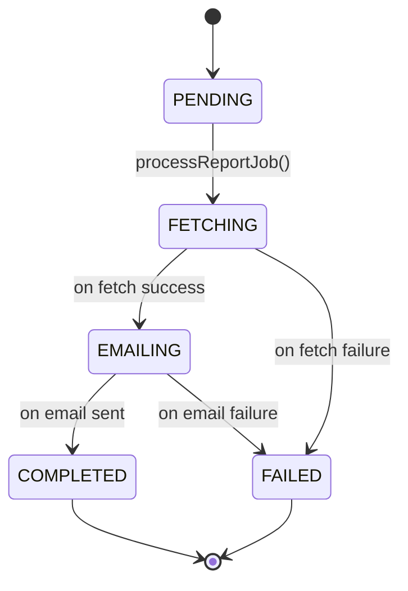
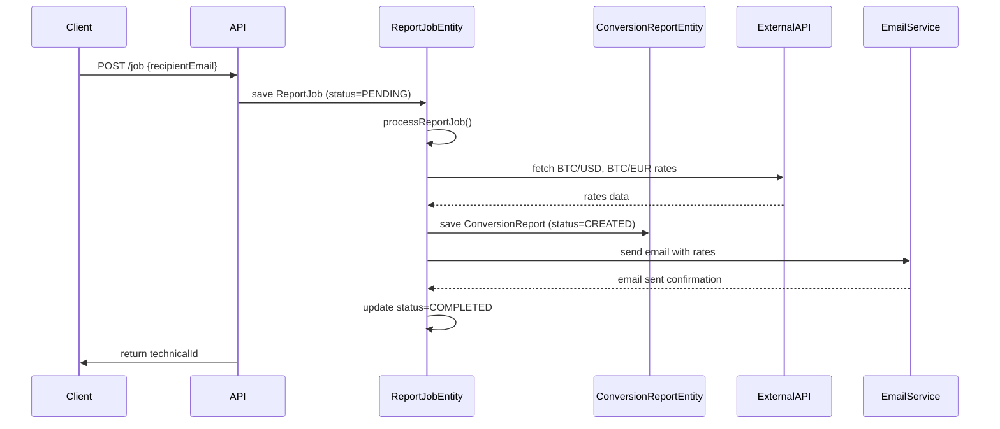
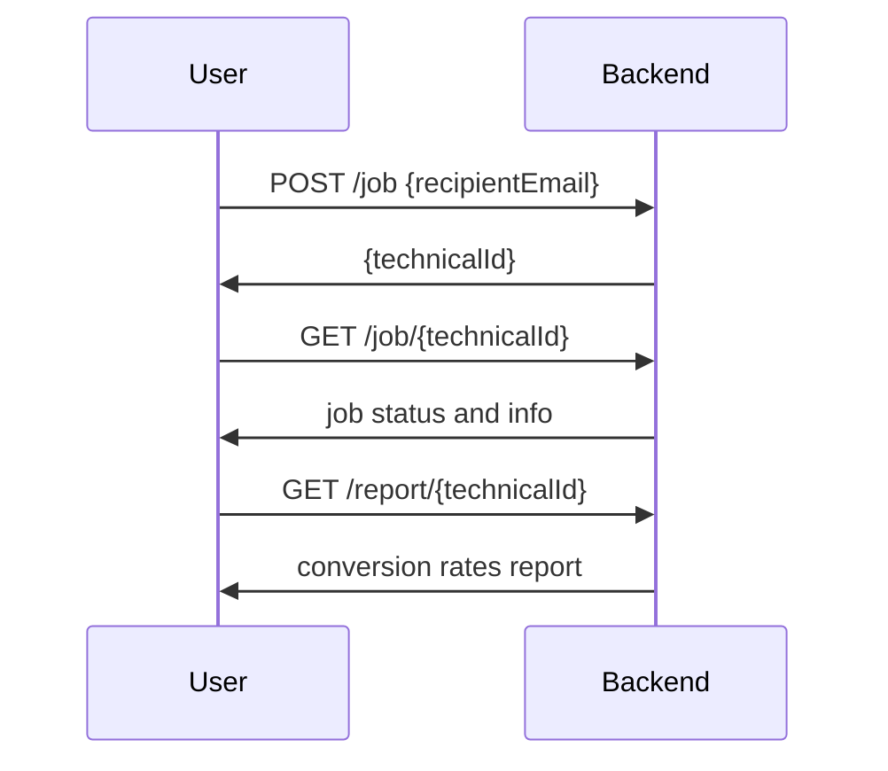

### 1. Entity Definitions

``` 
ReportJob:
- requestTimestamp: DateTime (timestamp when job was created)
- status: String (e.g., PENDING, FETCHING, EMAILED, COMPLETED, FAILED - for tracking lifecycle)
- recipientEmail: String (email address to send the report to)
- errorMessage: String (optional, stores failure reasons if any)

ConversionReport:
- jobTechnicalId: String (reference to the ReportJob that created this report)
- createdTimestamp: DateTime (when the report was generated)
- btcUsdRate: BigDecimal (BTC to USD conversion rate)
- btcEurRate: BigDecimal (BTC to EUR conversion rate)
- emailSentTimestamp: DateTime (when the report email was sent, optional)
- status: String (e.g., CREATED, EMAILED)
```

---

### 2. Process Method Flows

``` 
processReportJob() Flow:
1. Initial State: ReportJob entity created with status = PENDING
2. Validation: Check recipientEmail is present and valid (optional check event)
3. Fetching: Call external BTC price API to retrieve BTC/USD and BTC/EUR rates
4. On Success:
   a. Create ConversionReport entity with fetched rates and status = CREATED
   b. Update ReportJob status to FETCHING_COMPLETED
5. Emailing: Send email report to recipientEmail with conversion rates
6. On Email Sent Success:
   a. Update ConversionReport status to EMAILED and set emailSentTimestamp
   b. Update ReportJob status to COMPLETED
7. On Failure at any step:
   a. Update ReportJob status to FAILED
   b. Store errorMessage describing failure reason
```

``` 
processConversionReport() Flow:
- No additional processing after creation (immutable report)
- Used primarily for retrieval via GET endpoint
```

---

### 3. API Endpoints and Request/Response Formats

#### POST /job

- Creates `ReportJob` entity (immutable)
- Triggers `processReportJob()` event automatically
- Request body example:

```json
{
  "recipientEmail": "user@example.com"
}
```

- Response example:

```json
{
  "technicalId": "string-uuid"
}
```

---

#### GET /job/{technicalId}

- Retrieves the `ReportJob` entity including status and errorMessage if any
- Response example:

```json
{
  "technicalId": "string-uuid",
  "requestTimestamp": "2024-06-01T12:00:00Z",
  "status": "COMPLETED",
  "recipientEmail": "user@example.com",
  "errorMessage": null
}
```

---

#### GET /report/{jobTechnicalId}

- Retrieves the `ConversionReport` linked to the given ReportJob ID
- Response example:

```json
{
  "jobTechnicalId": "string-uuid",
  "createdTimestamp": "2024-06-01T12:01:00Z",
  "btcUsdRate": 27345.67,
  "btcEurRate": 25123.45,
  "emailSentTimestamp": "2024-06-01T12:02:00Z",
  "status": "EMAILED"
}
```

---

### 4. Mermaid Diagrams

#### ReportJob Lifecycle State Diagram


```mermaid
stateDiagram-v2
    [*] --> PENDING
    PENDING --> FETCHING : processReportJob()
    FETCHING --> EMAILING : on fetch success
    FETCHING --> FAILED : on fetch failure
    EMAILING --> COMPLETED : on email sent
    EMAILING --> FAILED : on email failure
    COMPLETED --> [*]
    FAILED --> [*]
```

#### Event-Driven Processing Chain


```mermaid
sequenceDiagram
    participant Client
    participant API
    participant ReportJobEntity
    participant ConversionReportEntity
    participant ExternalAPI
    participant EmailService

    Client->>API: POST /job {recipientEmail}
    API->>ReportJobEntity: save ReportJob (status=PENDING)
    ReportJobEntity->>ReportJobEntity: processReportJob()
    ReportJobEntity->>ExternalAPI: fetch BTC/USD, BTC/EUR rates
    ExternalAPI-->>ReportJobEntity: rates data
    ReportJobEntity->>ConversionReportEntity: save ConversionReport (status=CREATED)
    ReportJobEntity->>EmailService: send email with rates
    EmailService-->>ReportJobEntity: email sent confirmation
    ReportJobEntity->>ReportJobEntity: update status=COMPLETED
    API->>Client: return technicalId
```

#### User Interaction Sequence Flow


```mermaid
sequenceDiagram
    participant User
    participant Backend

    User->>Backend: POST /job {recipientEmail}
    Backend->>User: {technicalId}

    User->>Backend: GET /job/{technicalId}
    Backend->>User: job status and info

    User->>Backend: GET /report/{technicalId}
    Backend->>User: conversion rates report
```
