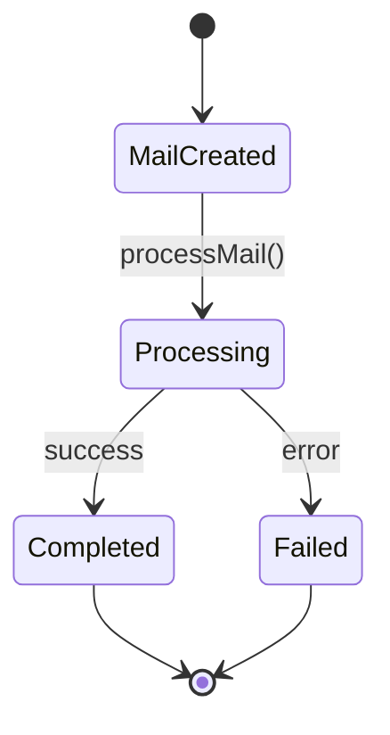
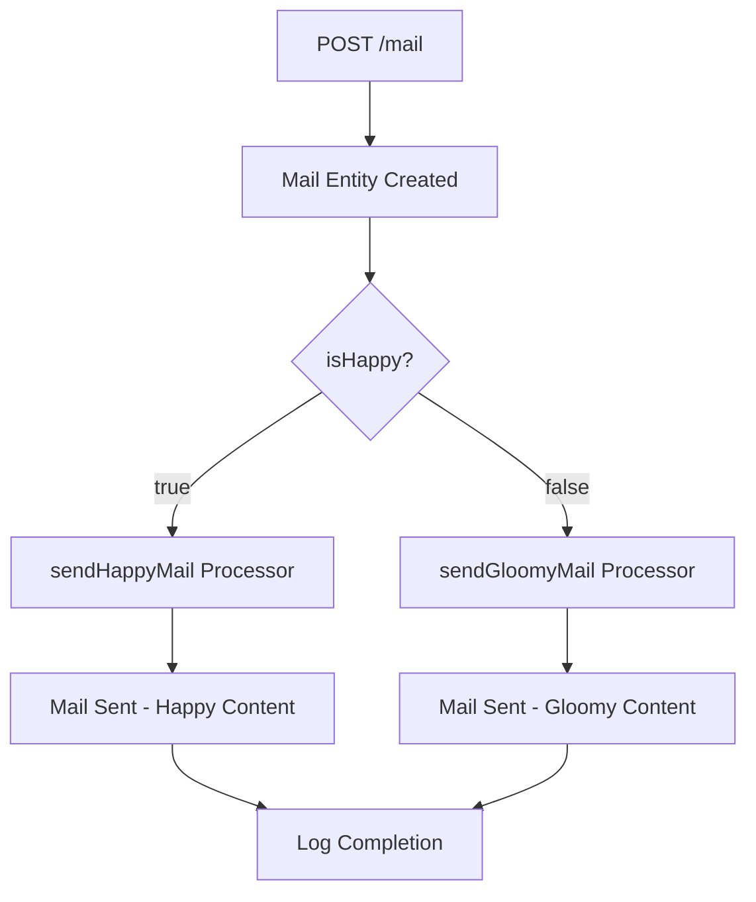
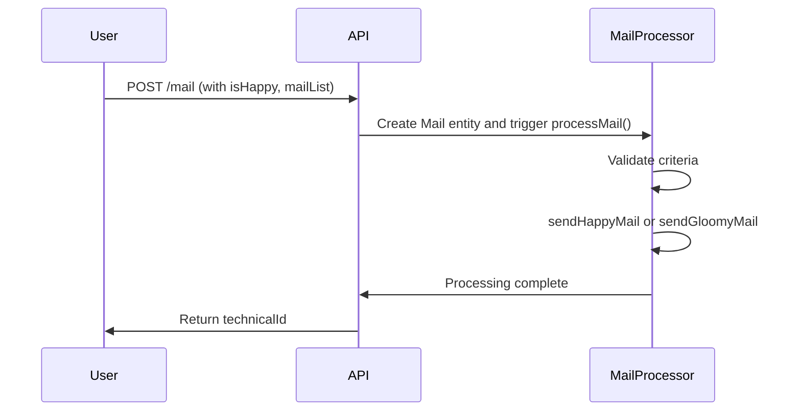

### 1. Entity Definitions

```
Mail:
- isHappy: Boolean (Indicates if the mail is happy or gloomy)
- mailList: List<String> (List of recipient email addresses)
- content: String (Optional, the body/content of the mail to be sent)
```

### 2. Process Method Flows

```
processMail() Flow:
1. Initial State: Mail entity is created with isHappy, mailList, and optional content fields set.
2. Validation: 
   - checkMailHappyCriteria() or checkMailGloomyCriteria() (triggered explicitly if requested)
   - Validate mailList contains valid email addresses (optional).
3. Processing:
   - If isHappy == true, execute sendHappyMail processor logic:
       - Compose/send happy mail content to all emails in mailList.
   - Else if isHappy == false, execute sendGloomyMail processor logic:
       - Compose/send gloomy mail content to all emails in mailList.
4. Completion: Mark mail as processed or log the event (favor immutable creation, no updates).
5. Notification: (Optional) Log or notify about mail sent status using logger.
```

### 3. API Endpoints Design

- **POST /mail**  
  - Creates a new `Mail` entity (immutable creation)  
  - Triggers `processMail()` event automatically  
  - Response: `{ "technicalId": "string" }`

- **GET /mail/{technicalId}**  
  - Retrieves stored mail processing result or status by technicalId

- **GET /mail?isHappy={true|false}** (Optional)  
  - Retrieves mails filtered by `isHappy` status  

### 4. Request/Response Formats

**POST /mail**  
Request body:
```json
{
  "isHappy": true,
  "mailList": ["user1@example.com", "user2@example.com"],
  "content": "Hello, this is a happy mail!"
}
```

Response body:
```json
{
  "technicalId": "abc123xyz"
}
```

**GET /mail/{technicalId}**  
Response body example:
```json
{
  "technicalId": "abc123xyz",
  "isHappy": true,
  "mailList": ["user1@example.com", "user2@example.com"],
  "content": "Hello, this is a happy mail!",
  "status": "COMPLETED"
}
```

**GET /mail?isHappy=true** (Optional)  
Response body example:
```json
[
  {
    "technicalId": "abc123xyz",
    "isHappy": true,
    "mailList": ["user1@example.com"],
    "content": "Happy mail content",
    "status": "COMPLETED"
  },
  {
    "technicalId": "def456uvw",
    "isHappy": true,
    "mailList": ["user3@example.com"],
    "content": "Another happy mail",
    "status": "COMPLETED"
  }
]
```

### 5. Mermaid Diagrams

#### Entity Lifecycle State Diagram


```mermaid
stateDiagram-v2
    [*] --> MailCreated
    MailCreated --> Processing : processMail()
    Processing --> Completed : success
    Processing --> Failed : error
    Completed --> [*]
    Failed --> [*]
```

#### Event-Driven Processing Chain


```mermaid
graph TD
    A[POST /mail] --> B[Mail Entity Created]
    B --> C{isHappy?}
    C -->|true| D[sendHappyMail Processor]
    C -->|false| E[sendGloomyMail Processor]
    D --> F[Mail Sent - Happy Content]
    E --> G[Mail Sent - Gloomy Content]
    F --> H[Log Completion]
    G --> H
```

#### User Interaction Sequence Flow


```mermaid
sequenceDiagram
    participant User
    participant API
    participant MailProcessor

    User->>API: POST /mail (with isHappy, mailList)
    API->>MailProcessor: Create Mail entity and trigger processMail()
    MailProcessor->>MailProcessor: Validate criteria
    MailProcessor->>MailProcessor: sendHappyMail or sendGloomyMail
    MailProcessor->>API: Processing complete
    API->>User: Return technicalId
```

---

This completes the functional requirements definition for your mail sending application using an Event-Driven Architecture approach.  
Please let me know if you need further adjustments or additional features!