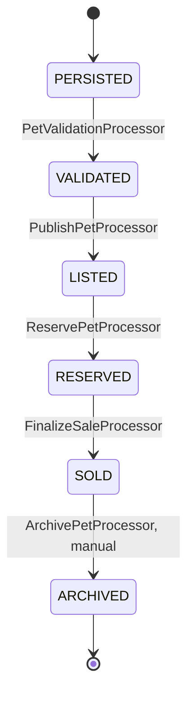
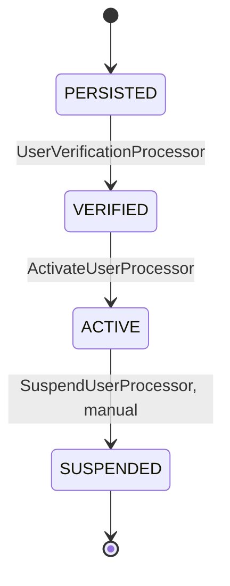
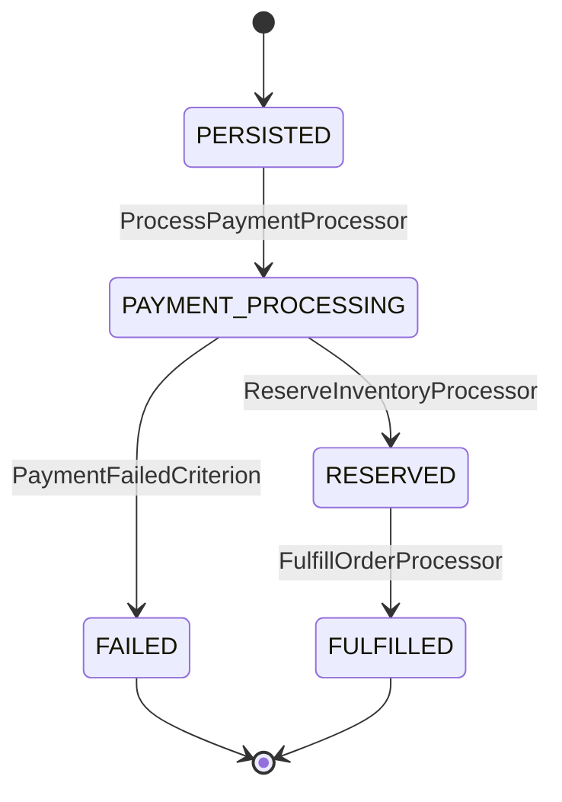

### 1. Entity Definitions
```
Pet:
- id: String (store-specific pet id)
- name: String (pet name)
- species: String (cat, dog, etc.)
- breed: String (breed details)
- ageMonths: Integer (age in months)
- healthStatus: String (initial health note)
- priceCents: Integer (price in cents)
- status: String (LISTED, RESERVED, SOLD, ARCHIVED)

User:
- id: String (store-specific user id)
- fullName: String (user full name)
- email: String (contact email)
- phone: String (contact phone)
- verified: Boolean (email/identity verified)
- accountStatus: String (ACTIVE, SUSPENDED)

Order:
- id: String (store-specific order id)
- petId: String (reference to Pet.id)
- buyerId: String (reference to User.id)
- totalCents: Integer (order total in cents)
- paymentMethod: String (card, paypal, etc.)
- status: String (PENDING, PAID, RESERVED, FULFILLED, FAILED)
```

### 2. Entity workflows

Pet workflow:
1. Initial State: PERSISTED when POSTed
2. Validation: automatic health and data checks
3. LISTED: visible in store
4. RESERVED: when an order reserves it
5. SOLD: when order completes
6. ARCHIVED: manual archival for retired pets


```mermaid
stateDiagram-v2
    [*] --> PERSISTED
    PERSISTED --> VALIDATED : PetValidationProcessor
    VALIDATED --> LISTED : PublishPetProcessor
    LISTED --> RESERVED : ReservePetProcessor
    RESERVED --> SOLD : FinalizeSaleProcessor
    SOLD --> ARCHIVED : ArchivePetProcessor, manual
    ARCHIVED --> [*]
```

Pet processors/criteria:
- Processors: PetValidationProcessor, PublishPetProcessor, ReservePetProcessor
- Criteria: PetHealthCriterion, PetDataCompleteCriterion

Pseudo code (processor examples):
```text
class PetValidationProcessor {
  process(pet){
    if PetHealthCriterion.ok(pet) and PetDataCompleteCriterion.ok(pet) set pet.status=LISTED
    else set pet.status=ARCHIVED
  }
}
class ReservePetProcessor { process(pet, order){ set pet.status=RESERVED } }
```

User workflow:
1. PERSISTED on create
2. Verification: auto email/fraud checks
3. ACTIVE or SUSPENDED
4. MANUAL_BAN possible by admin


```mermaid
stateDiagram-v2
    [*] --> PERSISTED
    PERSISTED --> VERIFIED : UserVerificationProcessor
    VERIFIED --> ACTIVE : ActivateUserProcessor
    ACTIVE --> SUSPENDED : SuspendUserProcessor, manual
    SUSPENDED --> [*]
```

User processors/criteria:
- Processors: UserVerificationProcessor, ActivateUserProcessor
- Criteria: EmailVerifiedCriterion, FraudCheckCriterion

Pseudo code:
```text
class UserVerificationProcessor {
  process(user){
    if EmailVerifiedCriterion.ok(user) and FraudCheckCriterion.ok(user) set user.verified=true
    else set user.accountStatus=SUSPENDED
  }
}
```

Order workflow:
1. PERSISTED (POST creates order event)
2. PAYMENT_PROCESSING: process payment
3. INVENTORY_RESERVATION: reserve pet if payment ok
4. FULFILLMENT: mark FULFILLED or FAILED
5. NOTIFICATION: notify buyer


```mermaid
stateDiagram-v2
    [*] --> PERSISTED
    PERSISTED --> PAYMENT_PROCESSING : ProcessPaymentProcessor
    PAYMENT_PROCESSING --> RESERVED : ReserveInventoryProcessor
    RESERVED --> FULFILLED : FulfillOrderProcessor
    PAYMENT_PROCESSING --> FAILED : PaymentFailedCriterion
    FAILED --> [*]
    FULFILLED --> [*]
```

Order processors/criteria:
- Processors: ProcessPaymentProcessor, ReserveInventoryProcessor, FulfillOrderProcessor, NotifyBuyerProcessor
- Criteria: PaymentSuccessCriterion, InventoryAvailableCriterion

Pseudo code:
```text
class ProcessPaymentProcessor {
  process(order){
    if PaymentSuccessCriterion.ok(order) set order.status=PAID
    else set order.status=FAILED
  }
}
class ReserveInventoryProcessor {
  process(order){
    if InventoryAvailableCriterion.ok(order.petId) set order.status=RESERVED; update Pet.status=RESERVED
    else set order.status=FAILED
  }
}
```

### 3. Pseudo code for each processor class
(See inline short pseudocode above for each processor; each processor implements process(entity[,context]) and updates entity.status, emits events for downstream processors.)

### 4. API Endpoints Design Rules

Rules applied:
- POST endpoints create entities and return only technicalId.
- GET by technicalId for all POSTed entities.
- No GET by condition (not requested).
- POST triggers Cyoda workflows automatically.

Endpoints and JSON examples:

POST /pets
Request:
```json
{
  "id":"pet-123",
  "name":"Mittens",
  "species":"Cat",
  "breed":"Tabby",
  "ageMonths":12,
  "healthStatus":"Checked",
  "priceCents":5000,
  "status":"LISTED"
}
```
Response:
```json
{ "technicalId":"tech-pet-0001" }
```

GET /pets/{technicalId}
Response:
```json
{ /* full persisted Pet record as stored */ }
```

POST /users
Request:
```json
{
  "id":"user-22",
  "fullName":"Alex P",
  "email":"alex@example.com",
  "phone":"555-0100",
  "verified":false,
  "accountStatus":"PENDING"
}
```
Response:
```json
{ "technicalId":"tech-user-0001" }
```

GET /users/{technicalId}
Response:
```json
{ /* full persisted User record */ }
```

POST /orders
Request:
```json
{
  "id":"order-9",
  "petId":"pet-123",
  "buyerId":"user-22",
  "totalCents":5000,
  "paymentMethod":"card",
  "status":"PENDING"
}
```
Response:
```json
{ "technicalId":"tech-order-0001" }
```

GET /orders/{technicalId}
Response:
```json
{ /* full persisted Order record */ }
```

Would you like me to (a) add an orchestration entity (OrderJob) to separately model retries and scheduling, (b) include GET-by-condition filters, or (c) expand processors with full Java-style pseudo code?