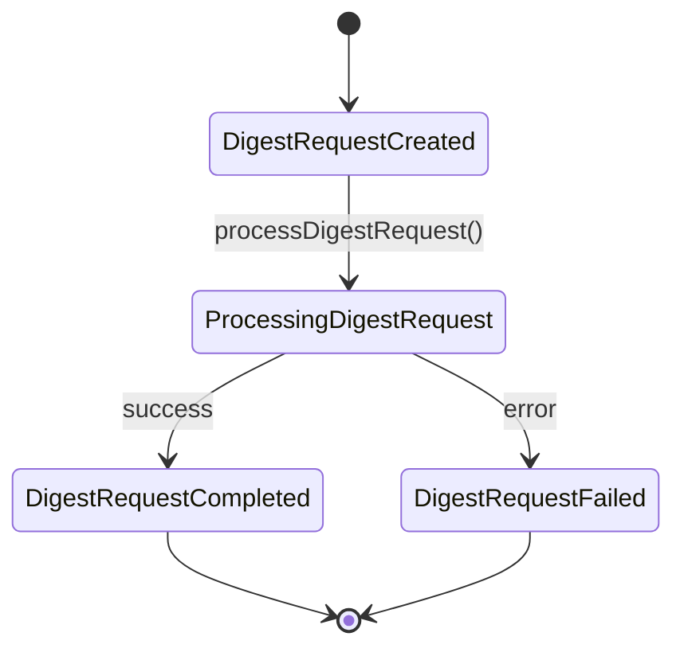
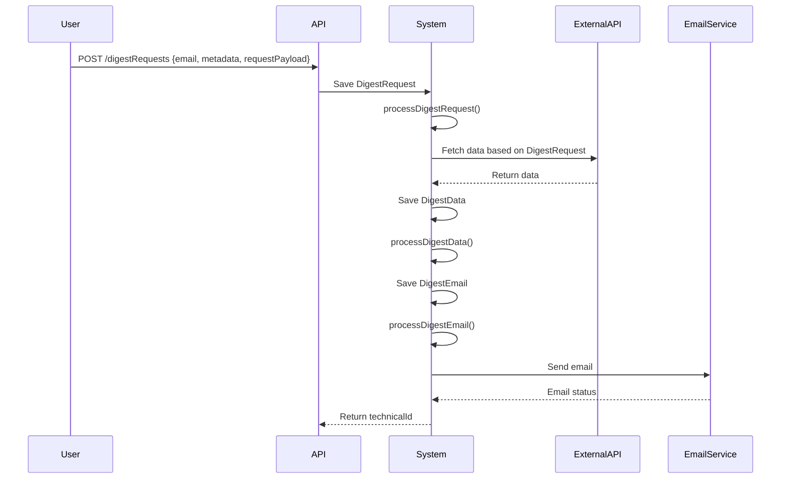

### 1. Entity Definitions

``` 
DigestRequest: 
- email: String (The user's email address to send the digest)
- metadata: String (Additional information influencing data retrieval or processing)
- requestPayload: String (Optional JSON/string data to guide API endpoint/parameters)

DigestData: 
- digestRequestId: String (Reference to the originating DigestRequest)
- retrievedData: String (Raw data fetched from external API, stored as JSON or text)
- formatType: String (Indicates digest format: plain text, HTML, attachment)

DigestEmail: 
- digestRequestId: String (Reference to the originating DigestRequest)
- emailContent: String (Compiled content ready for email sending)
- status: String (Email sending status: PENDING, SENT, FAILED)
```

---

### 2. Process Method Flows

```
processDigestRequest() Flow:
1. Initial State: DigestRequest entity created with user email and metadata.
2. Validation: Validate email format before processing.
3. Data Retrieval: 
   - Determine external API endpoint(s) and parameters from metadata or requestPayload, or use defaults.
   - Fetch required data from https://petstore.swagger.io/.
4. Persistence: Save fetched data in DigestData entity.
5. Trigger processDigestData() for digest compilation.

processDigestData() Flow:
1. Initial State: DigestData entity created with retrieved data.
2. Compilation: Format the retrieved data into HTML digest.
3. Persistence: Save compiled content in DigestEmail entity with status PENDING.
4. Trigger processDigestEmail() for email dispatch.

processDigestEmail() Flow:
1. Initial State: DigestEmail entity with PENDING status.
2. Email Dispatch: Send the compiled digest to the email address in DigestRequest.
3. Completion:
   - Update DigestEmail status to SENT if successful.
   - Update DigestEmail status to FAILED if error occurs.
```

---

### 3. API Endpoints Design

| HTTP Method | Endpoint                  | Description                                         | Request Body                | Response                    |
|-------------|---------------------------|---------------------------------------------------|-----------------------------|-----------------------------|
| POST        | /digestRequests            | Create DigestRequest entity, triggers processing  | `{ email, metadata, requestPayload? }` | `{ technicalId }`            |
| GET         | /digestRequests/{id}       | Retrieve DigestRequest by technicalId             | N/A                         | Full DigestRequest entity    |
| GET         | /digestData/{id}           | Retrieve DigestData by technicalId                 | N/A                         | Full DigestData entity       |
| GET         | /digestEmail/{id}          | Retrieve DigestEmail by technicalId                | N/A                         | Full DigestEmail entity      |

- No update/delete endpoints per EDA principle.
- POST endpoint only for orchestration entity `DigestRequest`.
- Business entities `DigestData` and `DigestEmail` managed internally via event processing.

---

### 4. Request/Response Formats

**POST /digestRequests**

_Request:_

```json
{
  "email": "user@example.com",
  "metadata": "fetchPetsByStatus=available",
  "requestPayload": "{\"endpoint\":\"/pet/findByStatus\",\"params\":{\"status\":\"available\"}}"
}
```

_Response:_

```json
{
  "technicalId": "abc123xyz"
}
```

**GET /digestRequests/{id}**

_Response:_

```json
{
  "email": "user@example.com",
  "metadata": "fetchPetsByStatus=available",
  "requestPayload": "{\"endpoint\":\"/pet/findByStatus\",\"params\":{\"status\":\"available\"}}"
}
```

**GET /digestData/{id}**

_Response:_

```json
{
  "digestRequestId": "abc123xyz",
  "retrievedData": "{...json data from petstore...}",
  "formatType": "html"
}
```

**GET /digestEmail/{id}**

_Response:_

```json
{
  "digestRequestId": "abc123xyz",
  "emailContent": "<html>...</html>",
  "status": "SENT"
}
```

---

### 5. Mermaid Diagrams

**DigestRequest Entity Lifecycle**


```mermaid
stateDiagram-v2
    [*] --> DigestRequestCreated
    DigestRequestCreated --> ProcessingDigestRequest : processDigestRequest()
    ProcessingDigestRequest --> DigestRequestCompleted : success
    ProcessingDigestRequest --> DigestRequestFailed : error
    DigestRequestCompleted --> [*]
    DigestRequestFailed --> [*]
```

**Event-Driven Processing Chain**

```mermaid
flowchart TD
    A[DigestRequest Created] --> B[processDigestRequest()]
    B --> C[DigestData Created]
    C --> D[processDigestData()]
    D --> E[DigestEmail Created]
    E --> F[processDigestEmail()]
    F --> G[Email Sent / Failed Status]
```

**User Interaction Sequence Flow**


```mermaid
sequenceDiagram
    participant User
    participant API
    participant System
    participant ExternalAPI
    participant EmailService

    User->>API: POST /digestRequests {email, metadata, requestPayload}
    API->>System: Save DigestRequest
    System->>System: processDigestRequest()
    System->>ExternalAPI: Fetch data based on DigestRequest
    ExternalAPI-->>System: Return data
    System->>System: Save DigestData
    System->>System: processDigestData()
    System->>System: Save DigestEmail
    System->>System: processDigestEmail()
    System->>EmailService: Send email
    EmailService-->>System: Email status
    System-->>API: Return technicalId
```

---

If you need any further refinement or additions, please let me know!