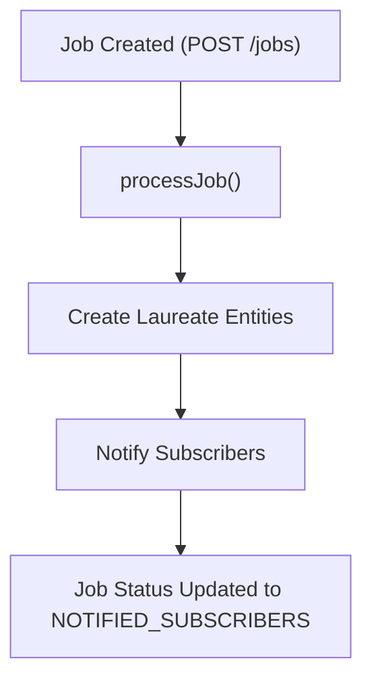

### 1. Entity Definitions

```
Job:
- jobName: String (Unique name or identifier for the job)
- status: String (Job lifecycle state: SCHEDULED, INGESTING, SUCCEEDED, FAILED, NOTIFIED_SUBSCRIBERS)
- createdAt: String (Timestamp of job creation)
- finishedAt: String (Timestamp of job completion, nullable if in progress)
- details: String (Optional details or logs related to the job)

Laureate:
- id: Integer (Unique laureate identifier from source API)
- firstname: String (First name of the laureate)
- surname: String (Surname of the laureate)
- born: String (Birth date in ISO format)
- died: String (Death date in ISO format or null)
- borncountry: String (Country where laureate was born)
- borncountrycode: String (Country code where laureate was born)
- borncity: String (City where laureate was born)
- gender: String (Gender of laureate)
- year: String (Year laureate received Nobel Prize)
- category: String (Nobel Prize category)
- motivation: String (Reason for award)
- name: String (Affiliated institution name)
- city: String (Affiliated institution city)
- country: String (Affiliated institution country)

Subscriber:
- subscriberName: String (Name of the subscriber)
- contactType: String (Type of contact: email, webhook, etc.)
- contactAddress: String (Email address or webhook URL)
- subscribedCategories: String (Comma-separated list of laureate categories subscriber wants notifications for)
- active: String (Indicator if subscriber is active: "true" or "false")
```

---

### 2. Process Method Flows

```
processJob() Flow:
1. Initial State: Job entity created with status = SCHEDULED
2. Validation: Validate jobName and required fields
3. Processing: Change status to INGESTING; call OpenDataSoft API to ingest laureates data
4. Laureate Entity Creation: For each laureate record, create a Laureate entity (immutable creation)
5. Completion: Update Job status to SUCCEEDED if ingestion successful or FAILED otherwise; set finishedAt timestamp
6. Notification: For each active Subscriber whose subscribedCategories intersect with new laureates’ categories, send notification
7. Final State: Update Job status to NOTIFIED_SUBSCRIBERS
```

```
processLaureate() Flow:
1. Validation: Check mandatory fields (id, firstname, surname, year, category)
2. Enrichment: Normalize country codes, calculate any derived data if needed
3. Persistence: Save laureate details as immutable record
4. No direct notifications or workflows triggered here (notifications handled by Job processing)
```

```
processSubscriber() Flow:
1. Validation: Validate contactType and contactAddress formats
2. Activation: Ensure active field is set correctly
3. Persistence: Save subscriber record immutably
4. No direct notifications or workflows triggered here; subscribers receive notifications via Job completion events
```

---

### 3. API Endpoints Design

**Job**

- `POST /jobs`  
  - Request:  
    ```json
    {
      "jobName": "IngestNobelLaureatesJob"
    }
    ```  
  - Response:  
    ```json
    {
      "technicalId": "string" 
    }
    ```
  - Behavior: Creates a Job entity, triggers `processJob()` event.

- `GET /jobs/{technicalId}`  
  - Response:  
    ```json
    {
      "jobName": "IngestNobelLaureatesJob",
      "status": "NOTIFIED_SUBSCRIBERS",
      "createdAt": "2024-06-01T12:00:00Z",
      "finishedAt": "2024-06-01T12:05:00Z",
      "details": "Job completed successfully"
    }
    ```

**Laureate**

- No POST endpoint (created immutably by Job processing).

- `GET /laureates/{technicalId}`  
  - Response:  
    ```json
    {
      "id": 853,
      "firstname": "Akira",
      "surname": "Suzuki",
      "born": "1930-09-12",
      "died": null,
      "borncountry": "Japan",
      "borncountrycode": "JP",
      "borncity": "Mukawa",
      "gender": "male",
      "year": "2010",
      "category": "Chemistry",
      "motivation": "\"for palladium-catalyzed cross couplings in organic synthesis\"",
      "name": "Hokkaido University",
      "city": "Sapporo",
      "country": "Japan"
    }
    ```

- `GET /laureates` (optional)  
  - Supports filtering by category, year, or borncountry if explicitly requested.

**Subscriber**

- `POST /subscribers`  
  - Request:  
    ```json
    {
      "subscriberName": "Science News Daily",
      "contactType": "email",
      "contactAddress": "notify@sciencenews.com",
      "subscribedCategories": "Physics,Chemistry",
      "active": "true"
    }
    ```  
  - Response:  
    ```json
    {
      "technicalId": "string"
    }
    ```
  - Behavior: Creates Subscriber entity, triggers `processSubscriber()` event.

- `GET /subscribers/{technicalId}`  
  - Response:  
    ```json
    {
      "subscriberName": "Science News Daily",
      "contactType": "email",
      "contactAddress": "notify@sciencenews.com",
      "subscribedCategories": "Physics,Chemistry",
      "active": "true"
    }
    ```

---

### 4. Mermaid Diagram: Event-Driven Processing Chain


```mermaid
graph TD
Job_Created["Job Created (POST /jobs)"]
Job_Processing["processJob()"]
Laureate_Creation["Create Laureate Entities"]
Subscriber_Notification["Notify Subscribers"]
Job_Completed["Job Status Updated to NOTIFIED_SUBSCRIBERS"]

Job_Created --> Job_Processing
Job_Processing --> Laureate_Creation
Laureate_Creation --> Subscriber_Notification
Subscriber_Notification --> Job_Completed
```