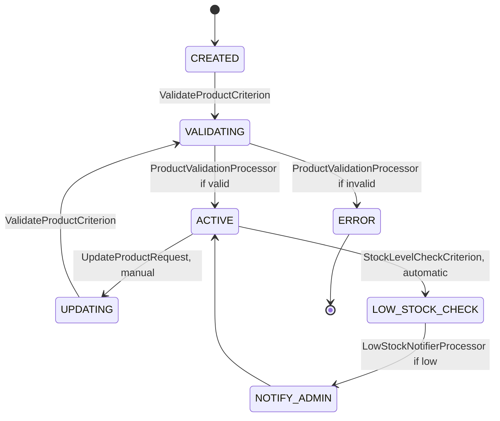
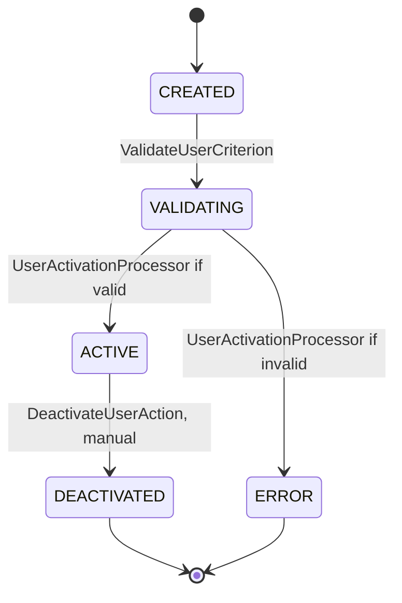
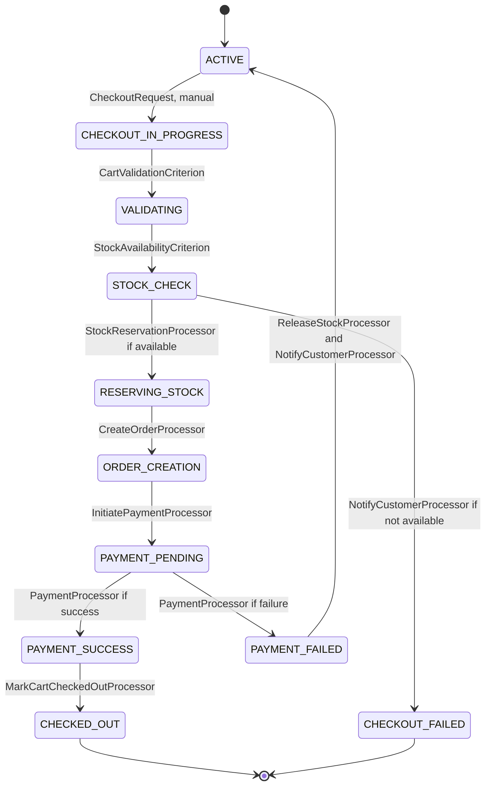
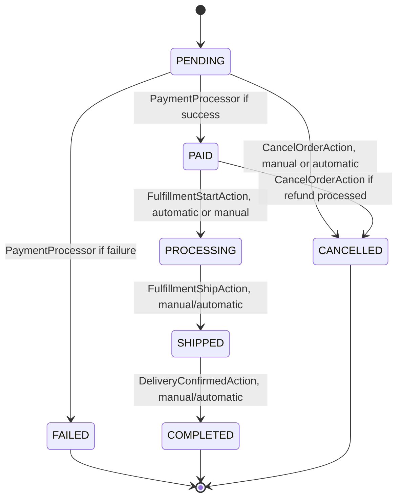
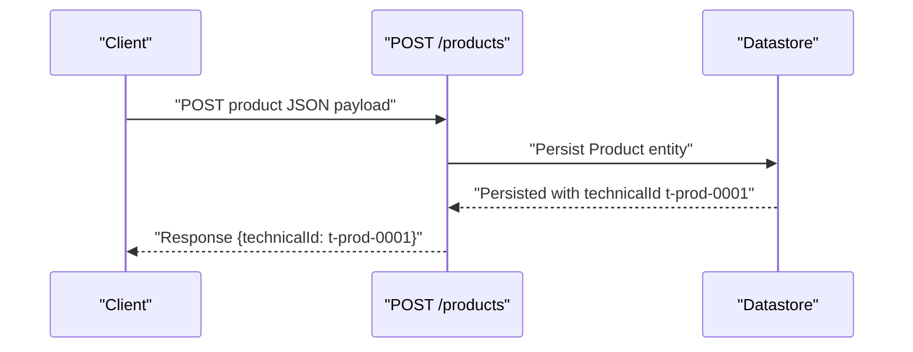
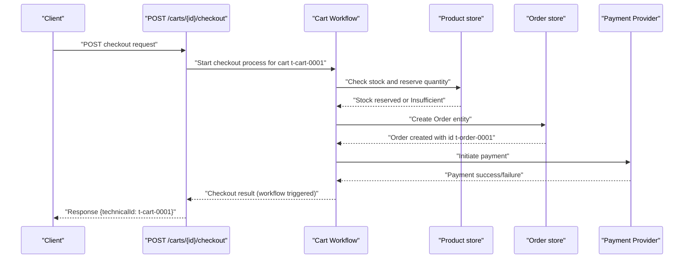
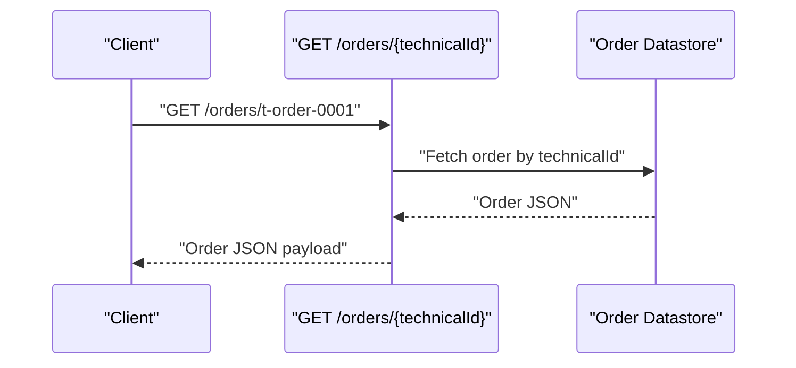

# Functional Requirements (Finalized)

Max entities considered: 4 (as specified by the user).  
Do not add any additional entities.

## 1. Entity Definitions

```
Product:
- id: String (business identifier, e.g., SKU or external id)
- name: String (product display name)
- description: String (long description)
- price: Decimal (unit price)
- currency: String (ISO currency code for price)
- stockQuantity: Integer (available quantity for sale)
- category: String (product category or taxonomy)
- imageUrl: String (URL to product image)
- importedFrom: String (optional source of import, e.g., filename or system)
- importedAt: String (ISO8601 timestamp when product was imported)
- createdByUserId: String (id of user who created/imported the product)
- createdAt: String (ISO8601 timestamp)
- updatedAt: String (ISO8601 timestamp)

User:
- id: String (business id for the user)
- role: String (Admin or Customer)
- name: String (full name)
- email: String (unique email)
- passwordHash: String (stored password hash)
- phone: String (optional phone number)
- createdAt: String (ISO8601 timestamp)
- updatedAt: String (ISO8601 timestamp)

ShoppingCart:
- id: String (business cart id)
- customerId: String (user.id of the owning customer)
- items: Array of objects (cart line items)
  - productId: String (reference to Product.id)
  - quantity: Integer (requested quantity)
  - priceAtAdd: Decimal (product price at time of adding)
- status: String (e.g., ACTIVE, CHECKOUT_IN_PROGRESS, CHECKED_OUT, CANCELLED)
- createdAt: String (ISO8601 timestamp)
- updatedAt: String (ISO8601 timestamp)

Order:
- id: String (business order id)
- customerId: String (user.id of the customer)
- items: Array of objects (order line items)
  - productId: String (reference to Product.id)
  - quantity: Integer
  - unitPrice: Decimal (unit price used for this order)
- subtotal: Decimal
- tax: Decimal
- shipping: Decimal
- total: Decimal
- status: String (e.g., PENDING, PAID, PROCESSING, SHIPPED, CANCELLED, FAILED)
- paymentReference: String (provider transaction id or reference)
- createdAt: String (ISO8601 timestamp)
- updatedAt: String (ISO8601 timestamp)
```

Do not use enum - not supported temporarily.

---

## 2. Entity Workflows

Note: In this Event-Driven Architecture each entity persistence (POST that creates or updates an entity) triggers its workflow automatically.

### Product workflow:
1. Initial State: Product created with CREATED status when persisted (via POST /products).
2. Validation (automatic): Validate required fields (id or sku, name, price, currency, stockQuantity >= 0).
3. Activation (automatic): If validation passes, mark product as ACTIVE and set createdAt/updatedAt.
4. Error (automatic): If validation fails, mark product as ERROR and log validation errors.
5. Update (manual/automatic): On product update, validate and set updatedAt.
6. Low Stock Notification (automatic): If stockQuantity falls below a configured threshold, emit LowStock event (notify Admin).

Entity state diagrams


```mermaid
stateDiagram-v2
    [*] --> CREATED
    CREATED --> VALIDATING : ValidateProductCriterion
    VALIDATING --> ACTIVE : ProductValidationProcessor if valid
    VALIDATING --> ERROR : ProductValidationProcessor if invalid
    ACTIVE --> UPDATING : UpdateProductRequest, manual
    UPDATING --> VALIDATING : ValidateProductCriterion
    ACTIVE --> LOW_STOCK_CHECK : StockLevelCheckCriterion, automatic
    LOW_STOCK_CHECK --> NOTIFY_ADMIN : LowStockNotifierProcessor if low
    NOTIFY_ADMIN --> ACTIVE
    ERROR --> [*]
```

Criterion and Processor classes needed:
- ProductValidationCriterion (checks required fields, price non-negative, currency format)
- ProductValidationProcessor (validates and sets ACTIVE or ERROR)
  - Pseudo:
    - fetch product
    - if fields missing or invalid -> set status=ERROR, errors=[...], persist
    - else set status=ACTIVE, set createdAt/updatedAt, persist
- StockLevelCheckCriterion (checks if stockQuantity < threshold)
- LowStockNotifierProcessor (sends notification to admins, logs)

---

### User workflow (Applies to both Admin and Customer roles):
1. Initial State: User created with CREATED status (via POST /users).
2. Validation (automatic): Validate email uniqueness and format.
3. Profile Setup (automatic): If role == Customer, create initial customer profile placeholders (addresses empty).
4. Activation (automatic): If validation passes, set status to ACTIVE.
5. Deactivation (manual): Admin can deactivate a user (manual).

Entity state diagrams


```mermaid
stateDiagram-v2
    [*] --> CREATED
    CREATED --> VALIDATING : ValidateUserCriterion
    VALIDATING --> ACTIVE : UserActivationProcessor if valid
    VALIDATING --> ERROR : UserActivationProcessor if invalid
    ACTIVE --> DEACTIVATED : DeactivateUserAction, manual
    DEACTIVATED --> [*]
    ERROR --> [*]
```

Criterion and Processor classes needed:
- ValidateUserCriterion (validates email format and uniqueness)
- UserActivationProcessor (on success sets ACTIVE and timestamps; on failure sets ERROR)
  - Pseudo:
    - check email uniqueness in datastore
    - if duplicate -> set status=ERROR, record reason
    - else hash password if provided, set status=ACTIVE, createdAt/updatedAt, persist
- CustomerProfileInitializerProcessor (for role==Customer, create default profile data) — this may be a step invoked by UserActivationProcessor.

---

### ShoppingCart workflow:
1. Initial State: Cart created with ACTIVE status (via POST /carts).
2. Add/Update Items (manual via API): Changing items updates cart.updatedAt and triggers CartChanged event.
3. Checkout Initiated (manual via POST /carts/{id}/checkout): change status to CHECKOUT_IN_PROGRESS (automatic as part of the checkout request).
4. Checkout Processing (automatic): Validate cart contents (CartValidationCriterion), check product availability (StockAvailabilityCriterion).
5. Reserve Stock (automatic): Decrement Product.stockQuantity atomically or reserve quantities; if insufficient stock, mark CHECKOUT_FAILED and notify customer.
6. Create Order (automatic): Create Order entity from cart items and persist Order with status PENDING.
7. Payment (automatic): Trigger PaymentProcessor; on payment success set Order.status=PAID and Cart.status=CHECKED_OUT and notify customer; on payment failure set Order.status=FAILED, Cart.status=ACTIVE (or CANCELLED per policy) and release reserved stock.
8. Completion: When Order transitions to PROCESSING/SHIPPED/COMPLETED as external fulfillment updates occur.

Entity state diagrams


```mermaid
stateDiagram-v2
    [*] --> ACTIVE
    ACTIVE --> CHECKOUT_IN_PROGRESS : CheckoutRequest, manual
    CHECKOUT_IN_PROGRESS --> VALIDATING : CartValidationCriterion
    VALIDATING --> STOCK_CHECK : StockAvailabilityCriterion
    STOCK_CHECK --> RESERVING_STOCK : StockReservationProcessor if available
    STOCK_CHECK --> CHECKOUT_FAILED : NotifyCustomerProcessor if not available
    RESERVING_STOCK --> ORDER_CREATION : CreateOrderProcessor
    ORDER_CREATION --> PAYMENT_PENDING : InitiatePaymentProcessor
    PAYMENT_PENDING --> PAYMENT_SUCCESS : PaymentProcessor if success
    PAYMENT_PENDING --> PAYMENT_FAILED : PaymentProcessor if failure
    PAYMENT_SUCCESS --> CHECKED_OUT : MarkCartCheckedOutProcessor
    PAYMENT_FAILED --> ACTIVE : ReleaseStockProcessor and NotifyCustomerProcessor
    CHECKED_OUT --> [*]
    CHECKOUT_FAILED --> [*]
```

Criterion and Processor classes needed:
- CartValidationCriterion (ensure cart has items, quantities > 0, prices present)
- StockAvailabilityCriterion (for each item check Product.stockQuantity >= requested)
- StockReservationProcessor
  - Pseudo:
    - for each item:
      - load Product
      - if product.stockQuantity >= item.quantity:
        - product.stockQuantity -= item.quantity
        - persist product
      - else throw InsufficientStockException
- CreateOrderProcessor
  - Pseudo:
    - create Order entity mapping items -> unitPrice = priceAtAdd
    - compute subtotal, tax, shipping, total
    - persist Order with status=PENDING
- InitiatePaymentProcessor
  - Pseudo:
    - call payment gateway adapter (synchronous or enqueue)
    - attach paymentReference to Order
- PaymentProcessor
  - Pseudo:
    - on success: set Order.status=PAID, updatedAt, persist
    - on failure: set Order.status=FAILED, persist
- ReleaseStockProcessor (restore product.stockQuantity on payment failure or cart cancel)
- NotifyCustomerProcessor (send emails/notifications)

---

### Order workflow:
1. Initial State: Order persisted with PENDING status (created by CreateOrderProcessor).
2. Payment Processing (automatic): PaymentProcessor moves status to PAID or FAILED.
3. Fulfillment (manual/automatic): On PAID, fulfillment system may set PROCESSING then SHIPPED then COMPLETED.
4. Cancellation (manual/automatic): Orders may be CANCELLED (e.g., stock/fulfillment issues or customer cancellation) and triggers stock release if needed.

Entity state diagrams


```mermaid
stateDiagram-v2
    [*] --> PENDING
    PENDING --> PAID : PaymentProcessor if success
    PENDING --> FAILED : PaymentProcessor if failure
    PAID --> PROCESSING : FulfillmentStartAction, automatic or manual
    PROCESSING --> SHIPPED : FulfillmentShipAction, manual/automatic
    SHIPPED --> COMPLETED : DeliveryConfirmedAction, manual/automatic
    PENDING --> CANCELLED : CancelOrderAction, manual or automatic
    PAID --> CANCELLED : CancelOrderAction if refund processed
    FAILED --> [*]
    COMPLETED --> [*]
    CANCELLED --> [*]
```

Criterion and Processor classes needed:
- PaymentCompletionCriterion (observes payment provider callbacks)
- PaymentCompletionProcessor
  - Pseudo:
    - on provider callback:
      - find Order by paymentReference
      - if provider status success -> set Order.status=PAID, persist
      - else set Order.status=FAILED, persist
- FulfillmentProcessor (receives external fulfillment updates and advances Order.status)
- OrderCancellationProcessor (handles cancellation and potential refunds and stock release)

---

## 3. API Endpoints Design (rules applied)

Rules applied:
- POST endpoints create entities and trigger their workflows. POST responses MUST return only technicalId (datastore-specific id).
- GET endpoints for retrieving stored results by technicalId are available for each entity that can be created via POST.
- GET by condition is NOT provided (not explicitly asked).
- GET all endpoints are optional; included for convenience for Product listing.

Endpoints list (behavior summary):

- POST /products
  - Description: Create a Product (triggers Product workflow).
  - Request: product payload (see JSON below).
  - Response: { "technicalId": "<id>" } only.

- GET /products/{technicalId}
  - Description: Retrieve stored Product by technicalId.

- GET /products
  - Description: Optional listing of products (pagination omitted for brevity).

- POST /users
  - Description: Create a User (Admin or Customer). Triggers User workflow.
  - Request: user payload.
  - Response: { "technicalId": "<id>" } only.

- GET /users/{technicalId}
  - Description: Retrieve stored User by technicalId.

- POST /carts
  - Description: Create a ShoppingCart for a customer. Triggers ShoppingCart workflow.
  - Request: cart payload (customerId and optional initial items).
  - Response: { "technicalId": "<cart-id>" } only.

- GET /carts/{technicalId}
  - Description: Retrieve stored ShoppingCart by technicalId.

- POST /carts/{technicalId}/items
  - Description: Add or update items in the cart. This is a POST that mutates the ShoppingCart entity and triggers CartChanged event/workflow.
  - Request: item payload (productId, quantity). Response: { "technicalId": "<cart-id>" } (only the cart technicalId).

- PATCH /carts/{technicalId}/items
  - Description: Update item quantities in cart. Returns { "technicalId": "<cart-id>" }.

- DELETE /carts/{technicalId}/items
  - Description: Remove an item from cart. Returns { "technicalId": "<cart-id>" }.

- POST /carts/{technicalId}/checkout
  - Description: Initiate checkout (changes cart to CHECKOUT_IN_PROGRESS and triggers checkout processors creating Order). Returns { "technicalId": "<cart-id>" }.

- GET /orders/{technicalId}
  - Description: Retrieve Order by technicalId (orders are created by CreateOrderProcessor as part of checkout).

Notes:
- No POST /orders endpoint is provided; orders are created by the ShoppingCart Checkout process (process method).
- All POST responses must return only technicalId field.

---

## 4. Request / Response Formats

Note: All POST endpoints return JSON with only the technicalId field in successful response bodies.

Examples:

- POST /products
  - Request JSON:
    {
      "id": "SKU-12345",
      "name": "Widget",
      "description": "A sample widget",
      "price": 9.99,
      "currency": "USD",
      "stockQuantity": 100,
      "category": "Gadgets",
      "imageUrl": "https://example.com/widget.png",
      "importedFrom": "csv_upload",
      "createdByUserId": "admin-1"
    }
  - Response JSON:
    {
      "technicalId": "t-prod-0001"
    }

- GET /products/{technicalId}
  - Response JSON:
    {
      "technicalId": "t-prod-0001",
      "id": "SKU-12345",
      "name": "Widget",
      "description": "A sample widget",
      "price": 9.99,
      "currency": "USD",
      "stockQuantity": 95,
      "category": "Gadgets",
      "imageUrl": "https://example.com/widget.png",
      "importedFrom": "csv_upload",
      "importedAt": "2025-08-01T12:00:00Z",
      "createdByUserId": "admin-1",
      "createdAt": "2025-08-01T12:00:00Z",
      "updatedAt": "2025-08-02T09:00:00Z"
    }

- POST /users
  - Request JSON:
    {
      "id": "user-100",
      "role": "Customer",
      "name": "Alice Example",
      "email": "alice@example.com",
      "passwordHash": "<bcrypt-hash>",
      "phone": "+15551234567"
    }
  - Response JSON:
    {
      "technicalId": "t-user-0001"
    }

- POST /carts
  - Request JSON:
    {
      "customerId": "user-100",
      "items": [
        { "productId": "SKU-12345", "quantity": 2, "priceAtAdd": 9.99 }
      ]
    }
  - Response JSON:
    {
      "technicalId": "t-cart-0001"
    }

- POST /carts/{technicalId}/checkout
  - Request JSON:
    {
      "paymentMethodId": "pm-visa-01",
      "shippingAddress": {
        "line1": "123 Main St",
        "city": "Exampleville",
        "state": "EX",
        "postalCode": "12345",
        "country": "US"
      }
    }
  - Response JSON:
    {
      "technicalId": "t-cart-0001"
    }

- GET /orders/{technicalId}
  - Response JSON:
    {
      "technicalId": "t-order-0001",
      "id": "ORD-2025-0001",
      "customerId": "user-100",
      "items": [
        { "productId": "SKU-12345", "quantity": 2, "unitPrice": 9.99 }
      ],
      "subtotal": 19.98,
      "tax": 1.50,
      "shipping": 5.00,
      "total": 26.48,
      "status": "PAID",
      "paymentReference": "payprov-98765",
      "createdAt": "2025-08-02T10:00:00Z",
      "updatedAt": "2025-08-02T10:01:00Z"
    }

---

## 5. Mermaid Visualizations for Request / Response flows

Note: Each code block below contains only valid Mermaid code.

POST /products request -> server -> response (technicalId):


```mermaid
sequenceDiagram
    participant Client as "Client"
    participant API as "POST /products"
    participant Store as "Datastore"
    Client->>API: "POST product JSON payload"
    API->>Store: "Persist Product entity"
    Store-->>API: "Persisted with technicalId t-prod-0001"
    API-->>Client: "Response {technicalId: t-prod-0001}"
```

POST /carts checkout flow (high-level):


```mermaid
sequenceDiagram
    participant Client as "Client"
    participant API as "POST /carts/{id}/checkout"
    participant CartSvc as "Cart Workflow"
    participant ProductSvc as "Product store"
    participant OrderSvc as "Order store"
    participant Payment as "Payment Provider"
    Client->>API: "POST checkout request"
    API->>CartSvc: "Start checkout process for cart t-cart-0001"
    CartSvc->>ProductSvc: "Check stock and reserve quantity"
    ProductSvc-->>CartSvc: "Stock reserved or Insufficient"
    CartSvc->>OrderSvc: "Create Order entity"
    OrderSvc-->>CartSvc: "Order created with id t-order-0001"
    CartSvc->>Payment: "Initiate payment"
    Payment-->>CartSvc: "Payment success/failure"
    CartSvc-->>API: "Checkout result (workflow triggered)"
    API-->>Client: "Response {technicalId: t-cart-0001}"
```

GET /orders/{technicalId} retrieval:


```mermaid
sequenceDiagram
    participant Client as "Client"
    participant API as "GET /orders/{technicalId}"
    participant OrderStore as "Order Datastore"
    Client->>API: "GET /orders/t-order-0001"
    API->>OrderStore: "Fetch order by technicalId"
    OrderStore-->>API: "Order JSON"
    API-->>Client: "Order JSON payload"
```

---

## 6. Required Criterion and Processor Class Summary (for implementation planning)

- ProductValidationCriterion
- ProductValidationProcessor
- StockLevelCheckCriterion
- LowStockNotifierProcessor

- ValidateUserCriterion
- UserActivationProcessor
- CustomerProfileInitializerProcessor

- CartValidationCriterion
- StockAvailabilityCriterion
- StockReservationProcessor
- CreateOrderProcessor
- InitiatePaymentProcessor
- PaymentProcessor
- ReleaseStockProcessor
- NotifyCustomerProcessor

- PaymentCompletionCriterion
- PaymentCompletionProcessor
- FulfillmentProcessor
- OrderCancellationProcessor

Each Processor pseudo code example (high-level):

- ProductValidationProcessor pseudo:
  - load product
  - if product.name empty or price < 0 or currency empty -> set status ERROR, persist errors
  - else set status ACTIVE, set timestamps, persist

- StockReservationProcessor pseudo:
  - begin transaction
  - for each item in cart:
    - load product
    - if product.stockQuantity < item.quantity -> rollback transaction -> throw InsufficientStock
    - product.stockQuantity -= item.quantity
    - persist product
  - commit transaction

- CreateOrderProcessor pseudo:
  - map cart items to order items with unitPrice = priceAtAdd
  - compute subtotal, tax, shipping, total
  - persist order with status PENDING
  - return order.technicalId

- PaymentProcessor pseudo:
  - call payment adapter
  - if success -> set order.status = PAID, persist, emit PaymentSucceededEvent
  - else -> set order.status = FAILED, persist, emit PaymentFailedEvent

---

**Please review the generated entities and workflows. If you need any changes, please let me know. Feel free to click Approve if this requirement meets your expectations or if you are ready to proceed.**