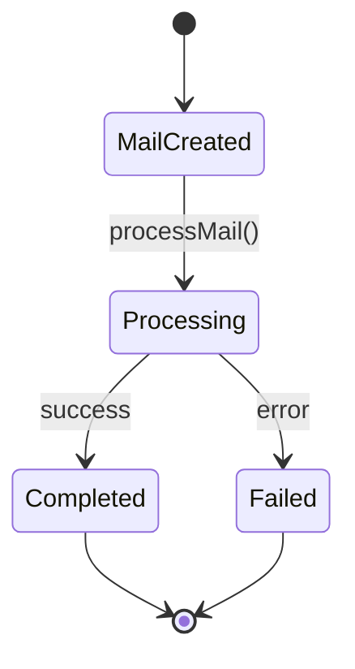
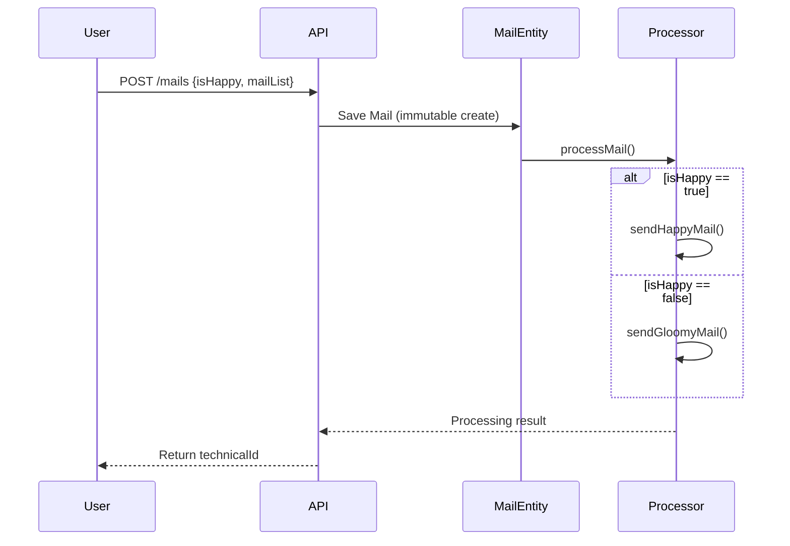
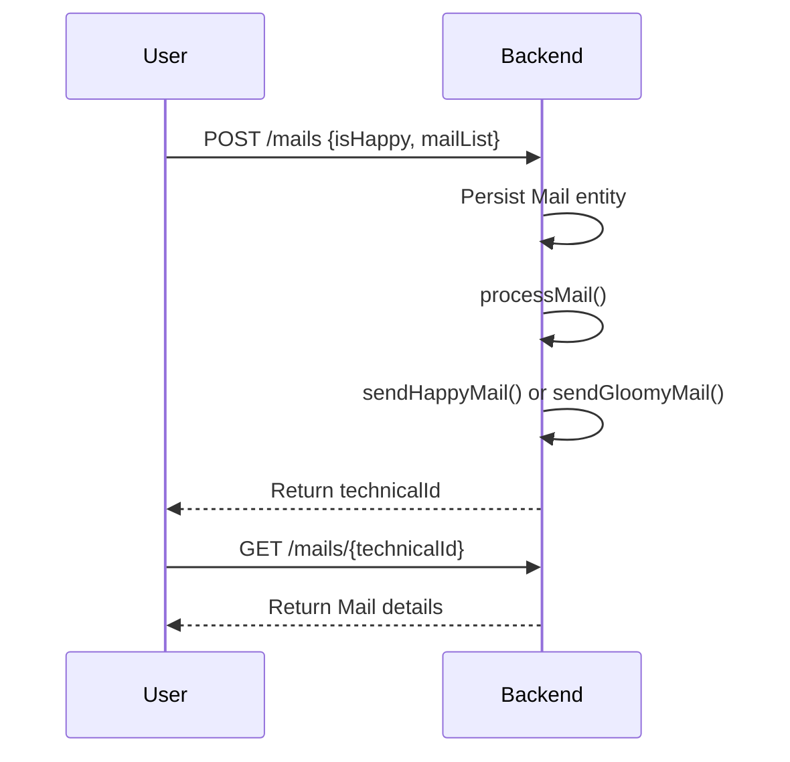

### 1. Entity Definitions

``` 
Mail: 
- isHappy: Boolean (Indicates if the mail is happy or gloomy)
- mailList: List<String> (List of recipient email addresses)
```

### 2. Process Method Flows

```
processMail() Flow:
1. Initial State: Mail entity is created (immutable creation) with given mailList and isHappy flag.
2. Validation: Optionally, checkMailHappyCriteria() or checkMailGloomyCriteria() can be called if criteria validation is requested.
3. Processing: Based on isHappy field:
   - If true, trigger sendHappyMail processor logic.
   - If false, trigger sendGloomyMail processor logic.
4. Completion: Mark the mail as processed (conceptually, by event emission; no update to entity).
5. Notification: Send mails to recipients in mailList with corresponding happy or gloomy message content.
```

### 3. API Endpoints Design

| Endpoint                   | HTTP Method | Description                                                   | Request Body Example                      | Response Example              |
|----------------------------|-------------|---------------------------------------------------------------|-------------------------------------------|-------------------------------|
| `/mails`                   | POST        | Create a new Mail entity and trigger processing               | `{ "isHappy": true, "mailList": ["a@b.com"] }` | `{ "technicalId": "uuid-1234" }` |
| `/mails/{technicalId}`     | GET         | Retrieve stored Mail processing result by technicalId         | N/A                                       | `{ "technicalId": "uuid-1234", "isHappy": true, "mailList": ["a@b.com"] }` |

- No update or delete endpoints, following immutable creation principle.
- No GET by condition endpoint unless explicitly requested later.

### 4. Request/Response Formats

**POST /mails Request**

```json
{
  "isHappy": true,
  "mailList": [
    "example1@example.com",
    "example2@example.com"
  ]
}
```

**POST /mails Response**

```json
{
  "technicalId": "generated-unique-id"
}
```

**GET /mails/{technicalId} Response**

```json
{
  "technicalId": "generated-unique-id",
  "isHappy": true,
  "mailList": [
    "example1@example.com",
    "example2@example.com"
  ]
}
```

---

### Mermaid Diagrams

**Mail Entity Lifecycle State Diagram**


```mermaid
stateDiagram-v2
    [*] --> MailCreated
    MailCreated --> Processing : processMail()
    Processing --> Completed : success
    Processing --> Failed : error
    Completed --> [*]
    Failed --> [*]
```

**Event-Driven Processing Chain**


```mermaid
sequenceDiagram
    participant User
    participant API
    participant MailEntity
    participant Processor

    User->>API: POST /mails {isHappy, mailList}
    API->>MailEntity: Save Mail (immutable create)
    MailEntity->>Processor: processMail()
    alt isHappy == true
        Processor->>Processor: sendHappyMail()
    else isHappy == false
        Processor->>Processor: sendGloomyMail()
    end
    Processor-->>API: Processing result
    API-->>User: Return technicalId
```

**User Interaction Sequence Flow**


```mermaid
sequenceDiagram
    participant User
    participant Backend

    User->>Backend: POST /mails {isHappy, mailList}
    Backend->>Backend: Persist Mail entity
    Backend->>Backend: processMail()
    Backend->>Backend: sendHappyMail() or sendGloomyMail()
    Backend-->>User: Return technicalId
    User->>Backend: GET /mails/{technicalId}
    Backend-->>User: Return Mail details
```

---

This completes the functional requirements for your Happy Mail Sender application using Event-Driven Architecture on Cyoda platform.  
Please let me know if you need further assistance!