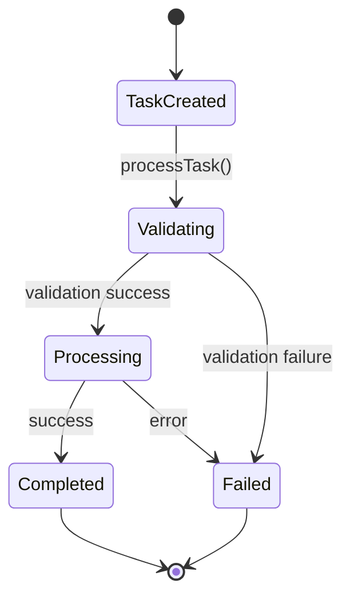
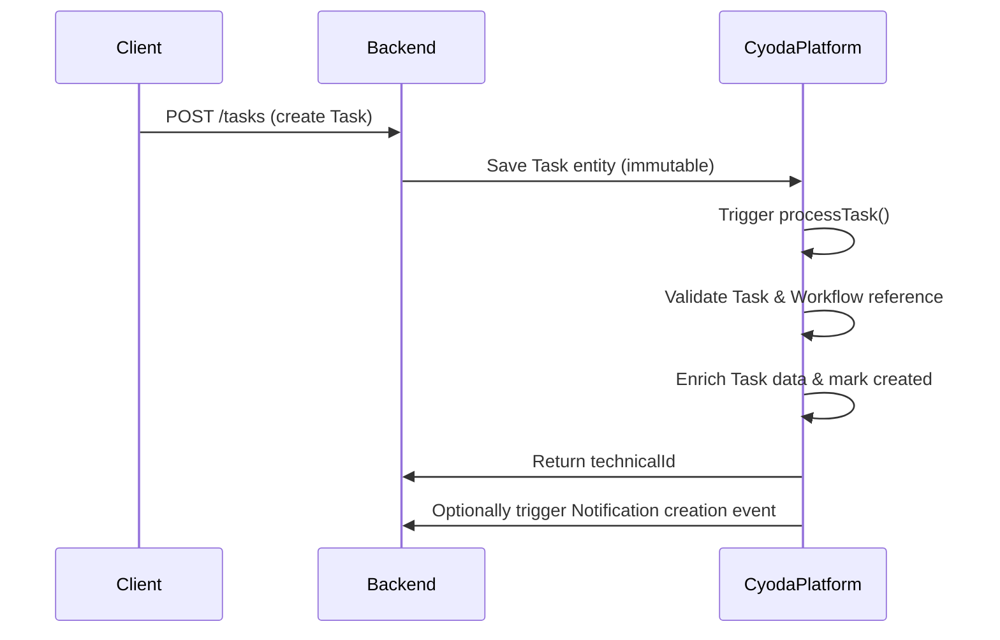
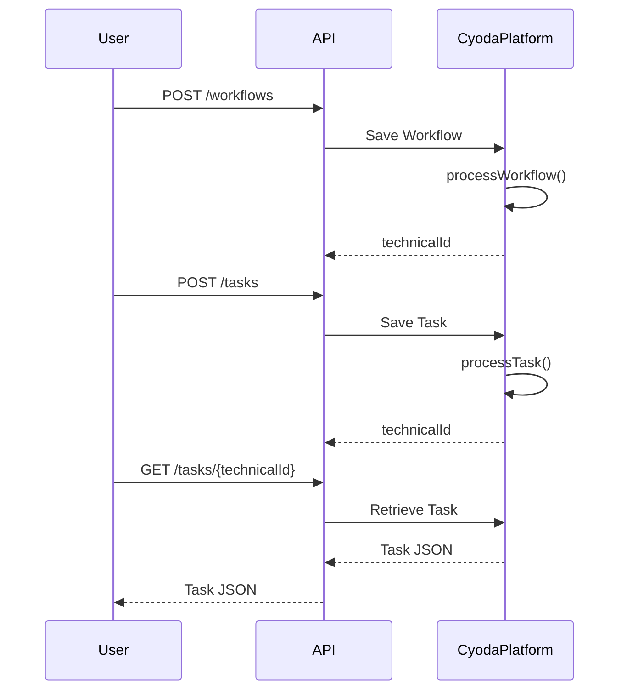

### 1. Entity Definitions

``` 
Workflow:  
- name: String (workflow name)  
- description: String (optional description/purpose)  
- createdAt: String (ISO timestamp when workflow created)  

Task:  
- workflowTechnicalId: String (reference to parent Workflow technicalId)  
- title: String (task title)  
- detail: String (task detailed description)  
- status: String (task status, e.g. PENDING, IN_PROGRESS, COMPLETED)  
- createdAt: String (ISO timestamp when task created)  

Notification:  
- taskTechnicalId: String (reference to related Task technicalId)  
- message: String (notification message content)  
- sentAt: String (ISO timestamp when notification sent)  
```

---

### 2. Process Method Flows

``` 
processWorkflow() Flow:
1. Initial State: Workflow entity saved (immutable creation)
2. Validation: Check workflow name is unique and non-empty
3. Initialization: Potentially create initial tasks or set up environment
4. Completion: Mark workflow as READY for task creation

processTask() Flow:
1. Initial State: Task created with PENDING status under a Workflow
2. Validation: Check referenced Workflow exists and status allows new tasks
3. Processing: Assign default status, possibly enrich task details
4. Completion: Mark task as created and trigger notification event

processNotification() Flow:
1. Initial State: Notification entity created for a Task
2. Validation: Confirm Task exists and notification message is valid
3. Processing: Send notification (e.g., log/send email - simulated)
4. Completion: Mark notification as sent with timestamp
```

---

### 3. API Endpoints Design

| HTTP Method | Path                    | Description                                   | Request Body                      | Response                    |
|-------------|-------------------------|-----------------------------------------------|---------------------------------|-----------------------------|
| POST        | /workflows              | Create a new Workflow (triggers processWorkflow) | `{ "name": "...", "description": "..." }` | `{ "technicalId": "..." }`  |
| GET         | /workflows/{technicalId}| Retrieve Workflow by technicalId              | N/A                             | Full Workflow entity JSON   |

| POST        | /tasks                  | Create a new Task (triggers processTask)      | `{ "workflowTechnicalId": "...", "title": "...", "detail": "...", "status": "PENDING" }` | `{ "technicalId": "..." }`  |
| GET         | /tasks/{technicalId}    | Retrieve Task by technicalId                   | N/A                             | Full Task entity JSON       |

| POST        | /notifications          | Create a Notification (triggers processNotification) | `{ "taskTechnicalId": "...", "message": "..." }` | `{ "technicalId": "..." }`  |
| GET         | /notifications/{technicalId} | Retrieve Notification by technicalId          | N/A                             | Full Notification entity JSON |

- **Note:** No update/delete endpoints to preserve immutability and event history.
- GET by condition or GET all endpoints are not included unless explicitly requested.

---

### 4. Request/Response JSON Examples

**Create Workflow (POST /workflows)**  
Request:  
```json
{
  "name": "Onboarding Process",
  "description": "Workflow for new employee onboarding"
}
```

Response:  
```json
{
  "technicalId": "wf-12345"
}
```

**Get Workflow (GET /workflows/wf-12345)**  
Response:  
```json
{
  "name": "Onboarding Process",
  "description": "Workflow for new employee onboarding",
  "createdAt": "2024-06-01T10:00:00Z"
}
```

**Create Task (POST /tasks)**  
Request:  
```json
{
  "workflowTechnicalId": "wf-12345",
  "title": "Setup workstation",
  "detail": "Order and set up computer and accessories",
  "status": "PENDING"
}
```

Response:  
```json
{
  "technicalId": "task-67890"
}
```

**Get Task (GET /tasks/task-67890)**  
Response:  
```json
{
  "workflowTechnicalId": "wf-12345",
  "title": "Setup workstation",
  "detail": "Order and set up computer and accessories",
  "status": "PENDING",
  "createdAt": "2024-06-01T11:00:00Z"
}
```

**Create Notification (POST /notifications)**  
Request:  
```json
{
  "taskTechnicalId": "task-67890",
  "message": "Task 'Setup workstation' is now pending"
}
```

Response:  
```json
{
  "technicalId": "notif-abcde"
}
```

---

### 5. Mermaid Diagrams

**Entity Lifecycle State Diagram (example for Task)**  

```mermaid
stateDiagram-v2
    [*] --> TaskCreated
    TaskCreated --> Validating : processTask()
    Validating --> Processing : validation success
    Validating --> Failed : validation failure
    Processing --> Completed : success
    Processing --> Failed : error
    Completed --> [*]
    Failed --> [*]
```

**Event-driven Processing Chain**  

```mermaid
sequenceDiagram
    participant Client
    participant Backend
    participant CyodaPlatform
    Client->>Backend: POST /tasks (create Task)
    Backend->>CyodaPlatform: Save Task entity (immutable)
    CyodaPlatform->>CyodaPlatform: Trigger processTask()
    CyodaPlatform->>CyodaPlatform: Validate Task & Workflow reference
    CyodaPlatform->>CyodaPlatform: Enrich Task data & mark created
    CyodaPlatform->>Backend: Return technicalId
    CyodaPlatform->>Backend: Optionally trigger Notification creation event
```

**User Interaction Sequence Flow**  

```mermaid
sequenceDiagram
    participant User
    participant API
    participant CyodaPlatform
    User->>API: POST /workflows
    API->>CyodaPlatform: Save Workflow
    CyodaPlatform->>CyodaPlatform: processWorkflow()
    CyodaPlatform-->>API: technicalId
    User->>API: POST /tasks
    API->>CyodaPlatform: Save Task
    CyodaPlatform->>CyodaPlatform: processTask()
    CyodaPlatform-->>API: technicalId
    User->>API: GET /tasks/{technicalId}
    API->>CyodaPlatform: Retrieve Task
    CyodaPlatform-->>API: Task JSON
    API-->>User: Task JSON
```

---

If you are ready, I can proceed to implement the backend application based on these functional requirements. Please let me know!