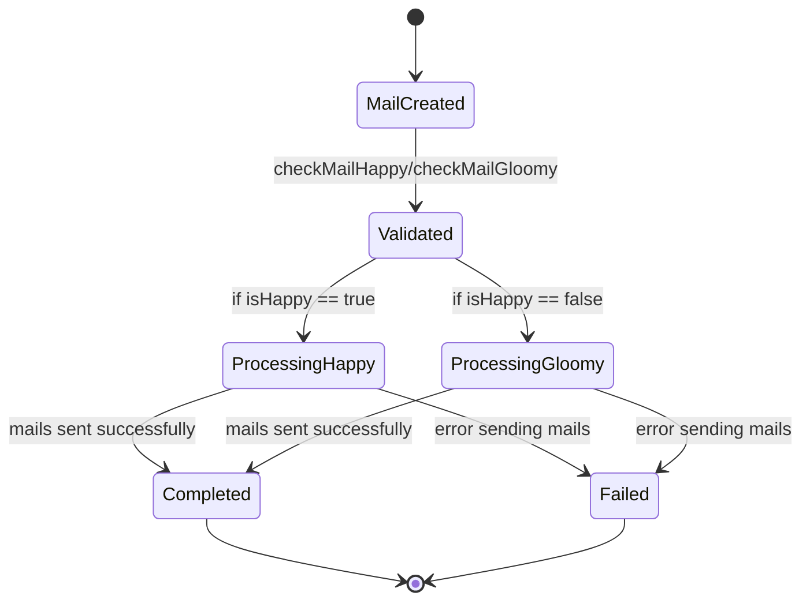
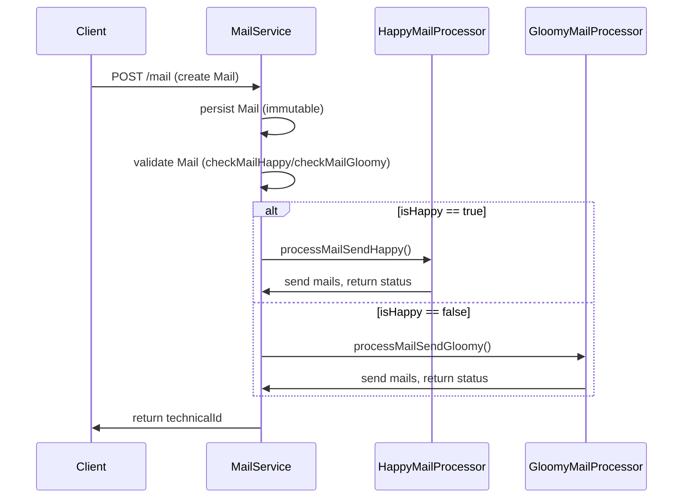
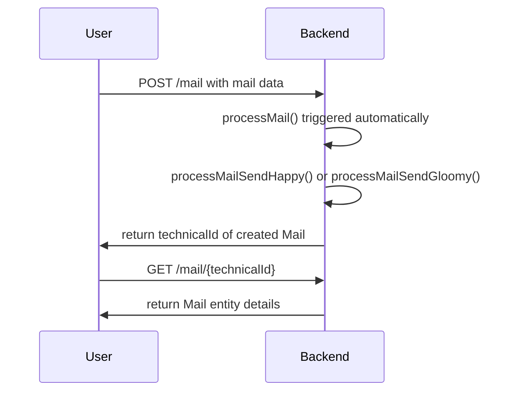

### 1. Entity Definitions

``` 
Mail:  
- isHappy: Boolean (indicates if the mail is happy or gloomy)  
- mailList: List<String> (list of recipient email addresses)  
- content: String (the body/content of the mail to be sent)  
- mailType: String (optional, to explicitly tag mail as "happy" or "gloomy"; derived from isHappy but can help criteria checks)  
```

### 2. Process Method Flows

``` 
processMail() Flow:  
1. Initial State: Mail entity is created and persisted (immutable).  
2. Validation: Check mail fields (isHappy, mailList, content).  
3. Criteria Evaluation: Use checkMailHappy() or checkMailGloomy() to determine mail type.  
4. Routing:  
   - If isHappy == true, trigger processMailSendHappy() processor event.  
   - If isHappy == false, trigger processMailSendGloomy() processor event.  
5. Processing: Send mails to all addresses in mailList with appropriate content.  
6. Completion: Log/send event about mail send completion or failure.  
```

### 3. API Endpoints Design

| Method | Endpoint       | Description                                  | Request Body                      | Response                     |
|--------|----------------|----------------------------------------------|---------------------------------|------------------------------|
| POST   | `/mail`        | Create a new Mail entity and trigger sending | `isHappy`, `mailList`, `content` | `{ "technicalId": "string" }` |
| GET    | `/mail/{technicalId}` | Retrieve Mail entity details                   | -                               | Full Mail entity JSON         |

- No update or delete endpoints to maintain immutability.
- POST `/mail` triggers the entire event-driven chain including mail sending.
- GET `/mail/{technicalId}` retrieves the stored mail entity by its technicalId.

### 4. Request/Response Formats

**POST /mail Request**

```json
{
  "isHappy": true,
  "mailList": ["user1@example.com", "user2@example.com"],
  "content": "Hello! Wishing you a wonderful day!"
}
```

**POST /mail Response**

```json
{
  "technicalId": "abc123"
}
```

**GET /mail/{technicalId} Response**

```json
{
  "isHappy": true,
  "mailList": ["user1@example.com", "user2@example.com"],
  "content": "Hello! Wishing you a wonderful day!",
  "mailType": "happy"
}
```

---

### Mermaid Diagrams

#### Entity Lifecycle State Diagram (Mail)


```mermaid
stateDiagram-v2
    [*] --> MailCreated
    MailCreated --> Validated : checkMailHappy/checkMailGloomy
    Validated --> ProcessingHappy : if isHappy == true
    Validated --> ProcessingGloomy : if isHappy == false
    ProcessingHappy --> Completed : mails sent successfully
    ProcessingHappy --> Failed : error sending mails
    ProcessingGloomy --> Completed : mails sent successfully
    ProcessingGloomy --> Failed : error sending mails
    Completed --> [*]
    Failed --> [*]
```

#### Event-Driven Processing Chain


```mermaid
sequenceDiagram
    participant Client
    participant MailService
    participant HappyMailProcessor
    participant GloomyMailProcessor
    Client->>MailService: POST /mail (create Mail)
    MailService->>MailService: persist Mail (immutable)
    MailService->>MailService: validate Mail (checkMailHappy/checkMailGloomy)
    alt isHappy == true
        MailService->>HappyMailProcessor: processMailSendHappy()
        HappyMailProcessor->>MailService: send mails, return status
    else isHappy == false
        MailService->>GloomyMailProcessor: processMailSendGloomy()
        GloomyMailProcessor->>MailService: send mails, return status
    end
    MailService->>Client: return technicalId
```

#### User Interaction Sequence Flow


```mermaid
sequenceDiagram
    participant User
    participant Backend
    User->>Backend: POST /mail with mail data
    Backend->>Backend: processMail() triggered automatically
    Backend->>Backend: processMailSendHappy() or processMailSendGloomy()
    Backend->>User: return technicalId of created Mail
    User->>Backend: GET /mail/{technicalId}
    Backend->>User: return Mail entity details
```

---

If you need any further clarifications or additions, please let me know!