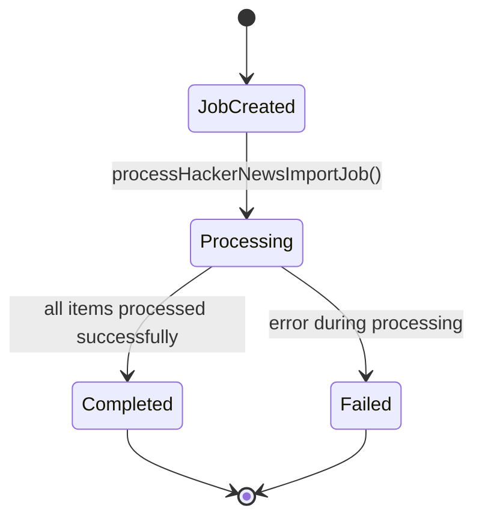
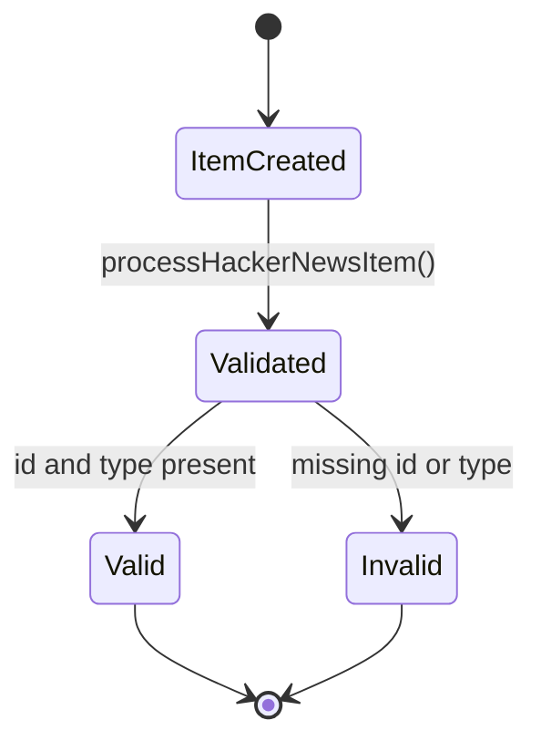
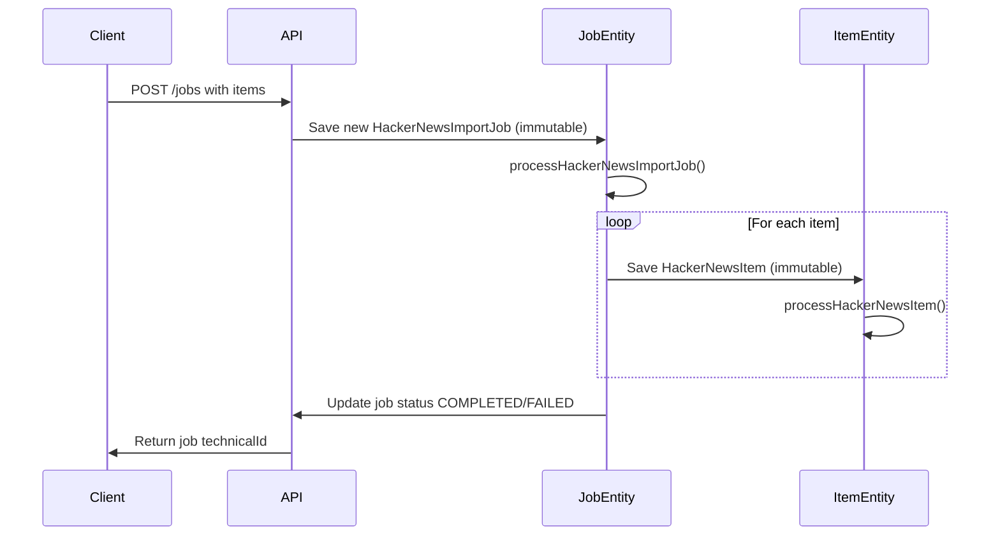

### 1. Entity Definitions

``` 
HackerNewsImportJob:
- technicalId: String (unique identifier assigned by datastore)
- importTimestamp: String (ISO-8601 timestamp when job was created)
- status: String (job processing state: PENDING, COMPLETED, FAILED)
- itemCount: Integer (number of items submitted in this job)
- description: String (optional description of job purpose)

HackerNewsItem:
- id: Long (Hacker News item id from JSON)
- type: String (type of item, e.g., story, comment)
- originalJson: String (full original JSON payload as string)
- importTimestamp: String (ISO-8601 timestamp when item was imported)
- state: String (VALID or INVALID depending on validation)
```

---

### 2. Process Method Flows

```
processHackerNewsImportJob() Flow:
1. Initial State: Job created with status = PENDING
2. Validation: Verify job parameters (e.g., itemCount > 0)
3. Processing:
    a. For each HackerNewsItem submitted within this job:
       - Save item entity (immutable creation)
       - Trigger processHackerNewsItem()
4. Completion:
    - Update job status to COMPLETED if all items processed successfully, else FAILED
5. Notification: (optional) Log or notify job completion status

processHackerNewsItem() Flow:
1. Initial State: Item persisted with originalJson and importTimestamp
2. Validation: Check presence of fields `id` and `type`
3. State Assignment:
    - If both present, set state = VALID
    - Else, state = INVALID
4. Completion: Item is stored immutable with state and timestamp
```

---

### 3. API Endpoints Design Rules

| Endpoint            | Description                                             | Response                          |
|---------------------|---------------------------------------------------------|----------------------------------|
| POST `/jobs`        | Create a new HackerNewsImportJob (triggers processing)  | `{ "technicalId": "job-uuid" }`  |
| GET `/jobs/{technicalId}` | Retrieve job details by technicalId                      | Job entity JSON (status, timestamps, counts) |
| GET `/items/{technicalId}` | Retrieve HackerNewsItem by technicalId                   | `{"item": {...originalJson...}, "state": "...", "importTimestamp": "..."}` |

- No update or delete endpoints (immutable creations only).
- Saving HackerNewsItems done internally during job processing; no direct POST for items.
- GET by non-technicalId or multiple retrievals only if explicitly requested.

---

### 4. Request/Response Formats

**POST `/jobs` Request JSON**

```json
{
  "description": "Import Hacker News items batch",
  "items": [
    { "id": 1234, "type": "story", "...": "..." },
    { "id": 5678, "type": "comment", "...": "..." }
  ]
}
```

**POST `/jobs` Response JSON**

```json
{
  "technicalId": "job-uuid-1234"
}
```

**GET `/jobs/{technicalId}` Response JSON**

```json
{
  "technicalId": "job-uuid-1234",
  "importTimestamp": "2024-06-01T15:30:00Z",
  "status": "COMPLETED",
  "itemCount": 2,
  "description": "Import Hacker News items batch"
}
```

**GET `/items/{technicalId}` Response JSON**

```json
{
  "item": {
    "id": 1234,
    "type": "story",
    "...": "..."
  },
  "state": "VALID",
  "importTimestamp": "2024-06-01T15:30:05Z"
}
```

---

### Mermaid Diagrams

**Entity Lifecycle State Diagram for HackerNewsImportJob**


```mermaid
stateDiagram-v2
    [*] --> JobCreated
    JobCreated --> Processing : processHackerNewsImportJob()
    Processing --> Completed : all items processed successfully
    Processing --> Failed : error during processing
    Completed --> [*]
    Failed --> [*]
```

**Entity Lifecycle State Diagram for HackerNewsItem**


```mermaid
stateDiagram-v2
    [*] --> ItemCreated
    ItemCreated --> Validated : processHackerNewsItem()
    Validated --> Valid : id and type present
    Validated --> Invalid : missing id or type
    Valid --> [*]
    Invalid --> [*]
```

**Event-Driven Processing Chain**


```mermaid
sequenceDiagram
    participant Client
    participant API
    participant JobEntity
    participant ItemEntity
    Client->>API: POST /jobs with items
    API->>JobEntity: Save new HackerNewsImportJob (immutable)
    JobEntity->>JobEntity: processHackerNewsImportJob()
    loop For each item
        JobEntity->>ItemEntity: Save HackerNewsItem (immutable)
        ItemEntity->>ItemEntity: processHackerNewsItem()
    end
    JobEntity->>API: Update job status COMPLETED/FAILED
    API->>Client: Return job technicalId
```

---

If you would like me to proceed with implementation or have any adjustments, please let me know!