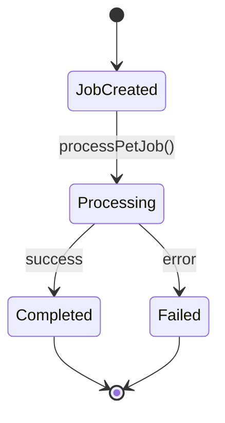
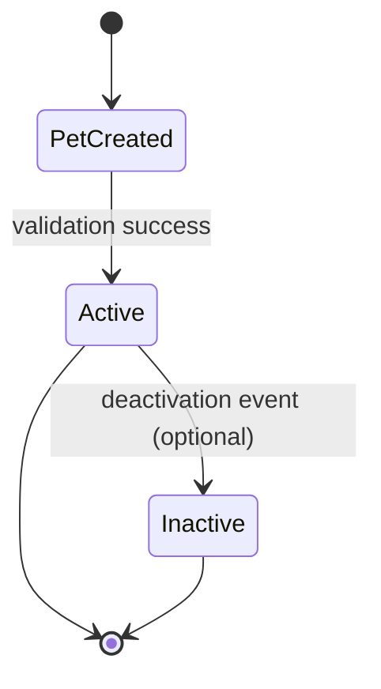
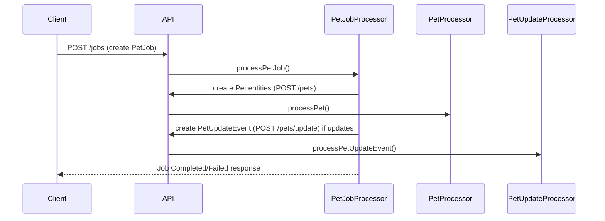

Certainly! Here is the well-formatted final version of your functional requirements for the "Purrfect Pets" API app following Event-Driven Architecture principles:

---

### 1. Entity Definitions

``` 
PetJob: 
- jobId: String (unique identifier for the job)
- submittedAt: DateTime (job creation timestamp)
- status: JobStatusEnum (PENDING, PROCESSING, COMPLETED, FAILED)

Pet:
- petId: String (unique identifier for the pet)
- name: String (name of the pet)
- species: String (type of pet, e.g., cat, dog)
- breed: String (breed of the pet)
- age: Integer (age of the pet in years)
- status: PetStatusEnum (ACTIVE, INACTIVE)

PetUpdateEvent:
- eventId: String (unique identifier for the event)
- petId: String (associated pet identifier)
- updatedFields: Map<String, Object> (fields and their new values)
- status: EventStatusEnum (PENDING, PROCESSED, FAILED)
```

---

### 2. Process Method Flows

```
processPetJob() Flow:
1. Initial State: PetJob created with PENDING status
2. Validation: Verify job parameters (e.g., pet data batch)
3. Trigger: For each pet data item, create a Pet entity (immutable)
4. Processing: Store Pet entities, trigger related PetUpdateEvent if updates exist
5. Completion: Update PetJob status to COMPLETED or FAILED
6. Notification: Log or notify job result

processPet() Flow:
1. Initial State: Pet entity created with ACTIVE status
2. Validation: Check mandatory pet fields (name, species)
3. Persistence: Save pet data immutably
4. Completion: Confirm pet record creation

processPetUpdateEvent() Flow:
1. Initial State: PetUpdateEvent created with PENDING status
2. Processing: Apply updates by creating new immutable Pet entity version
3. Completion: Update event status to PROCESSED or FAILED
```

---

### 3. API Endpoints

| Method | Endpoint               | Purpose                                      | Request Example                                      | Response Example                        |
|--------|------------------------|----------------------------------------------|-----------------------------------------------------|---------------------------------------|
| POST   | `/jobs`                | Create PetJob to batch process pets          | `{ "jobId": "job123" }`                             | `{ "jobId": "job123", "status": "PENDING" }` |
| POST   | `/pets`                | Add new Pet (triggers `processPet()`)        | `{ "name": "Whiskers", "species": "Cat", "breed": "Siamese", "age": 2 }` | `{ "petId": "pet789", "status": "ACTIVE" }` |
| POST   | `/pets/update`         | Create PetUpdateEvent to update pet info     | `{ "petId": "pet789", "updatedFields": { "age": 3 } }` | `{ "eventId": "event456", "status": "PENDING" }` |
| GET    | `/pets/{petId}`        | Retrieve pet details                          | -                                                   | `{ "petId": "pet789", "name": "Whiskers", ... }` |

---

### 4. Request/Response Formats

**Create PetJob Request:**
```json
{
  "jobId": "job123"
}
```

**Create PetJob Response:**
```json
{
  "jobId": "job123",
  "status": "PENDING"
}
```

**Create Pet Request:**
```json
{
  "name": "Whiskers",
  "species": "Cat",
  "breed": "Siamese",
  "age": 2
}
```

**Create Pet Response:**
```json
{
  "petId": "pet789",
  "status": "ACTIVE"
}
```

**Create PetUpdateEvent Request:**
```json
{
  "petId": "pet789",
  "updatedFields": {
    "age": 3
  }
}
```

**Create PetUpdateEvent Response:**
```json
{
  "eventId": "event456",
  "status": "PENDING"
}
```

**Get Pet Response:**
```json
{
  "petId": "pet789",
  "name": "Whiskers",
  "species": "Cat",
  "breed": "Siamese",
  "age": 3,
  "status": "ACTIVE"
}
```

---

### 5. Mermaid Diagrams

**PetJob Lifecycle State Diagram:**


```mermaid
stateDiagram-v2
    [*] --> JobCreated
    JobCreated --> Processing : processPetJob()
    Processing --> Completed : success
    Processing --> Failed : error
    Completed --> [*]
    Failed --> [*]
```

**Pet Lifecycle State Diagram:**


```mermaid
stateDiagram-v2
    [*] --> PetCreated
    PetCreated --> Active : validation success
    Active --> Inactive : deactivation event (optional)
    Active --> [*]
    Inactive --> [*]
```

**Event-Driven Processing Chain:**


```mermaid
sequenceDiagram
    participant Client
    participant API
    participant PetJobProcessor
    participant PetProcessor
    participant PetUpdateProcessor

    Client->>API: POST /jobs (create PetJob)
    API->>PetJobProcessor: processPetJob()
    PetJobProcessor->>API: create Pet entities (POST /pets)
    API->>PetProcessor: processPet()
    PetJobProcessor->>API: create PetUpdateEvent (POST /pets/update) if updates
    API->>PetUpdateProcessor: processPetUpdateEvent()
    PetJobProcessor-->>Client: Job Completed/Failed response
```

---

If you need any further details or adjustments, please let me know!