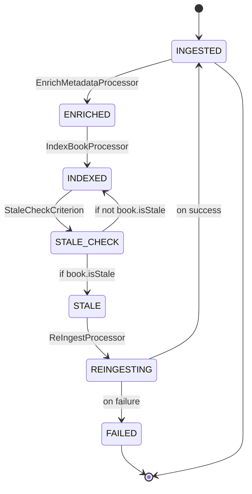
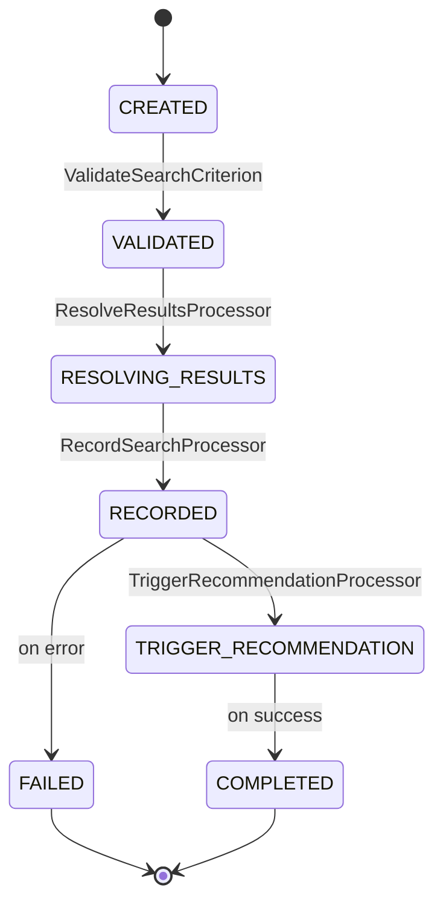
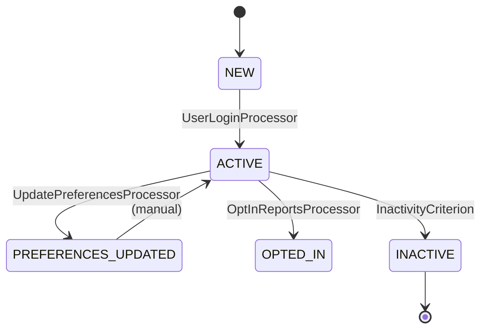
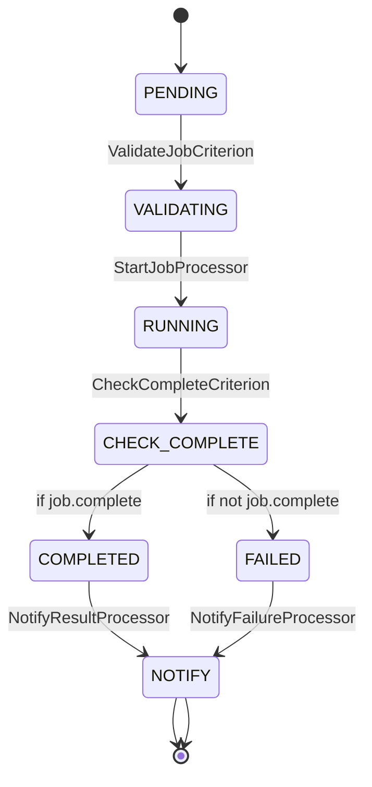

# Functional Requirements — Book Search & Orchestration Prototype

This document describes the canonical functional requirements for the prototype that manages Books, Users, SearchActivity events and Jobs (orchestration). It includes entity definitions, workflows (states, processors and criteria), representative pseudocode and API design rules. The content below updates and clarifies the previously provided logic to ensure internal consistency and to reflect the intended runtime behavior.

---

## 1. Entities (Definitions and important fields)

Note: Each entity lists required fields and common optional fields. Timestamp fields are ISO-8601 strings. Where appropriate, status/state enumerations are included.

- Book
  - id / openLibraryId: String (external/technical id; unique)
  - title: String
  - authors: Array[String]
  - coverImageUrl: String?
  - publicationYear: Integer?
  - genres: Array[String]
  - summary: String?
  - lastIngestedAt: String? (ISO timestamp)
  - state: String (INGESTED | ENRICHED | INDEXED | STALE | REINGESTING | FAILED)
  - metadata: Object? (free-form additional metadata)

- User
  - userId: String (application user id)
  - displayName: String?
  - preferences: Object (preferredGenres: Array[String], favoriteAuthors: Array[String])
  - optInReports: Boolean
  - lastActiveAt: String? (ISO timestamp)
  - state: String (NEW | ACTIVE | INACTIVE)

- SearchActivity
  - activityId: String (technical id)
  - userId: String? (nullable for anonymous searches)
  - queryText: String
  - timestamp: String (creation time, ISO)
  - filters: Object? (genres: Array[String], yearRange: {from,to}, authors: Array[String])
  - resultBookIds: Array[String] (populated after resolving results)
  - clickedBookIds: Array[String] (appended on click events)
  - state: String (CREATED | VALIDATED | RESOLVING_RESULTS | RECORDED | COMPLETED | FAILED)

- Job
  - jobId: String (technical orchestration id)
  - jobType: String (INGESTION | WEEKLY_REPORT | RECOMMENDATION_RUN | other types)
  - schedule: String? (cron or schedule descriptor)
  - status: String (PENDING | VALIDATING | RUNNING | COMPLETED | FAILED)
  - parameters: Object? (type-specific parameters)
  - startedAt: String?
  - finishedAt: String?
  - result: Object? (optional execution result or summary)

Notes:
- Where a field is marked optional (?) it may be absent on initial creation and populated by processors.
- States and status values are canonicalized here and used consistently across workflows and processors.

---

## 2. Workflows (states, processors, criteria and transitions)

Each entity is driven by processors (units of work) and criteria (decision checks). Processors are responsible for side effects (persisting entities, enqueueing jobs, calling external services). Criteria are deterministics checks that evaluate entity properties.

### 2.1 Book workflow

Typical lifecycle and state diagram:

- Initial state: INGESTED (record created after ingestion job)
- ENRICHED: metadata (cover, summary, genres) populated
- INDEXED: book made searchable (search index updated)
- STALE: lastIngestedAt older than configured threshold
- REINGESTING: reingestion in progress
- FAILED: terminal on repeated failures

State transitions (text):
1. INGESTED -> ENRICHED by EnrichMetadataProcessor
2. ENRICHED -> INDEXED by IndexBookProcessor
3. INDEXED -> STALE_CHECK (periodic check)
4. STALE_CHECK -> STALE if stale; otherwise remain INGESTED/INDEXED
5. STALE -> REINGESTING by ReIngestProcessor
6. REINGESTING -> INGESTED on success, -> FAILED on repeated failure
7. FAILED is terminal for the attempt (may be retried by operator or separate repair job)

Mermaid representation:


```mermaid
stateDiagram-v2
    [*] --> INGESTED
    INGESTED --> ENRICHED : EnrichMetadataProcessor
    ENRICHED --> INDEXED : IndexBookProcessor
    INDEXED --> STALE_CHECK : StaleCheckCriterion
    STALE_CHECK --> STALE : if book.isStale
    STALE_CHECK --> INDEXED : if not book.isStale
    STALE --> REINGESTING : ReIngestProcessor
    REINGESTING --> INGESTED : on success
    REINGESTING --> FAILED : on failure
    FAILED --> [*]
    INGESTED --> [*]
```

Processors & criteria (concise):
- Processors: EnrichMetadataProcessor, IndexBookProcessor, ReIngestProcessor
- Criteria: StaleCheckCriterion (configurable threshold)

Key rules / clarifications:
- Enrichment and Indexing are separate steps. Indexing may be asynchronous and eventually consistent.
- Stale detection depends on a configurable STALE_THRESHOLD (default example: 24 hours for prototype; production would be longer and configurable per source).
- ReIngest attempts should include backoff and limit retries. On repeated failures transition to FAILED and surface for operator intervention.

### 2.2 SearchActivity workflow

Lifecycle (text):
1. Created (POST /search-activities) -> state CREATED
2. Validate query/filters -> VALIDATED
3. Resolve results (query index) -> RESOLVING_RESULTS -> populate resultBookIds
4. Record activity (persist any analytics) -> RECORDED
5. Trigger downstream actions (Recommendation job, user preferences update, analytics feed) -> COMPLETED
6. On processing errors -> FAILED

Mermaid representation:


```mermaid
stateDiagram-v2
    [*] --> CREATED
    CREATED --> VALIDATED : ValidateSearchCriterion
    VALIDATED --> RESOLVING_RESULTS : ResolveResultsProcessor
    RESOLVING_RESULTS --> RECORDED : RecordSearchProcessor
    RECORDED --> TRIGGER_RECOMMENDATION : TriggerRecommendationProcessor
    TRIGGER_RECOMMENDATION --> COMPLETED : on success
    RECORDED --> FAILED : on error
    FAILED --> [*]
    COMPLETED --> [*]
```

Processors & criteria:
- Processors: ResolveResultsProcessor, RecordSearchProcessor, TriggerRecommendationProcessor
- Criteria: ValidateSearchCriterion (non-empty query unless anonymous analytics only; filter sanity checks)

Key rules / clarifications:
- POST /search-activities is an asynchronous event that returns a technical id immediately. The service should attempt to resolve results quickly but may populate resultBookIds asynchronously. GETting the activity returns current state and data.
- Click recording can be handled via a separate endpoint (e.g., POST /search-activities/{id}/clicks) that appends clickedBookIds and may enqueue personalization signals.
- TriggerRecommendationProcessor enqueues a Job of type RECOMMENDATION_RUN and does not block the search response.

### 2.3 User workflow

Lifecycle (text):
1. NEW on first creation (explicit signup or implicit on first action)
2. ACTIVE after login or performing actions
3. PREFERENCES_UPDATED whenever preferences are updated
4. OPTED_IN when user opts into reports (optInReports=true)
5. INACTIVE after inactivity threshold

Mermaid representation:


```mermaid
stateDiagram-v2
    [*] --> NEW
    NEW --> ACTIVE : UserLoginProcessor
    ACTIVE --> PREFERENCES_UPDATED : UpdatePreferencesProcessor
    PREFERENCES_UPDATED --> ACTIVE : (manual)
    ACTIVE --> OPTED_IN : OptInReportsProcessor
    ACTIVE --> INACTIVE : InactivityCriterion
    INACTIVE --> [*]
```

Processors & criteria:
- Processors: UserLoginProcessor, UpdatePreferencesProcessor, OptInReportsProcessor
- Criteria: InactivityCriterion (configurable window since lastActiveAt)

Key rules / clarifications:
- lastActiveAt should be updated on meaningful actions (search, click, login).
- Preferences updates can be triggered by user action or heuristics (e.g., preference inference from clicks) — these updates should be auditable and versioned if required.

### 2.4 Job workflow (orchestration)

Lifecycle (text):
1. PENDING when POST /jobs creates the job
2. VALIDATING when parameters/resources are validated
3. RUNNING when execution begins
4. COMPLETED on success, FAILED on error
5. Notify: NotifyResultProcessor publishes status/outputs to subscribers (admins, opt-in users)

Mermaid representation (aligned status names):


```mermaid
stateDiagram-v2
    [*] --> PENDING
    PENDING --> VALIDATING : ValidateJobCriterion
    VALIDATING --> RUNNING : StartJobProcessor
    RUNNING --> CHECK_COMPLETE : CheckCompleteCriterion
    CHECK_COMPLETE --> COMPLETED : if job.complete
    CHECK_COMPLETE --> FAILED : if not job.complete
    COMPLETED --> NOTIFY : NotifyResultProcessor
    NOTIFY --> [*]
    FAILED --> NOTIFY : NotifyFailureProcessor
    NOTIFY --> [*]
```

Processors & criteria:
- Processors: StartJobProcessor, ExecuteIngestionProcessor, ExecuteReportProcessor, NotifyResultProcessor
- Criteria: ValidateJobCriterion, CheckCompleteCriterion

Key rules / clarifications and recommended behavior:
- Jobs must record startedAt and finishedAt. Status transitions should be atomic and observable.
- StartJobProcessor should set status=RUNNING, startedAt=now(), call the type-specific executor and then set status=COMPLETED or FAILED and finishedAt=now().
- ValidateJobCriterion should ensure required parameters for the jobType are present and that resources (e.g., required connectors) are available.
- Job execution should be idempotent or guarded by execution locks to avoid duplicate runs.

---

## 3. Representative Pseudocode (updated and consistent)

EnrichMetadataProcessor

```
class EnrichMetadataProcessor {
  process(book) {
    external = fetchFromOpenLibrary(book.openLibraryId)
    if (external == null) throw new Error("External source not found")
    book.coverImageUrl = book.coverImageUrl || external.cover
    book.genres = mergeTags(book.genres, external.subjects)
    book.summary = book.summary || external.summary
    book.lastIngestedAt = now()
    book.state = 'ENRICHED'
    save(book)
  }
}
```

IndexBookProcessor

```
class IndexBookProcessor {
  process(book) {
    indexService.index(book.openLibraryId, {title: book.title, authors: book.authors, genres: book.genres, year: book.publicationYear})
    book.state = 'INDEXED'
    save(book)
  }
}
```

ResolveResultsProcessor

```
class ResolveResultsProcessor {
  process(activity) {
    // synchronous best-effort; may return partial results
    results = searchIndex.query(activity.queryText, activity.filters)
    activity.resultBookIds = results.map(r => r.openLibraryId)
    activity.state = 'RECORDED'
    save(activity)
  }
}
```

StartJobProcessor (corrected to set RUNNING and handle failures)

```
class StartJobProcessor {
  process(job) {
    job.status = 'RUNNING'
    job.startedAt = now()
    save(job)
    try {
      if (job.jobType == 'INGESTION') {
        ExecuteIngestionProcessor.process(job)
      } else if (job.jobType == 'WEEKLY_REPORT') {
        ExecuteReportProcessor.process(job)
      } else if (job.jobType == 'RECOMMENDATION_RUN') {
        ExecuteRecommendationProcessor.process(job)
      }
      job.finishedAt = now()
      job.status = 'COMPLETED'
    } catch (err) {
      job.finishedAt = now()
      job.status = 'FAILED'
      job.result = { error: err.message }
    } finally {
      save(job)
    }
  }
}
```

TriggerRecommendationProcessor

```
class TriggerRecommendationProcessor {
  process(activity) {
    enqueue Job { jobType: 'RECOMMENDATION_RUN', parameters: { userId: activity.userId, activityId: activity.activityId } }
  }
}
```

StaleCheckCriterion (configurable threshold)

```
class StaleCheckCriterion {
  constructor(threshold) { this.threshold = threshold || 24h }
  evaluate(book) {
    if (!book.lastIngestedAt) return true
    return now() - parseTimestamp(book.lastIngestedAt) > this.threshold
  }
}
```

Additional notes on pseudocode behaviour:
- Processors should persist state transitions atomically (or using a transaction) to avoid races.
- Many processors are expected to be idempotent (e.g., indexing, enrichment) to allow safe reprocessing.
- Retries: transient errors should be retried with backoff. Permanent errors must mark entity state appropriately.

---

## 4. API Endpoints — rules and detailed behavior

Rules applied across endpoints:
- POST endpoints create resources/events and return only a technical id (for event-driven design). The created entity may be processed asynchronously.
- GET endpoints return the stored entity representation by technical id.
- POST-created entities must have GET endpoints for clients to poll for results/state.
- Authorization, rate limiting, retention and error-handling specifics are out-of-scope for this file and must be defined separately.

Endpoints (concise):

1) Create Job (orchestration)
- POST /jobs
- Request JSON: { jobType: String, schedule?: String, parameters?: Object }
- Behavior: Validate parameters syntactically; create Job with status=PENDING and return { technicalId: jobId }.
- Response JSON: { technicalId: String }
- Notes: Validation of semantics (resources available) may be performed async by the validator; job will move to VALIDATING or RUNNING accordingly.

2) Get Job by technicalId
- GET /jobs/{technicalId}
- Response JSON: { jobId, jobType, schedule, status, parameters, startedAt, finishedAt, result }
- Notes: Clients may poll to determine completion and to fetch results or error details.

3) Create SearchActivity (user search event)
- POST /search-activities
- Request JSON: { userId?: String, queryText: String, filters?: Object }
- Behavior: Validate minimally (non-empty queryText unless analytics-only enabled), create SearchActivity with state=CREATED and return { technicalId: activityId }.
- Response JSON: { technicalId: String }
- Notes: The service will attempt to resolve results; resultBookIds may appear after processing. This endpoint is user-facing and should be low-latency.

4) Get SearchActivity by technicalId
- GET /search-activities/{technicalId}
- Response JSON: { activityId, userId, queryText, timestamp, filters, state, resultBookIds, clickedBookIds }
- Notes: Useful for progressive enhancement: the client may poll until state==COMPLETED or until resultBookIds is non-empty.

5) Append Click (record a click on a search result)
- POST /search-activities/{technicalId}/clicks
- Request JSON: { bookId: String }
- Behavior: Append to clickedBookIds and update analytics; return success status. This may update user preferences asynchronously.

6) Read Book
- GET /books/{technicalId}
- Response JSON: { openLibraryId, title, authors, coverImageUrl, publicationYear, genres, summary, lastIngestedAt, state }
- Notes: Books are primarily created/updated by ingestion/enrichment pipelines; clients read via GET.

7) Read User
- GET /users/{technicalId}
- Response JSON: { userId, displayName, preferences, optInReports, lastActiveAt, state }

API Error rules (high-level):
- Validation errors: 400 with error details
- Not found: 404
- Conflict (when attempting illegal state transitions or duplicate creates): 409
- Server errors: 500 (transient retry suggested)

---

## 5. Operational considerations / assumptions

- Idempotency & deduplication: Jobs and processors must be designed to be idempotent (or guarded by locks) to avoid duplicated work.
- Configurability: STALE_THRESHOLD, inactivity windows, retry limits, and backoff strategies are configurable values.
- Observability: All state transitions should be logged and emitted as events to an analytics/observability pipeline.
- Security: Authentication and authorization are expected but omitted from these functional requirements.
- Retention & GDPR: Storage and retention rules are out-of-scope but must be considered if real user data is persisted.

---

## 6. Summary of important fixes / updates applied to previous draft
- Standardized Job status enum and aligned all workflow diagrams and pseudocode to use PENDING | VALIDATING | RUNNING | COMPLETED | FAILED (previous draft mixed SUCCESS / COMPLETED).
- Made Book state explicit (added REINGESTING and clarified FAILED semantics).
- Clarified that POST /search-activities is asynchronous and that GET must be used to fetch results (progressive polling). Added explicit click endpoint behavior.
- Updated StartJobProcessor pseudocode to correctly set RUNNING, startedAt and handle failures with finishedAt and status set to COMPLETED or FAILED.
- Added notes on idempotency, retries, and configurability of thresholds.

If you prefer fewer entities or a different set of entities (or want these requirements adapted to a stricter synchronous API surface), tell me and I will adapt this document accordingly.
