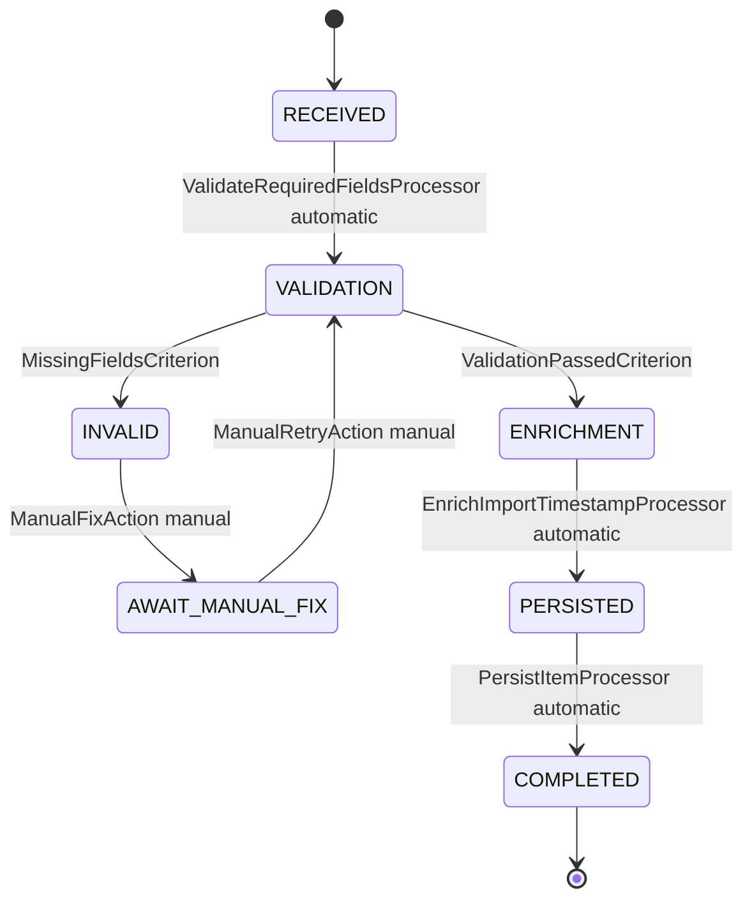
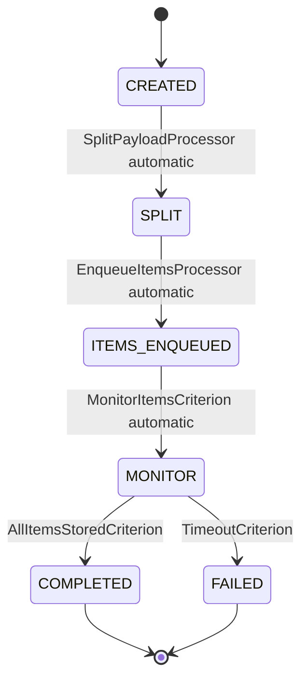
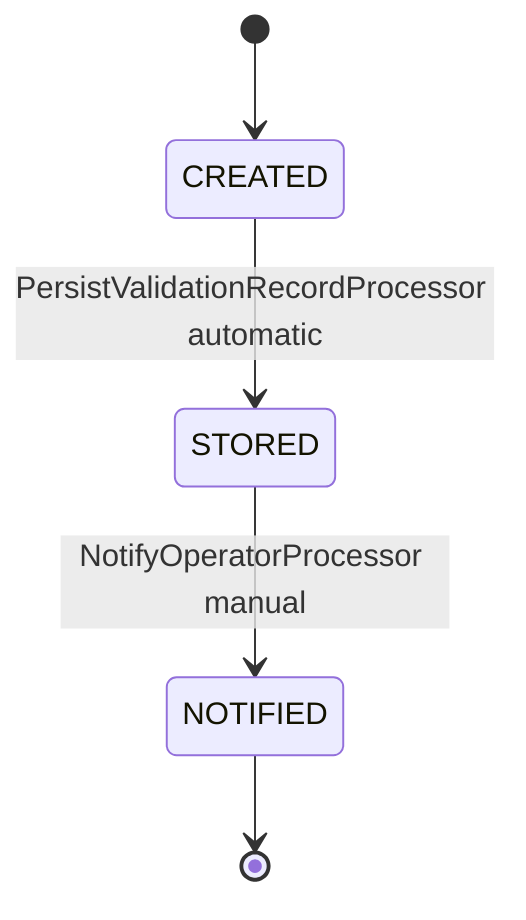
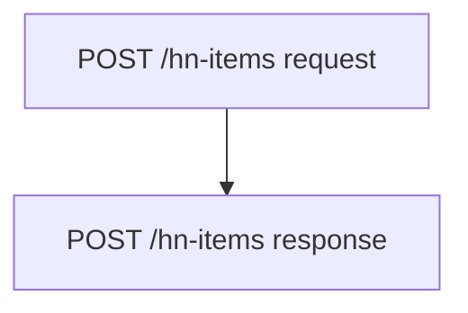
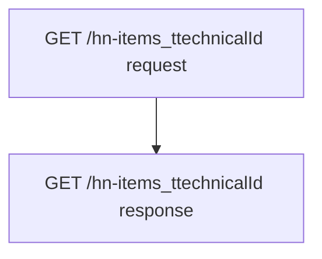
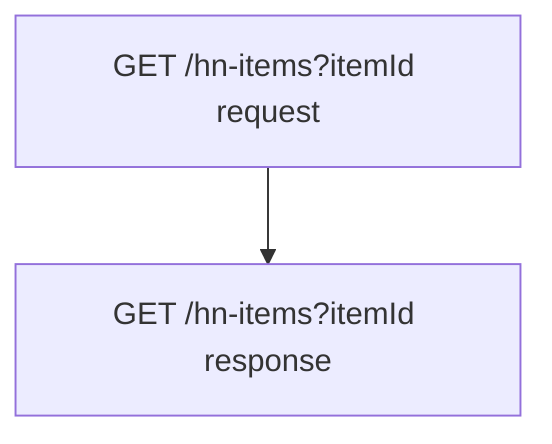

### 1. Entity Definitions
```
HNItem:
- id: Long (Hacker News item id from incoming JSON)
- type: String (item type from incoming JSON)
- rawJson: String (original JSON payload as received)
- importTimestamp: String (ISO8601 timestamp added by system)
- status: String (PENDING VALID INVALID STORED)
- errorMessage: String (validation or processing error if any)

IngestJob:
- source: String (origin of job eg manual bulk, api)
- payload: String (optional bulk JSON payload)
- createdAt: String (ISO8601)
- status: String (PENDING RUNNING COMPLETED FAILED)
- createdItemTechnicalIds: List String (technicalIds of created HNItem entities)

ValidationRecord:
- hnItemId: Long (if present in incoming data)
- technicalId: String (record technical id)
- isValid: Boolean
- missingFields: List String
- checkedAt: String (ISO8601)
- message: String (explanation)
```

### 2. Entity workflows

HNItem workflow:
1. Initial State: RECEIVED when POST creates HNItem event (Cyoda starts workflow)
2. Validation: automatic ValidateRequiredFieldsProcessor checks id and type
3. If invalid: move to INVALID and create ValidationRecord; await manual fix or reject
4. If valid: ENRICHMENT adds importTimestamp
5. Persistence: persist enriched metadata and rawJson; status STORED
6. Completion: COMPLETED (ready for GET by condition/technicalId)


```mermaid
stateDiagram-v2
    [*] --> RECEIVED
    RECEIVED --> VALIDATION : ValidateRequiredFieldsProcessor automatic
    VALIDATION --> INVALID : MissingFieldsCriterion
    VALIDATION --> ENRICHMENT : ValidationPassedCriterion
    INVALID --> AWAIT_MANUAL_FIX : ManualFixAction manual
    AWAIT_MANUAL_FIX --> VALIDATION : ManualRetryAction manual
    ENRICHMENT --> PERSISTED : EnrichImportTimestampProcessor automatic
    PERSISTED --> COMPLETED : PersistItemProcessor automatic
    COMPLETED --> [*]
```

Processors/Criteria for HNItem:
- ValidateRequiredFieldsProcessor (creates ValidationRecord when missing)
- MissingFieldsCriterion (decision)
- EnrichImportTimestampProcessor (adds importTimestamp)
- PersistItemProcessor (stores rawJson + metadata)
- ManualFixAction (UI/operator triggered retry)

IngestJob workflow (orchestration for bulk ingestion):
1. Initial State: CREATED via POST (returns technicalId)
2. Split: SplitPayloadProcessor extracts individual item payloads
3. Enqueue: EnqueueItemsProcessor creates HNItem entities (each triggers HNItem workflow)
4. Monitor: MonitorItemsCriterion watches created items until all STORED or timeout
5. Completion: COMPLETED or FAILED


```mermaid
stateDiagram-v2
    [*] --> CREATED
    CREATED --> SPLIT : SplitPayloadProcessor automatic
    SPLIT --> ITEMS_ENQUEUED : EnqueueItemsProcessor automatic
    ITEMS_ENQUEUED --> MONITOR : MonitorItemsCriterion automatic
    MONITOR --> COMPLETED : AllItemsStoredCriterion
    MONITOR --> FAILED : TimeoutCriterion
    COMPLETED --> [*]
    FAILED --> [*]
```

Processors/Criteria for IngestJob:
- SplitPayloadProcessor
- EnqueueItemsProcessor
- MonitorItemsCriterion
- AllItemsStoredCriterion
- TimeoutCriterion

ValidationRecord workflow:
1. CREATED when validation runs
2. STORED after saving record
3. OPTIONAL notify operator


```mermaid
stateDiagram-v2
    [*] --> CREATED
    CREATED --> STORED : PersistValidationRecordProcessor automatic
    STORED --> NOTIFIED : NotifyOperatorProcessor manual
    NOTIFIED --> [*]
```

Processors/Criteria for ValidationRecord:
- PersistValidationRecordProcessor
- NotifyOperatorProcessor

### 3. Pseudo code for processor classes

ValidateRequiredFieldsProcessor
```
process(hnItemEvent):
  payload = hnItemEvent.rawJson
  parsed = parseJson(payload)
  missing = []
  if parsed.id is missing: missing.add("id")
  if parsed.type is missing: missing.add("type")
  if missing not empty:
    create ValidationRecord with isValid=false missingFields=missing checkedAt=now
    update HNItem.status=INVALID errorMessage="missing fields"
    emit ValidationFailed event
  else:
    emit ValidationPassed event
```

EnrichImportTimestampProcessor
```
process(hnItem):
  hnItem.importTimestamp = now_iso()
  hnItem.status = VALID
  emit Enriched event
```

PersistItemProcessor
```
process(hnItem):
  store = { rawJson: hnItem.rawJson, importTimestamp: hnItem.importTimestamp, meta: ... }
  save store to persistent layer
  hnItem.status = STORED
  return technicalId
```

SplitPayloadProcessor (for IngestJob)
```
process(ingestJob):
  items = parseBulkPayload(ingestJob.payload)
  for itemJson in items:
    create HNItem entity with rawJson=itemJson status=PENDING
  update ingestJob.createdItemTechnicalIds with returned technicalIds
```

MonitorItemsCriterion
```
evaluate(ingestJob):
  for id in ingestJob.createdItemTechnicalIds:
    state = fetch HNItem status by technicalId
    if any status is INVALID and not fixed -> return false
    if any status is PENDING -> return false
  return true
```

Note: Cyoda will invoke these processors/criteria automatically when the entity is persisted or when their triggering events happen.

### 4. API Endpoints Design Rules

Rules applied:
- POST endpoints create entities and return only technicalId.
- GET by technicalId present for all POST-created entities.
- GET by condition provided for HNItem to fetch by hackernews id field (user requirement).
- GET endpoints only retrieve stored results.

Endpoints (examples)
- POST /hn-items
  - Request JSON: { "rawJson": "{...}" }
  - Response JSON: { "technicalId": "string" }

- GET /hn-items/{technicalId}
  - Response JSON: { "rawJson": "{...}" , "metadata": { "importTimestamp": "...", "status": "STORED" } }

- GET /hn-items?itemId=12345
  - Response JSON: { "rawJson": "{...}" }  (returns original JSON for item id 12345)

- POST /ingest-jobs
  - Request JSON: { "source": "manual", "payload": "[{...},{...}]" }
  - Response JSON: { "technicalId": "string" }

- GET /ingest-jobs/{technicalId}
  - Response JSON: { "status": "COMPLETED", "createdItemTechnicalIds":[ "..."] }

Mermaid request/response flows


```mermaid
flowchart TD
    POST_HN_ITEMS[POST /hn-items request]
    POST_HN_ITEMS --> POST_HN_ITEMS_RESP[POST /hn-items response]
```


```mermaid
flowchart TD
    GET_HN_BY_TID[GET /hn-items_ttechnicalId request]
    GET_HN_BY_TID --> GET_HN_BY_TID_RESP[GET /hn-items_ttechnicalId response]
```


```mermaid
flowchart TD
    GET_HN_BY_COND[GET /hn-items?itemId request]
    GET_HN_BY_COND --> GET_HN_BY_COND_RESP[GET /hn-items?itemId response]
```

Notes / decisions to confirm
- Retrieval should return the original rawJson (current model returns rawJson unchanged). Confirm if importTimestamp must be excluded from returned JSON or can be returned as metadata field.
- Decide behavior for duplicate incoming id on save: overwrite, reject, or version — current workflows assume create new technicalId and may overwrite store on PersistItemProcessor or reject if desired.

If you confirm the two questions above (return rawJson only vs include importTimestamp as part of JSON, and duplicate id handling), I will finalize the entity fields, transitions and API examples and generate the Cyoda model.