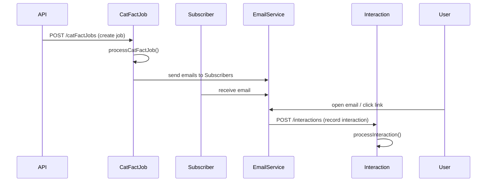
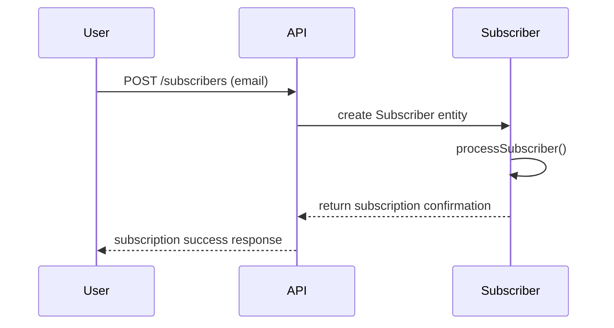

### 1. Entity Definitions

``` 
CatFactJob:  
- id: UUID (unique identifier)  
- scheduledAt: DateTime (when the ingestion/send job is scheduled)  
- catFactText: String (the fetched cat fact content)  
- status: StatusEnum {PENDING, PROCESSING, COMPLETED, FAILED} (job lifecycle state)  

Subscriber:  
- id: UUID (unique identifier)  
- email: String (subscriber email address)  
- subscribedAt: DateTime (timestamp of subscription)  
- status: StatusEnum {ACTIVE, UNSUBSCRIBED} (subscription state)  

Interaction:  
- id: UUID (unique identifier)  
- subscriberId: UUID (reference to Subscriber)  
- catFactJobId: UUID (reference to CatFactJob)  
- interactionType: InteractionEnum {EMAIL_OPEN, LINK_CLICK} (type of interaction)  
- interactedAt: DateTime (timestamp of interaction)  
- status: StatusEnum {RECORDED} (interaction state)  
```

---

### 2. Process Method Flows

```
processCatFactJob() Flow:
1. Initial State: CatFactJob created with PENDING status.
2. Fetch Fact: Retrieve new cat fact from Cat Fact API.
3. Save Fact: Store cat fact text in CatFactJob.
4. Send Emails: Dispatch cat fact email to all ACTIVE Subscribers.
5. Update Status: Mark job COMPLETED if successful, FAILED otherwise.
6. Trigger interaction tracking mechanisms asynchronously (e.g., email opens, clicks).

processSubscriber() Flow:
1. Initial State: Subscriber created with ACTIVE status.
2. Validation: Verify valid email format and uniqueness.
3. Persistence: Save subscriber data.
4. Confirmation: Optionally send welcome/confirmation email.
5. Status remains ACTIVE until unsubscribe event.

processInteraction() Flow:
1. Initial State: Interaction entity created when interaction event occurs.
2. Validation: Confirm referenced Subscriber and CatFactJob exist.
3. Persistence: Record interaction details.
4. Status set to RECORDED.
```

---

### 3. API Endpoints & Request/Response Formats

**POST /subscribers**  
_Create new subscriber (triggers `processSubscriber()`)_

Request:
```json
{
  "email": "user@example.com"
}
```

Response:
```json
{
  "id": "uuid",
  "email": "user@example.com",
  "subscribedAt": "2024-06-01T12:00:00Z",
  "status": "ACTIVE"
}
```

---

**POST /catFactJobs**  
_Trigger new CatFactJob creation (triggers `processCatFactJob()`, scheduled weekly)_

Request:
```json
{
  "scheduledAt": "2024-06-08T09:00:00Z"
}
```

Response:
```json
{
  "id": "uuid",
  "scheduledAt": "2024-06-08T09:00:00Z",
  "status": "PENDING"
}
```

---

**POST /interactions**  
_Record an interaction event (triggers `processInteraction()`)_

Request:
```json
{
  "subscriberId": "uuid",
  "catFactJobId": "uuid",
  "interactionType": "LINK_CLICK",
  "interactedAt": "2024-06-01T13:00:00Z"
}
```

Response:
```json
{
  "id": "uuid",
  "status": "RECORDED"
}
```

---

**GET /subscribers/count**  
_Return total number of ACTIVE subscribers_

Response:
```json
{
  "activeSubscribers": 1234
}
```

**GET /interactions/count**  
_Return total interactions count by type_

Response:
```json
{
  "emailOpens": 5678,
  "linkClicks": 3456
}
```

---

### 4. Mermaid Diagrams

**CatFactJob Lifecycle State Diagram**


```mermaid
stateDiagram-v2
    [*] --> PENDING
    PENDING --> PROCESSING : processCatFactJob()
    PROCESSING --> COMPLETED : success
    PROCESSING --> FAILED : error
    COMPLETED --> [*]
    FAILED --> [*]
```

---

**Event-Driven Processing Chain**


```mermaid
sequenceDiagram
    participant API
    participant CatFactJob
    participant Subscriber
    participant EmailService
    participant Interaction

    API->>CatFactJob: POST /catFactJobs (create job)
    CatFactJob->>CatFactJob: processCatFactJob()
    CatFactJob->>EmailService: send emails to Subscribers
    Subscriber->>EmailService: receive email
    User->>EmailService: open email / click link
    EmailService->>Interaction: POST /interactions (record interaction)
    Interaction->>Interaction: processInteraction()
```

---

**User Subscription Flow**


```mermaid
sequenceDiagram
    participant User
    participant API
    participant Subscriber

    User->>API: POST /subscribers (email)
    API->>Subscriber: create Subscriber entity
    Subscriber->>Subscriber: processSubscriber()
    Subscriber-->>API: return subscription confirmation
    API-->>User: subscription success response
```

---

If you need any further clarifications or extensions, feel free to ask. Thank you!