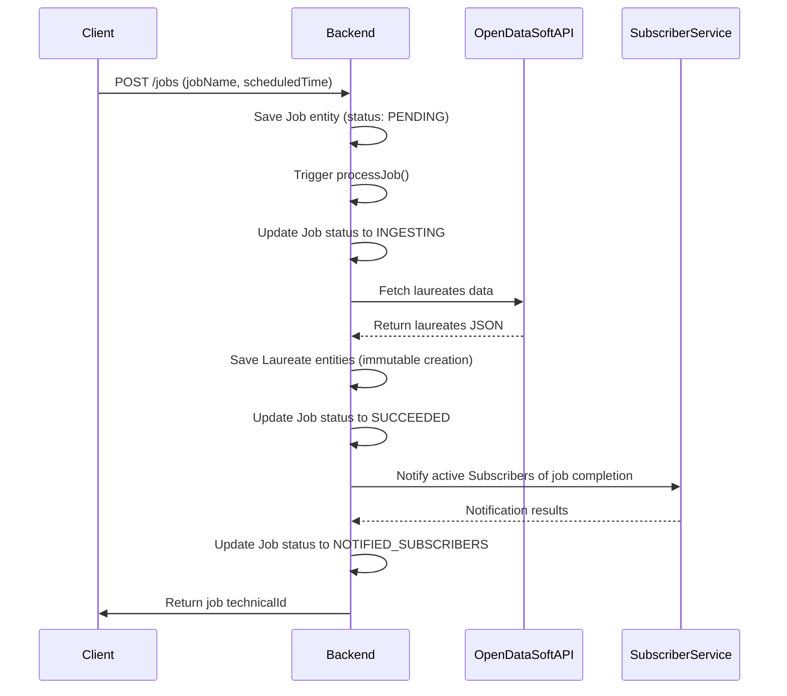
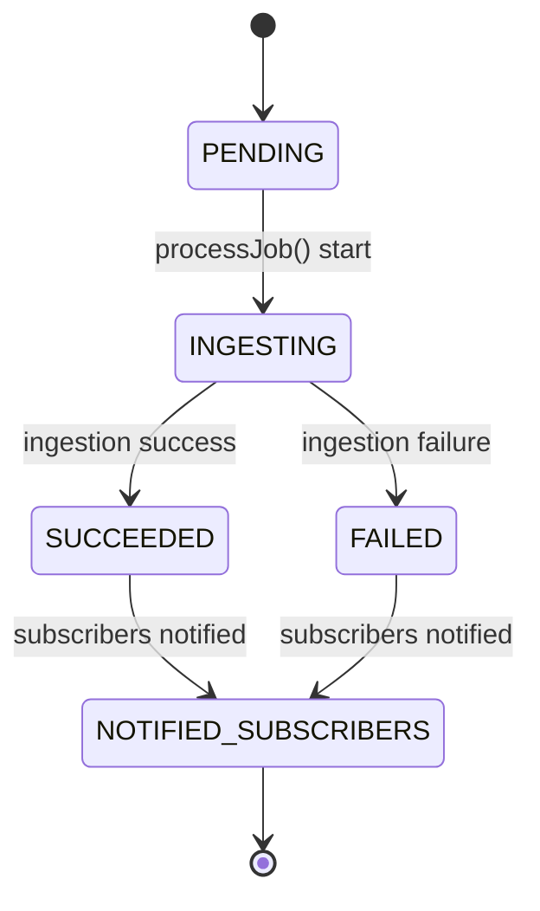

### 1. Entity Definitions

```
Job:
- jobName: String (Name of the ingestion job)
- status: String (Current job status: PENDING, INGESTING, SUCCEEDED, FAILED, NOTIFIED_SUBSCRIBERS)
- scheduledTime: String (ISO timestamp when job is scheduled)
- startedTime: String (ISO timestamp when ingestion starts)
- finishedTime: String (ISO timestamp when ingestion finishes)
- resultSummary: String (Summary of ingestion outcome, e.g., number of laureates ingested)

Laureate:
- laureateId: Long (Unique ID from source dataset)
- firstname: String (Laureate’s first name)
- surname: String (Laureate’s surname)
- born: String (Date of birth in ISO format)
- died: String (Date of death in ISO format or null)
- borncountry: String (Country of birth)
- borncountrycode: String (Country code of birth)
- borncity: String (City of birth)
- gender: String (Gender of laureate)
- year: String (Year laureate received Nobel Prize)
- category: String (Prize category)
- motivation: String (Prize motivation text)
- affiliationName: String (Name of affiliated institution)
- affiliationCity: String (City of affiliated institution)
- affiliationCountry: String (Country of affiliated institution)

Subscriber:
- subscriberId: String (Unique subscriber identifier)
- contactType: String (Type of contact: e.g., email, webhook)
- contactAddress: String (Email address or webhook URL)
- active: Boolean (Indicates if subscriber is active for notifications)
```

---

### 2. Process Method Flows

```
processJob() Flow:
1. Initial State: Job created with status = PENDING
2. Validation: Verify jobName and scheduledTime are present
3. Processing: 
   - Update status to INGESTING and startedTime to current timestamp
   - Call OpenDataSoft API to fetch Nobel laureates data
   - For each laureate record, create a new Laureate entity (immutable creation)
4. Completion:
   - On success, update job status to SUCCEEDED and finishedTime
   - On failure, update job status to FAILED and finishedTime
5. Notification:
   - Notify all active Subscribers by sending notifications (email/webhook) about job outcome
   - Update job status to NOTIFIED_SUBSCRIBERS
```

```
processLaureate() Flow:
1. Validation: Check required fields (laureateId, firstname, surname, year, category) are non-null
2. Enrichment: Normalize country codes, calculate age if needed (optional)
3. Persistence: Save laureate data as immutable record for history
4. No direct notification or further process triggered by laureate save alone
```

```
processSubscriber() Flow:
1. Validation: Check contactType and contactAddress are valid formats (e.g., email syntax, valid URL)
2. Persistence: Save subscriber entity
3. No further automated processing triggered by subscriber save
```

---

### 3. API Endpoints Design

| Entity     | Endpoint                       | Description                                | Request Body                             | Response Body                 |
|------------|--------------------------------|--------------------------------------------|------------------------------------------|------------------------------|
| Job        | POST `/jobs`                   | Create a new ingestion job (triggers ingestion) | `{ "jobName": "string", "scheduledTime": "ISO8601" }` | `{ "technicalId": "string" }` |
| Job        | GET `/jobs/{technicalId}`      | Retrieve job status and details             | -                                        | Full Job entity JSON          |
| Laureate   | GET `/laureates/{technicalId}`| Retrieve laureate by technicalId            | -                                        | Full Laureate entity JSON     |
| Subscriber | POST `/subscribers`            | Add new subscriber                           | `{ "contactType": "string", "contactAddress": "string", "active": true }` | `{ "technicalId": "string" }` |
| Subscriber | GET `/subscribers/{technicalId}` | Retrieve subscriber details               | -                                        | Full Subscriber entity JSON   |

- No PUT, PATCH, DELETE endpoints (immutable entity creation only)
- Laureate entity creation done internally by `processJob()` flow, no public POST endpoint

---

### 4. Request/Response Formats

**Create Job Request:**
```json
{
  "jobName": "NobelLaureateIngestion",
  "scheduledTime": "2024-07-01T10:00:00Z"
}
```

**Create Job Response:**
```json
{
  "technicalId": "job_12345"
}
```

**Job Retrieval Response:**
```json
{
  "jobName": "NobelLaureateIngestion",
  "status": "SUCCEEDED",
  "scheduledTime": "2024-07-01T10:00:00Z",
  "startedTime": "2024-07-01T10:01:05Z",
  "finishedTime": "2024-07-01T10:05:00Z",
  "resultSummary": "Ingested 100 laureates"
}
```

**Create Subscriber Request:**
```json
{
  "contactType": "email",
  "contactAddress": "subscriber@example.com",
  "active": true
}
```

**Create Subscriber Response:**
```json
{
  "technicalId": "sub_67890"
}
```

**Subscriber Retrieval Response:**
```json
{
  "contactType": "email",
  "contactAddress": "subscriber@example.com",
  "active": true
}
```

**Laureate Retrieval Response:**
```json
{
  "laureateId": 853,
  "firstname": "Akira",
  "surname": "Suzuki",
  "born": "1930-09-12",
  "died": null,
  "borncountry": "Japan",
  "borncountrycode": "JP",
  "borncity": "Mukawa",
  "gender": "male",
  "year": "2010",
  "category": "Chemistry",
  "motivation": "for palladium-catalyzed cross couplings in organic synthesis",
  "affiliationName": "Hokkaido University",
  "affiliationCity": "Sapporo",
  "affiliationCountry": "Japan"
}
```

---

### 5. Mermaid Diagrams


```mermaid
sequenceDiagram
    participant Client
    participant Backend
    participant OpenDataSoftAPI
    participant SubscriberService

    Client->>Backend: POST /jobs (jobName, scheduledTime)
    Backend->>Backend: Save Job entity (status: PENDING)
    Backend->>Backend: Trigger processJob()
    Backend->>Backend: Update Job status to INGESTING
    Backend->>OpenDataSoftAPI: Fetch laureates data
    OpenDataSoftAPI-->>Backend: Return laureates JSON
    Backend->>Backend: Save Laureate entities (immutable creation)
    Backend->>Backend: Update Job status to SUCCEEDED
    Backend->>SubscriberService: Notify active Subscribers of job completion
    SubscriberService-->>Backend: Notification results
    Backend->>Backend: Update Job status to NOTIFIED_SUBSCRIBERS
    Backend->>Client: Return job technicalId
```


```mermaid
stateDiagram-v2
    [*] --> PENDING
    PENDING --> INGESTING : processJob() start
    INGESTING --> SUCCEEDED : ingestion success
    INGESTING --> FAILED : ingestion failure
    SUCCEEDED --> NOTIFIED_SUBSCRIBERS : subscribers notified
    FAILED --> NOTIFIED_SUBSCRIBERS : subscribers notified
    NOTIFIED_SUBSCRIBERS --> [*]
```