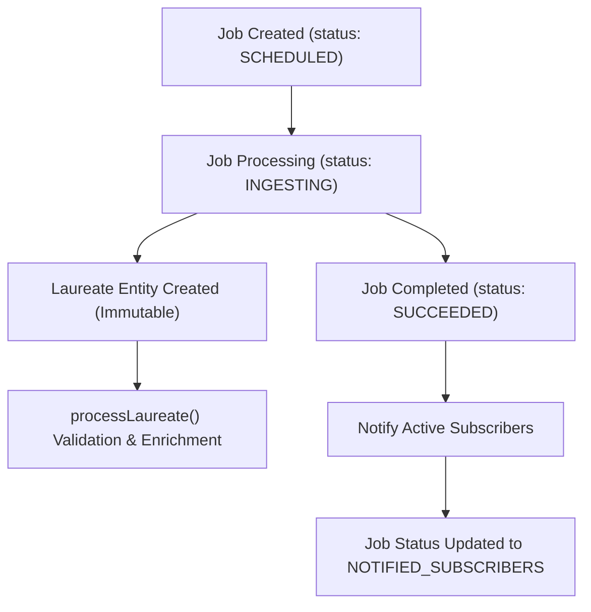

### 1. Entity Definitions

```
Job:
- jobId: String (unique identifier, generated by datastore as technicalId)
- status: String (represents the job state, e.g., SCHEDULED, INGESTING, SUCCEEDED, FAILED, NOTIFIED_SUBSCRIBERS)
- createdAt: String (ISO 8601 timestamp of job creation)
- startedAt: String (ISO 8601 timestamp when ingestion started, nullable)
- finishedAt: String (ISO 8601 timestamp when ingestion finished, nullable)
- errorMessage: String (nullable, stores error details if job failed)

Laureate:
- laureateId: String (unique identifier, generated by datastore as technicalId)
- id: Integer (original laureate ID from source)
- firstname: String
- surname: String
- born: String (date of birth, ISO 8601 format)
- died: String (date of death, ISO 8601 format, nullable)
- borncountry: String
- borncountrycode: String
- borncity: String
- gender: String
- year: String (award year)
- category: String
- motivation: String
- name: String (affiliation name)
- city: String (affiliation city)
- country: String (affiliation country)

Subscriber:
- subscriberId: String (unique identifier, generated by datastore as technicalId)
- contactType: String (e.g., email, webhook)
- contactAddress: String (email address or webhook URL)
- active: Boolean (if the subscriber is active)
```

---

### 2. Process Method Flows

```
processJob() Flow:
1. Initial State: Job entity is created with status = SCHEDULED.
2. Validation: Check if the job parameters (if any) are correct.
3. Processing:  
   - Update status to INGESTING and set startedAt timestamp.  
   - Call OpenDataSoft API to ingest Nobel laureates data.  
   - For each laureate record retrieved, create immutable Laureate entities (triggering processLaureate()).  
4. Completion:  
   - If ingestion successful, update status to SUCCEEDED and set finishedAt.  
   - If ingestion fails, update status to FAILED, set finishedAt and record errorMessage.  
5. Notification:  
   - Notify all active Subscribers by creating notification events (or another immutable entity if needed).  
   - Update job status to NOTIFIED_SUBSCRIBERS.
```

```
processLaureate() Flow:
1. Validation: Verify required laureate fields (e.g., id, firstname, surname, year, category) are present and correctly formatted.
2. Enrichment:  
   - Calculate derived data if needed (e.g., age at award, normalize country codes).  
3. Persistence: Save the enriched Laureate entity as immutable.
```

```
processSubscriber() Flow:
1. Validation: Check contact details format based on contactType.
2. Persistence: Save Subscriber entity as immutable.
3. Notification Handling (triggered outside processSubscriber): Subscribers receive notifications triggered by Job completion.
```

---

### 3. API Endpoints Design

| HTTP Method | Endpoint                  | Description                                             | Request Body                    | Response               |
|-------------|---------------------------|---------------------------------------------------------|--------------------------------|------------------------|
| POST        | `/jobs`                   | Create a Job to trigger ingestion and processing        | `{}` (empty or optional params) | `{ "technicalId": "..." }` |
| GET         | `/jobs/{technicalId}`     | Retrieve Job details by technicalId                      | N/A                            | Job entity JSON        |
| POST        | `/subscribers`            | Create a Subscriber (register for notifications)        | Subscriber JSON                | `{ "technicalId": "..." }` |
| GET         | `/subscribers/{technicalId}` | Retrieve Subscriber by technicalId                      | N/A                            | Subscriber entity JSON |
| GET         | `/subscribers` (optional) | Retrieve all Subscribers                                 | N/A                            | List of Subscriber JSON|
| GET         | `/laureates/{technicalId}` | Retrieve Laureate by technicalId                         | N/A                            | Laureate entity JSON   |
| GET         | `/laureates` (optional)   | Retrieve Laureates by conditions (e.g., year, category) | Query params                   | List of Laureate JSON  |

---

### 4. Request/Response Formats

**POST /jobs** Request Body (optional, minimal for future extension):

```json
{}
```

Response:

```json
{
  "technicalId": "job-uuid-1234"
}
```

---

**GET /jobs/{technicalId}** Response Body:

```json
{
  "jobId": "job-uuid-1234",
  "status": "SUCCEEDED",
  "createdAt": "2024-06-01T08:00:00Z",
  "startedAt": "2024-06-01T08:01:00Z",
  "finishedAt": "2024-06-01T08:05:00Z",
  "errorMessage": null
}
```

---

**POST /subscribers** Request Body:

```json
{
  "contactType": "email",
  "contactAddress": "subscriber@example.com",
  "active": true
}
```

Response:

```json
{
  "technicalId": "subscriber-uuid-5678"
}
```

---

**GET /subscribers/{technicalId}** Response Body:

```json
{
  "subscriberId": "subscriber-uuid-5678",
  "contactType": "email",
  "contactAddress": "subscriber@example.com",
  "active": true
}
```

---

**GET /laureates/{technicalId}** Response Body:

```json
{
  "laureateId": "laureate-uuid-9012",
  "id": 853,
  "firstname": "Akira",
  "surname": "Suzuki",
  "born": "1930-09-12",
  "died": null,
  "borncountry": "Japan",
  "borncountrycode": "JP",
  "borncity": "Mukawa",
  "gender": "male",
  "year": "2010",
  "category": "Chemistry",
  "motivation": "\"for palladium-catalyzed cross couplings in organic synthesis\"",
  "name": "Hokkaido University",
  "city": "Sapporo",
  "country": "Japan"
}
```

---

### 5. Mermaid Diagram: Event-Driven Processing Chain


```mermaid
graph TD
Job_Created["Job Created (status: SCHEDULED)"]
Job_Processing["Job Processing (status: INGESTING)"]
Laureate_Created["Laureate Entity Created (Immutable)"]
Laureate_Processed["processLaureate() Validation & Enrichment"]
Job_Succeeded["Job Completed (status: SUCCEEDED)"]
Notify_Subscribers["Notify Active Subscribers"]
Job_Notified["Job Status Updated to NOTIFIED_SUBSCRIBERS"]

Job_Created --> Job_Processing
Job_Processing --> Laureate_Created
Laureate_Created --> Laureate_Processed
Job_Processing --> Job_Succeeded
Job_Succeeded --> Notify_Subscribers
Notify_Subscribers --> Job_Notified
```