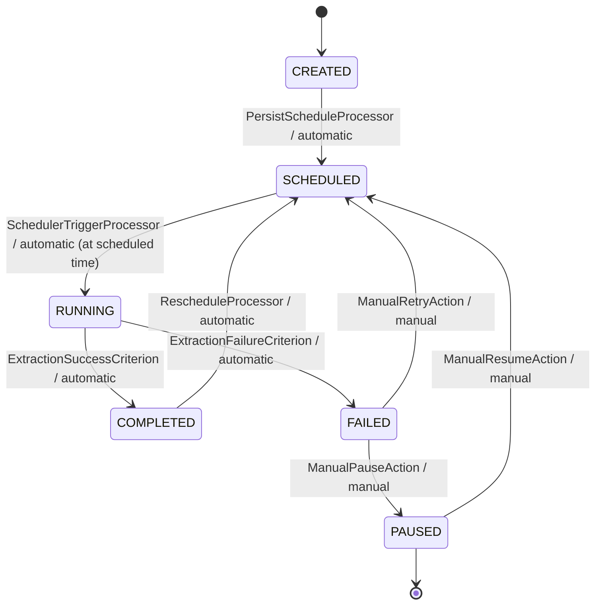
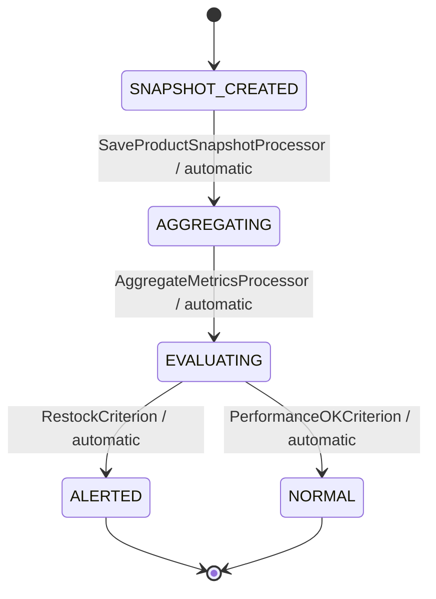
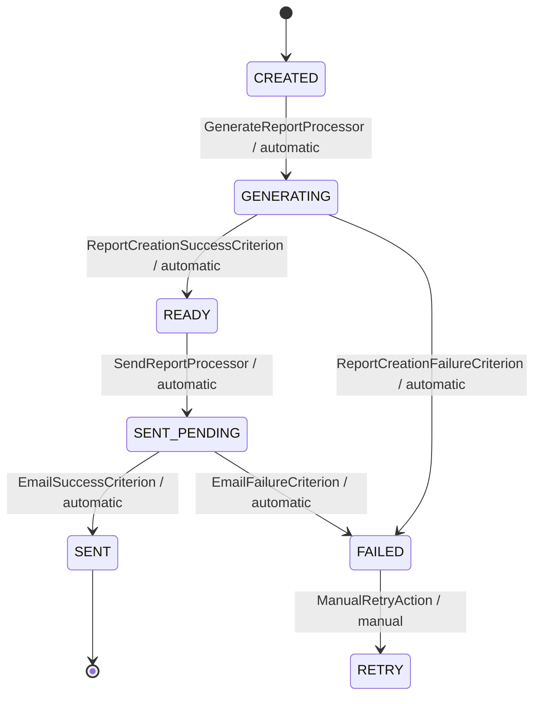
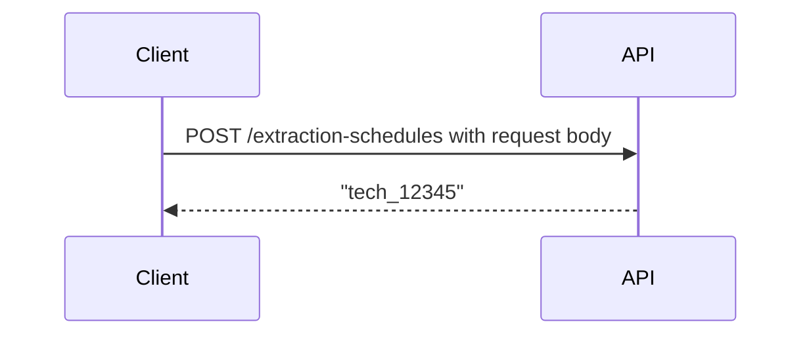

# Functional Requirements

This document specifies the entities, workflows, processors and API rules for the Pet Store extraction, product aggregation and weekly reporting prototype. It consolidates and corrects previous logic inconsistencies so the implementation and tests can rely on a single source of truth.

---

## 1. Entity Definitions

All timestamps are ISO-8601 strings (UTC unless otherwise stated). Technical identifiers (returned by POST APIs) are UUID-like strings referred to as `technicalId` in the API section.

### Product
- technicalId: String (internal UUID for lookup)
- product_id: String (external product identifier from Pet Store API)
- name: String
- category: String
- price: Number
- cost: Number
- stock_level: Number (current stock snapshot)
- store_id: String
- sales_history: Array of { timestamp: String, quantity: Number, revenue: Number }
- tags: Array (e.g., ["restock_candidate", "underperformer"]) - optional
- metadata_updated_on: String (timestamp of last manual metadata update)

Notes:
- Product entities are created/updated by processors (no public POST endpoint).

### ExtractionSchedule
- technicalId: String (internal UUID returned by POST)
- schedule_id: String (human-friendly identifier)
- frequency: String (e.g., "weekly")
- day: String (e.g., "Monday")
- time: String (HH:MM)
- timezone: String (IANA timezone)
- last_run: String (timestamp of last run) or null
- status: String (one of: CREATED | SCHEDULED | RUNNING | COMPLETED | PAUSED | FAILED)
- recipients: Array of emails
- format: String (PDF | CSV)
- created_on: String
- updated_on: String

Notes:
- `CREATED` is the initial state when schedule is accepted by API.
- `COMPLETED` is used to mark a successful end of a run cycle before rescheduling.

### WeeklyReport
- technicalId: String (internal UUID)
- report_id: String (human identifier, e.g., "rpt_2025_08_11")
- period_start: String (timestamp)
- period_end: String (timestamp)
- generated_on: String (timestamp)
- summary_metrics: Object (KPIs: sales_volume, revenue_by_product, inventory_turnover, etc.)
- top_products: Array (top N products by sales)
- restock_list: Array (products below restock threshold)
- attachment_url: String (link to generated report file) or null until created
- recipients: Array (emails)
- status: String (one of: CREATED | GENERATING | READY | SENT_PENDING | SENT | FAILED)
- created_on: String
- updated_on: String

Notes:
- `READY` indicates report file/attachment was successfully created and the report is waiting for send step.
- `SENT_PENDING` indicates send has been started and awaiting email delivery result.

---

## 2. Workflows and State Machines

Each workflow includes the intended automatic vs manual transitions and the processors/criteria needed. The state diagrams below are the canonical specification.

### ExtractionSchedule workflow

Flow summary:
1. Client POSTs schedule -> schedule is created in state `CREATED`.
2. Persistence layer sets schedule to `SCHEDULED` for the scheduler to pick up (automatic).
3. At scheduled time scheduler triggers `RUNNING` and extraction begins (automatic).
4. On successful extraction and analysis the run transitions to `COMPLETED`, `last_run` is set, and schedule is returned to `SCHEDULED` for future runs (automatic).
5. On failure the schedule transitions to `FAILED` and an Incident is created; humans may `PAUSE` or `RETRY` (manual).
6. Users can `PAUSE` or `UPDATE` an existing schedule via API (manual transitions to `PAUSED` or updates persisted).

Mermaid state diagram:


```mermaid
stateDiagram-v2
    [*] --> CREATED
    CREATED --> SCHEDULED : PersistScheduleProcessor / automatic
    SCHEDULED --> RUNNING : SchedulerTriggerProcessor / automatic (at scheduled time)
    RUNNING --> COMPLETED : ExtractionSuccessCriterion / automatic
    RUNNING --> FAILED : ExtractionFailureCriterion / automatic
    COMPLETED --> SCHEDULED : RescheduleProcessor / automatic
    FAILED --> PAUSED : ManualPauseAction / manual
    FAILED --> SCHEDULED : ManualRetryAction / manual
    PAUSED --> SCHEDULED : ManualResumeAction / manual
    PAUSED --> [*]
```

Processors / Criteria required:
- PersistScheduleProcessor
- StartScheduleProcessor (used by scheduler; marks RUNNING)
- SchedulerTriggerProcessor (component that triggers StartScheduleProcessor at target time)
- FetchFromPetStoreProcessor
- RescheduleProcessor
- ExtractionSuccessCriterion
- ExtractionFailureCriterion
- NotifyOnFailureProcessor
- CreateIncidentProcessor
- ManualPauseProcessor
- ManualResumeProcessor
- ManualRetryProcessor

Important notes:
- `StartScheduleProcessor` is invoked by the scheduler service (not by an API client).
- On success the `last_run` must be set to the extraction completion timestamp.
- When rescheduling, computation of the next scheduled run must respect `frequency`, `day`, `time` and `timezone`.


### Product workflow

Flow summary:
1. When a product snapshot is saved by extraction a `SNAPSHOT_CREATED` event occurs (automatic).
2. Aggregation processes update `sales_history` and recompute KPIs (automatic).
3. Product performance analysis tags the product as `restock_candidate` or `underperformer` as needed (automatic).
4. After retention period old snapshots are purged/archived (automatic).
5. Manual updates to product metadata (name, price, category) can be made via the UI (manual).

Mermaid state diagram:


```mermaid
stateDiagram-v2
    [*] --> SNAPSHOT_CREATED
    SNAPSHOT_CREATED --> AGGREGATING : SaveProductSnapshotProcessor / automatic
    AGGREGATING --> EVALUATING : AggregateMetricsProcessor / automatic
    EVALUATING --> ALERTED : RestockCriterion / automatic
    EVALUATING --> NORMAL : PerformanceOKCriterion / automatic
    ALERTED --> [*]
    NORMAL --> [*]
```

Processors / Criteria required:
- SaveProductSnapshotProcessor
- AggregateMetricsProcessor
- ProductPerformanceAnalysisProcessor
- RestockCriterion
- PerformanceOKCriterion
- RetentionPurgeProcessor (or ArchiveProductProcessor)

Important notes:
- Product snapshots can arrive for the same product from multiple stores; aggregation must be idempotent and time-series ordered.
- Tags set by analysis (e.g., "restock_candidate") are part of product metadata and reset/updated on subsequent analyses.


### WeeklyReport workflow

Flow summary:
1. A `WeeklyReport` entity is created (status `CREATED`) when analysis decides a report for a period should be generated (automatic).
2. The report moves to `GENERATING` while file is constructed (automatic).
3. On successful creation the report is `READY` with `attachment_url` set (automatic).
4. The sending step marks `SENT_PENDING` while email delivery is attempted (automatic).
5. On email success the report becomes `SENT`. On generation or email failure the report becomes `FAILED` and an Incident is created; humans may `RETRY` (manual).

Mermaid state diagram:


```mermaid
stateDiagram-v2
    [*] --> CREATED
    CREATED --> GENERATING : GenerateReportProcessor / automatic
    GENERATING --> READY : ReportCreationSuccessCriterion / automatic
    GENERATING --> FAILED : ReportCreationFailureCriterion / automatic
    READY --> SENT_PENDING : SendReportProcessor / automatic
    SENT_PENDING --> SENT : EmailSuccessCriterion / automatic
    SENT_PENDING --> FAILED : EmailFailureCriterion / automatic
    FAILED --> RETRY : ManualRetryAction / manual
    SENT --> [*]
```

Processors / Criteria required:
- GenerateReportProcessor
- ReportCreationSuccessCriterion
- ReportCreationFailureCriterion
- SendReportProcessor
- EmailSuccessCriterion
- EmailFailureCriterion
- NotifyOnFailureProcessor
- CreateIncidentProcessor

Important notes:
- GenerateReportProcessor must compute the reporting period (period_start, period_end) deterministically (based on schedule and `last_run`) so reports are not duplicated or overlapped.

---

## 3. Processor Pseudocode (updated and corrected)

These pseudocode snippets clarify responsibilities, error handling and the minimal side effects each processor must perform.

PersistScheduleProcessor

```java
class PersistScheduleProcessor {
  process(scheduleRequest) {
    // validate request
    schedule = buildScheduleEntity(scheduleRequest)
    schedule.status = CREATED
    schedule.created_on = now()
    schedule.updated_on = now()
    schedule.last_run = null
    save(schedule)
    // A background job or persistence hook will promote CREATED -> SCHEDULED
    return schedule.technicalId
  }
}
```

StartScheduleProcessor / Scheduler-trigger

```java
class StartScheduleProcessor {
  process(schedule) {
    schedule.status = RUNNING
    schedule.updated_on = now()
    save(schedule)
    // trigger Extraction for this schedule asynchronously
    FetchFromPetStoreProcessor.processAsync(schedule)
  }
}
```

FetchFromPetStoreProcessor

```java
class FetchFromPetStoreProcessor {
  process(schedule) {
    try {
      data = PetStoreAPI.fetchAllStoresData() // can be paginated
      for (productSnapshot : data) {
        SaveProductSnapshotProcessor.process(productSnapshot, schedule)
      }

      // After snapshots processed, run aggregation/analysis (may be async)
      RescheduleProcessor.process(schedule) // schedules next run

      schedule.last_run = now()
      schedule.status = COMPLETED
      schedule.updated_on = now()
      save(schedule)

      // Decide reporting period deterministically and trigger GenerateReportProcessor
      period = computeReportingPeriod(schedule)
      GenerateReportProcessor.processAsync(period, schedule.recipients, schedule.format)

    } catch (e) {
      schedule.status = FAILED
      schedule.updated_on = now()
      save(schedule)
      CreateIncidentProcessor.process(schedule, e)
      NotifyOnFailureProcessor.process(schedule, e)
    }
  }
}
```

AggregateMetricsProcessor / ProductPerformanceAnalysisProcessor

```java
class AggregateMetricsProcessor {
  process(productSnapshot) {
    product = loadOrCreateProduct(productSnapshot.product_id, productSnapshot.store_id)
    updateSalesHistory(product, productSnapshot)
    computeKPIs(product)

    if (RestockCriterion.isMet(product)) {
      product.tags.add("restock_candidate")
    } else {
      product.tags.remove("restock_candidate")
    }

    if (PerformanceOKCriterion.isNotMet(product)) {
      product.tags.add("underperformer")
    } else {
      product.tags.remove("underperformer")
    }

    product.updated_on = now()
    save(product)
  }
}
```

GenerateReportProcessor / SendReportProcessor

```java
class GenerateReportProcessor {
  process(period, recipients, format) {
    try {
      report = buildSummary(period)
      report.period_start = period.start
      report.period_end = period.end
      report.generated_on = now()

      // create file (PDF/CSV) and persist storage URL
      report.attachment_url = renderReportFile(report, format)
      report.status = READY
      report.updated_on = now()
      save(report)

      // trigger send step asynchronously
      SendReportProcessor.processAsync(report)

    } catch (e) {
      report.status = FAILED
      report.updated_on = now()
      save(report)
      CreateIncidentProcessor.process(report, e)
      NotifyOnFailureProcessor.process(report, e)
    }
  }
}

class SendReportProcessor {
  process(report) {
    try {
      EmailService.send(report.recipients, report.attachment_url, report.summary_metrics)
      report.status = SENT
      report.updated_on = now()
      save(report)
    } catch (e) {
      report.status = FAILED
      report.updated_on = now()
      save(report)
      CreateIncidentProcessor.process(report, e)
      NotifyOnFailureProcessor.process(report, e)
    }
  }
}
```

Notes on async vs sync:
- Long-running tasks (fetching external APIs, rendering PDFs, sending emails) should be executed asynchronously and idempotently.
- Processors that call others should use asynchronous handoff (e.g., processAsync) to avoid blocking scheduling threads.

---

## 4. API Endpoints Design Rules (updated)

General rules:
- Only ExtractionSchedule is created by clients (POST). Product and WeeklyReport entities are created by processors as a result of extractions and analysis.
- POST responses MUST return ONLY the technicalId string (no envelope) to keep the API thin and deterministic for clients. Example response body: "tech_12345"
- All GET endpoints return the full stored entity representation in JSON.
- POST must be idempotent when the client provides the same `schedule_id` (service should return the existing technicalId instead of creating duplicates). Clients can also supply an `Idempotency-Key` header to guarantee single-create semantics.
- Errors must create Incident records and notify configured recipients.

Endpoints and JSON shapes (canonical examples)

1) Create ExtractionSchedule (POST /extraction-schedules)
Request:

```json
{
  "schedule_id":"weekly_pets",
  "frequency":"weekly",
  "day":"Monday",
  "time":"08:00",
  "timezone":"Europe/Moscow",
  "recipients":["victoria.sagdieva@cyoda.com"],
  "format":"PDF"
}
```

Response (MUST contain only technicalId string in body):

```text
"tech_12345"
```

Sequence (conceptual):


```mermaid
sequenceDiagram
  participant Client
  participant API
  Client->>API: POST /extraction-schedules with request body
  API-->>Client: "tech_12345"
```

2) Get ExtractionSchedule by technicalId (GET /extraction-schedules/{technicalId})

Response shape:

```json
{
  "technicalId":"tech_12345",
  "schedule_id":"weekly_pets",
  "frequency":"weekly",
  "day":"Monday",
  "time":"08:00",
  "timezone":"Europe/Moscow",
  "last_run":"2025-08-11T08:00:00Z",
  "status":"SCHEDULED",
  "recipients":["victoria.sagdieva@cyoda.com"],
  "format":"PDF",
  "created_on":"2025-01-01T00:00:00Z",
  "updated_on":"2025-08-11T08:01:00Z"
}
```

3) Get WeeklyReport by technicalId (GET /weekly-reports/{technicalId})

Response shape:

```json
{
  "technicalId":"tech_rpt_001",
  "report_id":"rpt_2025_08_11",
  "period_start":"2025-08-04T00:00:00Z",
  "period_end":"2025-08-10T23:59:59Z",
  "generated_on":"2025-08-11T09:00:00Z",
  "summary_metrics":{ "sales_volume":1234, "revenue":45678 },
  "top_products":[],
  "restock_list":[],
  "attachment_url":"https://storage/reports/rpt_2025_08_11.pdf",
  "recipients":["victoria.sagdieva@cyoda.com"],
  "status":"SENT",
  "created_on":"2025-08-11T08:50:00Z",
  "updated_on":"2025-08-11T09:05:00Z"
}
```

4) Get Product by technicalId (GET /products/{technicalId})

Response shape:

```json
{
  "technicalId":"tech_prod_001",
  "product_id":"pet_001",
  "name":"Deluxe Dog Food",
  "category":"Food",
  "price":19.99,
  "cost":10.00,
  "stock_level":25,
  "store_id":"store_01",
  "sales_history":[{"timestamp":"2025-08-10T00:00:00Z","quantity":5,"revenue":99.95}],
  "tags":["restock_candidate"],
  "metadata_updated_on":"2025-08-01T12:00:00Z"
}
```

Additional rules:
- No POST endpoints for Product or WeeklyReport.
- If an upstream failure occurs during scheduled processing, create an Incident and email all `recipients` configured on the schedule as well as system owners.
- Provide GET-by-condition endpoints as a separate enhancement (not included in this version). If required, they should be implemented with pagination and filter query parameters.

---

## 5. Incidents, Notifications and Operational Concerns

- CreateIncidentProcessor should persist incidents with references to the failing entity (technicalId), error details and retry hints.
- NotifyOnFailureProcessor must include schedule metadata and recent logs in the notification and should be throttled to avoid spam.
- Long-running jobs must be idempotent and support retries. Use checkpoints to avoid reprocessing the same snapshots twice.

---

## 6. Backwards-compatibility and Known Changes

This document updates and corrects the previously provided functional requirements by:
- Standardizing status values across entities and aligning workflows to use the same status names (e.g., `COMPLETED`, `READY`, `SENT_PENDING`).
- Clarifying asynchronous handoffs and responsibilities for setting `last_run` and `attachment_url`.
- Adding explicit incident creation and notification steps on failures.
- Making POST idempotency explicit.

---

If you want, I can also:
- Add an Incident entity definition and example API shapes.
- Provide sample JSON Schema for each entity.
- Add GET-by-condition endpoints (with filter examples and pagination).

Please let me know which of these (if any) you would like next.
