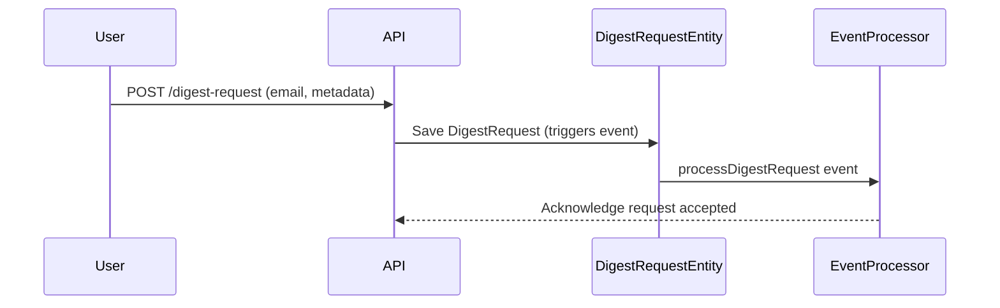
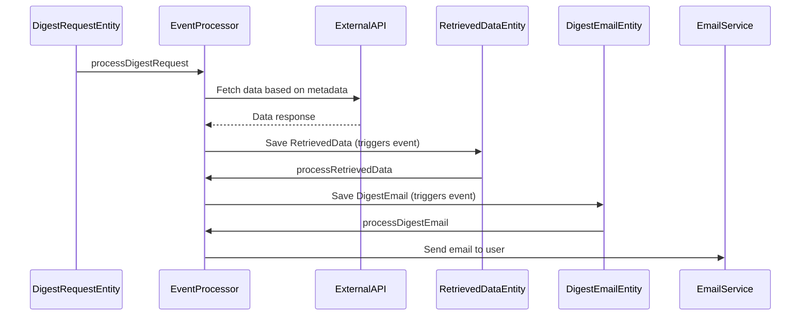
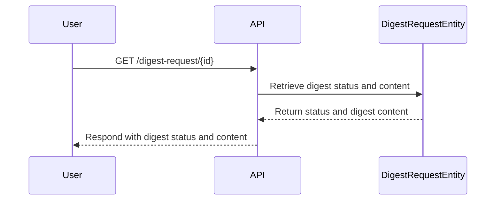

# Functional Requirements for Digest Processing System (Event-Driven Architecture)

## 1. Business Entities

| Entity Name          | Description                                  | Persisted Fields (examples)                           |
|----------------------|----------------------------------------------|------------------------------------------------------|
| DigestRequest        | Represents an incoming digest request event | id, email, metadata (JSON), status, createdAt        |
| RetrievedData        | Data fetched from external API               | id, digestRequestId (FK), dataPayload (JSON), fetchedAt |
| DigestEmail          | Compiled digest ready for email dispatch     | id, digestRequestId (FK), content (HTML/plain), status, sentAt |

---

## 2. API Endpoints

### POST /digest-request

- Purpose: Add/update a DigestRequest entity (triggers event processing)
- Request Body:
  ```json
  {
    "email": "user@example.com",
    "metadata": {
      "param1": "value1",
      "param2": "value2"
    }
  }
  ```
- Response Body:
  ```json
  {
    "digestRequestId": "uuid",
    "status": "Accepted"
  }
  ```

### GET /digest-request/{id}

- Purpose: Retrieve the current status and result of a digest request
- Response Body:
  ```json
  {
    "digestRequestId": "uuid",
    "email": "user@example.com",
    "status": "Completed",
    "digestContent": "<html>...</html>"
  }
  ```

---

## 3. Event Processing Workflows

### Workflow: DigestRequest Persistence → ProcessEntity Event

1. **DigestRequest saved** → triggers `processDigestRequest` event.
2. Upon event:
   - Retrieve parameters from DigestRequest metadata.
   - Call external API (`https://petstore.swagger.io/`) with parameters or defaults.
   - Save RetrievedData entity with fetched API response.
3. **RetrievedData saved** → triggers `processRetrievedData` event.
4. Upon event:
   - Compile digest content (HTML/plain text) using RetrievedData.
   - Save DigestEmail entity with compiled content.
5. **DigestEmail saved** → triggers `processDigestEmail` event.
6. Upon event:
   - Send email to the DigestRequest email address.
   - Update DigestEmail status to "Sent".

---

## 4. Request/Response Formats Summary

| Endpoint          | Request Body                          | Response Body                                      |
|-------------------|-------------------------------------|---------------------------------------------------|
| POST /digest-request | `{ "email": "...", "metadata": {...} }` | `{ "digestRequestId": "...", "status": "Accepted" }` |
| GET /digest-request/{id} | N/A                             | `{ "digestRequestId": "...", "email": "...", "status": "...", "digestContent": "..." }` |

---

## 5. Mermaid Diagrams

### User and DigestRequest Creation Flow


```mermaid
sequenceDiagram
  participant User
  participant API
  participant DigestRequestEntity
  participant EventProcessor

  User->>API: POST /digest-request (email, metadata)
  API->>DigestRequestEntity: Save DigestRequest (triggers event)
  DigestRequestEntity->>EventProcessor: processDigestRequest event
  EventProcessor-->>API: Acknowledge request accepted
```

### Event-Driven Processing Chain


```mermaid
sequenceDiagram
  participant DigestRequestEntity
  participant EventProcessor
  participant ExternalAPI
  participant RetrievedDataEntity
  participant DigestEmailEntity
  participant EmailService

  DigestRequestEntity->>EventProcessor: processDigestRequest
  EventProcessor->>ExternalAPI: Fetch data based on metadata
  ExternalAPI-->>EventProcessor: Data response
  EventProcessor->>RetrievedDataEntity: Save RetrievedData (triggers event)
  RetrievedDataEntity->>EventProcessor: processRetrievedData
  EventProcessor->>DigestEmailEntity: Save DigestEmail (triggers event)
  DigestEmailEntity->>EventProcessor: processDigestEmail
  EventProcessor->>EmailService: Send email to user
```

### User Querying Digest Status Flow


```mermaid
sequenceDiagram
  participant User
  participant API
  participant DigestRequestEntity

  User->>API: GET /digest-request/{id}
  API->>DigestRequestEntity: Retrieve digest status and content
  DigestRequestEntity-->>API: Return status and digest content
  API-->>User: Respond with digest status and content
```