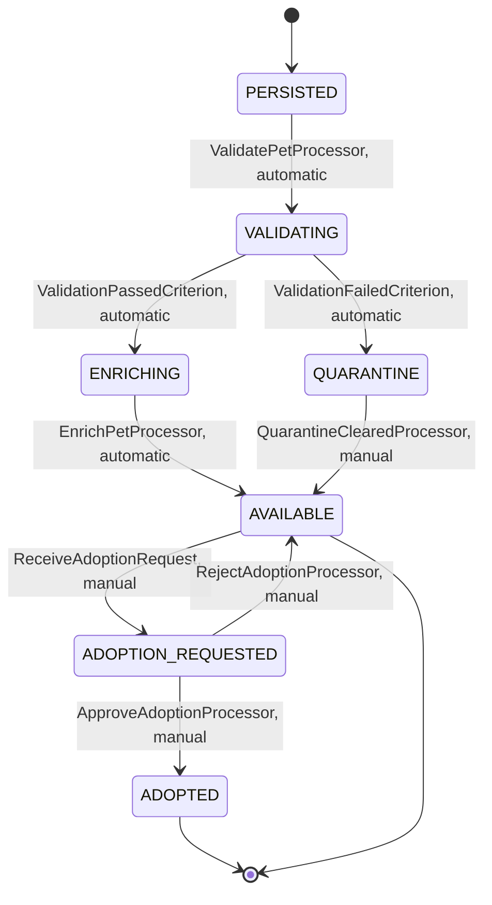
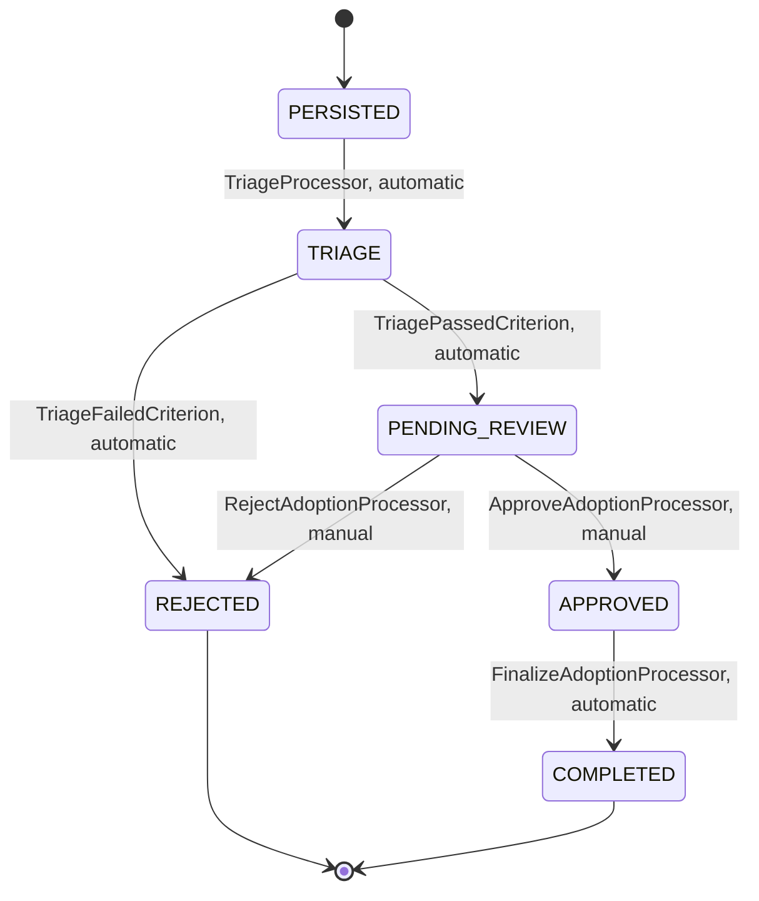
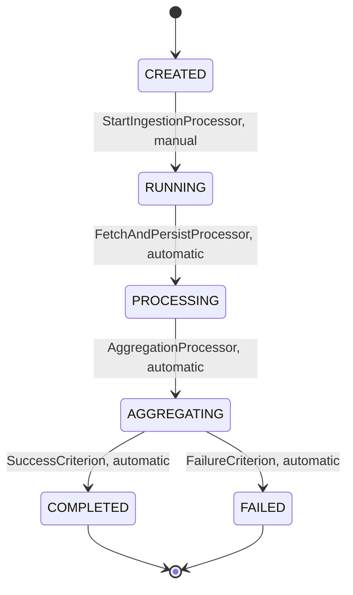

### 1. Entity Definitions
```
Pet:
- petId: string (external Petstore ID, used as business reference)
- name: string (pet name)
- species: string (e.g., dog, cat)
- breed: string (breed or subtype)
- ageMonths: integer (age in months)
- color: string (color/markings)
- status: string (availability status: e.g., AVAILABLE, QUARANTINE, ADOPTED)
- source: string (source system, e.g., PETSTORE_API)
- ingestedAt: string (ISO8601 timestamp when persisted)

AdoptionRequest:
- requesterName: string (name of person requesting adoption)
- requesterContact: string (email/phone)
- petId: string (business petId for requested pet)
- message: string (optional note from requester)
- status: string (NEW, PENDING_REVIEW, APPROVED, REJECTED, COMPLETED)
- requestedAt: string (ISO8601 timestamp when persisted)
- decisionAt: string (ISO8601 timestamp of approval/rejection)

IngestionJob:
- jobName: string (human friendly job name)
- sourceUrl: string (Petstore API base URL or endpoint)
- mode: string (FULL or DELTA)
- startedAt: string (ISO8601)
- completedAt: string (ISO8601)
- status: string (PENDING, RUNNING, COMPLETED, FAILED)
- processedCount: integer (number of Pet entities persisted)
```

Important: you did not specify entities explicitly so I used 3 entities (maximum default). If you want more, tell me and I will expand (max 10).

---

### 2. Entity workflows

Pet workflow:
1. Initial State: PERSISTED (Pet entity created by ingestion process)
2. Validation: automatic validation of required fields and anti-duplicate checks
3. Enrichment: automatic enrichment (fill missing fields, set source info)
4. Health/Quarantine check: automatic rule to mark QUARANTINE if missing critical info
5. Available: mark AVAILABLE when ready for adoption
6. Adoption flow: when an AdoptionRequest is approved, Pet moves to ADOPTED and record updated

Mermaid state diagram for Pet:

```mermaid
stateDiagram-v2
    [*] --> PERSISTED
    PERSISTED --> VALIDATING : ValidatePetProcessor, automatic
    VALIDATING --> ENRICHING : ValidationPassedCriterion, automatic
    VALIDATING --> QUARANTINE : ValidationFailedCriterion, automatic
    ENRICHING --> AVAILABLE : EnrichPetProcessor, automatic
    AVAILABLE --> ADOPTION_REQUESTED : ReceiveAdoptionRequest, manual
    ADOPTION_REQUESTED --> ADOPTED : ApproveAdoptionProcessor, manual
    ADOPTION_REQUESTED --> AVAILABLE : RejectAdoptionProcessor, manual
    QUARANTINE --> AVAILABLE : QuarantineClearedProcessor, manual
    ADOPTED --> [*]
    AVAILABLE --> [*]
```

Processors and criteria for Pet:
- Processors: ValidatePetProcessor, EnrichPetProcessor, QuarantineClearedProcessor, ApproveAdoptionProcessor, RejectAdoptionProcessor
- Criteria: ValidationPassedCriterion, ValidationFailedCriterion
- Purpose: validation ensures required fields; enrichment fills in missing non-critical info; approve/reject processors update status and emit notifications.

AdoptionRequest workflow:
1. Initial State: PERSISTED (AdoptionRequest created via POST by a user)
2. Triage: automatic duplicate check and pet availability check
3. Review: manual human review (background check / contact)
4. Decision: manual approve or reject
5. Completion: if approved, mark pet ADOPTED and request COMPLETED; if rejected, request REJECTED

Mermaid state diagram for AdoptionRequest:

```mermaid
stateDiagram-v2
    [*] --> PERSISTED
    PERSISTED --> TRIAGE : TriageProcessor, automatic
    TRIAGE --> PENDING_REVIEW : TriagePassedCriterion, automatic
    TRIAGE --> REJECTED : TriageFailedCriterion, automatic
    PENDING_REVIEW --> APPROVED : ApproveAdoptionProcessor, manual
    PENDING_REVIEW --> REJECTED : RejectAdoptionProcessor, manual
    APPROVED --> COMPLETED : FinalizeAdoptionProcessor, automatic
    REJECTED --> [*]
    COMPLETED --> [*]
```

Processors and criteria for AdoptionRequest:
- Processors: TriageProcessor, ApproveAdoptionProcessor, RejectAdoptionProcessor, FinalizeAdoptionProcessor
- Criteria: TriagePassedCriterion, TriageFailedCriterion
- Purpose: triage checks pet availability and duplicates; finalize updates Pet to ADOPTED and notifies stakeholders.

IngestionJob workflow:
1. Initial State: CREATED (job POSTed)
2. Start: system sets RUNNING and begins fetching Petstore API
3. Processing: for each external pet, persist Pet entity (each persist is an EVENT that starts Pet workflow)
4. Aggregation: count processed items and record errors
5. Completion: mark COMPLETED or FAILED and record timestamps

Mermaid state diagram for IngestionJob:

```mermaid
stateDiagram-v2
    [*] --> CREATED
    CREATED --> RUNNING : StartIngestionProcessor, manual
    RUNNING --> PROCESSING : FetchAndPersistProcessor, automatic
    PROCESSING --> AGGREGATING : AggregationProcessor, automatic
    AGGREGATING --> COMPLETED : SuccessCriterion, automatic
    AGGREGATING --> FAILED : FailureCriterion, automatic
    COMPLETED --> [*]
    FAILED --> [*]
```

Processors and criteria for IngestionJob:
- Processors: StartIngestionProcessor, FetchAndPersistProcessor, AggregationProcessor
- Criteria: SuccessCriterion, FailureCriterion
- Purpose: orchestrates calls to external Petstore API; each Pet persisted triggers Pet workflow via Cyoda process method.

Note: every entity persist operation is an EVENT — Cyoda will start the corresponding entity workflow automatically upon persistence.

---

### 3. Pseudo code for processor classes

Example pseudo code (illustrative, not implementation details):

ValidatePetProcessor
```
class ValidatePetProcessor {
    void process(Pet pet) {
        if (pet.name == null || pet.species == null) {
            pet.validationPassed = false;
        } else {
            pet.validationPassed = true;
        }
        // update pet state in datastore (triggers next transitions via Cyoda)
    }
}
```

EnrichPetProcessor
```
class EnrichPetProcessor {
    void process(Pet pet) {
        if (pet.source == null) pet.source = "PETSTORE_API";
        if (pet.ingestedAt == null) pet.ingestedAt = now();
        // possibly map species normalization, fill missing color via heuristics
    }
}
```

TriageProcessor (AdoptionRequest)
```
class TriageProcessor {
    void process(AdoptionRequest req) {
        Pet pet = findPetByPetId(req.petId);
        if (pet == null || pet.status != "AVAILABLE") {
            req.triagePassed = false;
        } else {
            req.triagePassed = true;
        }
        // persist triage result; Cyoda moves request to PENDING_REVIEW or REJECTED
    }
}
```

FetchAndPersistProcessor (IngestionJob)
```
class FetchAndPersistProcessor {
    void process(IngestionJob job) {
        for each externalPet in fetchFrom(job.sourceUrl) {
            Pet p = mapExternalToPet(externalPet);
            persistEntity(p); // persistence is an EVENT: Cyoda will start Pet workflow
            job.processedCount++;
        }
    }
}
```

FinalizeAdoptionProcessor
```
class FinalizeAdoptionProcessor {
    void process(AdoptionRequest req) {
        Pet pet = findPetByPetId(req.petId);
        pet.status = "ADOPTED";
        persistEntity(pet);
        req.status = "COMPLETED";
        req.decisionAt = now();
        // notify owner and update records
    }
}
```

Keep processors small (1-3 responsibilities). Criteria are simple boolean checks (e.g., ValidationPassedCriterion checks pet.validationPassed).

---

### 4. API Endpoints Design Rules

Rules applied:
- POST endpoints produce entity creation events and must return only the technicalId.
- Only IngestionJob and AdoptionRequest are created via POST in this design (AdoptionRequest is user-triggered). Pet entities are created by the IngestionJob process (persisted by processors), so no POST for Pet.
- GET endpoints are for retrieval only. Provide GET by technicalId for all entities created by POST (IngestionJob, AdoptionRequest). Also provide GET for Pet by technicalId for consumers to read pet records.

Endpoints and JSON formats:

1) Create Ingestion Job (orchestration)
- POST /ingestion-jobs
Request:
```json
{
  "jobName": "PetstoreFullSync",
  "sourceUrl": "https://petstore.example/api/pets",
  "mode": "FULL"
}
```
Response (must contain only technicalId):
```json
{
  "technicalId": "job-12345"
}
```

2) Get Ingestion Job by technicalId
- GET /ingestion-jobs/{technicalId}
Response:
```json
{
  "technicalId": "job-12345",
  "jobName": "PetstoreFullSync",
  "status": "COMPLETED",
  "startedAt": "2025-08-28T10:00:00Z",
  "completedAt": "2025-08-28T10:02:00Z",
  "processedCount": 124
}
```

3) Create Adoption Request (triggers AdoptionRequest workflow)
- POST /adoption-requests
Request:
```json
{
  "requesterName": "Alice Smith",
  "requesterContact": "alice@example.com",
  "petId": "pet-987",
  "message": "I have a fenced yard and previous experience with cats."
}
```
Response:
```json
{
  "technicalId": "adopt-456"
}
```

4) Get Adoption Request by technicalId
- GET /adoption-requests/{technicalId}
Response:
```json
{
  "technicalId": "adopt-456",
  "requesterName": "Alice Smith",
  "requesterContact": "alice@example.com",
  "petId": "pet-987",
  "status": "PENDING_REVIEW",
  "requestedAt": "2025-08-28T10:05:00Z"
}
```

5) Get Pet by technicalId
- GET /pets/{technicalId}
Response:
```json
{
  "technicalId": "pet-987",
  "petId": "987",
  "name": "Whiskers",
  "species": "cat",
  "breed": "Tabby",
  "ageMonths": 14,
  "color": "brown",
  "status": "AVAILABLE",
  "source": "PETSTORE_API",
  "ingestedAt": "2025-08-28T10:01:00Z"
}
```

Notes and constraints:
- POST responses return only the technicalId string.
- GET endpoints never modify state.
- Pet creation is done by the IngestionJob processors (persistEntity(pet)) — each persist triggers Pet workflow in Cyoda.
- AdoptionRequest POST triggers Cyoda to start its workflow (triage -> review).
- Keep processors limited (prefer 1-3 processors and 1-3 criteria per workflow). Cyoda will manage event-driven transitions after persistence.

If you want, next we can:
- Add Owner entity (separate max 4 entities)
- Add notification processors (email/SMS) and more criteria
- Expand API to include search or GET by conditions

Which addition would you like to do next?