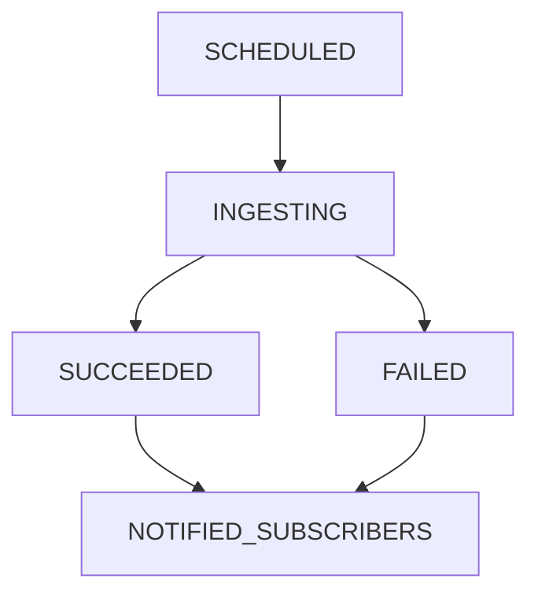
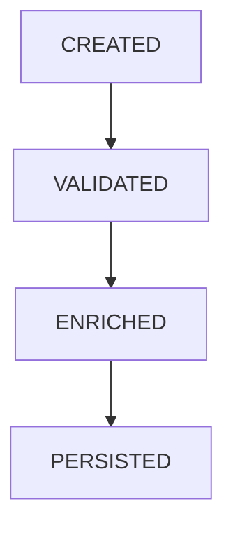
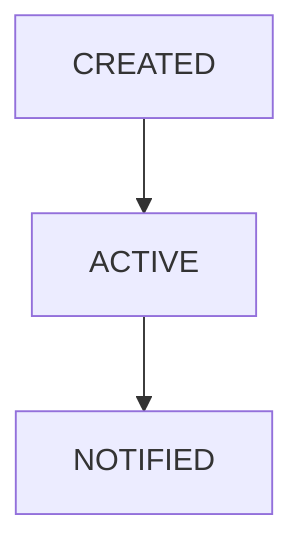

# Functional Requirements for Nobel Laureates Data Ingestion Backend Application

---

## 1. Entity Definitions

```
Job:
- apiUrl: String (API endpoint to ingest Nobel laureates data)
- status: String (job lifecycle state: SCHEDULED, INGESTING, SUCCEEDED, FAILED, NOTIFIED_SUBSCRIBERS)
- scheduledAt: String (timestamp when job is scheduled)
- startedAt: String (timestamp when ingestion started)
- completedAt: String (timestamp when ingestion finished)
- message: String (optional message or error description)

Laureate:
- id: Integer (Nobel laureate unique identifier)
- firstname: String (Laureate first name)
- surname: String (Laureate surname)
- born: String (date of birth, format YYYY-MM-DD)
- died: String (date of death or null)
- borncountry: String (country of birth)
- borncountrycode: String (country code of birth)
- borncity: String (city of birth)
- gender: String (gender of laureate)
- year: String (award year)
- category: String (prize category)
- motivation: String (text describing prize motivation)
- name: String (affiliated institution name)
- city: String (affiliated institution city)
- country: String (affiliated institution country)

Subscriber:
- contactType: String (e.g., "email", "webhook")
- contactValue: String (email address or webhook URL)
- active: Boolean (indicates if subscriber is active)
```

---

## 2. Entity Workflows

### Job workflow:
1. Initial State: Job created with status = SCHEDULED  
2. Ingestion: Status changes to INGESTING; fetch data from OpenDataSoft API  
3. Processing: Process and persist Laureate entities from fetched data  
4. Completion: Status changes to SUCCEEDED or FAILED based on ingestion result  
5. Notification: Status changes to NOTIFIED_SUBSCRIBERS; send notifications to all active Subscribers  


```mermaid
graph TD
    Job_SCHEDULED["SCHEDULED"] --> Job_INGESTING["INGESTING"]
    Job_INGESTING --> Job_SUCCEEDED["SUCCEEDED"]
    Job_INGESTING --> Job_FAILED["FAILED"]
    Job_SUCCEEDED --> Job_NOTIFIED["NOTIFIED_SUBSCRIBERS"]
    Job_FAILED --> Job_NOTIFIED
```

---

### Laureate workflow:
1. Creation: Laureate entity is created as immutable record during Job ingestion  
2. Validation: Validate required attributes and formats  
3. Enrichment: Normalize and enrich data (e.g., age calculation)  
4. Persistence: Save validated and enriched Laureate data  


```mermaid
graph TD
    Laureate_CREATED["CREATED"] --> Laureate_VALIDATED["VALIDATED"]
    Laureate_VALIDATED --> Laureate_ENRICHED["ENRICHED"]
    Laureate_ENRICHED --> Laureate_PERSISTED["PERSISTED"]
```

---

### Subscriber workflow:
1. Creation: Subscriber entity created with contact info and active status  
2. Notification: Upon Job completion, send notifications to active subscribers  
3. Persistence: Subscriber data remains immutable unless explicitly recreated  


```mermaid
graph TD
    Subscriber_CREATED["CREATED"] --> Subscriber_ACTIVE["ACTIVE"]
    Subscriber_ACTIVE --> Subscriber_NOTIFIED["NOTIFIED"]
```

---

## 3. API Endpoints

### Job APIs

- **POST /jobs**  
  - Description: Create a new ingestion job (triggers ingestion workflow)  
  - Request JSON:
    ```json
    {
      "apiUrl": "https://public.opendatasoft.com/api/explore/v2.1/catalog/datasets/nobel-prize-laureates/records"
    }
    ```
  - Response JSON:
    ```json
    {
      "technicalId": "string"
    }
    ```

- **GET /jobs/{technicalId}**  
  - Description: Retrieve job status and details by technicalId  
  - Response JSON:
    ```json
    {
      "apiUrl": "string",
      "status": "string",
      "scheduledAt": "string",
      "startedAt": "string",
      "completedAt": "string",
      "message": "string"
    }
    ```

---

### Laureate APIs

- **GET /laureates/{technicalId}**  
  - Description: Retrieve laureate data by technicalId (assigned on ingestion)  
  - Response JSON:
    ```json
    {
      "id": 853,
      "firstname": "Akira",
      "surname": "Suzuki",
      "born": "1930-09-12",
      "died": null,
      "borncountry": "Japan",
      "borncountrycode": "JP",
      "borncity": "Mukawa",
      "gender": "male",
      "year": "2010",
      "category": "Chemistry",
      "motivation": "for palladium-catalyzed cross couplings in organic synthesis",
      "name": "Hokkaido University",
      "city": "Sapporo",
      "country": "Japan"
    }
    ```
- **Note:** Laureates are created only during ingestion. No POST endpoint for manual creation.

---

### Subscriber APIs

- **POST /subscribers**  
  - Description: Create a new subscriber (triggers subscriber creation event)  
  - Request JSON:
    ```json
    {
      "contactType": "email",
      "contactValue": "user@example.com",
      "active": true
    }
    ```
  - Response JSON:
    ```json
    {
      "technicalId": "string"
    }
    ```

- **GET /subscribers/{technicalId}**  
  - Description: Retrieve subscriber details by technicalId  
  - Response JSON:
    ```json
    {
      "contactType": "email",
      "contactValue": "user@example.com",
      "active": true
    }
    ```

---

## 4. Request/Response Flow Diagram

```mermaid
flowchart TD
    A["POST /jobs"] --> B["{ \"apiUrl\": \"string\" }"]
    B --> C["{ \"technicalId\": \"string\" }"]

    D["GET /jobs/{technicalId}"] --> E["Job details JSON"]

    F["POST /subscribers"] --> G["{ \"contactType\": \"string\", \"contactValue\": \"string\", \"active\": true }"]
    G --> H["{ \"technicalId\": \"string\" }"]

    I["GET /subscribers/{technicalId}"] --> J["Subscriber details JSON"]

    K["GET /laureates/{technicalId}"] --> L["Laureate details JSON"]
```

---

**Notes:**  
- Immutable entity creation is favored; no update or delete endpoints are defined.  
- Notifications to subscribers occur automatically upon job completion.  
- GET by condition endpoints or update/delete endpoints can be added only if explicitly requested.

---

This specification is ready for direct use in documentation or implementation on the Cyoda platform.