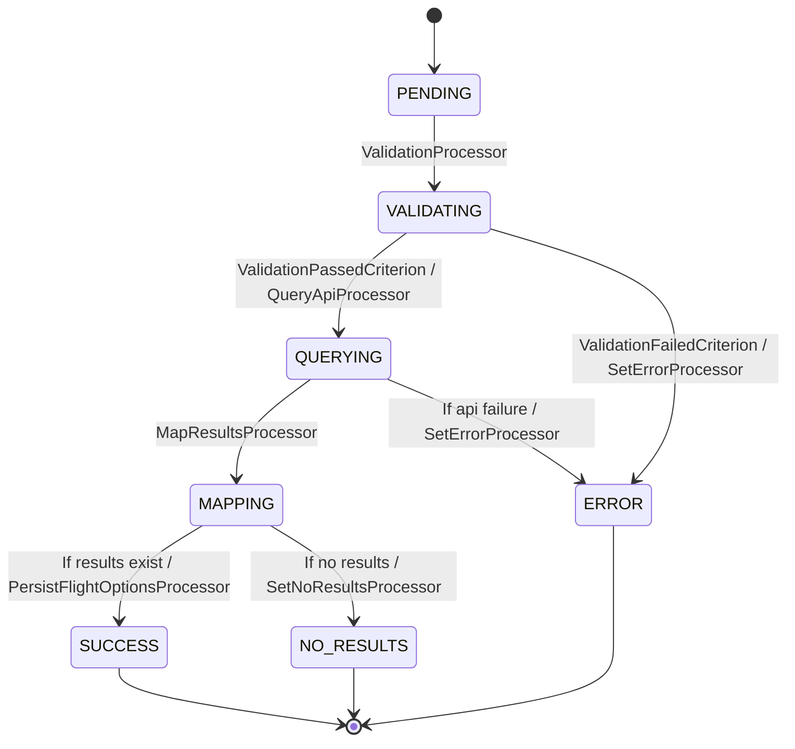
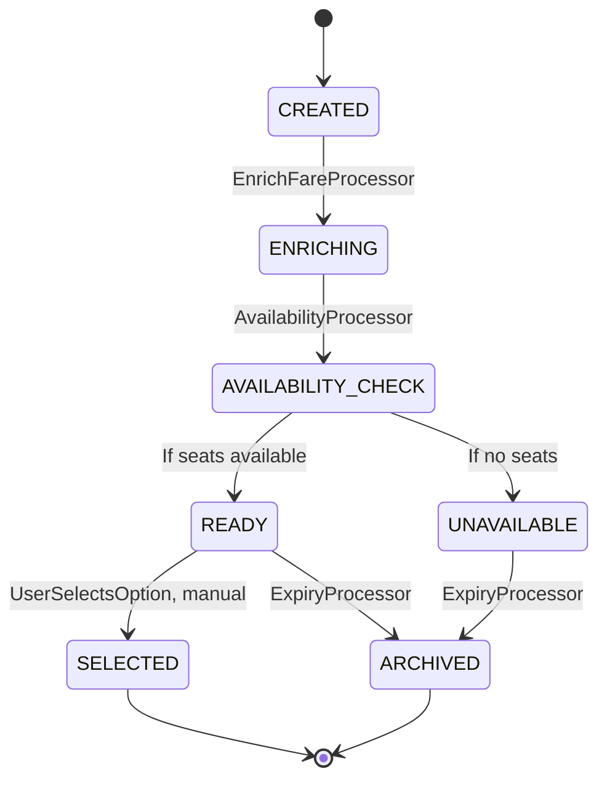
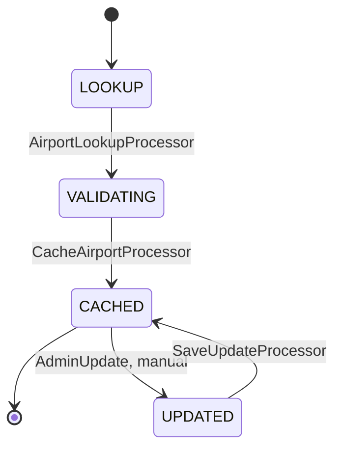

### 1. Entity Definitions
```
FlightSearch:
- searchId: String (unique business id for the search)
- originAirportCode: String (IATA code user entered)
- destinationAirportCode: String (IATA code user entered)
- departureDate: String (ISO date)
- returnDate: String (ISO date, optional)
- passengerCount: Integer (number of passengers)
- cabinClass: String (optional)
- createdAt: String (ISO timestamp)
- status: String (PENDING|SUCCESS|NO_RESULTS|ERROR)
- errorMessage: String (optional, populated on ERROR)

FlightOption:
- optionId: String (unique id for this flight option)
- searchId: String (links to FlightSearch)
- airline: String
- flightNumber: String
- departureTime: String (ISO datetime)
- arrivalTime: String (ISO datetime)
- durationMinutes: Integer
- priceAmount: Number
- currency: String
- stops: Integer
- layovers: String (short description)
- fareRules: String (summary)
- seatAvailability: Integer

Airport:
- airportCode: String (IATA code)
- name: String (airport full name)
- city: String
- country: String
- timezone: String
```

Notes: You requested default 3 entities — I used 3. Cyoda will treat each persisted entity add as an EVENT that triggers the entity workflow.

### 2. Entity workflows

FlightSearch workflow:
1. Initial State: FlightSearch persisted with status PENDING (automatic: Cyoda begins processing)
2. Validation: Validate airports, dates, passengerCount (automatic)
3. Query API: Call Airport Gap API and gather raw results (automatic)
4. Map Results: Create FlightOption entities for each returned result (automatic)
5. Post-processing: If results empty → set NO_RESULTS; if API error → ERROR; otherwise SUCCESS (automatic)
6. Manual actions: User may re-run search or adjust filters (manual)
7. Final: Search COMPLETE (SUCCESS/NO_RESULTS/ERROR) and results retrievable

Entity state diagram


```mermaid
stateDiagram-v2
    [*] --> PENDING
    PENDING --> VALIDATING : ValidationProcessor
    VALIDATING --> QUERYING : ValidationPassedCriterion / QueryApiProcessor
    VALIDATING --> ERROR : ValidationFailedCriterion / SetErrorProcessor
    QUERYING --> MAPPING : MapResultsProcessor
    MAPPING --> SUCCESS : If results exist / PersistFlightOptionsProcessor
    MAPPING --> NO_RESULTS : If no results / SetNoResultsProcessor
    QUERYING --> ERROR : If api failure / SetErrorProcessor
    SUCCESS --> [*]
    NO_RESULTS --> [*]
    ERROR --> [*]
```

Processors and Criteria (FlightSearch)
- Criteria
  - ValidationPassedCriterion (checks fields present and consistent)
  - ValidationFailedCriterion
- Processors
  - ValidationProcessor (validates input)
  - QueryApiProcessor (calls Airport Gap API via Cyoda action)
  - MapResultsProcessor (transforms API response to FlightOption entities)
  - PersistFlightOptionsProcessor (persists FlightOption entities into datastore)
  - SetNoResultsProcessor / SetErrorProcessor (update search status)

FlightOption workflow:
1. Initial State: FlightOption created by FlightSearch processing (automatic)
2. Enrichment: Fetch baggage/refund/fare details if missing (automatic)
3. AvailabilityCheck: Verify seatAvailability (automatic)
4. Ready: FlightOption marked READY for display (automatic)
5. Manual: User selects an option for booking (manual)
6. Archived: After TTL or when search expires option becomes ARCHIVED (automatic)

Entity state diagram


```mermaid
stateDiagram-v2
    [*] --> CREATED
    CREATED --> ENRICHING : EnrichFareProcessor
    ENRICHING --> AVAILABILITY_CHECK : AvailabilityProcessor
    AVAILABILITY_CHECK --> READY : If seats available
    AVAILABILITY_CHECK --> UNAVAILABLE : If no seats
    READY --> SELECTED : UserSelectsOption, manual
    READY --> ARCHIVED : ExpiryProcessor
    UNAVAILABLE --> ARCHIVED : ExpiryProcessor
    SELECTED --> [*]
    ARCHIVED --> [*]
```

Processors and Criteria (FlightOption)
- Criteria
  - SeatsAvailableCriterion
  - EnrichmentNeededCriterion
- Processors
  - EnrichFareProcessor (adds baggage, fare rules summary)
  - AvailabilityProcessor (verifies seat counts)
  - ExpiryProcessor (moves stale options to ARCHIVED)
  - SetReadyProcessor (marks READY)

Airport workflow:
1. Initial State: Airport data preloaded or looked up on demand (manual or automatic)
2. Validate: Ensure airport code exists and map metadata (automatic)
3. Cached: Airport stored/cached for lookup/autocomplete (automatic)
4. Manual update: Admin can correct metadata (manual)

Entity state diagram


```mermaid
stateDiagram-v2
    [*] --> LOOKUP
    LOOKUP --> VALIDATING : AirportLookupProcessor
    VALIDATING --> CACHED : CacheAirportProcessor
    CACHED --> [*]
    CACHED --> UPDATED : AdminUpdate, manual
    UPDATED --> CACHED : SaveUpdateProcessor
```

Processors and Criteria (Airport)
- Criteria
  - AirportExistsCriterion
- Processors
  - AirportLookupProcessor (validates code and fetches metadata)
  - CacheAirportProcessor (persist/cache metadata)
  - SaveUpdateProcessor (manual admin edits)

### 3. Pseudo code for processor classes (short)

ValidationProcessor
```
class ValidationProcessor {
  void process(FlightSearch s) {
    if missing(s.originAirportCode) or missing(s.departureDate) or s.passengerCount < 1 {
      s.status = ERROR
      s.errorMessage = "Invalid search parameters"
      persist(s)
      return
    }
    // mark as validated
  }
}
```

QueryApiProcessor
```
class QueryApiProcessor {
  void process(FlightSearch s) {
    try {
      apiResponse = Cyoda.callAction("AirportGapQuery", s)
      s.rawResponse = apiResponse
    } catch (e) {
      s.status = ERROR
      s.errorMessage = e.message
      persist(s)
    }
  }
}
```

MapResultsProcessor
```
class MapResultsProcessor {
  void process(FlightSearch s) {
    results = transform(s.rawResponse)
    if results.empty {
      s.status = NO_RESULTS
      persist(s)
      return
    }
    for r in results {
      option = mapToFlightOption(r, s.searchId)
      persist(option)
    }
    s.status = SUCCESS
    persist(s)
  }
}
```

EnrichFareProcessor (FlightOption)
```
class EnrichFareProcessor {
  void process(FlightOption o) {
    if missing(o.fareRules) {
      details = Cyoda.callAction("FetchFareDetails", o)
      o.fareRules = summarize(details)
      persist(o)
    }
  }
}
```

AvailabilityProcessor
```
class AvailabilityProcessor {
  void process(FlightOption o) {
    seats = Cyoda.callAction("CheckSeats", o)
    o.seatAvailability = seats
    if seats > 0 then o.status = READY else o.status = UNAVAILABLE
    persist(o)
  }
}
```

### 4. API Endpoints Design Rules

- POST /flight-search
  - Purpose: Create FlightSearch entity (triggers Cyoda workflow)
  - Request JSON:
    - originAirportCode, destinationAirportCode, departureDate, returnDate (opt), passengerCount, cabinClass
  - Response JSON: { "technicalId": "string" }  // only technicalId

Mermaid visual for POST request/response

```mermaid
flowchart LR
  A[ "POST /flight-search" ] --> B[ "Request JSON" ]
  B --> C[ "Cyoda persists FlightSearch and returns technicalId" ]
  C --> D[ "Response JSON { technicalId }" ]
```

- GET /flight-search/{technicalId}
  - Purpose: Retrieve full persisted FlightSearch including status and links to results
  - Response JSON: FlightSearch object plus list of FlightOption ids or summary

- GET /airports/{airportCode}
  - Purpose: Retrieve airport metadata for display/validation
  - Response JSON: Airport object

- GET /flight-search/{technicalId}/results
  - Purpose: Retrieve list of FlightOption objects created for that search (optional helper GET)

Request/response JSON examples (concise)

POST /flight-search request example
```json
{
  "originAirportCode":"JFK",
  "destinationAirportCode":"LHR",
  "departureDate":"2025-09-01",
  "returnDate":"2025-09-10",
  "passengerCount":2,
  "cabinClass":"Economy"
}
```

POST /flight-search response example
```json
{ "technicalId": "ts-123456" }
```

GET /flight-search/{technicalId} response example
```json
{
  "searchId":"s-001",
  "originAirportCode":"JFK",
  "destinationAirportCode":"LHR",
  "departureDate":"2025-09-01",
  "returnDate":"2025-09-10",
  "passengerCount":2,
  "status":"SUCCESS",
  "errorMessage":null,
  "createdAt":"2025-07-01T12:00:00Z"
}
```

GET /flight-search/{technicalId}/results response example (summary)
```json
{
  "options":[
    {
      "optionId":"o-1",
      "airline":"ExampleAir",
      "departureTime":"2025-09-01T08:00:00Z",
      "arrivalTime":"2025-09-01T20:00:00Z",
      "durationMinutes":720,
      "priceAmount":750,
      "currency":"USD",
      "stops":1
    }
  ]
}
```

Notes and business rules
- Only POST endpoint is for orchestration entity FlightSearch (creates event). POST returns only technicalId.
- FlightOption and Airport are produced/maintained by workflows — retrieval is via GET endpoints only.
- Cyoda starts processing when FlightSearch is persisted. Processors and criteria above map to Cyoda actions/criteria.

Quick questions to finalize:
1. Do you need support for round-trip (returnDate) — I included it as optional; confirm.
2. Do you want alternate suggestions on NO_RESULTS (nearby airports / flexible dates)? If yes, I will add processors and fields to FlightSearch to capture suggestions.