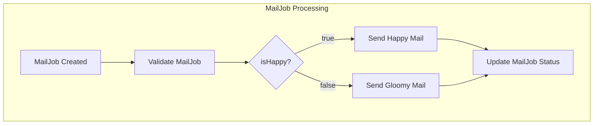

### 1. Entity Definitions

```
MailJob:
- isHappy: Boolean (Indicates if this job sends happy or gloomy mails)
- mailList: List<String> (List of recipient email addresses)
- status: String (Job status such as PENDING, IN_PROGRESS, COMPLETED, FAILED)

Mail:
- isHappy: Boolean (Classifies mail as happy or gloomy)
- mailList: List<String> (List of recipient email addresses)
```

### 2. Process Method Flows

```
processMailJob() Flow:
1. Initial State: MailJob created with status = PENDING
2. Validation: Check mailList is not empty and isHappy is not null
3. Processing: 
   - If isHappy == true, trigger sendHappyMail logic for each email in mailList
   - Else, trigger sendGloomyMail logic for each email in mailList
4. Completion: Update MailJob status to COMPLETED if all mails sent successfully, otherwise FAILED
5. Notification: Log results or send internal event for audit (optional)
```

```
processMail() Flow:
1. Initial State: Mail entity created (immutable)
2. Validation: Check mailList is not empty
3. Processing: 
   - If isHappy == true, send happy mail content to mailList
   - Else, send gloomy mail content to mailList
4. Completion: Persist mail send status (optional)
```

### 3. API Endpoints Design

- **POST /mailJobs**  
  - Description: Create a new MailJob which triggers sending mails based on `isHappy`.  
  - Request Body:  
    ```json
    {
      "isHappy": true,
      "mailList": ["recipient1@example.com", "recipient2@example.com"]
    }
    ```  
  - Response:  
    ```json
    {
      "technicalId": "generated-unique-id"
    }
    ```

- **GET /mailJobs/{technicalId}**  
  - Description: Retrieve MailJob status and details by technicalId.  
  - Response:  
    ```json
    {
      "technicalId": "generated-unique-id",
      "isHappy": true,
      "mailList": ["recipient1@example.com", "recipient2@example.com"],
      "status": "COMPLETED"
    }
    ```

- **GET /mails/{technicalId}** *(optional)*  
  - Description: Retrieve Mail entity details by technicalId.  
  - Response:  
    ```json
    {
      "technicalId": "mail-unique-id",
      "isHappy": true,
      "mailList": ["recipient1@example.com"]
    }
    ```

### 4. Event-Driven Processing Chains (Mermaid Diagrams)

```mermaid
flowchart TD
  A[POST /mailJobs] --> B[Create MailJob Entity]
  B --> C[processMailJob()]
  C --> D{isHappy?}
  D -- true --> E[sendHappyMail to each recipient]
  D -- false --> F[sendGloomyMail to each recipient]
  E --> G[Update MailJob status to COMPLETED/FAILED]
  F --> G
  G --> H[Log/Notify results]
```


```mermaid
flowchart TD
  subgraph MailJob Processing
    A[MailJob Created] --> B[Validate MailJob]
    B --> C{isHappy?}
    C -->|true| D[Send Happy Mail]
    C -->|false| E[Send Gloomy Mail]
    D --> F[Update MailJob Status]
    E --> F
  end
```

---

Please let me know if you need any further refinements or additions!