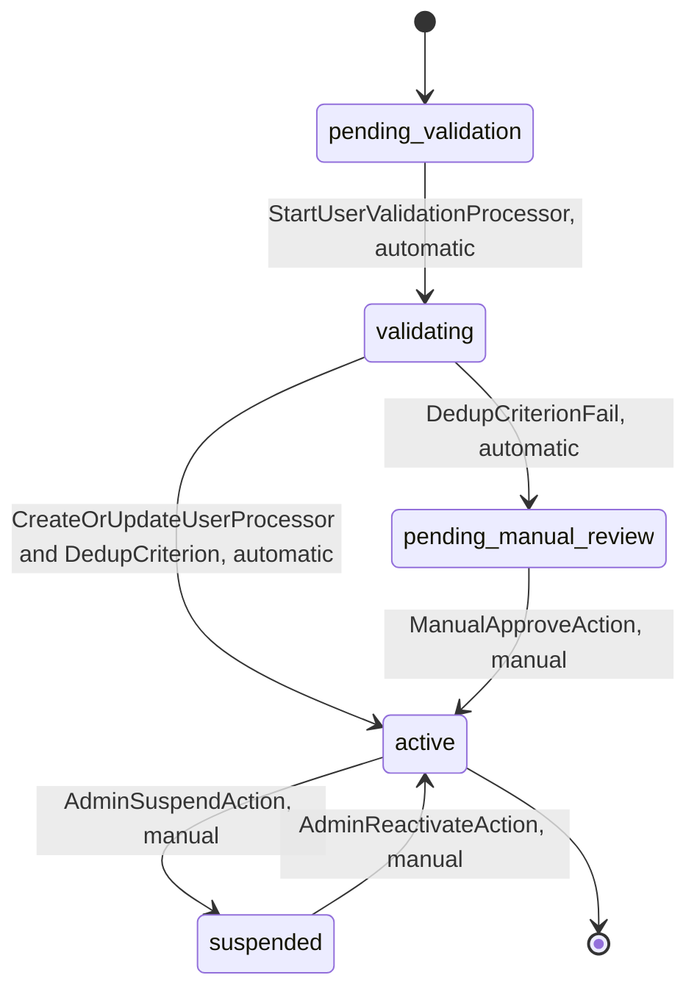
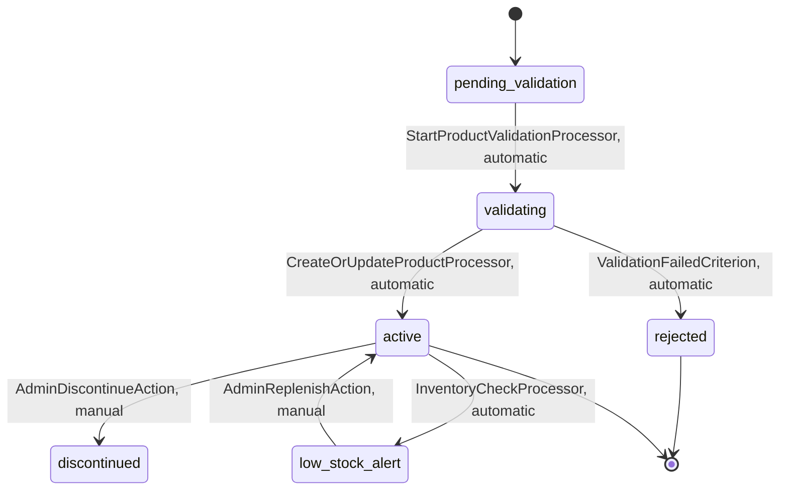
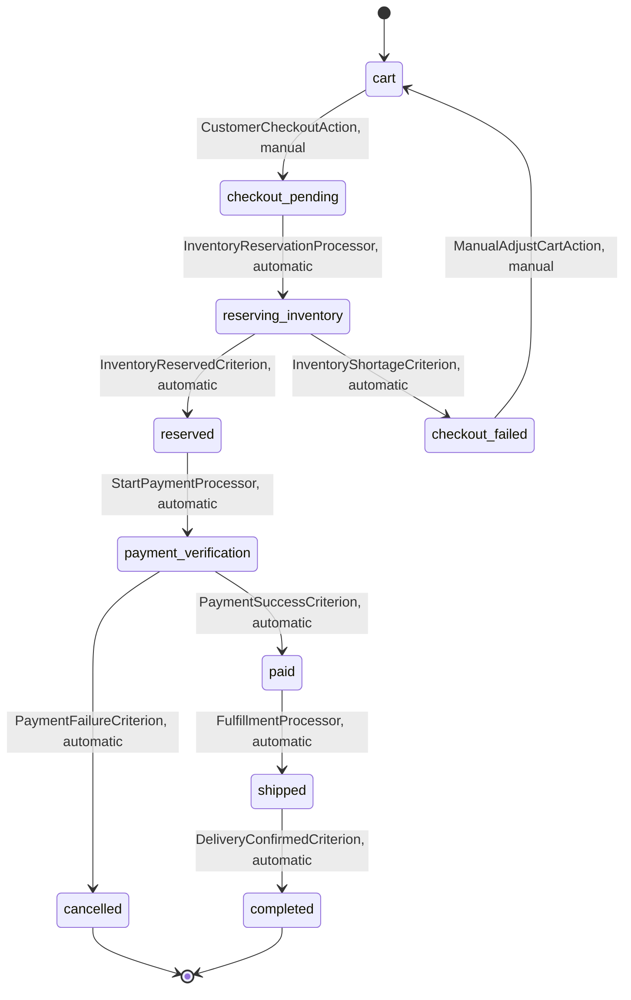
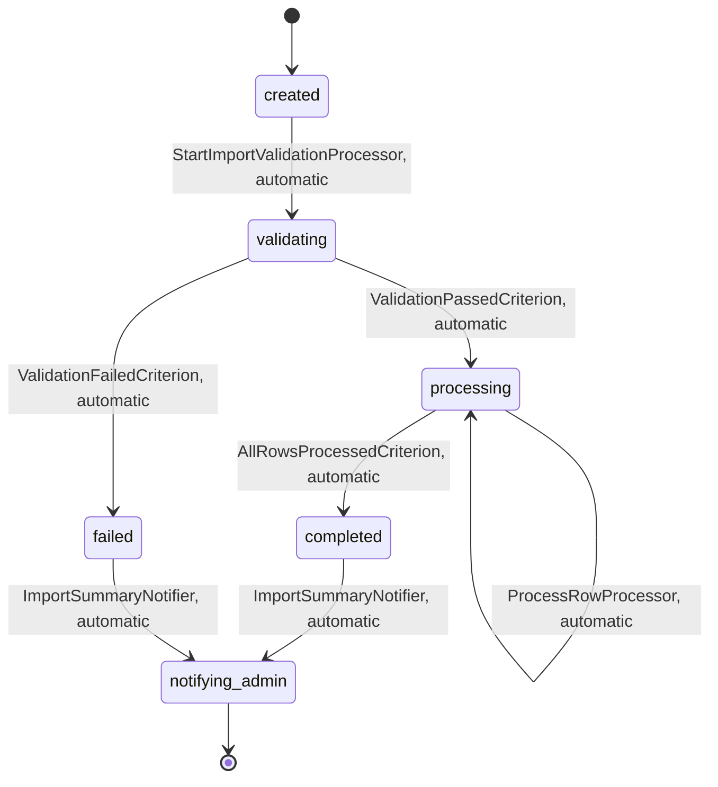
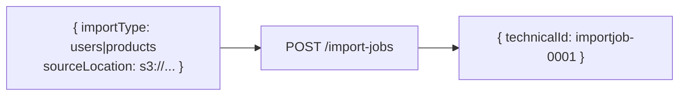
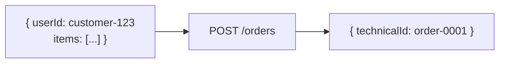

### 1. Entity Definitions
```
User:
- id: String (business id, e.g., external CRM id)
- email: String (contact and login)
- name: String (full name)
- role: String (Admin or Customer)
- status: String (active suspended pending_validation)
- importedFrom: String (ImportJob id or manual)
- createdAt: DateTime (creation timestamp)

Product:
- id: String (business id / sku)
- title: String (product name)
- description: String (short description)
- price: Number (unit price)
- currency: String (currency code)
- inventoryQuantity: Number (available stock)
- status: String (active discontinued pending_validation)
- importedFrom: String (ImportJob id or manual)
- createdAt: DateTime

Order:
- id: String (business id)
- userId: String (customer business id)
- items: Array of { productId: String, qty: Number, unitPrice: Number, lineTotal: Number }
- subtotal: Number
- tax: Number
- shipping: Number
- total: Number
- status: String (cart checkout_pending reserved paid shipped completed cancelled)
- createdAt: DateTime
- reservedInventoryTx: String (reference to inventory reservation)
- paymentRef: String (payment reference if any)

ImportJob:
- id: String (business id)
- importType: String (users or products)
- sourceLocation: String (file path / url)
- uploadedBy: String (admin user id)
- uploadedAt: DateTime
- status: String (created validating processing completed failed)
- summary: Object (rowsProcessed rowsCreated rowsUpdated rowsFailed)
```

Note: I included 4 entities to represent both business and orchestration needs (imports). If you prefer exactly 3, tell me which to drop.

---

### 2. Entity workflows

User workflow:
1. Initial: User persisted with status pending_validation (automatic when created by ImportJob)
2. Validation: Validate email, dedupe by email/id (automatic via ImportValidationCriterion)
3. Activation: If valid -> status active (automatic). If duplicate -> set pending_validation or merge (manual review)
4. Manual actions: Admin may suspend/reactivate (manual)


```mermaid
stateDiagram-v2
    [*] --> pending_validation
    pending_validation --> validating : StartUserValidationProcessor, automatic
    validating --> active : CreateOrUpdateUserProcessor and DedupCriterion, automatic
    validating --> pending_manual_review : DedupCriterionFail, automatic
    pending_manual_review --> active : ManualApproveAction, manual
    active --> suspended : AdminSuspendAction, manual
    suspended --> active : AdminReactivateAction, manual
    active --> [*]
```

Processors / Criteria needed:
- StartUserValidationProcessor
- DedupCriterion
- CreateOrUpdateUserProcessor
- ManualApproveAction

Product workflow:
1. Initial: product persisted with status pending_validation
2. Validation: Validate SKU, price, mandatory fields (automatic)
3. Activation: If valid -> active (automatic). If inventory 0 -> active but with low stock alerts (automatic)
4. Manual: Admin may discontinue (manual)


```mermaid
stateDiagram-v2
    [*] --> pending_validation
    pending_validation --> validating : StartProductValidationProcessor, automatic
    validating --> active : CreateOrUpdateProductProcessor, automatic
    validating --> rejected : ValidationFailedCriterion, automatic
    active --> low_stock_alert : InventoryCheckProcessor, automatic
    active --> discontinued : AdminDiscontinueAction, manual
    low_stock_alert --> active : AdminReplenishAction, manual
    rejected --> [*]
    active --> [*]
```

Processors / Criteria needed:
- StartProductValidationProcessor
- ValidationFailedCriterion
- CreateOrUpdateProductProcessor
- InventoryCheckProcessor

Order workflow (covers cart -> checkout -> payment/reservation -> fulfillment):
1. Initial: Order created with status cart (customer adds items)
2. Checkout: Customer requests checkout -> status checkout_pending (manual by customer)
3. Reservation: System attempts inventory reservation -> if success status reserved else status checkout_failed (automatic)
4. Payment: If payment required, verify payment -> on success status paid (automatic), else cancelled
5. Fulfillment: After paid -> status shipped -> completed (automatic/manual)
6. Cancellation/Refund: manual by admin/customer or automatic on payment failure


```mermaid
stateDiagram-v2
    [*] --> cart
    cart --> checkout_pending : CustomerCheckoutAction, manual
    checkout_pending --> reserving_inventory : InventoryReservationProcessor, automatic
    reserving_inventory --> reserved : InventoryReservedCriterion, automatic
    reserving_inventory --> checkout_failed : InventoryShortageCriterion, automatic
    reserved --> payment_verification : StartPaymentProcessor, automatic
    payment_verification --> paid : PaymentSuccessCriterion, automatic
    payment_verification --> cancelled : PaymentFailureCriterion, automatic
    paid --> shipped : FulfillmentProcessor, automatic
    shipped --> completed : DeliveryConfirmedCriterion, automatic
    checkout_failed --> cart : ManualAdjustCartAction, manual
    cancelled --> [*]
    completed --> [*]
```

Processors / Criteria needed:
- InventoryReservationProcessor
- InventoryReservedCriterion
- InventoryShortageCriterion
- StartPaymentProcessor
- PaymentSuccessCriterion
- FulfillmentProcessor
- DeliveryConfirmedCriterion
- ManualAdjustCartAction

ImportJob workflow:
1. Created: Admin posts ImportJob (created)
2. Validation: Validate file format and headers (automatic)
3. Processing: Stream rows -> for each row emit User or Product entity persist events (automatic)
4. Completion: When done set completed or failed and produce summary (automatic)
5. Notification: Notify admin via summary (automatic)


```mermaid
stateDiagram-v2
    [*] --> created
    created --> validating : StartImportValidationProcessor, automatic
    validating --> processing : ValidationPassedCriterion, automatic
    validating --> failed : ValidationFailedCriterion, automatic
    processing --> processing : ProcessRowProcessor, automatic
    processing --> completed : AllRowsProcessedCriterion, automatic
    completed --> notifying_admin : ImportSummaryNotifier, automatic
    notifying_admin --> [*]
    failed --> notifying_admin : ImportSummaryNotifier, automatic
```

Processors / Criteria needed:
- StartImportValidationProcessor
- ValidationPassedCriterion
- ValidationFailedCriterion
- ProcessRowProcessor
- AllRowsProcessedCriterion
- ImportSummaryNotifier

---

### 3. Pseudo code for processor classes (concise)

StartImportValidationProcessor:
```
class StartImportValidationProcessor {
  process(importJob) {
    if invalidFormat(importJob.sourceLocation) { mark importJob.status = failed; return; }
    mark importJob.status = processing
    enqueue ProcessRowProcessor for each chunk
  }
}
```

ProcessRowProcessor (emits business entity events):
```
class ProcessRowProcessor {
  process(row, importJob) {
    if importJob.importType == users {
      persist User entity from row -> this triggers User workflow
    } else if importJob.importType == products {
      persist Product entity from row -> triggers Product workflow
    }
    update importJob.summary
  }
}
```

InventoryReservationProcessor:
```
class InventoryReservationProcessor {
  process(order) {
    for item in order.items {
      if inventory[item.productId] < item.qty { mark order.status = checkout_failed; return; }
    }
    decrement inventory for items
    mark order.status = reserved
  }
}
```

StartPaymentProcessor:
```
class StartPaymentProcessor {
  process(order) {
    if order.total == 0 { mark order.status = paid; return; }
    initiate payment gateway (async) and update order.paymentRef
  }
}
```

ImportSummaryNotifier:
```
class ImportSummaryNotifier {
  process(importJob) {
    build summary message from importJob.summary
    send to uploadedBy
  }
}
```

---

### 4. API Endpoints Design Rules

Rules applied:
- POST endpoints create orchestration entities or events and must return ONLY technicalId.
- GET by technicalId present for entities that can be created via POST or will be queried.
- Business entities created by ImportJob are retrieved via GET by technicalId.
- POST endpoints: /import-jobs, /orders
- GET endpoints: /import-jobs/{technicalId}, /orders/{technicalId}, /users/{technicalId}, /products/{technicalId}

POST /import-jobs
Request JSON:
```json
{
  "importType": "users|products",
  "sourceLocation": "s3://bucket/file.csv",
  "uploadedBy": "admin-id",
  "options": { "dedupeStrategy": "email" }
}
```
Response JSON (must return only technicalId):
```json
{ "technicalId": "importjob-0001" }
```

POST /orders
Request JSON:
```json
{
  "userId": "customer-123",
  "items": [{ "productId": "sku-1", "qty": 2 }],
  "shippingAddress": "123 Main St, City"
}
```
Response JSON:
```json
{ "technicalId": "order-0001" }
```

GET /orders/{technicalId} response example (full stored result):
```json
{
  "id": "order-0001",
  "userId": "customer-123",
  "items": [{ "productId": "sku-1", "qty": 2, "unitPrice": 10, "lineTotal": 20 }],
  "subtotal": 20,
  "tax": 2,
  "shipping": 5,
  "total": 27,
  "status": "reserved",
  "createdAt": "2025-08-15T12:00:00Z"
}
```

Visualize POST /import-jobs request/response (Mermaid flow)

```mermaid
flowchart LR
  req["{ importType: users|products<br>sourceLocation: s3://... }"]
  api["POST /import-jobs"]
  res["{ technicalId: importjob-0001 }"]
  req --> api
  api --> res
```

Visualize POST /orders request/response (Mermaid flow)

```mermaid
flowchart LR
  req2["{ userId: customer-123<br>items: [...] }"]
  api2["POST /orders"]
  res2["{ technicalId: order-0001 }"]
  req2 --> api2
  api2 --> res2
```

Questions to refine (pick which to answer next):
- Do you want Admins to be able to create single Users/Products manually (additional POSTs) or only via ImportJob?
- On import conflicts do you prefer update, skip, or create duplicates by default?
- Should checkout reserve inventory immediately or only after successful payment?

Tell me which choices and I will adjust entities/workflows and processors for Cyoda import.