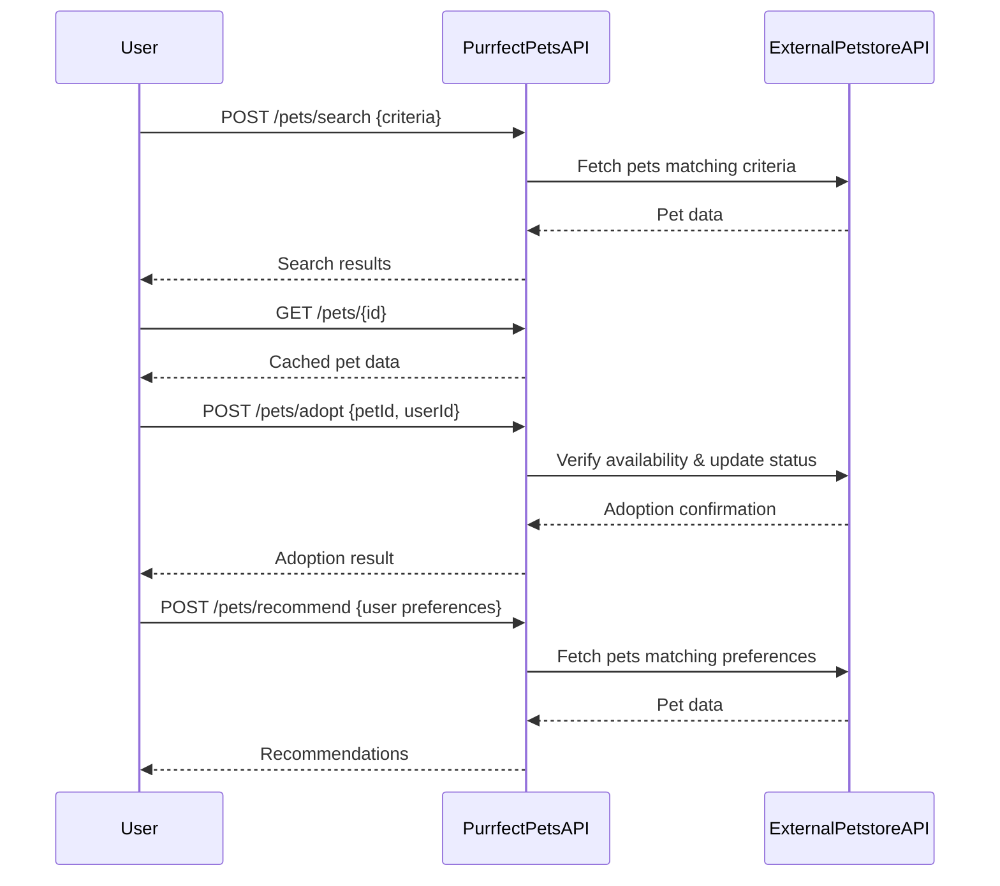

# Purrfect Pets API - Functional Requirements

## API Endpoints

### 1. POST /pets/search  
**Description:** Search pets by criteria, invoking external Petstore API data and applying any business logic filters.  
**Request:**  
```json
{
  "type": "string",          // optional, e.g. "dog", "cat"
  "status": "string",        // optional, e.g. "available", "sold"
  "name": "string"           // optional, partial or full name match
}
```  
**Response:**  
```json
{
  "pets": [
    {
      "id": "integer",
      "name": "string",
      "type": "string",
      "status": "string",
      "tags": ["string"]
    }
  ]
}
```

---

### 2. GET /pets/{id}  
**Description:** Retrieve cached or previously fetched pet details by ID (no external call).  
**Response:**  
```json
{
  "id": "integer",
  "name": "string",
  "type": "string",
  "status": "string",
  "tags": ["string"]
}
```

---

### 3. POST /pets/adopt  
**Description:** Process pet adoption request, including availability verification and updating status (business logic).  
**Request:**  
```json
{
  "petId": "integer",
  "userId": "integer"
}
```  
**Response:**  
```json
{
  "success": "boolean",
  "message": "string"
}
```

---

### 4. POST /pets/recommend  
**Description:** Recommend pets based on user preferences or history (business logic + external data integration).  
**Request:**  
```json
{
  "userId": "integer",
  "preferences": {
    "type": "string",
    "status": "string"
  }
}
```  
**Response:**  
```json
{
  "recommendedPets": [
    {
      "id": "integer",
      "name": "string",
      "type": "string",
      "status": "string"
    }
  ]
}
```

---

## Mermaid Sequence Diagram: User Interaction Flow


```mermaid
sequenceDiagram
    participant User
    participant PurrfectPetsAPI
    participant ExternalPetstoreAPI

    User->>PurrfectPetsAPI: POST /pets/search {criteria}
    PurrfectPetsAPI->>ExternalPetstoreAPI: Fetch pets matching criteria
    ExternalPetstoreAPI-->>PurrfectPetsAPI: Pet data
    PurrfectPetsAPI-->>User: Search results

    User->>PurrfectPetsAPI: GET /pets/{id}
    PurrfectPetsAPI-->>User: Cached pet data

    User->>PurrfectPetsAPI: POST /pets/adopt {petId, userId}
    PurrfectPetsAPI->>ExternalPetstoreAPI: Verify availability & update status
    ExternalPetstoreAPI-->>PurrfectPetsAPI: Adoption confirmation
    PurrfectPetsAPI-->>User: Adoption result

    User->>PurrfectPetsAPI: POST /pets/recommend {user preferences}
    PurrfectPetsAPI->>ExternalPetstoreAPI: Fetch pets matching preferences
    ExternalPetstoreAPI-->>PurrfectPetsAPI: Pet data
    PurrfectPetsAPI-->>User: Recommendations
```