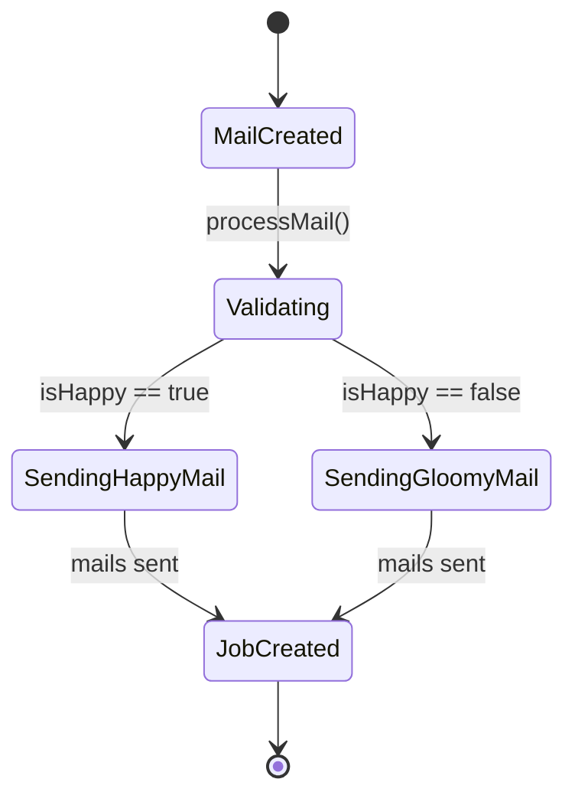
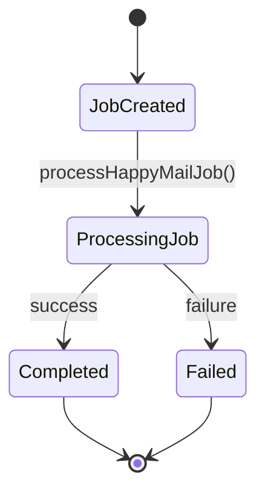
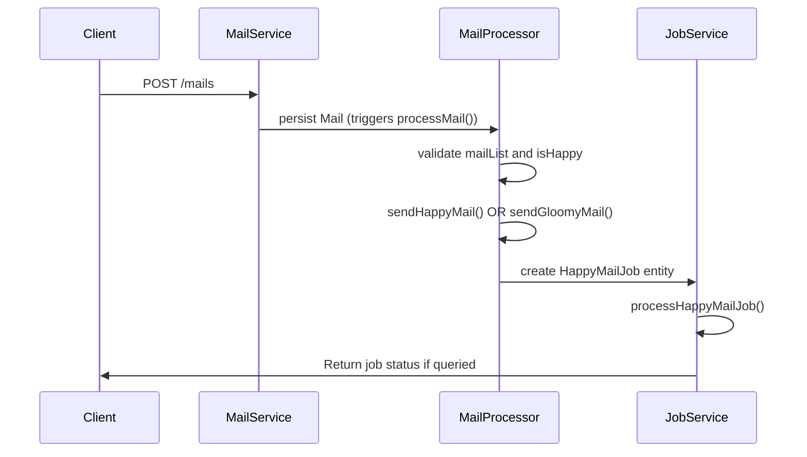

### 1. Entity Definitions

``` 
Mail: 
- isHappy: Boolean (indicates if the mail is happy or gloomy) 
- mailList: List<String> (list of recipient email addresses) 

HappyMailJob: 
- mailTechnicalId: String (reference to the Mail entity's datastore technicalId) 
- status: String (PENDING, COMPLETED, FAILED - tracks job processing state) 
- createdAt: DateTime (job creation timestamp) 
- resultMessage: String (optional message describing processing result) 
```

---

### 2. Process Method Flows

``` 
processMail() Flow: 
1. Initial State: Mail entity created (immutable) with isHappy flag and mailList 
2. Validation: Validate mailList emails (syntax only) and that mailList is not empty 
3. Classification: Based on isHappy flag, route to appropriate processor: 
   - If true → sendHappyMail() 
   - If false → sendGloomyMail() 
4. Sending: Simulate sending mails to all recipients in mailList with corresponding content 
5. Completion: Create HappyMailJob entity with status COMPLETED or FAILED based on sending result 

processHappyMailJob() Flow: 
1. Initial State: HappyMailJob entity created with PENDING status 
2. Processing: Track mail sending results and update status accordingly 
3. Completion: Set status to COMPLETED or FAILED, add resultMessage 
4. Notification: Optionally emit events or notifications about job completion 
```

---

### 3. Event Processing Workflows

- When a new **Mail** entity is saved (POST `/mails`), `processMail()` is automatically triggered by Cyoda.
- `processMail()` validates the mail, checks `isHappy` flag, and invokes either `sendHappyMail()` or `sendGloomyMail()` processors.
- Sending mails is simulated or integrated with mail service; after sending, a **HappyMailJob** entity is created to track the sending job.
- Saving a HappyMailJob triggers `processHappyMailJob()` which handles status updates and finalization.
- No update/delete endpoints are provided; all entities are immutable to preserve event history.

---

### 4. Request/Response Formats

**POST /mails**  
Request:
```json
{
  "isHappy": true,
  "mailList": ["user1@example.com", "user2@example.com"]
}
```
Response:
```json
{
  "technicalId": "generated-mail-technical-id"
}
```

**GET /mails/{technicalId}**  
Response:
```json
{
  "isHappy": true,
  "mailList": ["user1@example.com", "user2@example.com"]
}
```

**POST /happyMailJobs**  
Request:
```json
{
  "mailTechnicalId": "generated-mail-technical-id"
}
```
Response:
```json
{
  "technicalId": "generated-job-technical-id"
}
```

**GET /happyMailJobs/{technicalId}**  
Response:
```json
{
  "mailTechnicalId": "generated-mail-technical-id",
  "status": "COMPLETED",
  "createdAt": "2024-06-01T12:00:00Z",
  "resultMessage": "Mails sent successfully"
}
```

---

### Visual Representations

**Mail Entity Lifecycle**


```mermaid
stateDiagram-v2
    [*] --> MailCreated
    MailCreated --> Validating : processMail()
    Validating --> SendingHappyMail : isHappy == true
    Validating --> SendingGloomyMail : isHappy == false
    SendingHappyMail --> JobCreated : mails sent
    SendingGloomyMail --> JobCreated : mails sent
    JobCreated --> [*]
```

**HappyMailJob Lifecycle**


```mermaid
stateDiagram-v2
    [*] --> JobCreated
    JobCreated --> ProcessingJob : processHappyMailJob()
    ProcessingJob --> Completed : success
    ProcessingJob --> Failed : failure
    Completed --> [*]
    Failed --> [*]
```

**Event-Driven Processing Chain**


```mermaid
sequenceDiagram
    participant Client
    participant MailService
    participant MailProcessor
    participant JobService

    Client->>MailService: POST /mails
    MailService->>MailProcessor: persist Mail (triggers processMail())
    MailProcessor->>MailProcessor: validate mailList and isHappy
    MailProcessor->>MailProcessor: sendHappyMail() OR sendGloomyMail()
    MailProcessor->>JobService: create HappyMailJob entity
    JobService->>JobService: processHappyMailJob()
    JobService->>Client: Return job status if queried
```

---

This completes the functional requirements for your Happy Mail application using Event-Driven Architecture on Cyoda with Java Spring Boot.