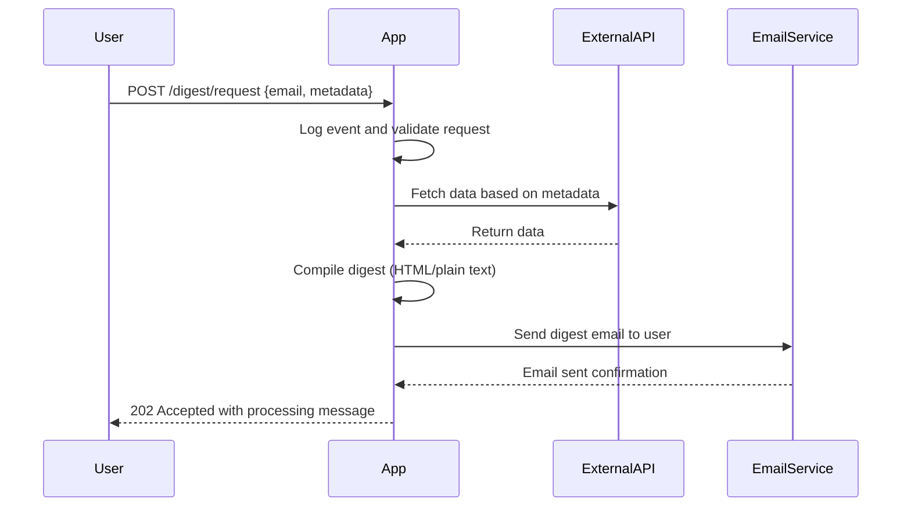
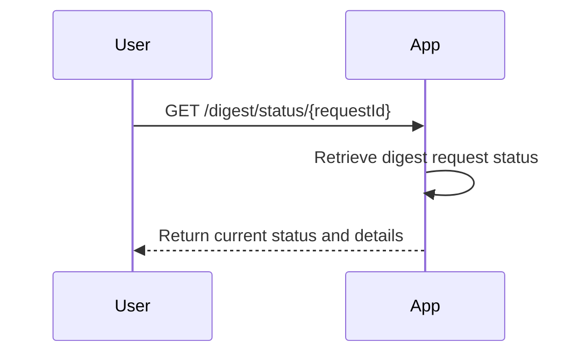

# Functional Requirements and API Design

## API Endpoints

### 1. POST /digest/request  
**Description:** Accepts and registers a digest request event, triggers data retrieval from external API, compiles the digest, and sends the email.  
**Request Body:**  
```json
{
  "email": "user@example.com",
  "metadata": {
    "userId": "1234",
    "requestTimestamp": "2024-06-01T12:00:00Z",
    "preferredCategories": ["pets", "orders"]
  }
}
```  
**Response:**  
```json
{
  "status": "accepted",
  "message": "Digest request received and processing started."
}
```  

---

### 2. GET /digest/status/{requestId}  
**Description:** Retrieves the current status or result of the digest request by requestId.  
**Response:**  
```json
{
  "requestId": "abcd-1234",
  "status": "completed",
  "sentTo": "user@example.com",
  "sentAt": "2024-06-01T12:05:00Z"
}
```  

---

# User-App Interaction Sequence Diagram


```mermaid
sequenceDiagram
    participant User
    participant App
    participant ExternalAPI
    participant EmailService

    User->>App: POST /digest/request {email, metadata}
    App->>App: Log event and validate request
    App->>ExternalAPI: Fetch data based on metadata
    ExternalAPI-->>App: Return data
    App->>App: Compile digest (HTML/plain text)
    App->>EmailService: Send digest email to user
    EmailService-->>App: Email sent confirmation
    App-->>User: 202 Accepted with processing message
```

---

# Digest Status Retrieval Flow


```mermaid
sequenceDiagram
    participant User
    participant App

    User->>App: GET /digest/status/{requestId}
    App->>App: Retrieve digest request status
    App-->>User: Return current status and details
```