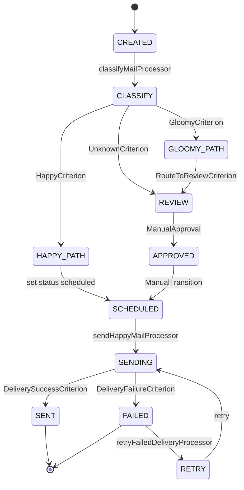
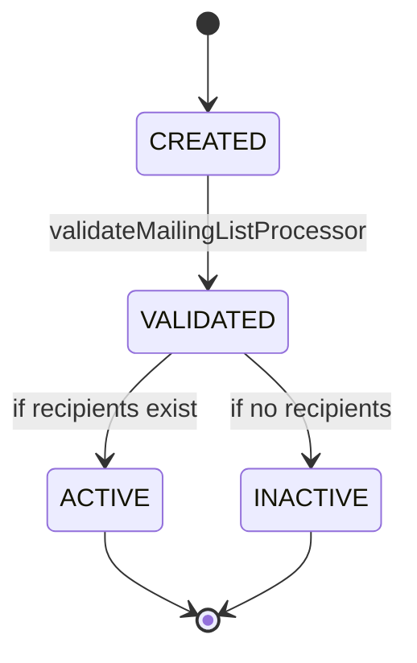
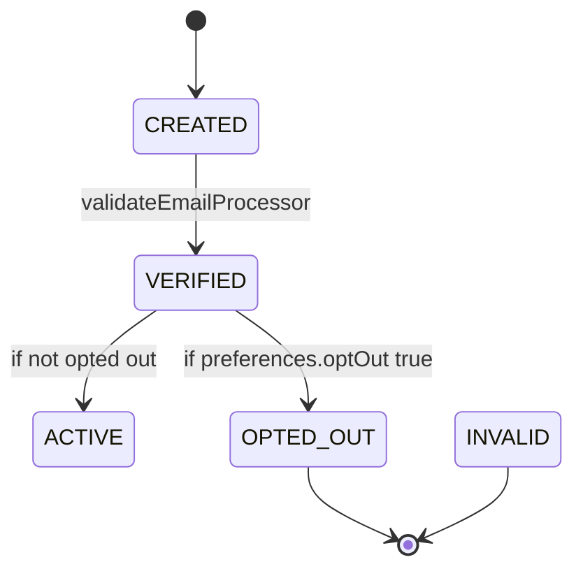
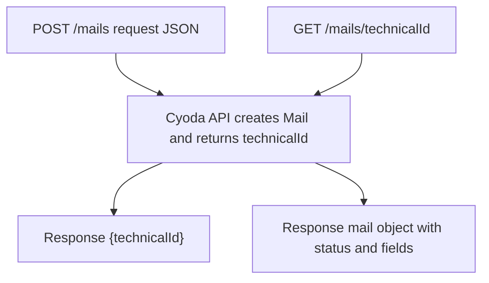

### 1. Entity Definitions
```
Mail:
- id: String (business id)
- subject: String (message subject)
- body: String (message body)
- isHappy: Boolean (true/false/null if unknown)
- mailList: String or Array (reference to MailingList id or inline Recipient emails)
- status: String (draft scheduled queued sending sent failed review)
- createdBy: String (user id)
- createdAt: String (timestamp)

MailingList:
- id: String (business id)
- name: String (display name)
- recipients: Array (list of Recipient ids or emails)
- isActive: Boolean (list active flag)
- createdAt: String (timestamp)

Recipient:
- id: String (business id)
- email: String (email address)
- name: String (display name)
- preferences: Object (optOut boolean, allowedCategories array)
- status: String (new verified opted_out invalid)
- createdAt: String (timestamp)
```

Note: You specified 3 entities; I used only those.

### 2. Entity workflows

Mail workflow:
1. Initial State: Mail persisted (CREATED) — this persistence is the EVENT that starts processing.
2. Classification (automatic): classifyMailProcessor runs; sets isHappy true/false/unknown.
3. If isHappy true (automatic): status -> SCHEDULED or QUEUED -> sendHappyMailProcessor runs -> SENDING -> recordDeliveryResultProcessor -> SENT or FAILED.
4. If isHappy false (automatic): option A automatic sendGloomyMailProcessor -> SENDING -> SENT/FAILED; option B route to REVIEW (manual) for human decision.
5. If unknown (automatic): enqueueForReviewProcessor -> REVIEW (manual) -> human may set isHappy -> follow happy/gloomy path.
6. On failures automatic retry via retryFailedDeliveryProcessor; persistent failures -> status FAILED and notify admin (manual).


```mermaid
stateDiagram-v2
    [*] --> CREATED
    CREATED --> CLASSIFY : classifyMailProcessor
    CLASSIFY --> HAPPY_PATH : HappyCriterion
    CLASSIFY --> GLOOMY_PATH : GloomyCriterion
    CLASSIFY --> REVIEW : UnknownCriterion
    HAPPY_PATH --> SCHEDULED : set status scheduled
    SCHEDULED --> SENDING : sendHappyMailProcessor
    SENDING --> SENT : DeliverySuccessCriterion
    SENDING --> FAILED : DeliveryFailureCriterion
    GLOOMY_PATH --> REVIEW : RouteToReviewCriterion
    REVIEW --> APPROVED : ManualApproval
    APPROVED --> SCHEDULED : ManualTransition
    FAILED --> RETRY : retryFailedDeliveryProcessor
    RETRY --> SENDING : retry
    SENT --> [*]
    FAILED --> [*]
```

Needed processors/criteria for Mail:
- Processors: classifyMailProcessor, sendHappyMailProcessor, sendGloomyMailProcessor, enqueueForReviewProcessor, recordDeliveryResultProcessor, retryFailedDeliveryProcessor
- Criteria: HappyKeywordCriterion, GloomyKeywordCriterion, DeliverySuccessCriterion

MailingList workflow:
1. CREATED -> validationProcessor runs -> VALIDATED (automatic)
2. VALIDATED -> ACTIVE (if recipients > 0 and isActive true) or INACTIVE (manual)
3. When used by Mail send processors, invalid recipients removed automatically.


```mermaid
stateDiagram-v2
    [*] --> CREATED
    CREATED --> VALIDATED : validateMailingListProcessor
    VALIDATED --> ACTIVE : if recipients exist
    VALIDATED --> INACTIVE : if no recipients
    ACTIVE --> [*]
    INACTIVE --> [*]
```

Processors/criteria:
- validateMailingListProcessor, removeInvalidRecipientsProcessor
- Criteria: RecipientCountCriterion

Recipient workflow:
1. CREATED -> validateEmailProcessor (automatic) -> VERIFIED or INVALID
2. VERIFIED -> ACTIVE (unless preferences.optOut true -> OPTED_OUT manual/automatic)
3. OPTED_OUT excludes recipient from sends.


```mermaid
stateDiagram-v2
    [*] --> CREATED
    CREATED --> VERIFIED : validateEmailProcessor
    VERIFIED --> ACTIVE : if not opted out
    VERIFIED --> OPTED_OUT : if preferences.optOut true
    OPTED_OUT --> [*]
    INVALID --> [*]
```

Processors/criteria:
- validateEmailProcessor, enforceOptOutProcessor
- Criteria: EmailFormatCriterion, OptOutCriterion

### 3. Pseudo code for processor classes

classifyMailProcessor(mail):
- if HappyKeywordCriterion(mail.body) then mail.isHappy = true
- else if GloomyKeywordCriterion(mail.body) then mail.isHappy = false
- else mail.isHappy = null
- persist mail (triggers next transitions)

sendHappyMailProcessor(mail):
- for each recipient in resolved mailList:
    - if recipient.preferences.optOut then skip
    - create delivery record status = queued
    - attempt send
    - if success recordDeliveryResultProcessor(recipient, success)
    - else recordDeliveryResultProcessor(recipient, failure)

sendGloomyMailProcessor(mail):
- similar to sendHappyMailProcessor but uses gloomy template or routes to review per policy

enqueueForReviewProcessor(mail):
- set mail.status = review
- notify reviewer role
- persist

recordDeliveryResultProcessor(recipient, result):
- update per-recipient delivery record
- if result failure increment attempt count
- if attempts < max schedule retryFailedDeliveryProcessor
- else mark recipient delivery failed

retryFailedDeliveryProcessor(deliveryRecord):
- if attempts < maxAttempts then requeue send
- else escalate to admin notification

(Processors avoid implementation specifics; they update status fields and persist to trigger next Cyoda workflows.)

### 4. API Endpoints Design Rules

Rules followed:
- POST creation endpoints return only technicalId.
- GET by technicalId returns stored entity result.
- No GET by condition provided.

Endpoints and JSON formats:

POST /mails
Request JSON:
{
  subject: String,
  body: String,
  mailList: String or Array,
  createdBy: String
}
Response JSON:
{
  technicalId: String
}

GET /mails/{technicalId}
Response JSON:
{
  technicalId: String,
  id: String,
  subject: String,
  body: String,
  isHappy: Boolean or null,
  mailList: String or Array,
  status: String,
  createdBy: String,
  createdAt: String
}

POST /mailinglists
Request:
{
  name: String,
  recipients: Array
}
Response:
{
  technicalId: String
}

GET /mailinglists/{technicalId}
Response:
{
  technicalId: String,
  id: String,
  name: String,
  recipients: Array,
  isActive: Boolean,
  createdAt: String
}

POST /recipients
Request:
{
  email: String,
  name: String,
  preferences: Object
}
Response:
{
  technicalId: String
}

GET /recipients/{technicalId}
Response:
{
  technicalId: String,
  id: String,
  email: String,
  name: String,
  preferences: Object,
  status: String,
  createdAt: String
}

Mermaid visualization of Mail POST/GET:


```mermaid
graph TD
  Mail_POST_Request["POST /mails request JSON"]
  Mail_API["Cyoda API creates Mail and returns technicalId"]
  Mail_POST_Response["Response {technicalId}"]
  Mail_GET_Request["GET /mails/technicalId"]
  Mail_GET_Response["Response mail object with status and fields"]
  Mail_POST_Request --> Mail_API
  Mail_API --> Mail_POST_Response
  Mail_GET_Request --> Mail_API
  Mail_API --> Mail_GET_Response
```

If you want, I can: (A) keep this model as-is, (B) add an orchestration Job entity for batched sends and provide its POST/GET, or (C) adjust classification rules (e.g., threshold, ML vs keywords). Which would you like next?