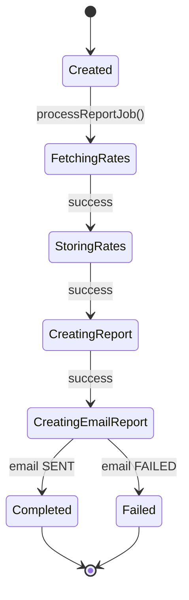
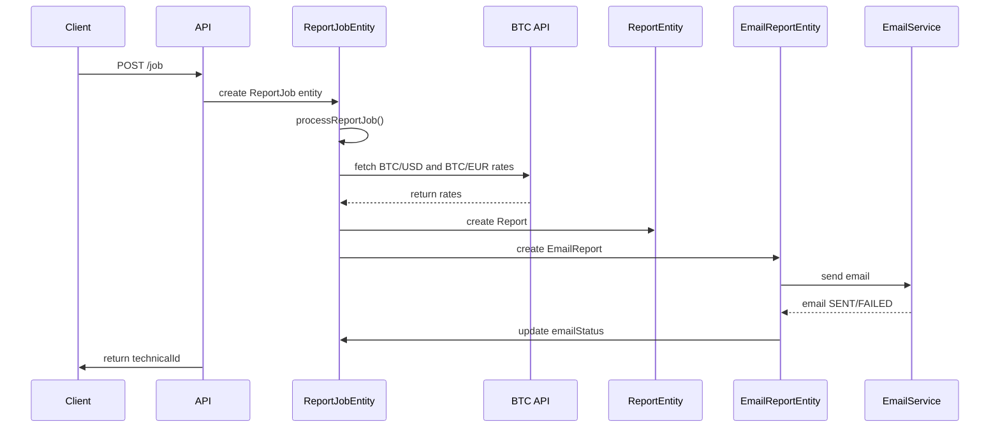
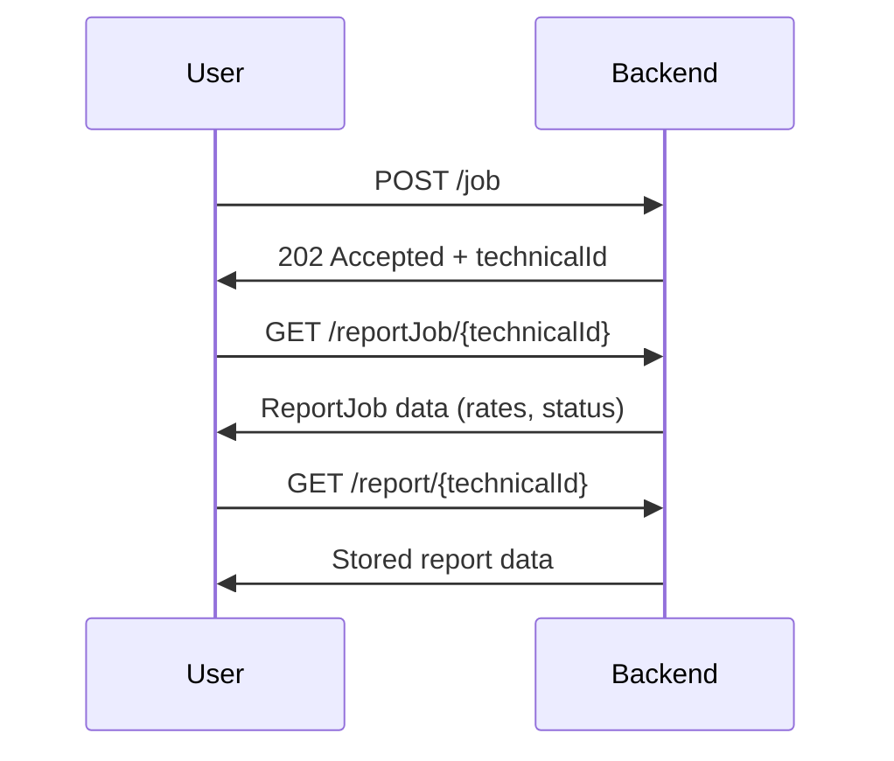

### 1. Entity Definitions

```
ReportJob:
- btcUsdRate: Decimal (Bitcoin to USD conversion rate)
- btcEurRate: Decimal (Bitcoin to EUR conversion rate)
- timestamp: DateTime (when rates were fetched)
- emailStatus: String (email sending status, e.g., PENDING, SENT, FAILED)

EmailReport:
- reportJobId: String (reference to ReportJob technicalId)
- recipient: String (email address)
- subject: String (email subject)
- body: String (email content)
- sentTimestamp: DateTime (when email was sent)
- status: String (email delivery status)

Report:
- reportJobId: String (reference to ReportJob technicalId)
- btcUsdRate: Decimal (stored BTC/USD rate)
- btcEurRate: Decimal (stored BTC/EUR rate)
- timestamp: DateTime (when report was created)
```

---

### 2. Process Method Flows

```
processReportJob() Flow:
1. Initial State: ReportJob entity created with PENDING emailStatus.
2. Fetch Conversion Rates: Call external APIs to get BTC/USD and BTC/EUR rates.
3. Store Rates: Save fetched rates and timestamp in ReportJob.
4. Create Report Entity: Generate immutable Report entity with the rates and timestamp.
5. Trigger EmailReport Creation: Create EmailReport entity for sending email.
6. Update emailStatus in ReportJob based on email sending result (e.g., SENT or FAILED).

processEmailReport() Flow:
1. Initial State: EmailReport entity created with status PENDING.
2. Compose Email: Construct email content from ReportJob data.
3. Send Email: Use configured email service to send the report.
4. Update EmailReport status to SENT or FAILED.
5. Optionally, update ReportJob.emailStatus accordingly.
```

---

### 3. API Endpoints

| Method | Endpoint           | Description                              | Request Body                        | Response                         |
|--------|--------------------|--------------------------------------|-----------------------------------|---------------------------------|
| POST   | `/job`             | Create a new report job (triggers fetching rates and email) | `{}` (empty or optional parameters) | `{ "technicalId": "uuid-string" }` |
| GET    | `/reportJob/{id}`  | Retrieve ReportJob info by technicalId | N/A                               | `{ btcUsdRate, btcEurRate, timestamp, emailStatus }` |
| GET    | `/report/{id}`     | Retrieve stored Report by technicalId | N/A                               | `{ reportJobId, btcUsdRate, btcEurRate, timestamp }` |

---

### 4. Request/Response Formats

**POST /job**

Request body (optional):

```json
{}
```

Response:

```json
{
  "technicalId": "string-uuid"
}
```

**GET /reportJob/{technicalId}**

Response:

```json
{
  "btcUsdRate": 30123.45,
  "btcEurRate": 27950.30,
  "timestamp": "2024-06-01T12:00:00Z",
  "emailStatus": "SENT"
}
```

**GET /report/{technicalId}**

Response:

```json
{
  "reportJobId": "string-uuid",
  "btcUsdRate": 30123.45,
  "btcEurRate": 27950.30,
  "timestamp": "2024-06-01T12:00:00Z"
}
```

---

### 5. Mermaid Diagrams

**ReportJob Entity Lifecycle**


```mermaid
stateDiagram-v2
    [*] --> Created
    Created --> FetchingRates : processReportJob()
    FetchingRates --> StoringRates : success
    StoringRates --> CreatingReport : success
    CreatingReport --> CreatingEmailReport : success
    CreatingEmailReport --> Completed : email SENT
    CreatingEmailReport --> Failed : email FAILED
    Completed --> [*]
    Failed --> [*]
```

**Event-Driven Processing Chain**


```mermaid
sequenceDiagram
    participant Client
    participant API
    participant ReportJobEntity
    participant ExternalAPI as BTC API
    participant ReportEntity
    participant EmailReportEntity
    participant EmailService

    Client->>API: POST /job
    API->>ReportJobEntity: create ReportJob entity
    ReportJobEntity->>ReportJobEntity: processReportJob()
    ReportJobEntity->>ExternalAPI: fetch BTC/USD and BTC/EUR rates
    ExternalAPI-->>ReportJobEntity: return rates
    ReportJobEntity->>ReportEntity: create Report
    ReportJobEntity->>EmailReportEntity: create EmailReport
    EmailReportEntity->>EmailService: send email
    EmailService-->>EmailReportEntity: email SENT/FAILED
    EmailReportEntity->>ReportJobEntity: update emailStatus
    API->>Client: return technicalId
```

**User Interaction Sequence**


```mermaid
sequenceDiagram
    participant User
    participant Backend

    User->>Backend: POST /job
    Backend->>User: 202 Accepted + technicalId

    User->>Backend: GET /reportJob/{technicalId}
    Backend->>User: ReportJob data (rates, status)

    User->>Backend: GET /report/{technicalId}
    Backend->>User: Stored report data
```

---

This completes the confirmed functional requirements specification for your Bitcoin conversion rate reporting application using an Event-Driven Architecture approach on Cyoda.