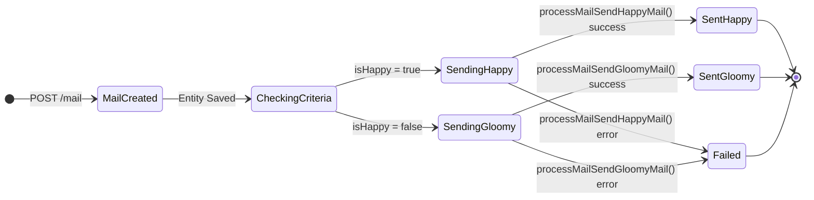
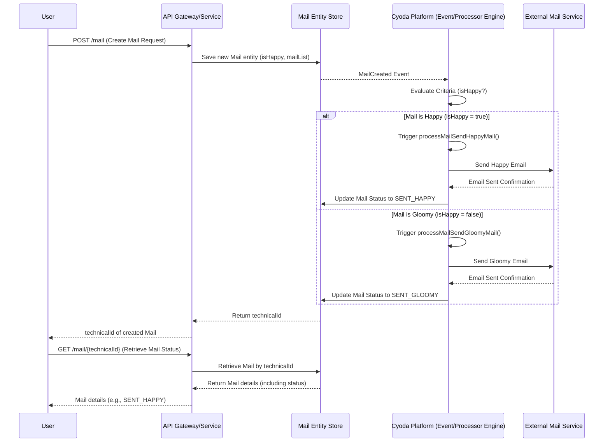

Here is the well-formatted final version of the functional requirements for your "happy mails" application, confirmed based on our discussion and your explicit request for an Event-Driven Architecture (EDA) approach:

### 1. Entity Definitions

The core entity for this application is `mail`.

```
mail:
- isHappy: Boolean (Indicates if the mail content is happy or gloomy. True for happy, false for gloomy.)
- mailList: List of Strings (List of email addresses to send the mail to)
- status: String (Current state of the mail processing, e.g., PENDING, SENT_HAPPY, SENT_GLOOMY, FAILED)
```

### 2. Process Method Flows

The creation of a new `mail` entity acts as an event that triggers its processing workflow.

**`processMailSendHappyMail()` Flow:**
1.  **Initial State:** A `mail` entity has been successfully created and persisted.
2.  **Condition Check:** The `checkMailHappy()` event is implicitly triggered by Cyoda, verifying if the `mail.isHappy` field is `true`.
3.  **Processing:** If the `isHappy` condition is met, the system prepares the "happy mail" content and sends it to all recipients listed in `mailList`. This involves interaction with an external mail service.
4.  **Completion:** Upon successful delivery, the `mail` entity's `status` field is updated to `SENT_HAPPY`. If any error occurs during the sending process, the `status` is updated to `FAILED`.

**`processMailSendGloomyMail()` Flow:**
1.  **Initial State:** A `mail` entity has been successfully created and persisted.
2.  **Condition Check:** The `checkMailGloomy()` event is implicitly triggered by Cyoda, verifying if the `mail.isHappy` field is `false`.
3.  **Processing:** If the `isHappy` condition is not met (i.e., `isHappy` is `false`), the system prepares the "gloomy mail" content and sends it to all recipients in `mailList`. This also involves interaction with an external mail service.
4.  **Completion:** Upon successful delivery, the `mail` entity's `status` field is updated to `SENT_GLOOMY`. If any error occurs during the sending process, the `status` is updated to `FAILED`.

### 3. Requirements to Define

#### Business Entities

The application will feature one primary business entity: `mail`. This entity also serves an orchestration role for its own mail-sending process.

#### API Endpoints Design Rules

Following the Event-Driven Architecture (EDA) principle of favoring immutable entity creation and event-driven processing:

*   **POST /mail**
    *   **Purpose:** To create a new `mail` entity, which serves as the initiating event for the mail sending workflow.
    *   **Request Body:** A JSON object structured according to the `mail` entity, containing `isHappy` and `mailList`. The `status` field is managed internally by the system and should not be provided in the request.
    *   **Response:** Returns only the `technicalId` of the newly created `mail` entity.
    *   **Triggers:** This POST operation acts as an `EVENT`, triggering Cyoda's automatic criteria evaluation (`checkMailHappy()` or `checkMailGloomy()`) which then leads to the invocation of the appropriate processor (`processMailSendHappyMail()` or `processMailSendGloomyMail()`) based on the `isHappy` field.

*   **GET /mail/{technicalId}**
    *   **Purpose:** To retrieve the current state and full details of a specific `mail` entity by its system-assigned unique identifier (`technicalId`). This endpoint is used to query the results of the asynchronous mail sending process.
    *   **Response:** A JSON object representing the `mail` entity, including its `technicalId`, `isHappy`, `mailList`, and the current `status` of the mail sending operation.

#### Event Processing Workflows

The `mail` entity's lifecycle and processing within the system are driven by the following sequence of events and actions:

1.  **Mail Creation Event:** Triggered when a `POST /mail` request successfully creates a new `mail` entity in the underlying data store. The `mail` entity's initial `status` will typically be `PENDING`.
2.  **Criteria Evaluation Events:**
    *   `checkMailHappy()`: Cyoda automatically triggers this event to evaluate if the `mail` entity's `isHappy` field is `true`.
    *   `checkMailGloomy()`: Cyoda automatically triggers this event to evaluate if the `mail` entity's `isHappy` field is `false`.
3.  **Processor Invocation Events:**
    *   `processMailSendHappyMail()`: This processor is invoked by Cyoda if the `checkMailHappy()` criteria evaluates to true. It contains the business logic for sending happy emails.
    *   `processMailSendGloomyMail()`: This processor is invoked by Cyoda if the `checkMailGloomy()` criteria evaluates to true. It contains the business logic for sending gloomy emails.
4.  **Status Update Event:** After either `processMailSendHappyMail()` or `processMailSendGloomyMail()` completes its execution (whether successfully or with an error), it updates the `mail` entity's `status` field accordingly (e.g., `SENT_HAPPY`, `SENT_GLOOMY`, or `FAILED`).

#### Request/Response Formats

**1. POST /mail Request Body (JSON):**

```json
{
  "isHappy": true,
  "mailList": [
    "john.doe@example.com",
    "jane.smith@example.com"
  ]
}
```

**2. POST /mail Response Body (JSON):**

```json
{
  "technicalId": "your-unique-mail-id-12345"
}
```

**3. GET /mail/{technicalId} Response Body (JSON):**

```json
{
  "technicalId": "your-unique-mail-id-12345",
  "isHappy": true,
  "mailList": [
    "john.doe@example.com",
    "jane.smith@example.com"
  ],
  "status": "SENT_HAPPY",
  "timestamp": "2023-10-27T10:30:00Z"
}
```

### 4. Visual Representation

#### Entity Lifecycle State Diagram for `mail`


```mermaid
stateDiagram-v2
    direction LR
    [*] --> MailCreated : POST /mail
    MailCreated --> CheckingCriteria : Entity Saved
    CheckingCriteria --> SendingHappy : isHappy = true
    CheckingCriteria --> SendingGloomy : isHappy = false
    SendingHappy --> SentHappy : processMailSendHappyMail() success
    SendingGloomy --> SentGloomy : processMailSendGloomyMail() success
    SendingHappy --> Failed : processMailSendHappyMail() error
    SendingGloomy --> Failed : processMailSendGloomyMail() error
    SentHappy --> [*]
    SentGloomy --> [*]
    Failed --> [*]
```

#### Event-Driven Processing Chain

```mermaid
graph TD
    A[User POST /mail] --> B{Save Mail Entity};
    B --> C{Mail Entity Created};
    C --> D{Evaluate Criteria (Cyoda)};
    D -- isHappy = true --> E[checkMailHappy() Event];
    D -- isHappy = false --> F[checkMailGloomy() Event];
    E --> G[processMailSendHappyMail() Processor];
    F --> H[processMailSendGloomyMail() Processor];
    G --> I[Update Mail Status to SENT_HAPPY];
    H --> J[Update Mail Status to SENT_GLOOMY];
    I --> K[End Process];
    J --> K[End Process];
```

#### User Interaction Sequence Flow


```mermaid
sequenceDiagram
    participant User
    participant BackendAPI as API Gateway/Service
    participant MailEntityStore as Mail Entity Store
    participant CyodaPlatform as Cyoda Platform (Event/Processor Engine)
    participant ExternalMailService as External Mail Service

    User->>BackendAPI: POST /mail (Create Mail Request)
    BackendAPI->>MailEntityStore: Save new Mail entity (isHappy, mailList)
    MailEntityStore-->>CyodaPlatform: MailCreated Event
    CyodaPlatform->>CyodaPlatform: Evaluate Criteria (isHappy?)
    alt Mail is Happy (isHappy = true)
        CyodaPlatform->>CyodaPlatform: Trigger processMailSendHappyMail()
        CyodaPlatform->>ExternalMailService: Send Happy Email
        ExternalMailService-->>CyodaPlatform: Email Sent Confirmation
        CyodaPlatform->>MailEntityStore: Update Mail Status to SENT_HAPPY
    else Mail is Gloomy (isHappy = false)
        CyodaPlatform->>CyodaPlatform: Trigger processMailSendGloomyMail()
        CyodaPlatform->>ExternalMailService: Send Gloomy Email
        ExternalMailService-->>CyodaPlatform: Email Sent Confirmation
        CyodaPlatform->>MailEntityStore: Update Mail Status to SENT_GLOOMY
    end
    MailEntityStore-->>BackendAPI: Return technicalId
    BackendAPI-->>User: technicalId of created Mail

    User->>BackendAPI: GET /mail/{technicalId} (Retrieve Mail Status)
    BackendAPI->>MailEntityStore: Retrieve Mail by technicalId
    MailEntityStore-->>BackendAPI: Return Mail details (including status)
    BackendAPI-->>User: Mail details (e.g., SENT_HAPPY)
```