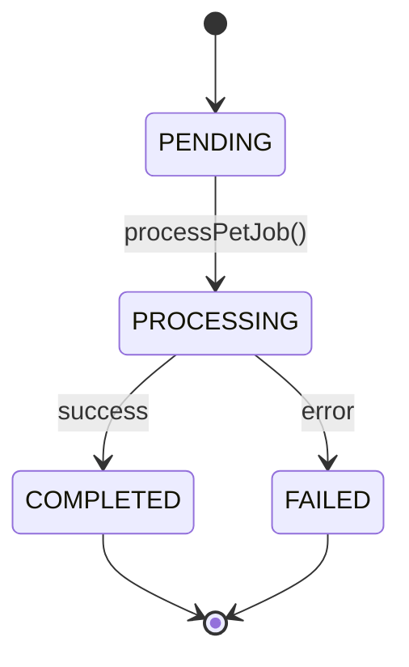
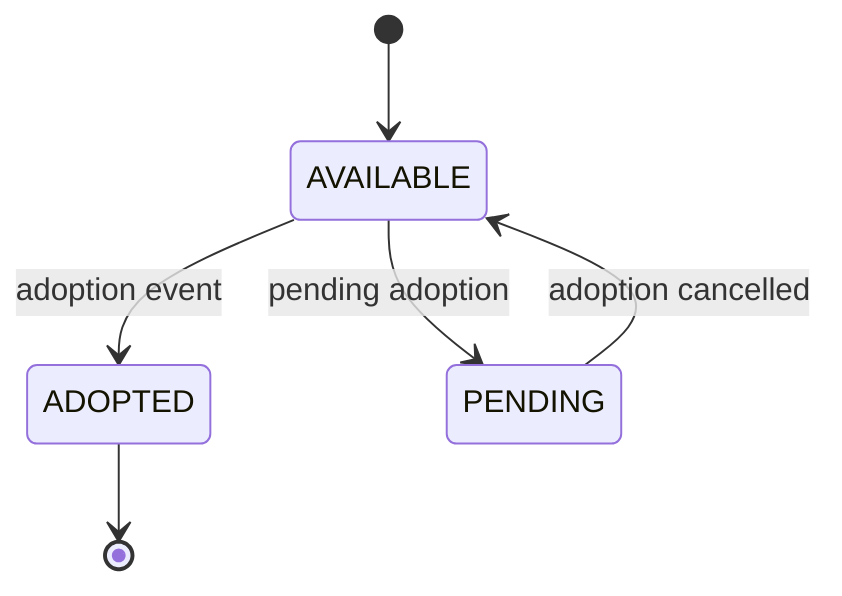
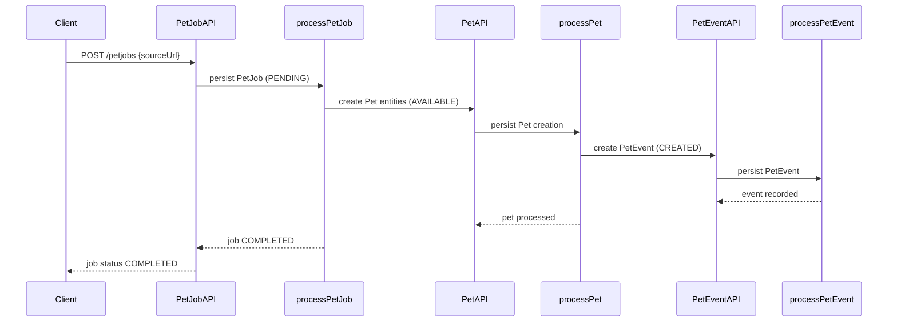

Certainly! Here is the well-formatted final version of your functional requirements for the "Purrfect Pets" API app using Event-Driven Architecture:

---

### 1. Entity Definitions

```
PetJob:  
- jobId: String (unique identifier for the ingestion job)  
- sourceUrl: String (Petstore API endpoint URL)  
- status: StatusEnum (PENDING, PROCESSING, COMPLETED, FAILED)  

Pet:  
- petId: String (unique identifier for a pet)  
- name: String (pet's name)  
- category: String (e.g., cat, dog, bird)  
- status: StatusEnum (AVAILABLE, ADOPTED, PENDING)  

PetEvent:  
- eventId: String (unique event id)  
- petId: String (associated pet)  
- eventType: String (e.g., CREATED, UPDATED, ADOPTED)  
- timestamp: DateTime (event time)  
- status: StatusEnum (RECORDED)  
```

---

### 2. Process Method Flows

```
processPetJob() Flow:  
1. Initial State: PetJob created with PENDING status  
2. Validation: Confirm Petstore API URL accessibility  
3. Processing: Fetch pets data from Petstore API  
4. Persistence: Create new Pet entities for each fetched pet (immutable creation)  
5. Completion: Update PetJob status to COMPLETED or FAILED  
6. Notification: Log job completion status  

processPet() Flow:  
1. Initial State: Pet created with AVAILABLE or PENDING status  
2. Validation: Check required pet fields (name, category)  
3. Business Logic: Optionally add fun pet puns or enrichment  
4. Completion: Update Pet status if needed (e.g., ADOPTED)  
5. Event Creation: Create corresponding PetEvent with eventType CREATED or ADOPTED  

processPetEvent() Flow:  
1. Initial State: PetEvent recorded with RECORDED status  
2. Processing: Log event for audit/tracking  
3. Completion: No state change (immutable event record)  
```

---

### 3. API Endpoints (JSON)

- **POST /petjobs**  
Request:  
```json
{
  "sourceUrl": "https://petstore.swagger.io/v2/pet/findByStatus?status=available"
}
```
Response:  
```json
{
  "jobId": "string",
  "status": "PENDING"
}
```

- **POST /pets**  
Request:  
```json
{
  "name": "Whiskers",
  "category": "cat",
  "status": "AVAILABLE"
}
```
Response:  
```json
{
  "petId": "string",
  "status": "AVAILABLE"
}
```

- **GET /pets**  
Response:  
```json
[
  {
    "petId": "string",
    "name": "Whiskers",
    "category": "cat",
    "status": "AVAILABLE"
  }
]
```

- **GET /petevents**  
Response:  
```json
[
  {
    "eventId": "string",
    "petId": "string",
    "eventType": "CREATED",
    "timestamp": "2024-06-01T12:00:00Z",
    "status": "RECORDED"
  }
]
```

---

### 4. Mermaid Diagrams

#### PetJob Lifecycle State Diagram


```mermaid
stateDiagram-v2
    [*] --> PENDING
    PENDING --> PROCESSING : processPetJob()
    PROCESSING --> COMPLETED : success
    PROCESSING --> FAILED : error
    COMPLETED --> [*]
    FAILED --> [*]
```

#### Pet Lifecycle State Diagram


```mermaid
stateDiagram-v2
    [*] --> AVAILABLE
    AVAILABLE --> ADOPTED : adoption event
    AVAILABLE --> PENDING : pending adoption
    PENDING --> AVAILABLE : adoption cancelled
    ADOPTED --> [*]
```

#### Event-Driven Processing Chain


```mermaid
sequenceDiagram
    participant Client
    participant PetJobAPI
    participant processPetJob
    participant PetAPI
    participant processPet
    participant PetEventAPI
    participant processPetEvent

    Client->>PetJobAPI: POST /petjobs {sourceUrl}
    PetJobAPI->>processPetJob: persist PetJob (PENDING)
    processPetJob->>PetAPI: create Pet entities (AVAILABLE)
    PetAPI->>processPet: persist Pet creation
    processPet->>PetEventAPI: create PetEvent (CREATED)
    PetEventAPI->>processPetEvent: persist PetEvent
    processPetEvent-->>PetEventAPI: event recorded
    processPet-->>PetAPI: pet processed
    processPetJob-->>PetJobAPI: job COMPLETED
    PetJobAPI-->>Client: job status COMPLETED
```

---

If you need any further refinements or additions, feel free to ask!