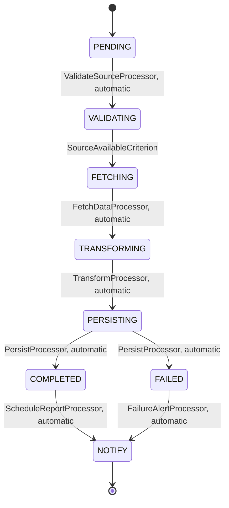
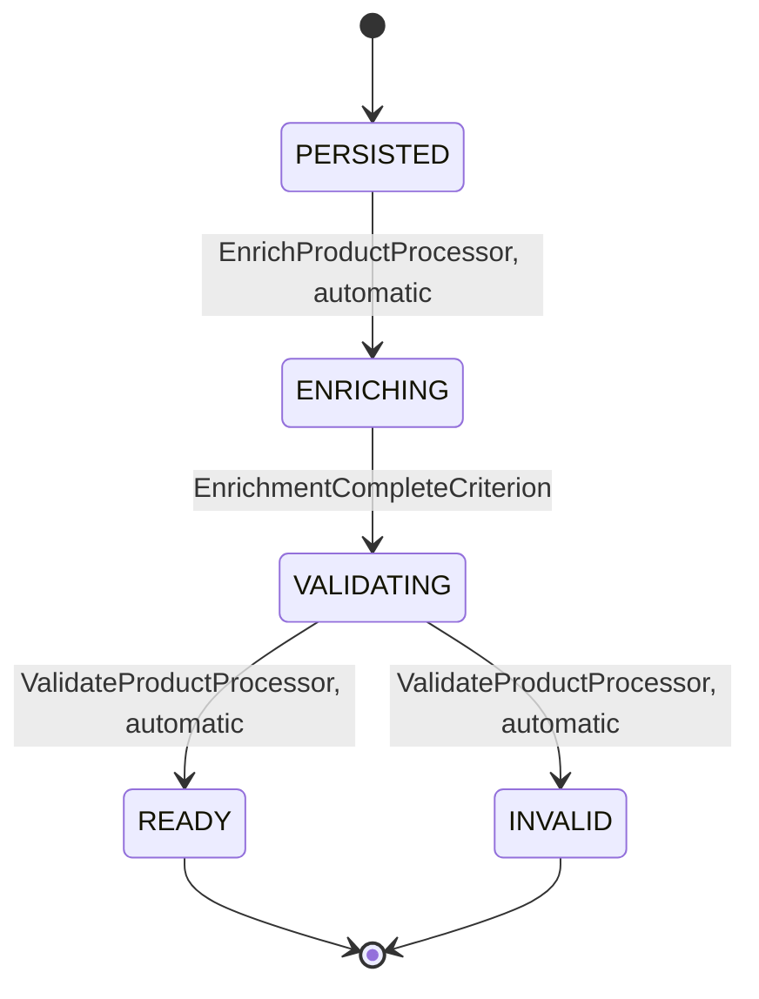
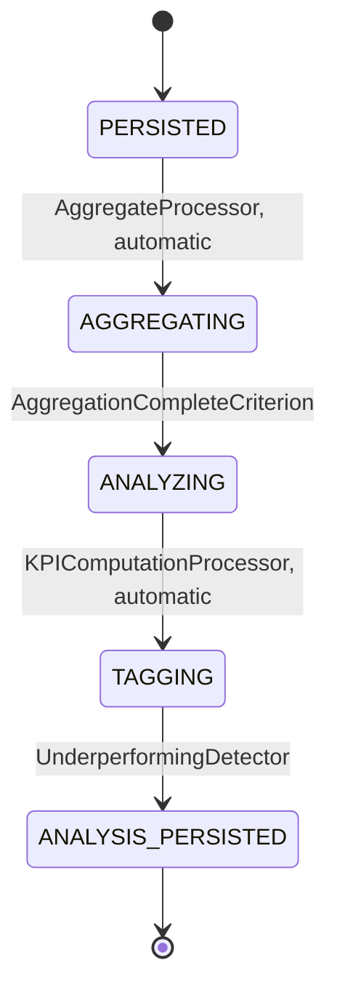
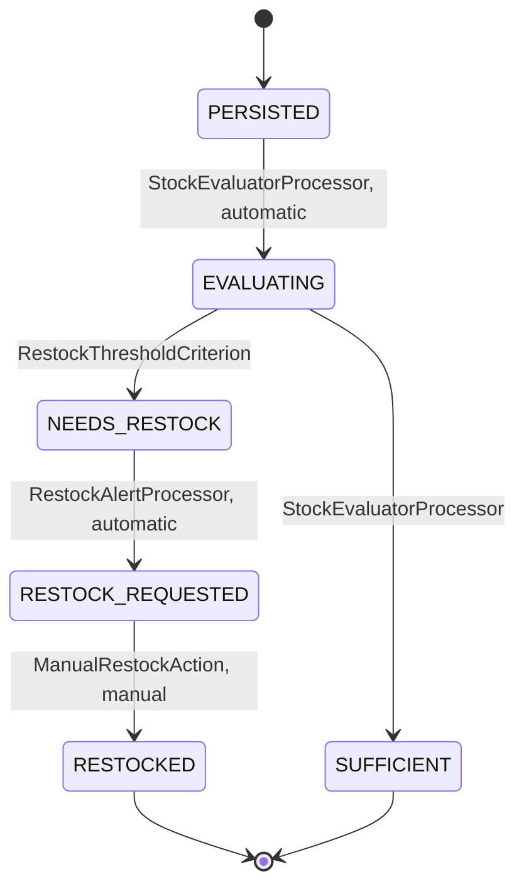
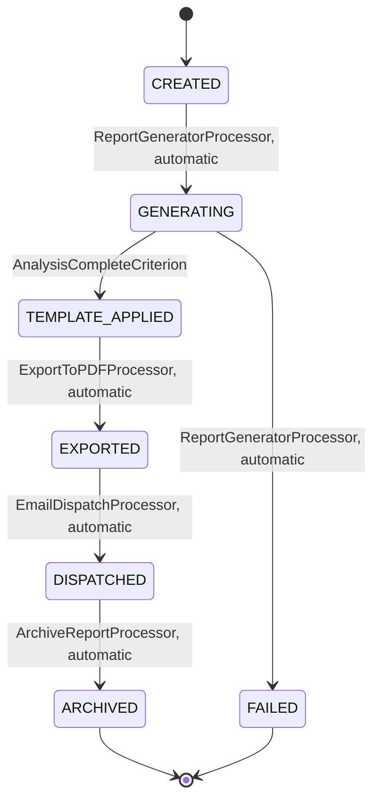

### 1. Entity Definitions
(Max 10 allowed — I use 5 relevant entities derived from your requirement)

```
IngestionJob:
- jobId: String (human id / name for job)
- scheduleCron: String (cron expression / weekly schedule)
- sourceUrl: String (Pet Store API base URL)
- dataFormats: String (comma separated: JSON, XML)
- lastRunAt: String (timestamp of last execution)
- status: String (PENDING / RUNNING / COMPLETED / FAILED)
- notifyEmail: String (e.g., victoria.sagdieva@cyoda.com)

Product:
- productId: String (product reference from API)
- name: String (product name)
- category: String (product category)
- price: Number (unit price)
- metadata: String (raw or enriched metadata)

SalesRecord:
- recordId: String (unique record id)
- productId: String (links to Product)
- dateSold: String (timestamp)
- quantity: Integer (units sold)
- revenue: Number (revenue for this record)
- rawSource: String (raw payload / format)

InventorySnapshot:
- snapshotId: String (unique id)
- productId: String
- snapshotAt: String (timestamp)
- stockLevel: Integer
- restockThreshold: Integer

WeeklyReport:
- reportId: String (business id)
- weekStart: String (date)
- generatedAt: String (timestamp)
- summary: String (short text)
- attachmentUrl: String (PDF or file store link)
- status: String (GENERATING / READY / FAILED)
```

---

### 2. Entity workflows

In all flows: persistence (POST of orchestration entity or process method result) triggers the workflow automatically.

IngestionJob workflow:
1. Initial State: PENDING when job entity persisted (event triggers workflow)
2. Validation: Check schedule and source availability (automatic)
3. Fetching: Call Pet Store API to retrieve product, sales, inventory data (automatic)
4. Transformation: Normalize JSON/XML into SalesRecord, Product, InventorySnapshot entities (automatic)
5. Persistence: Persist derived business entities and update job status (automatic)
6. Completion: Set job status to COMPLETED or FAILED, enqueue WeeklyReport generation if Monday run (automatic)
7. Notification: If configured, notify stakeholders on failure/success (automatic / manual ack possible)


```mermaid
stateDiagram-v2
    [*] --> PENDING
    PENDING --> VALIDATING : ValidateSourceProcessor, automatic
    VALIDATING --> FETCHING : SourceAvailableCriterion
    FETCHING --> TRANSFORMING : FetchDataProcessor, automatic
    TRANSFORMING --> PERSISTING : TransformProcessor, automatic
    PERSISTING --> COMPLETED : PersistProcessor, automatic
    PERSISTING --> FAILED : PersistProcessor, automatic
    COMPLETED --> NOTIFY : ScheduleReportProcessor, automatic
    NOTIFY --> [*]
    FAILED --> NOTIFY : FailureAlertProcessor, automatic
```

Processors: ValidateSourceProcessor, FetchDataProcessor, TransformProcessor, PersistProcessor, ScheduleReportProcessor  
Criteria: SourceAvailableCriterion, FetchSuccessCriterion

Product workflow:
1. Initial State: PERSISTED when Product persisted by ingestion
2. Enrichment: Enrich product with category, price normalization (automatic)
3. Validation: Validate required fields and price sanity (automatic)
4. Ready: Mark product as READY for analysis or mark INVALID (automatic/manual correction)


```mermaid
stateDiagram-v2
    [*] --> PERSISTED
    PERSISTED --> ENRICHING : EnrichProductProcessor, automatic
    ENRICHING --> VALIDATING : EnrichmentCompleteCriterion
    VALIDATING --> READY : ValidateProductProcessor, automatic
    VALIDATING --> INVALID : ValidateProductProcessor, automatic
    READY --> [*]
    INVALID --> [*]
```

Processors: EnrichProductProcessor, ValidateProductProcessor, IndexProductProcessor  
Criteria: EnrichmentCompleteCriterion, ProductValidCriterion

SalesRecord workflow:
1. Initial State: PERSISTED when sales record created by ingestion
2. Aggregation: Aggregate records by product/week/category (automatic)
3. KPI Analysis: Compute KPIs (sales volume, revenue, inventory turnover) (automatic)
4. Tagging: Tag product as UNDERPERFORMING or NORMAL (automatic)
5. Persist Analysis: Save aggregates and signals for reporting (automatic)


```mermaid
stateDiagram-v2
    [*] --> PERSISTED
    PERSISTED --> AGGREGATING : AggregateProcessor, automatic
    AGGREGATING --> ANALYZING : AggregationCompleteCriterion
    ANALYZING --> TAGGING : KPIComputationProcessor, automatic
    TAGGING --> ANALYSIS_PERSISTED : UnderperformingDetector
    ANALYSIS_PERSISTED --> [*]
```

Processors: AggregateProcessor, KPIComputationProcessor, UnderperformingDetector, PersistAnalysisProcessor  
Criteria: AggregationCompleteCriterion, SufficientDataCriterion

InventorySnapshot workflow:
1. Initial State: PERSISTED after ingestion
2. Evaluate Stock: Compute stock coverage and turnover (automatic)
3. Restock Decision: If below threshold mark NEEDS_RESTOCK (automatic)
4. Restock Request: Create manual restock request or automated alert (manual/automatic)
5. Reconciled: After restock event, mark RESTOCKED (manual)


```mermaid
stateDiagram-v2
    [*] --> PERSISTED
    PERSISTED --> EVALUATING : StockEvaluatorProcessor, automatic
    EVALUATING --> NEEDS_RESTOCK : RestockThresholdCriterion
    EVALUATING --> SUFFICIENT : StockEvaluatorProcessor
    NEEDS_RESTOCK --> RESTOCK_REQUESTED : RestockAlertProcessor, automatic
    RESTOCK_REQUESTED --> RESTOCKED : ManualRestockAction, manual
    RESTOCKED --> [*]
    SUFFICIENT --> [*]
```

Processors: StockEvaluatorProcessor, RestockAlertProcessor, ReconciliationProcessor  
Criteria: RestockThresholdCriterion

WeeklyReport workflow:
1. Initial State: CREATED (automatically created by IngestionJob scheduler or on-demand POST)
2. Generating: Collect aggregates, visuals, summaries (automatic)
3. Template Apply: Apply custom template (automatic)
4. Export: Produce PDF/attachment (automatic)
5. Dispatch: Email to victoria.sagdieva@cyoda.com and stakeholders (automatic)
6. Archive: Mark report ARCHIVED after retention window (automatic)


```mermaid
stateDiagram-v2
    [*] --> CREATED
    CREATED --> GENERATING : ReportGeneratorProcessor, automatic
    GENERATING --> TEMPLATE_APPLIED : AnalysisCompleteCriterion
    TEMPLATE_APPLIED --> EXPORTED : ExportToPDFProcessor, automatic
    EXPORTED --> DISPATCHED : EmailDispatchProcessor, automatic
    DISPATCHED --> ARCHIVED : ArchiveReportProcessor, automatic
    ARCHIVED --> [*]
    GENERATING --> FAILED : ReportGeneratorProcessor, automatic
    FAILED --> [*]
```

Processors: ReportGeneratorProcessor, TemplateApplierProcessor, ExportToPDFProcessor, EmailDispatchProcessor, ArchiveReportProcessor  
Criteria: AnalysisCompleteCriterion, TemplateAvailableCriterion

---

### 3. Pseudo code for processor classes (concise)

- ValidateSourceProcessor
```
process(job):
  if ping(job.sourceUrl) and scheduleValid(job.scheduleCron):
    return success
  else:
    mark job.status = FAILED
    publish FailureEvent(job)
```

- FetchDataProcessor
```
process(job):
  for endpoint in configured_endpoints:
    resp = httpGet(job.sourceUrl + endpoint, accept=job.dataFormats)
    if resp.ok:
      collect raw payloads
    else:
      record error
  if collected:
    emit RawDataPersistEvent(rawPayloads, jobId)
```

- TransformProcessor
```
process(rawPayloads):
  for payload in rawPayloads:
    if payload.type == sales:
      mapped = mapToSalesRecord(payload)
      persist(mapped)
    if payload.type == product:
      mapped = mapToProduct(payload)
      persist(mapped)
    if payload.type == inventory:
      mapped = mapToInventorySnapshot(payload)
      persist(mapped)
```

- AggregateProcessor
```
process(salesRecords):
  grouped = groupBy(productId, week)
  for group in grouped:
    compute totals, avg price
    persist AggregateEntity
  emit AggregationCompleteEvent(aggregateIds)
```

- KPIComputationProcessor
```
process(aggregates):
  for agg in aggregates:
    kpis = computeKPIs(agg)
    if kpis.turnover < threshold or kpis.salesVolume low:
      tag product UNDERPERFORMING
    persist kpis and tags
```

- ReportGeneratorProcessor
```
process(reportRequest):
  load aggregates for weekStart
  create summary text
  render charts for top/bottom products
  attach to report object
  set report.status = GENERATING
```

- ExportToPDFProcessor
```
process(report):
  render HTML using template
  convert HTML to PDF
  upload PDF to storage, set attachmentUrl
  set report.status = READY
```

- EmailDispatchProcessor
```
process(report):
  compose email body with summary
  attach attachmentUrl or inline visuals
  send to notify list (victoria.sagdieva@cyoda.com)
  set report.status = DISPATCHED
```

---

### 4. API Endpoints Design Rules & Request/Response formats

Rules applied:
- POST endpoints created only for orchestration entities (IngestionJob, WeeklyReport). POST returns only technicalId.
- GET endpoints provided to retrieve stored results. GET by technicalId for POST-created entities present.
- Business entities are created by ingestion workflow (no public POST).

1) Create Ingestion Job (schedules automatic Monday runs)
POST /api/jobs
Request:
```json
{
  "jobId": "weekly-petstore-ingest",
  "scheduleCron": "0 9 * * MON",
  "sourceUrl": "https://petstore.swagger.io",
  "dataFormats": "JSON,XML",
  "notifyEmail": "victoria.sagdieva@cyoda.com"
}
```
Response (must return only technicalId):
```json
{
  "technicalId": "job_614f2c9b"
}
```

GET job by technicalId:
GET /api/jobs/{technicalId}
Response:
```json
{
  "technicalId": "job_614f2c9b",
  "jobId": "weekly-petstore-ingest",
  "scheduleCron": "0 9 * * MON",
  "sourceUrl": "https://petstore.swagger.io",
  "lastRunAt": "2025-08-25T09:00:00Z",
  "status": "COMPLETED",
  "notifyEmail": "victoria.sagdieva@cyoda.com"
}
```

2) Create On-demand Weekly Report (optional orchestration)
POST /api/reports
Request:
```json
{
  "reportId": "weekly-summary-2025-W34",
  "weekStart": "2025-08-18",
  "template": "sales_summary_v1",
  "notifyEmail": "victoria.sagdieva@cyoda.com"
}
```
Response:
```json
{
  "technicalId": "report_9a0b1c2d"
}
```

GET report by technicalId:
GET /api/reports/{technicalId}
Response:
```json
{
  "technicalId": "report_9a0b1c2d",
  "reportId": "weekly-summary-2025-W34",
  "weekStart": "2025-08-18",
  "generatedAt": "2025-08-25T09:15:00Z",
  "status": "DISPATCHED",
  "attachmentUrl": "https://filestore/reports/report_9a0b1c2d.pdf",
  "summary": "Top seller: Dog Food X; 3 SKUs need restocking"
}
```

3) GET business entity results (read-only retrieval)
GET /api/products/{productId}
Response:
```json
{
  "productId": "p-123",
  "name": "Dog Food X",
  "category": "Food",
  "price": 12.99,
  "metadata": "{}"
}
```

GET /api/sales/{recordId}
Response:
```json
{
  "recordId": "s-20250825-01",
  "productId": "p-123",
  "dateSold": "2025-08-25T08:12:00Z",
  "quantity": 3,
  "revenue": 38.97
}
```

Notes / Business rules recap:
- Creating (POST) an orchestration entity triggers Cyoda workflows automatically.
- Business entities are created by processors in workflows — clients do not POST them directly.
- All POST responses return only technicalId.
- Weekly ingestion is scheduled via IngestionJob; IngestionJob will automatically create WeeklyReport after successful run on Mondays.

If you want, I can:
- Reduce/increase entities (max 10) or
- Provide additional criteria/processors names for any workflow, or
- Provide an optional GET by condition endpoint (e.g., fetch products needing restock). Which would you like next?