### NOTE
- You specified business entities and behaviors in your requirement. I considered the domain entities you implied. Total entities defined: 6 (<= 10). No additional entities beyond what is needed to represent the user requirement in an EDA style were added.

### 1. Entity Definitions
```
User:
- id: string (business unique id, e.g., email or UUID)
- name: string (display name)
- email: string (contact email)
- role: string (Admin or Customer)
- status: string (account status such as Active, Inactive, Pending)
- createdAt: string (ISO8601 timestamp)
- updatedAt: string (ISO8601 timestamp)

Product:
- sku: string (stock keeping unit, business unique id)
- name: string (product name)
- description: string (product description)
- price: number (unit price)
- currency: string (currency code)
- quantityAvailable: integer (inventory level)
- attributes: object (free-form map of attribute key -> value)
- importedAt: string (ISO8601 timestamp of import)

ShoppingCart:
- cartId: string (business unique id)
- customerId: string (references User.id)
- items: array (each item is { sku: string, quantity: integer, unitPrice: number })
- status: string (OPEN, CHECKOUT_INITIATED, CHECKED_OUT, ABANDONED)
- createdAt: string (ISO8601 timestamp)
- updatedAt: string (ISO8601 timestamp)
- expiresAt: string (ISO8601 timestamp when cart should be auto-abandoned)

Order:
- orderId: string (business unique id)
- customerId: string (references User.id)
- items: array (each item is { sku: string, quantity: integer, unitPrice: number })
- totalAmount: number
- currency: string
- status: string (CREATED, PAYMENT_PENDING, PAYMENT_FAILED, COMPLETED, CANCELLED)
- placedAt: string (ISO8601 timestamp)

ProductImportJob:
- jobId: string (business job id)
- sourceType: string (e.g., CSV, S3, API)
- sourceLocation: string (path or URL for import)
- initiatedBy: string (User.id)
- fileChecksum: string (optional checksum of import file)
- status: string (PENDING, VALIDATING, PROCESSING, COMPLETED, FAILED)
- createdAt: string (ISO8601 timestamp)
- completedAt: string (ISO8601 timestamp)

CheckoutJob:
- jobId: string (business job id)
- cartId: string (references ShoppingCart.cartId)
- customerId: string (references User.id)
- paymentMethod: object (e.g., {type: string, token: string, last4: string})
- status: string (PENDING, VALIDATING, RESERVING_INVENTORY, PROCESSING_PAYMENT, COMPLETED, FAILED)
- createdAt: string (ISO8601 timestamp)
- completedAt: string (ISO8601 timestamp)
```

---

### 2. Entity workflows

ProductImportJob workflow:
1. Initial State: Job created with PENDING status (trigger: POST /jobs/product-import)
2. Validation: Validate sourceType, sourceLocation, checksum and access (automatic)
3. Fetch/Transform: Fetch import payload, transform rows into Product domain model (automatic)
4. Persist Products: Persist Product entities for each valid row (automatic)
5. Post-Import Processing: Update inventory totals, set importedAt on Products (automatic)
6. Completion: Mark job COMPLETED or FAILED
7. Notification: Notify initiatedBy (Admin) about results (automatic)

Mermaid state diagram for ProductImportJob:
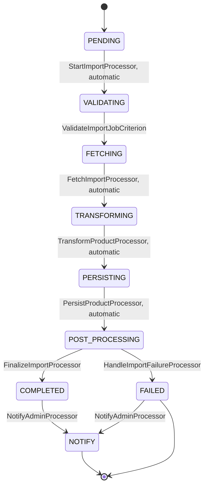
```mermaid
stateDiagram-v2
    [*] --> PENDING
    PENDING --> VALIDATING : StartImportProcessor, automatic
    VALIDATING --> FETCHING : ValidateImportJobCriterion
    FETCHING --> TRANSFORMING : FetchImportProcessor, automatic
    TRANSFORMING --> PERSISTING : TransformProductProcessor, automatic
    PERSISTING --> POST_PROCESSING : PersistProductProcessor, automatic
    POST_PROCESSING --> COMPLETED : FinalizeImportProcessor
    POST_PROCESSING --> FAILED : HandleImportFailureProcessor
    COMPLETED --> NOTIFY : NotifyAdminProcessor
    NOTIFY --> [*]
    FAILED --> NOTIFY : NotifyAdminProcessor
    FAILED --> [*]
```

Required criteria and processors (ProductImportJob):
- Criteria:
  - ValidateImportJobCriterion (checks source availability, checksum)
  - ImportRowsValidityCriterion (checks each row fields)
- Processors:
  - StartImportProcessor (entrypoint)
  - FetchImportProcessor (reads CSV/S3/API)
  - TransformProductProcessor (maps payload row -> Product object)
  - PersistProductProcessor (persists Product entities)
  - FinalizeImportProcessor (tallies results)
  - HandleImportFailureProcessor (aggregates errors)
  - NotifyAdminProcessor (sends summary to initiatedBy)
  
ProductImport processors pseudo responsibilities (detailed pseudo code in section 3).

---

User workflow:
1. Initial State: User persisted with status = Pending (POST /users triggers event)
2. Validation: Validate email uniqueness and required fields (automatic)
3. Activation: If Admin-created or validated, set status = Active (manual or automatic depending on policy)
4. Suspension/Deactivation: Admin can manually change status to Inactive or Suspended (manual)
5. Deletion/Archived: Admin can archive users (manual)

Mermaid state diagram for User:
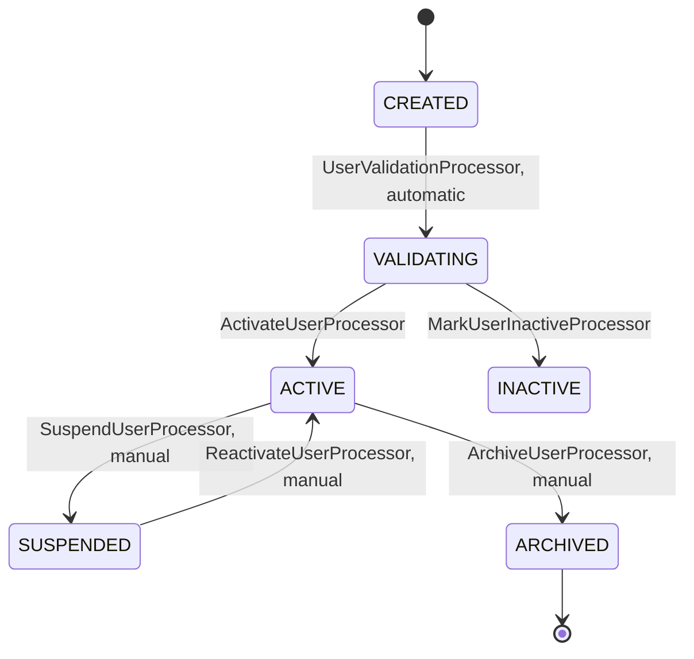
```mermaid
stateDiagram-v2
    [*] --> CREATED
    CREATED --> VALIDATING : UserValidationProcessor, automatic
    VALIDATING --> ACTIVE : ActivateUserProcessor
    VALIDATING --> INACTIVE : MarkUserInactiveProcessor
    ACTIVE --> SUSPENDED : SuspendUserProcessor, manual
    SUSPENDED --> ACTIVE : ReactivateUserProcessor, manual
    ACTIVE --> ARCHIVED : ArchiveUserProcessor, manual
    ARCHIVED --> [*]
```

Required criteria and processors (User):
- Criteria:
  - UniqueEmailCriterion
  - PasswordPolicyCriterion (if password creation included)
- Processors:
  - UserValidationProcessor (checks uniqueness and data integrity)
  - ActivateUserProcessor (finalizes activation)
  - SuspendUserProcessor (manual state transition)
  - ArchiveUserProcessor (manual state transition)
  - NotifyUserProcessor (welcome email)

---

ShoppingCart workflow:
1. Initial State: ShoppingCart created with status = OPEN (POST /shoppingcarts triggers event)
2. Item updates: Items added/removed/quantity changed (manual actions by customer)
3. Expiration check: If cart is idle until expiresAt, transition to ABANDONED (automatic)
4. Checkout initiated: When customer requests checkout, create CheckoutJob → cart status becomes CHECKOUT_INITIATED (manual to create job)
5. Checkout in progress: Reserve inventory and process payment (automatic via CheckoutJob)
6. Checked out: On successful checkout, cart moves to CHECKED_OUT and an Order is created (automatic)
7. Abandoned: If reservation/payment fails or timeout, cart may be ABANDONED (automatic/manual)

Mermaid state diagram for ShoppingCart:
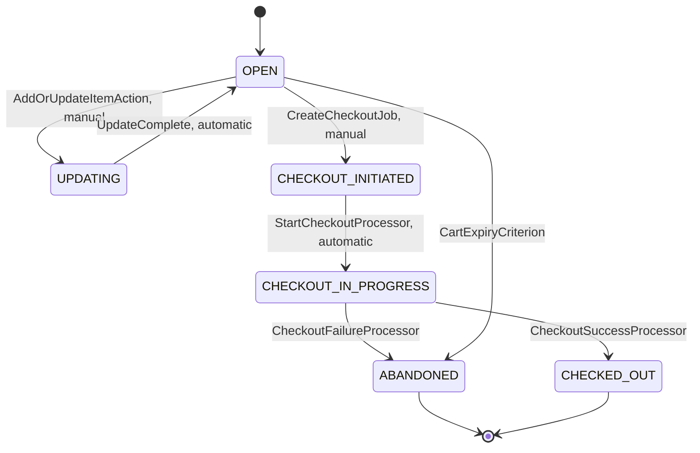
```mermaid
stateDiagram-v2
    [*] --> OPEN
    OPEN --> UPDATING : AddOrUpdateItemAction, manual
    UPDATING --> OPEN : UpdateComplete, automatic
    OPEN --> CHECKOUT_INITIATED : CreateCheckoutJob, manual
    CHECKOUT_INITIATED --> CHECKOUT_IN_PROGRESS : StartCheckoutProcessor, automatic
    CHECKOUT_IN_PROGRESS --> CHECKED_OUT : CheckoutSuccessProcessor
    CHECKOUT_IN_PROGRESS --> ABANDONED : CheckoutFailureProcessor
    OPEN --> ABANDONED : CartExpiryCriterion
    ABANDONED --> [*]
    CHECKED_OUT --> [*]
```

Required criteria and processors (ShoppingCart):
- Criteria:
  - CartExpirationCriterion (checks expiresAt)
  - CartNotEmptyCriterion (ensures at least one item before checkout)
- Processors:
  - AddOrUpdateItemProcessor (handles item mutations)
  - StartCheckoutProcessor (creates CheckoutJob or forwards to Checkout workflow)
  - ReserveInventoryProcessor (attempts to reserve inventory)
  - ReleaseReservationProcessor (on failure)
  - CartExpirationProcessor (marks cart abandoned)
  - NotifyCustomerProcessor (cart reminders or confirmations)

---

Order workflow:
1. Initial State: Order created with status = CREATED (generated by CheckoutJob)
2. Payment: PAYMENT_PENDING → PROCESSING_PAYMENT (automatic)
3. Payment result: PAYMENT_SUCCESS → COMPLETED, or PAYMENT_FAILED → CANCELLED/FAIL
4. Fulfillment: On COMPLETED, downstream fulfillment/shipping flows may start (out of scope but triggered) 
5. Notification: Notify customer and update order history (automatic)

Mermaid state diagram for Order:
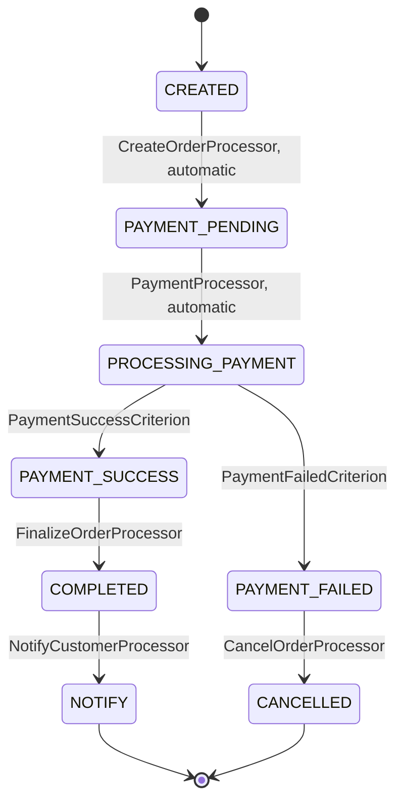
```mermaid
stateDiagram-v2
    [*] --> CREATED
    CREATED --> PAYMENT_PENDING : CreateOrderProcessor, automatic
    PAYMENT_PENDING --> PROCESSING_PAYMENT : PaymentProcessor, automatic
    PROCESSING_PAYMENT --> PAYMENT_SUCCESS : PaymentSuccessCriterion
    PROCESSING_PAYMENT --> PAYMENT_FAILED : PaymentFailedCriterion
    PAYMENT_SUCCESS --> COMPLETED : FinalizeOrderProcessor
    PAYMENT_FAILED --> CANCELLED : CancelOrderProcessor
    COMPLETED --> NOTIFY : NotifyCustomerProcessor
    NOTIFY --> [*]
    CANCELLED --> [*]
```

Required criteria and processors (Order):
- Criteria:
  - PaymentSuccessCriterion (verifies payment gateway response)
  - InventoryDeductionCriterion (ensures inventory deduction succeeded)
- Processors:
  - CreateOrderProcessor (builds Order from cart)
  - PaymentProcessor (calls payment gateway)
  - FinalizeOrderProcessor (marks order completed and persists)
  - CancelOrderProcessor (reverts reservations)
  - NotifyCustomerProcessor (email/SMS)

---

CheckoutJob workflow:
1. Initial State: CheckoutJob created with PENDING status (POST /jobs/checkout)
2. Validate Cart: Confirm cart exists and CartNotEmptyCriterion (automatic)
3. Reserve Inventory: Reserve items in inventory (automatic)
4. Process Payment: Charge payment method (automatic)
5. Finalize: On success create Order and mark job COMPLETED; on failure mark FAILED and release reservations
6. Notify: Send confirmation or failure notification to customer (automatic)

Mermaid state diagram for CheckoutJob:
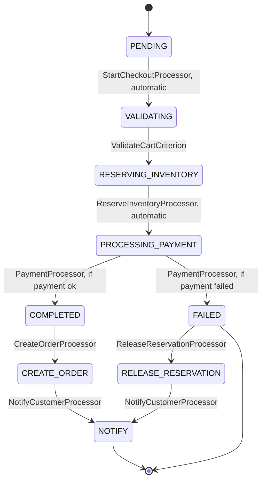
```mermaid
stateDiagram-v2
    [*] --> PENDING
    PENDING --> VALIDATING : StartCheckoutProcessor, automatic
    VALIDATING --> RESERVING_INVENTORY : ValidateCartCriterion
    RESERVING_INVENTORY --> PROCESSING_PAYMENT : ReserveInventoryProcessor, automatic
    PROCESSING_PAYMENT --> COMPLETED : PaymentProcessor, if payment ok
    PROCESSING_PAYMENT --> FAILED : PaymentProcessor, if payment failed
    COMPLETED --> CREATE_ORDER : CreateOrderProcessor
    CREATE_ORDER --> NOTIFY : NotifyCustomerProcessor
    NOTIFY --> [*]
    FAILED --> RELEASE_RESERVATION : ReleaseReservationProcessor
    RELEASE_RESERVATION --> NOTIFY : NotifyCustomerProcessor
    FAILED --> [*]
```

Required criteria and processors (CheckoutJob):
- Criteria:
  - ValidateCartCriterion (cart exists, not expired, has items)
  - InventoryAvailableCriterion (pre-check before reservation)
- Processors:
  - StartCheckoutProcessor
  - ReserveInventoryProcessor
  - PaymentProcessor
  - CreateOrderProcessor
  - ReleaseReservationProcessor
  - NotifyCustomerProcessor

---

### 3. Pseudo code for processor classes

Note: pseudo-code is high level; these processors are invoked by the EDA process method when entity persistence triggers the workflow.

ProductImport processors (pseudo):
- StartImportProcessor
```
class StartImportProcessor {
  void process(ProductImportJob job) {
    // mark job as VALIDATING
    job.status = 'VALIDATING'
    persist(job)
    // trigger next step automatically via EDA
  }
}
```

- FetchImportProcessor
```
class FetchImportProcessor {
  List<Row> process(ProductImportJob job) {
    // depending on sourceType: read CSV from sourceLocation, or call API, or read S3
    // return list of rows
  }
}
```

- TransformProductProcessor
```
class TransformProductProcessor {
  List<Product> process(List<Row> rows) {
    // map rows to Product objects, validate field types
    // raise ImportRowsValidityCriterion violations for bad rows
  }
}
```

- PersistProductProcessor
```
class PersistProductProcessor {
  void process(List<Product> products, ProductImportJob job) {
    // for each product:
    // - upsert Product by sku
    // - set importedAt = now
    // - update quantityAvailable if provided
    // persist in DB
    // collect success/failure counts in job metadata
  }
}
```

- FinalizeImportProcessor
```
class FinalizeImportProcessor {
  void process(ProductImportJob job) {
    // set job.status = COMPLETED if no fatal errors else FAILED
    // set completedAt
    // persist job
  }
}
```

- NotifyAdminProcessor
```
class NotifyAdminProcessor {
  void process(ProductImportJob job) {
    // send summary email/notification to job.initiatedBy with counts, errors
  }
}
```

User processors (pseudo):
- UserValidationProcessor
```
class UserValidationProcessor {
  void process(User user) {
    // check UniqueEmailCriterion
    // if passes: user.status = 'Active' or 'Pending' based on policy
    // persist user
    // NotifyUserProcessor if Active
  }
}
```

ShoppingCart processors (pseudo):
- AddOrUpdateItemProcessor
```
class AddOrUpdateItemProcessor {
  void process(ShoppingCart cart, ItemChange change) {
    // apply change: add or update quantity
    // recalc totals if needed
    // set cart.updatedAt = now
    // persist cart
  }
}
```

- StartCheckoutProcessor
```
class StartCheckoutProcessor {
  void process(ShoppingCart cart) {
    // create CheckoutJob with cartId and customerId
    // set cart.status = 'CHECKOUT_INITIATED'
    // persist both entities (CheckoutJob triggers Checkout workflow)
  }
}
```

Checkout processors (pseudo):
- ReserveInventoryProcessor
```
class ReserveInventoryProcessor {
  boolean process(CheckoutJob job) {
    // for each item in cart:
    // call inventory service to reserve quantity
    // if any reservation fails: return false
    // else return true
  }
}
```

- PaymentProcessor
```
class PaymentProcessor {
  PaymentResult process(CheckoutJob job) {
    // call payment gateway with job.paymentMethod and total
    // return success/failure and transaction id
  }
}
```

- CreateOrderProcessor
```
class CreateOrderProcessor {
  void process(CheckoutJob job, PaymentResult payment) {
    // build Order from cart
    // set order.status = COMPLETED if payment success
    // persist Order
    // update inventory permanently (deduct reserved)
  }
}
```

- ReleaseReservationProcessor
```
class ReleaseReservationProcessor {
  void process(CheckoutJob job) {
    // release reserved inventory for items on the cart
  }
}
```

Notification processors:
```
class NotifyCustomerProcessor {
  void process(entityRef) {
    // send email/SMS based on entity (order confirmation, cart abandoned, import result)
  }
}
```

Criterion examples (pseudo):
- UniqueEmailCriterion
```
class UniqueEmailCriterion {
  boolean evaluate(User user) {
    // query DB: return not exists user.email
  }
}
```

- CartExpirationCriterion
```
class CartExpirationCriterion {
  boolean evaluate(ShoppingCart cart) {
    return now() > cart.expiresAt
  }
}
```

---

### 4. API Endpoints Design Rules

General rules applied:
- POST endpoints: create entity and trigger workflows (events). A POST that adds an entity returns only entity technicalId (datastore-imitation field).
- GET endpoints: only for retrieving stored application results.
- GET by technicalId: present for all entities created via POST endpoints.
- Business rule: External data sources/processing → POST endpoints (orchestration jobs).
- Orchestration entities (ProductImportJob, CheckoutJob) have POST and GET by technicalId.
- POST endpoints for business entities included where user actions create them: Users and ShoppingCarts.

Endpoints list with Request/Response JSON structures and visualized request/response mermaid diagrams.

1) POST /jobs/product-import
- Purpose: Create a ProductImportJob to import products (triggers ProductImportJob workflow).
- Request JSON:
```
{
  "sourceType": "CSV|S3|API",
  "sourceLocation": "string",
  "initiatedBy": "User.id",
  "fileChecksum": "string (optional)"
}
```
- Response JSON (POST must return only technicalId):
```
{
  "technicalId": "string"
}
```
- GET /jobs/product-import/{technicalId}
  - Response JSON: full ProductImportJob entity with fields listed in Entity Definitions.

Mermaid visualization of request/response for POST /jobs/product-import:
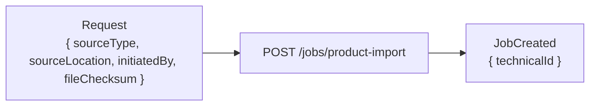
```mermaid
flowchart LR
    RequestNode["Request<br>{ sourceType, sourceLocation, initiatedBy, fileChecksum }"]
    API["POST /jobs/product-import"]
    JobCreated["JobCreated<br>{ technicalId }"]
    RequestNode --> API
    API --> JobCreated
```

Mermaid visualization of GET response:
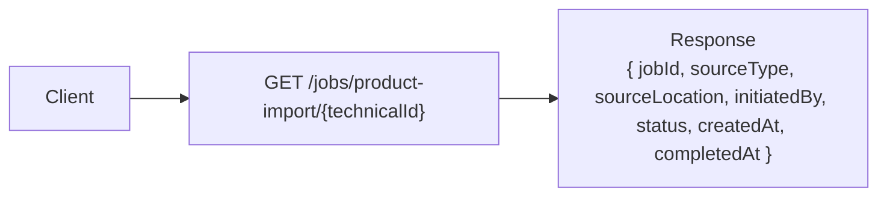
```mermaid
flowchart LR
    Client["Client"]
    APIGet["GET /jobs/product-import/{technicalId}"]
    JobEntity["Response<br>{ jobId, sourceType, sourceLocation, initiatedBy, status, createdAt, completedAt }"]
    Client --> APIGet
    APIGet --> JobEntity
```

2) POST /users
- Purpose: Create a User (Admin or Customer). Persistence triggers User workflow (validation/activation).
- Request JSON:
```
{
  "id": "string (business id, optional client-provided)",
  "name": "string",
  "email": "string",
  "role": "Admin|Customer"
}
```
- Response JSON:
```
{
  "technicalId": "string"
}
```
- GET /users/{technicalId}
  - Response JSON: full User entity with fields defined earlier.

Mermaid visualization for POST /users:
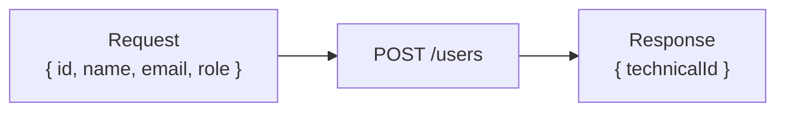
```mermaid
flowchart LR
    RequestUser["Request<br>{ id, name, email, role }"]
    APIUser["POST /users"]
    UserCreated["Response<br>{ technicalId }"]
    RequestUser --> APIUser
    APIUser --> UserCreated
```

GET /users/{technicalId} visualization:
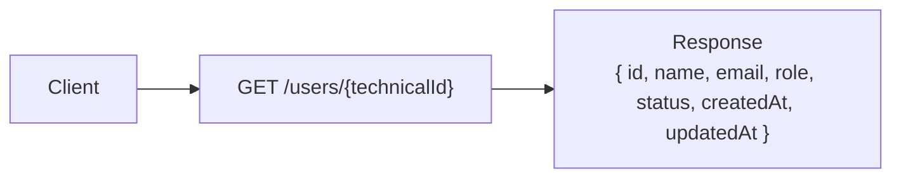
```mermaid
flowchart LR
    ClientUser["Client"]
    APIGetUser["GET /users/{technicalId}"]
    UserEntity["Response<br>{ id, name, email, role, status, createdAt, updatedAt }"]
    ClientUser --> APIGetUser
    APIGetUser --> UserEntity
```

3) POST /shoppingcarts
- Purpose: Create a ShoppingCart for a Customer (triggers ShoppingCart workflow).
- Request JSON:
```
{
  "customerId": "User.id",
  "items": [
    { "sku": "string", "quantity": integer, "unitPrice": number }
  ],
  "expiresAt": "ISO8601 timestamp (optional)"
}
```
- Response JSON:
```
{
  "technicalId": "string"
}
```
- GET /shoppingcarts/{technicalId}
  - Response JSON: full ShoppingCart entity.

Mermaid visualization for POST /shoppingcarts:
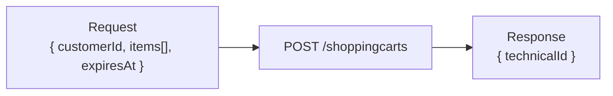
```mermaid
flowchart LR
    ReqCart["Request<br>{ customerId, items[], expiresAt }"]
    APICart["POST /shoppingcarts"]
    CartCreated["Response<br>{ technicalId }"]
    ReqCart --> APICart
    APICart --> CartCreated
```

GET /shoppingcarts/{technicalId} visualization:
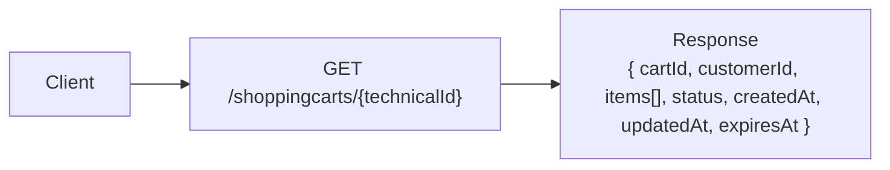
```mermaid
flowchart LR
    ClientCart["Client"]
    APIGetCart["GET /shoppingcarts/{technicalId}"]
    CartEntity["Response<br>{ cartId, customerId, items[], status, createdAt, updatedAt, expiresAt }"]
    ClientCart --> APIGetCart
    APIGetCart --> CartEntity
```

4) POST /jobs/checkout
- Purpose: Start checkout for a cart (creates CheckoutJob and triggers Checkout workflow).
- Request JSON:
```
{
  "cartId": "ShoppingCart.cartId",
  "customerId": "User.id",
  "paymentMethod": { "type": "string", "token": "string", "last4": "string" }
}
```
- Response JSON:
```
{
  "technicalId": "string"
}
```
- GET /jobs/checkout/{technicalId}
  - Response JSON: full CheckoutJob entity with status and timestamps.

Mermaid visualization for POST /jobs/checkout:
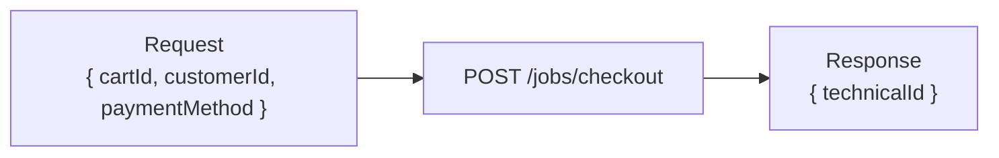
```mermaid
flowchart LR
    ReqCheckout["Request<br>{ cartId, customerId, paymentMethod }"]
    APICheckout["POST /jobs/checkout"]
    CheckoutCreated["Response<br>{ technicalId }"]
    ReqCheckout --> APICheckout
    APICheckout --> CheckoutCreated
```

GET /jobs/checkout/{technicalId} visualization:
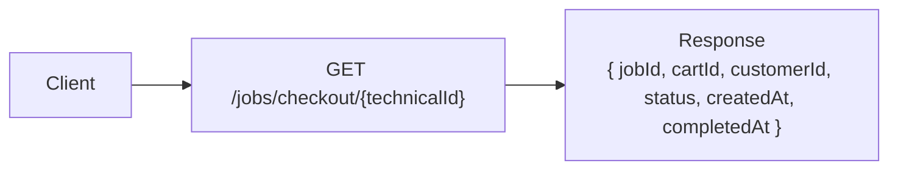
```mermaid
flowchart LR
    ClientCheckout["Client"]
    APIGetCheckout["GET /jobs/checkout/{technicalId}"]
    CheckoutEntity["Response<br>{ jobId, cartId, customerId, status, createdAt, completedAt }"]
    ClientCheckout --> APIGetCheckout
    APIGetCheckout --> CheckoutEntity
```

5) GET endpoints for Orders and Products (retrieval only)
- GET /orders/{orderId}
  - Response JSON: Order entity.
- GET /products/{sku}
  - Response JSON: Product entity.
- GET /products (optional) for listing all products (optional endpoint).

Mermaid visualization for GET /orders/{orderId}:
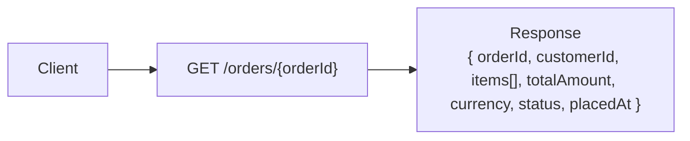
```mermaid
flowchart LR
    ClientOrder["Client"]
    APIGetOrder["GET /orders/{orderId}"]
    OrderEntity["Response<br>{ orderId, customerId, items[], totalAmount, currency, status, placedAt }"]
    ClientOrder --> APIGetOrder
    APIGetOrder --> OrderEntity
```

Mermaid visualization for GET /products/{sku}:
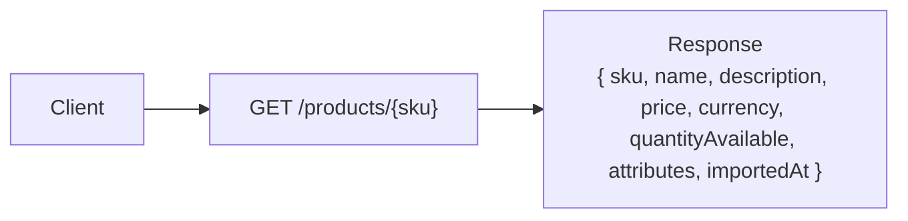
```mermaid
flowchart LR
    ClientProd["Client"]
    APIGetProd["GET /products/{sku}"]
    ProductEntity["Response<br>{ sku, name, description, price, currency, quantityAvailable, attributes, importedAt }"]
    ClientProd --> APIGetProd
    APIGetProd --> ProductEntity
```

Notes on responses:
- POST responses must return only { "technicalId": "..." }.
- GET responses return the persisted entity fields exactly as defined in Section 1.
- There are no POST endpoints that return full entities directly. All POSTs that create entities return only technicalId, consistent with EDA pattern that creation triggers asynchronous processing.

---

If you want, next steps I can provide:
- Concrete Java class/interface names for each Criterion and Processor (with package naming).
- OpenAPI specification snippets for the endpoints.
- Example sequences showing EDA message flow between components (event bus, processors, datastore).