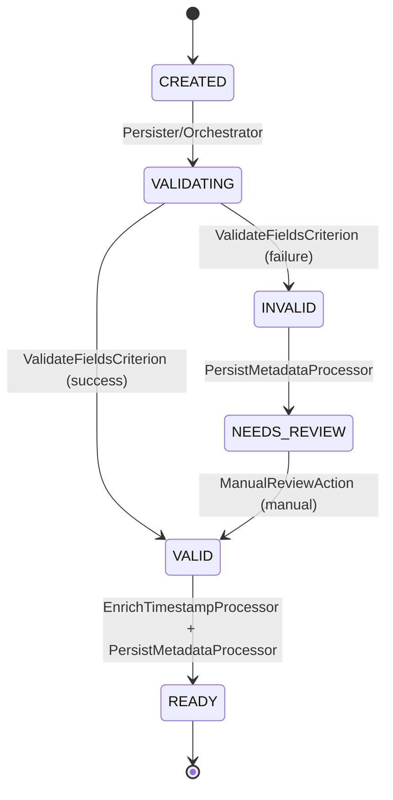
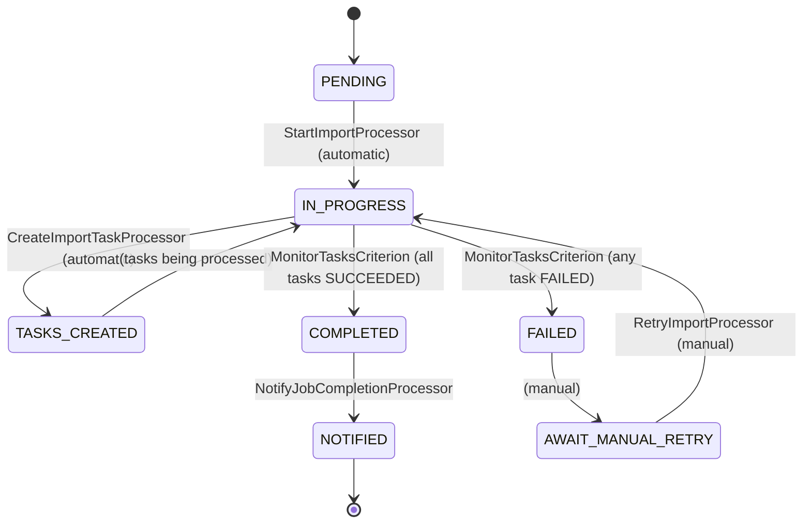
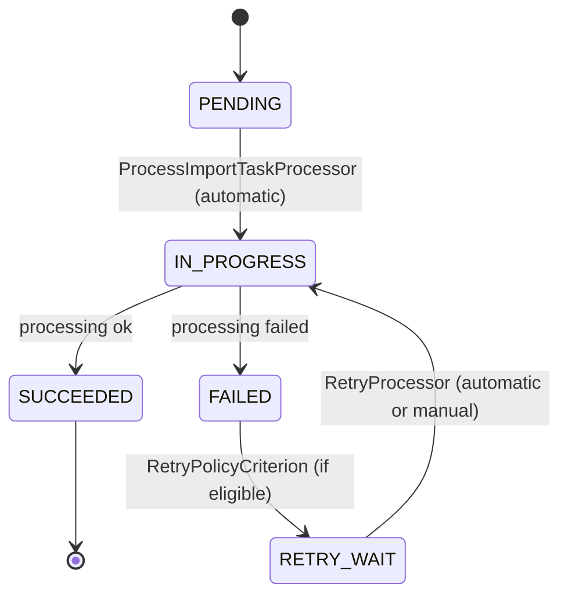

# Functional Requirements

This document describes the entities, workflows, processors/criteria, and HTTP API for importing Hacker News (HN) items into the system. It has been reviewed and updated so the logic is consistent across entity definitions, state machines, processors, and API behaviour.

---

## 1. Entity Definitions

### HNItem
- id: Long
  - Business identifier from the Hacker News Firebase API JSON (the `id` field in the original JSON).
- type: String
  - Item type from the Firebase HN API JSON (the `type` field in the original JSON).
- originalJson: JSON
  - The complete original JSON object returned by the Firebase HN API; stored verbatim and never mutated.
- importTimestamp: String
  - ISO-8601 UTC timestamp when the importer first processed/observed the item. Stored separately from `originalJson`.
- state: String (enumeration)
  - One of: CREATED, VALIDATING, VALID, INVALID, READY, NEEDS_REVIEW
  - Note: The validation step will determine VALID or INVALID; additional states express lifecycle stages and readiness for downstream consumers.
- createdAt: String
  - ISO-8601 UTC timestamp when the HNItem record was first persisted in the datastore.
- updatedAt: String
  - ISO-8601 UTC timestamp when the HNItem record was last updated.

### ImportJob
- technicalId: String
  - Datastore / orchestration-specific identifier returned by POST /import-jobs. Unique for the job.
- jobType: String
  - Type of import job, e.g., `single_item_import`, `batch_import`.
- payload: JSON
  - The original request payload for the job. For `single_item_import` this is a single Firebase HN API item JSON; for `batch_import` this is an array of such items.
- status: String (enumeration)
  - One of: PENDING, IN_PROGRESS, TASKS_CREATED, COMPLETED, FAILED, AWAIT_MANUAL_RETRY, NOTIFIED
  - Note: TASKS_CREATED and NOTIFIED are intermediate/optional states used by the orchestration machinery. API clients only need to rely on the canonical states (PENDING, IN_PROGRESS, COMPLETED, FAILED) but the system will track the intermediate states for observability.
- errorMessage: String (nullable)
  - Optional description when job ends in FAILED.
- createdAt: String
  - ISO-8601 UTC timestamp when job record created.
- startedAt: String (nullable)
  - ISO-8601 UTC timestamp when processing started (when status moved to IN_PROGRESS).
- finishedAt: String (nullable)
  - ISO-8601 UTC timestamp when processing finished (COMPLETED or FAILED).

### ImportTask
- technicalId: String
  - Datastore / orchestration-specific identifier returned by the system when the task was created.
- jobTechnicalId: String
  - Reference to ImportJob.technicalId (which job this task belongs to).
- attemptNumber: Integer
  - 1-based attempt counter for the task.
- attemptedAt: String (nullable)
  - ISO-8601 UTC timestamp for the last attempt.
- result: JSON (nullable)
  - Result details, e.g., `{ "persistedId": 12345 }` or `{ "error": "..." }`.
- status: String (enumeration)
  - One of: PENDING, IN_PROGRESS, SUCCEEDED, FAILED, RETRY_WAIT

---

## 2. Entity Workflows and State Machines

### HNItem workflow (summary)
1. Creation: When a new HN item is created by the processing pipeline it is persisted with state = CREATED and `importTimestamp` (if available) set by the importer.
2. Validation: The system runs a validation step that ensures required fields are present in `originalJson` (at minimum `id` and `type`). While validation is running the state may be set to VALIDATING.
3. Mark State:
   - If validation succeeds → state becomes VALID.
   - If validation fails → state becomes INVALID.
4. Persist Metadata: Ensure `importTimestamp`, `createdAt`, `updatedAt` are persisted separately from `originalJson`.
5. Post-processing:
   - If VALID: item moves to READY (ready for downstream consumption) and the system MAY emit an `ItemImported` event.
   - If INVALID: item moves to NEEDS_REVIEW and the system MAY push the item to a manual review queue / notify operators.
6. Manual Corrections: Items in NEEDS_REVIEW can be manually corrected and moved back to VALID via a manual review action. When corrected and marked VALID the usual Persist and READY transitions apply.

The lifecycle states used by the system are: CREATED -> VALIDATING -> (VALID -> READY) or (INVALID -> NEEDS_REVIEW).

HNItem state diagram

```mermaid
stateDiagram-v2
    [*] --> CREATED
    CREATED --> VALIDATING : Persister/Orchestrator
    VALIDATING --> VALID : ValidateFieldsCriterion (success)
    VALIDATING --> INVALID : ValidateFieldsCriterion (failure)
    VALID --> READY : EnrichTimestampProcessor + PersistMetadataProcessor
    INVALID --> NEEDS_REVIEW : PersistMetadataProcessor
    NEEDS_REVIEW --> VALID : ManualReviewAction (manual)
    READY --> [*]
```

Notes:
- `CREATED` and `VALIDATING` are transient states representing ingestion and validation phases.
- `READY` indicates item has been fully processed and is available to downstream consumers.
- `NEEDS_REVIEW` indicates item failed automated validation and is expected to be reviewed manually.

### ImportJob workflow (summary)
1. Creation: Client POSTs to `/import-jobs` with the job payload. The system persists an ImportJob with status = PENDING and returns only `technicalId` in the POST response.
2. Start: The orchestrator automatically picks up PENDING jobs and transitions them to IN_PROGRESS (sets `startedAt`) and triggers task creation.
3. Task creation: For each item in the job payload the system creates an ImportTask with status = PENDING (job may enter TASKS_CREATED transient state).
4. Execution: Worker processes ImportTasks (see ImportTask workflow). The orchestrator monitors tasks and aggregates results.
5. Completion: When all tasks have reached a final state, the job transitions to COMPLETED if all tasks SUCCEEDED or to FAILED if any task FAILED (the system records `finishedAt` and optional `errorMessage`).
6. Notification: The system may emit a `JobCompleted` event and/or transition to NOTIFIED for observability. Manual retry is possible via a retry endpoint which will transition AWAIT_MANUAL_RETRY -> IN_PROGRESS.

ImportJob state diagram

```mermaid
stateDiagram-v2
    [*] --> PENDING
    PENDING --> IN_PROGRESS : StartImportProcessor (automatic)
    IN_PROGRESS --> TASKS_CREATED : CreateImportTaskProcessor (automatic)
    TASKS_CREATED --> IN_PROGRESS : (tasks being processed)
    IN_PROGRESS --> COMPLETED : MonitorTasksCriterion (all tasks SUCCEEDED)
    IN_PROGRESS --> FAILED : MonitorTasksCriterion (any task FAILED)
    COMPLETED --> NOTIFIED : NotifyJobCompletionProcessor
    FAILED --> AWAIT_MANUAL_RETRY : (manual)
    AWAIT_MANUAL_RETRY --> IN_PROGRESS : RetryImportProcessor (manual)
    NOTIFIED --> [*]
```

Notes:
- API clients should primarily observe PENDING, IN_PROGRESS, COMPLETED, FAILED. Other states are internal bookkeeping states.

### ImportTask workflow (summary)
1. Creation: Created by CreateImportTaskProcessor with status = PENDING and attemptNumber = 0.
2. Execution: ProcessImportTaskProcessor sets status = IN_PROGRESS and increments attemptNumber.
3. Result:
   - SUCCEEDED: task completed and result contains persisted HNItem id.
   - FAILED: task failed and result contains error details.
4. Retry: If a retry policy allows it, the task can enter RETRY_WAIT and be re-queued; on retry the attemptNumber is incremented.
5. Finalization: A TaskFinishedEvent is published when a task reaches SUCCEEDED or a terminal FAILED (if retries exhausted).

ImportTask state diagram

```mermaid
stateDiagram-v2
    [*] --> PENDING
    PENDING --> IN_PROGRESS : ProcessImportTaskProcessor (automatic)
    IN_PROGRESS --> SUCCEEDED : processing ok
    IN_PROGRESS --> FAILED : processing failed
    FAILED --> RETRY_WAIT : RetryPolicyCriterion (if eligible)
    RETRY_WAIT --> IN_PROGRESS : RetryProcessor (automatic or manual)
    SUCCEEDED --> [*]
```

---

## 3. Processors and Criteria (Responsibilities and pseudocode)

The system is organized as small, testable processors and criteria. Each processor is responsible for a single concern.

### ValidateFieldsCriterion
- Responsibility: Inspect `originalJson` and verify presence of required fields. Current minimum required fields: `id`, `type`.
- Pseudocode:
  - boolean evaluate(JsonNode originalJson) {
      return originalJson != null && originalJson.has("id") && originalJson.has("type");
    }

### EnrichTimestampProcessor
- Responsibility: Ensure `importTimestamp`, `createdAt`, and `updatedAt` exist and are set to the current UTC ISO-8601 timestamp when appropriate.
- Pseudocode:
  - void process(HNItem item) {
      String ts = Instant.now().toString();
      if (item.importTimestamp == null) item.importTimestamp = ts;
      if (item.createdAt == null) item.createdAt = ts;
      item.updatedAt = ts;
    }

### PersistItemProcessor (persist HN business entity)
- Responsibility: Persist the HNItem to the datastore separating `originalJson` (body) from metadata fields.
- Pseudocode:
  - void process(HNItem item) {
      datastore.insertOrUpdate(item.id, item.originalJson, item.importTimestamp, item.state, item.createdAt, item.updatedAt);
    }

### MarkValidProcessor / MarkInvalidProcessor
- Responsibility: Update `item.state` to VALID or INVALID, set `updatedAt`, and persist the change.
- Pseudocode:
  - void processMarkValid(HNItem item) {
      item.state = "VALID";
      item.updatedAt = Instant.now().toString();
      persist(item);
    }
  - void processMarkInvalid(HNItem item) {
      item.state = "INVALID";
      item.updatedAt = Instant.now().toString();
      persist(item);
    }

### NotifyInvalidItemProcessor (optional)
- Responsibility: Push metadata or the item into a manual review queue, send alert, or otherwise notify operators when an item is INVALID.

### StartImportProcessor
- Responsibility: Transition ImportJob.status -> IN_PROGRESS, set startedAt, persist, and create tasks by invoking CreateImportTaskProcessor.
- Pseudocode:
  - void process(ImportJob job) {
      job.status = "IN_PROGRESS";
      job.startedAt = Instant.now().toString();
      persist(job);
      createImportTasks(job);
    }

### CreateImportTaskProcessor
- Responsibility: For each payload item create an ImportTask with status = PENDING, persist it, and publish TaskCreatedEvent.
- Pseudocode:
  - void process(ImportJob job) {
      for (payloadItem : job.payloadItems) {
        ImportTask task = new ImportTask(...);
        task.jobTechnicalId = job.technicalId;
        task.status = "PENDING";
        task.attemptNumber = 0;
        persist(task);
        publishEvent(new TaskCreatedEvent(task.technicalId));
      }
    }

### ProcessImportTaskProcessor
- Responsibility: Execute a single ImportTask: build HNItem from payload; enrich timestamps; validate; mark valid/invalid; persist item; update task result and status.
- Pseudocode (simplified):
  - void process(ImportTask task) {
      task.status = "IN_PROGRESS";
      task.attemptNumber = task.attemptNumber + 1;
      task.attemptedAt = Instant.now().toString();
      persist(task);

      try {
        HNItem item = buildHNItemFromTaskPayload(task);

        EnrichTimestampProcessor.process(item);
        boolean valid = ValidateFieldsCriterion.evaluate(item.originalJson);
        if (valid) {
          MarkValidProcessor.process(item);
        } else {
          MarkInvalidProcessor.process(item);
          NotifyInvalidItemProcessor.process(item); // optional
        }

        PersistItemProcessor.process(item);

        task.result = Map.of("persistedId", item.id);
        task.status = "SUCCEEDED";
      } catch (Exception e) {
        task.result = Map.of("error", e.getMessage());
        task.status = "FAILED";
      } finally {
        task.attemptedAt = Instant.now().toString();
        persist(task);
        publishEvent(new TaskFinishedEvent(task.technicalId));
      }
    }

### MonitorTasksCriterion
- Responsibility: Aggregate task states for a job and decide whether job is COMPLETED or FAILED (or still in progress).
- Pseudocode:
  - JobStatus evaluate(ImportJob job) {
      List<ImportTask> tasks = findTasksByJob(job.technicalId);
      if (tasks.isEmpty()) return IN_PROGRESS;
      if (all tasks.status == SUCCEEDED) return COMPLETED;
      if (any task.status == FAILED && no retries pending) return FAILED;
      else return IN_PROGRESS;
    }

### RetryPolicyCriterion and RetryProcessor (optional)
- Responsibility (criterion): Decide whether a FAILED task is eligible for retry (max attempts, error types, backoff window).
- Responsibility (processor): If eligible, set task.status = RETRY_WAIT and schedule a retry; on retry increment attemptNumber and re-invoke ProcessImportTaskProcessor.

---

## 4. API Endpoints

Design rules observed:
- POST endpoints create orchestration entities and must return only `technicalId` in the response body.
- GET endpoints are used to retrieve stored results and current state.
- POST /import-jobs creates an ImportJob and returns `technicalId` immediately. Processing is asynchronous.

### 1) POST /import-jobs
- Purpose: Create an ImportJob to import one or more HN items. This enqueues the job for processing and returns `technicalId`.
- Request JSON:
  - jobType: string (e.g. `single_item_import` or `batch_import`)
  - payload: JSON or [JSON]
- Response: 200 OK (or 202 Accepted) with body:
  - { "technicalId": "string" }
- Example Request:
  {
    "jobType": "single_item_import",
    "payload": { /* Firebase HN API item JSON */ }
  }
- Example Response:
  {
    "technicalId": "job_0001_abcd1234"
  }

Notes:
- The POST must persist the ImportJob with status = PENDING and a generated `technicalId` and return that `technicalId` only (no job details).

### 2) GET /import-jobs/{technicalId}
- Purpose: Retrieve ImportJob status and metadata (orchestration view).
- Response JSON:
  - technicalId: string
  - jobType: string
  - status: string
  - createdAt: string
  - startedAt: string|null
  - finishedAt: string|null
  - errorMessage: string|null
  - tasks: [ { technicalId: string, status: string, attemptedAt: string|null, attemptNumber: integer, result: JSON|null } ] (optional)
- Example Response:
  {
    "technicalId": "job_0001_abcd1234",
    "jobType": "single_item_import",
    "status": "COMPLETED",
    "createdAt": "2025-08-15T12:00:00Z",
    "startedAt": "2025-08-15T12:00:01Z",
    "finishedAt": "2025-08-15T12:00:02Z",
    "errorMessage": null,
    "tasks": [ { "technicalId": "task_0001_xxx", "status": "SUCCEEDED", "attemptedAt": "2025-08-15T12:00:01Z", "attemptNumber": 1, "result": { "persistedId": 12345 } } ]
  }

Notes:
- GET by technicalId must be supported for orchestration entities created via POST.

### 3) GET /items/{id}
- Purpose: Retrieve stored HNItem by its HN business id. Returns the verbatim `originalJson` plus metadata.
- Response JSON:
  - originalJson: JSON (verbatim Firebase HN API item JSON)
  - state: string (CREATED, VALIDATING, VALID, INVALID, READY, NEEDS_REVIEW)
  - importTimestamp: string (ISO-8601 UTC)
  - createdAt: string
  - updatedAt: string
- If not found return HTTP 404.
- Example Response:
  {
    "originalJson": { /* Firebase HN API item JSON */ },
    "state": "VALID",
    "importTimestamp": "2025-08-15T12:00:01Z",
    "createdAt": "2025-08-15T12:00:01Z",
    "updatedAt": "2025-08-15T12:00:01Z"
  }

---

## 5. Request/Response JSON Schemas (concise)

- POST /import-jobs request
  - Schema:
    {
      "jobType": "string",
      "payload": JSON | [JSON]
    }

- POST /import-jobs response
  - Schema:
    {
      "technicalId": "string"
    }

- GET /import-jobs/{technicalId} response
  - Schema:
    {
      "technicalId": "string",
      "jobType": "string",
      "status": "string",
      "createdAt": "string",
      "startedAt": "string|null",
      "finishedAt": "string|null",
      "errorMessage": "string|null",
      "tasks": [ { "technicalId": "string", "status": "string", "attemptedAt": "string|null", "attemptNumber": integer, "result": JSON|null } ]
    }

- GET /items/{id} response
  - Schema:
    {
      "originalJson": JSON,
      "state": "CREATED|VALIDATING|VALID|INVALID|READY|NEEDS_REVIEW",
      "importTimestamp": "string",
      "createdAt": "string",
      "updatedAt": "string"
    }

---

## 6. Operational / Implementation Notes
- Timestamps MUST use UTC ISO-8601 (e.g. Instant.now().toString()).
- The `originalJson` field must be stored verbatim and not modified by processors; any derived metadata or normalization results must be stored in separate fields.
- POST /import-jobs returns only `technicalId` to ensure the API is asynchronous and idempotent from a client perspective.
- Retry policy: The system should support configurable retry policy (max attempts, backoff) for ImportTask processing. Whether retries are automatic or manual must be configurable; the functional model supports both.
- Observability: Tasks and jobs should emit events (TaskCreated, TaskFinished, JobCompleted) for downstream subscribers and for orchestration. These events are optional but recommended.

---

If any behaviour or state names above conflict with implementation choices, tell me which parts to change and I will update the document accordingly.