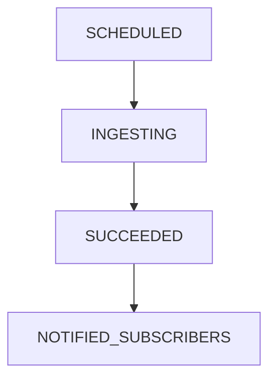
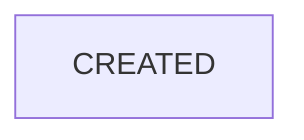
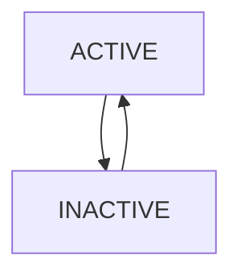
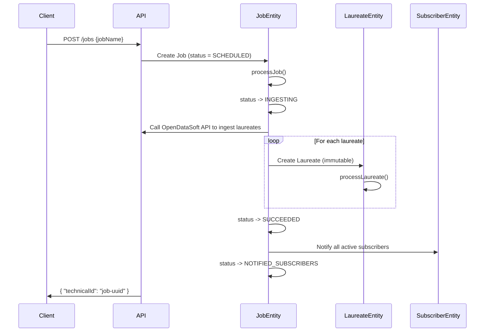

### 1. Entity Definitions

```
Job:
- jobName: String (name/identifier of the ingestion job)
- status: String (current state of the job, e.g., "SCHEDULED", "INGESTING", "SUCCEEDED", "NOTIFIED_SUBSCRIBERS")
- createdAt: String (timestamp of job creation)
- completedAt: String (timestamp of job completion, if applicable)
- errorMessage: String (error details if the job failed)

Laureate:
- laureateId: String (unique identifier from source data)
- firstname: String (laureate first name)
- surname: String (laureate surname)
- gender: String (gender of laureate)
- born: String (birthdate)
- died: String (date of death, nullable)
- borncountry: String (country of birth)
- borncountrycode: String (country code of birth)
- borncity: String (city of birth)
- year: String (award year)
- category: String (award category)
- motivation: String (award motivation text)
- name: String (affiliation name)
- city: String (affiliation city)
- country: String (affiliation country)

Subscriber:
- subscriberId: String (unique identifier)
- contactType: String (e.g., "email", "webhook")
- contactValue: String (email address or webhook URL)
- active: Boolean (subscription active status)
```

---

### 2. Process Method Flows

```
processJob() Flow:
1. Job created with status "SCHEDULED"
2. Change status to "INGESTING"
3. Ingest laureate data from API and create Laureate entities
4. After all laureates are processed, change status to "SUCCEEDED"
5. Notify all active subscribers
6. Change status to "NOTIFIED_SUBSCRIBERS"
```

```
processLaureate() Flow:
1. Validation: Check mandatory fields such as laureateId, firstname, surname, year, category
2. Enrichment: Normalize/standardize borncountrycode or other fields if needed
3. Persistence: Save the immutable laureate entity for history and downstream use
4. No direct notification - relies on Job notification after batch ingestion
```

```
processSubscriber() Flow:
1. Validation: Check contactType and contactValue for format correctness
2. Persistence: Save Subscriber entity as immutable record
3. No further processing unless triggered by Job notification
```

---

### 3. API Endpoints Specification

| Entity     | POST Endpoint                | Response           | GET by technicalId Endpoint        |
|------------|-----------------------------|--------------------|-----------------------------------|
| Job        | POST /jobs                  | `{ "technicalId": "uuid" }` | GET /jobs/{technicalId}          |
| Laureate   | No POST endpoint            | N/A                | GET /laureates/{technicalId}     |
| Subscriber | POST /subscribers           | `{ "technicalId": "uuid" }` | GET /subscribers/{technicalId}   |

- No PUT, PATCH, DELETE endpoints for any entity (immutable creation only).
- No GET by condition or GET all endpoints, unless explicitly requested later.
- POST endpoints return only `technicalId`.

---

### 4. Request/Response Formats

**POST /jobs**  
_Request Body:_
```json
{
  "jobName": "string"
}
```
_Response Body:_
```json
{
  "technicalId": "string"
}
```

**GET /jobs/{technicalId}**  
_Response Body:_
```json
{
  "jobName": "string",
  "status": "string",
  "createdAt": "string",
  "completedAt": "string",
  "errorMessage": "string"
}
```

**POST /subscribers**  
_Request Body:_
```json
{
  "contactType": "email" | "webhook",
  "contactValue": "string",
  "active": true
}
```
_Response Body:_
```json
{
  "technicalId": "string"
}
```

**GET /subscribers/{technicalId}**  
_Response Body:_
```json
{
  "contactType": "string",
  "contactValue": "string",
  "active": true
}
```

**GET /laureates/{technicalId}**  
_Response Body:_
```json
{
  "laureateId": "string",
  "firstname": "string",
  "surname": "string",
  "gender": "string",
  "born": "string",
  "died": "string",
  "borncountry": "string",
  "borncountrycode": "string",
  "borncity": "string",
  "year": "string",
  "category": "string",
  "motivation": "string",
  "name": "string",
  "city": "string",
  "country": "string"
}
```

---

### 5. Mermaid Diagrams

**Job Entity State Diagram**


```mermaid
graph TD
    SCHEDUL["SCHEDULED"]
    INGEST["INGESTING"]
    SUCC["SUCCEEDED"]
    NOTIF["NOTIFIED_SUBSCRIBERS"]

    SCHEDUL --> INGEST
    INGEST --> SUCC
    SUCC --> NOTIF
```

**Laureate Entity State Diagram**


```mermaid
graph TD
    CREATED["CREATED"]
```

**Subscriber Entity State Diagram**


```mermaid
graph TD
    ACTIVE["ACTIVE"]
    INACTIVE["INACTIVE"]

    ACTIVE --> INACTIVE
    INACTIVE --> ACTIVE
```

---

**Sequence Diagram for Job Lifecycle**


```mermaid
sequenceDiagram
    participant Client
    participant API
    participant JobEntity
    participant LaureateEntity
    participant SubscriberEntity

    Client->>API: POST /jobs {jobName}
    API->>JobEntity: Create Job (status = SCHEDULED)
    JobEntity->>JobEntity: processJob()
    JobEntity->>JobEntity: status -> INGESTING
    JobEntity->>API: Call OpenDataSoft API to ingest laureates
    loop For each laureate
        JobEntity->>LaureateEntity: Create Laureate (immutable)
        LaureateEntity->>LaureateEntity: processLaureate()
    end
    JobEntity->>JobEntity: status -> SUCCEEDED
    JobEntity->>SubscriberEntity: Notify all active subscribers
    JobEntity->>JobEntity: status -> NOTIFIED_SUBSCRIBERS
    API->>Client: { "technicalId": "job-uuid" }
```

---

This completes the finalized functional requirements for your Java Spring Boot backend application implementing an Event-Driven Architecture with the specified entities, workflows, and APIs.