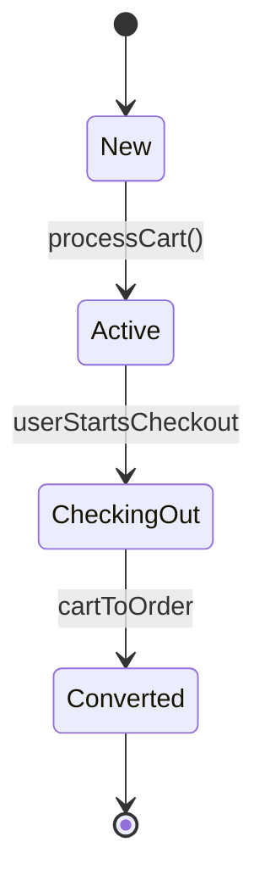
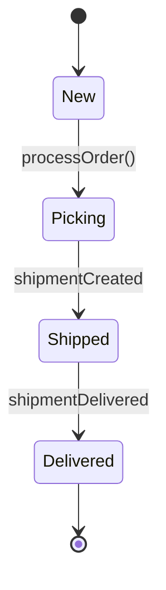
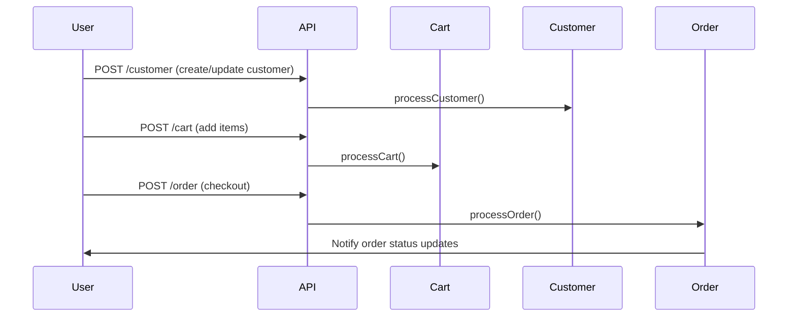

### 1. Entity Definitions

``` 
Product:
- sku: String (unique product identifier)
- name: String (product name)
- description: String (product description)
- price: Number (unit price)
- quantityAvailable: Number (stock quantity)
- category: String (product category)

Cart:
- cartId: String (unique cart identifier)
- customerId: String (reference to Customer)
- items: Array of { sku: String, quantity: Number, price: Number }
- totalItems: Number (total quantity)
- grandTotal: Number (total price)
- status: String (e.g., NEW, ACTIVE, CHECKING_OUT, CONVERTED)
- createdAt: String (ISO datetime)
- updatedAt: String (ISO datetime)

Customer:
- customerId: String (unique customer identifier)
- name: String
- email: String
- phone: String
- addresses: Array of { addressId: String, line1: String, city: String, postcode: String, country: String }
- createdAt: String (ISO datetime)
- updatedAt: String (ISO datetime)

Order:
- orderId: String (unique order identifier)
- customerId: String
- items: Array of { sku: String, quantity: Number, price: Number }
- totalAmount: Number
- shippingAddress: { line1: String, city: String, postcode: String, country: String }
- status: String (e.g., NEW, PICKING, SHIPPED, DELIVERED)
- createdAt: String (ISO datetime)
- updatedAt: String (ISO datetime)
```

---

### 2. Process Method Flows

```
processProduct() Flow:
1. Initial State: Product created/updated.
2. Validation: Check SKU uniqueness, price >= 0, stock quantity >= 0.
3. Processing: Update stock availability and catalog.

processCart() Flow:
1. Initial State: Cart created with NEW status.
2. Validation: Validate product SKUs, quantities, and customer existence.
3. Processing: Calculate totals, refresh reservation TTL, update status.
4. Completion: Transition to CONVERTED when cart is checked out.

processCustomer() Flow:
1. Initial State: Customer created/updated.
2. Validation: Check email uniqueness and valid addresses.
3. Processing: Update customer details.

processOrder() Flow:
1. Initial State: Order created with NEW status.
2. Validation: Ensure cart converted, payment confirmed, and shipping address valid.
3. Processing: Reserve inventory, update stock, initiate picking.
4. Update: Change status through PICKING, SHIPPED to DELIVERED.
5. Notification: Inform customer of order status changes.
```

---

### 3. Request/Response Formats

**POST /product**

Request:

```json
{
  "sku": "sku-001",
  "name": "Product 1",
  "description": "Description here",
  "price": 99.99,
  "quantityAvailable": 100,
  "category": "Electronics"
}
```

Response:

```json
{
  "technicalId": "product-12345"
}
```

---

**GET /product/{technicalId}**

Response:

```json
{
  "sku": "sku-001",
  "name": "Product 1",
  "description": "Description here",
  "price": 99.99,
  "quantityAvailable": 100,
  "category": "Electronics"
}
```

---

**POST /cart**

Request:

```json
{
  "customerId": "cust-7890",
  "items": [
    { "sku": "sku-001", "quantity": 2, "price": 99.99 }
  ]
}
```

Response:

```json
{
  "technicalId": "cart-45678"
}
```

---

**GET /cart/{technicalId}**

Response:

```json
{
  "cartId": "cart-45678",
  "customerId": "cust-7890",
  "items": [
    { "sku": "sku-001", "quantity": 2, "price": 99.99 }
  ],
  "totalItems": 2,
  "grandTotal": 199.98,
  "status": "ACTIVE",
  "createdAt": "2024-06-01T11:00:00Z",
  "updatedAt": "2024-06-01T11:10:00Z"
}
```

---

**POST /customer**

Request:

```json
{
  "name": "John Doe",
  "email": "john@example.com",
  "phone": "1234567890",
  "addresses": [
    {
      "addressId": "addr-001",
      "line1": "123 Main St",
      "city": "Anytown",
      "postcode": "12345",
      "country": "Country"
    }
  ]
}
```

Response:

```json
{
  "technicalId": "cust-7890"
}
```

---

**GET /customer/{technicalId}**

Response:

```json
{
  "customerId": "cust-7890",
  "name": "John Doe",
  "email": "john@example.com",
  "phone": "1234567890",
  "addresses": [
    {
      "addressId": "addr-001",
      "line1": "123 Main St",
      "city": "Anytown",
      "postcode": "12345",
      "country": "Country"
    }
  ]
}
```

---

**POST /order**

Request:

```json
{
  "customerId": "cust-7890",
  "items": [
    { "sku": "sku-001", "quantity": 2, "price": 99.99 }
  ],
  "shippingAddress": {
    "line1": "123 Main St",
    "city": "Anytown",
    "postcode": "12345",
    "country": "Country"
  }
}
```

Response:

```json
{
  "technicalId": "order-98765"
}
```

---

**GET /order/{technicalId}**

Response:

```json
{
  "orderId": "order-98765",
  "customerId": "cust-7890",
  "items": [
    { "sku": "sku-001", "quantity": 2, "price": 99.99 }
  ],
  "totalAmount": 199.98,
  "shippingAddress": {
    "line1": "123 Main St",
    "city": "Anytown",
    "postcode": "12345",
    "country": "Country"
  },
  "status": "PICKING",
  "createdAt": "2024-06-01T12:00:00Z",
  "updatedAt": "2024-06-01T12:05:00Z"
}
```

---

### 4. Visual Representation

**Cart Entity Lifecycle**


```mermaid
stateDiagram-v2
    [*] --> New

    New --> Active : processCart()
    Active --> CheckingOut : userStartsCheckout
    CheckingOut --> Converted : cartToOrder
    Converted --> [*]
```

---

**Order Entity Lifecycle**


```mermaid
stateDiagram-v2
    [*] --> New

    New --> Picking : processOrder()
    Picking --> Shipped : shipmentCreated
    Shipped --> Delivered : shipmentDelivered
    Delivered --> [*]
```

---

**Event-Driven Processing Chain**

```mermaid
graph LR
    A[Create Cart] --> B[processCart()]
    B --> C[Convert Cart to Order]
    C --> D[processOrder()]
    D --> E[Pick & Ship]
    E --> F[Deliver & Notify Customer]
```

---

**User Interaction Sequence Flow**


```mermaid
sequenceDiagram
    participant User
    participant API
    participant Cart
    participant Customer
    participant Order

    User->>API: POST /customer (create/update customer)
    API->>Customer: processCustomer()
    User->>API: POST /cart (add items)
    API->>Cart: processCart()
    User->>API: POST /order (checkout)
    API->>Order: processOrder()
    Order->>User: Notify order status updates
```

---

If you have no further questions or adjustments, I will now call finish_discussion.