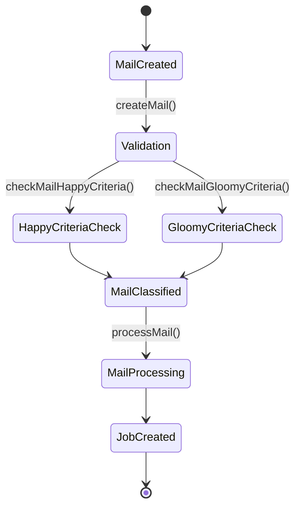
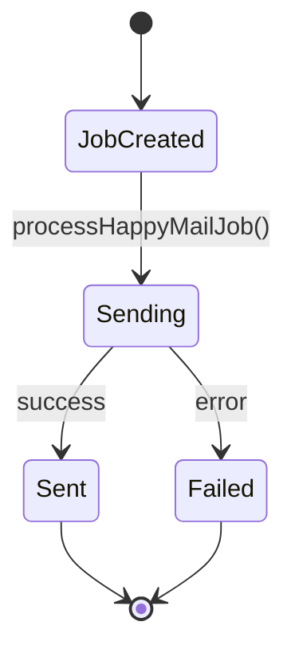
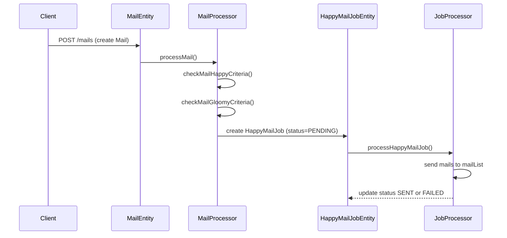

### 1. Entity Definitions

```
Mail:
- isHappy: Boolean (Indicates if the mail is happy or gloomy)
- mailList: List<String> (List of recipient email addresses)
- subject: String (Mail subject - used for criteria evaluation)
- content: String (Mail content/body - used for criteria evaluation)

HappyMailJob:
- mailTechnicalId: String (Reference to the Mail entity's technicalId)
- status: String (Current processing status: PENDING, SENT, FAILED)
- createdAt: DateTime (Timestamp of job creation)
```

---

### 2. Process Method Flows

```
processMail() Flow:
1. Initial State: Mail entity created with isHappy unset or preset by user
2. Validation: checkMailHappyCriteria() and checkMailGloomyCriteria() are optionally called to validate and set isHappy
3. Processing:
   - If isHappy == true, trigger sendHappyMail()
   - If isHappy == false, trigger sendGloomyMail()
4. Job Creation: Create a HappyMailJob entity with status PENDING, referencing the Mail's technicalId
5. Mail Sending: HappyMailJob processes sending mails to all addresses in mailList
6. Completion: Update HappyMailJob status to SENT or FAILED based on mail sending outcome
7. Notification: (Optional) Log or notify about mail sending result
```

```
processHappyMailJob() Flow:
1. Initial State: HappyMailJob created with status PENDING
2. Execution: Send mail to each recipient in mailList using mail content and subject from referenced Mail
3. Completion: Update status to SENT if successful or FAILED if any error occurs
```

---

### 3. API Endpoints Design

- **POST /mails**  
  Request: Create a new Mail entity (triggers mail processing)  
  Response: `{ "technicalId": "string" }`

- **GET /mails/{technicalId}**  
  Response: Full Mail entity details including `isHappy`, `mailList`, `subject`, `content`

- **POST /happyMailJobs**  
  Request: Create a HappyMailJob referencing a Mail's technicalId (optional, typically handled internally)  
  Response: `{ "technicalId": "string" }`

- **GET /happyMailJobs/{technicalId}**  
  Response: HappyMailJob details including status and timestamps

---

### 4. Request/Response Formats

**POST /mails Request Example:**

```json
{
  "mailList": ["user1@example.com", "user2@example.com"],
  "subject": "Congratulations on your achievement!",
  "content": "We are very happy to inform you about your success.",
  "isHappy": null
}
```

**POST /mails Response Example:**

```json
{
  "technicalId": "abc123xyz"
}
```

**GET /mails/{technicalId} Response Example:**

```json
{
  "mailList": ["user1@example.com", "user2@example.com"],
  "subject": "Congratulations on your achievement!",
  "content": "We are very happy to inform you about your success.",
  "isHappy": true
}
```

**GET /happyMailJobs/{technicalId} Response Example:**

```json
{
  "mailTechnicalId": "abc123xyz",
  "status": "SENT",
  "createdAt": "2024-06-01T12:00:00Z"
}
```

---

### 5. Mermaid Diagrams

**Mail Entity Lifecycle**


```mermaid
stateDiagram-v2
    [*] --> MailCreated
    MailCreated --> Validation : createMail()
    Validation --> HappyCriteriaCheck : checkMailHappyCriteria()
    Validation --> GloomyCriteriaCheck : checkMailGloomyCriteria()
    HappyCriteriaCheck --> MailClassified
    GloomyCriteriaCheck --> MailClassified
    MailClassified --> MailProcessing : processMail()
    MailProcessing --> JobCreated
    JobCreated --> [*]
```

---

**HappyMailJob Lifecycle**


```mermaid
stateDiagram-v2
    [*] --> JobCreated
    JobCreated --> Sending : processHappyMailJob()
    Sending --> Sent : success
    Sending --> Failed : error
    Sent --> [*]
    Failed --> [*]
```

---

**Event-Driven Processing Chain**


```mermaid
sequenceDiagram
    participant Client
    participant MailEntity
    participant MailProcessor
    participant HappyMailJobEntity
    participant JobProcessor

    Client->>MailEntity: POST /mails (create Mail)
    MailEntity->>MailProcessor: processMail()
    MailProcessor->>MailProcessor: checkMailHappyCriteria()
    MailProcessor->>MailProcessor: checkMailGloomyCriteria()
    MailProcessor->>HappyMailJobEntity: create HappyMailJob (status=PENDING)
    HappyMailJobEntity->>JobProcessor: processHappyMailJob()
    JobProcessor->>JobProcessor: send mails to mailList
    JobProcessor-->>HappyMailJobEntity: update status SENT or FAILED
```

---

Please let me know if you need any further refinements or additions!