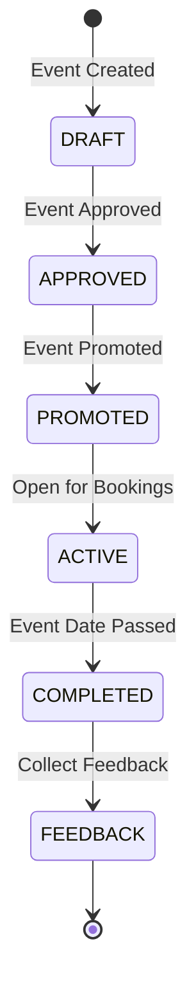
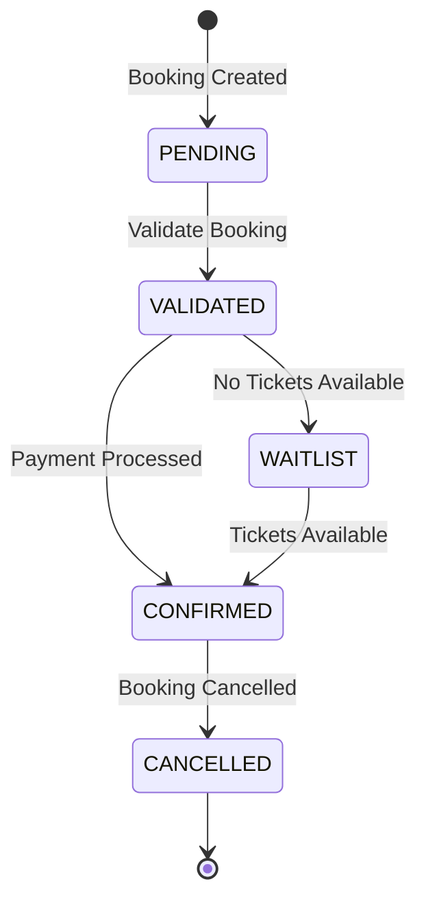
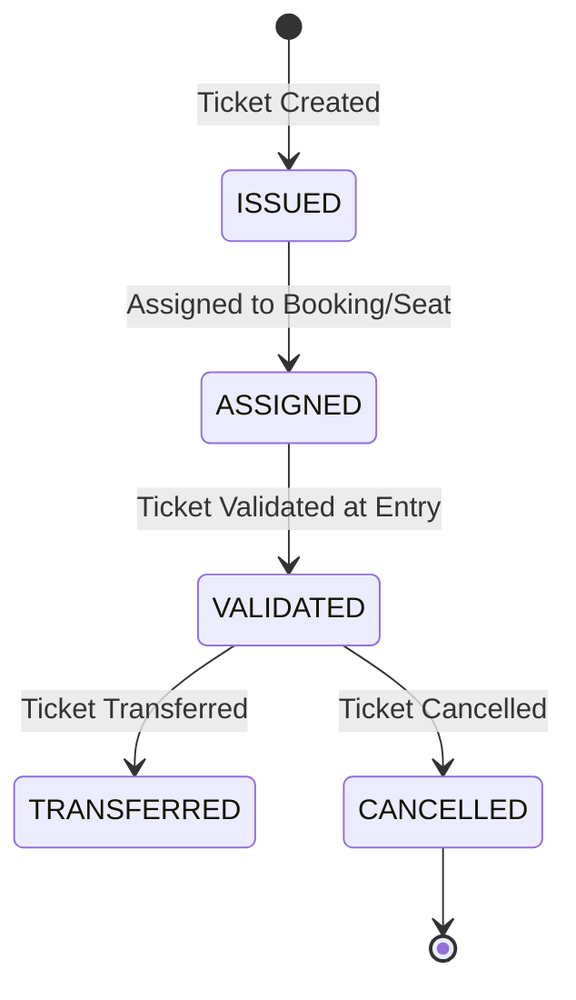
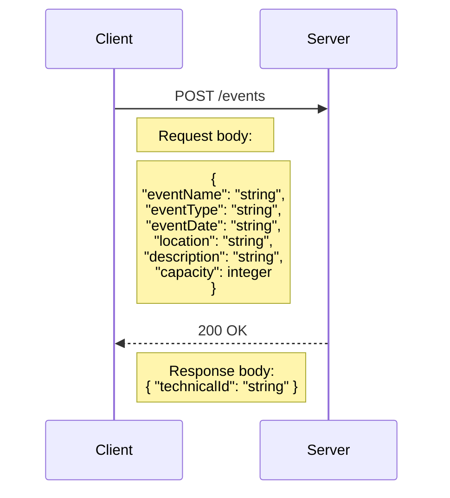
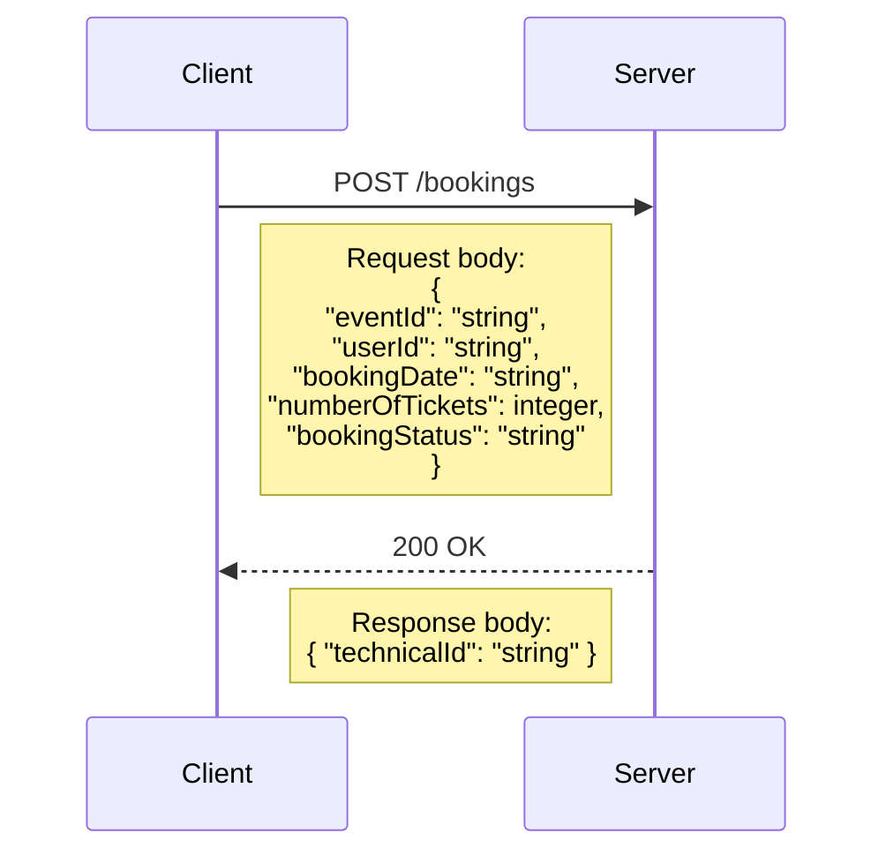
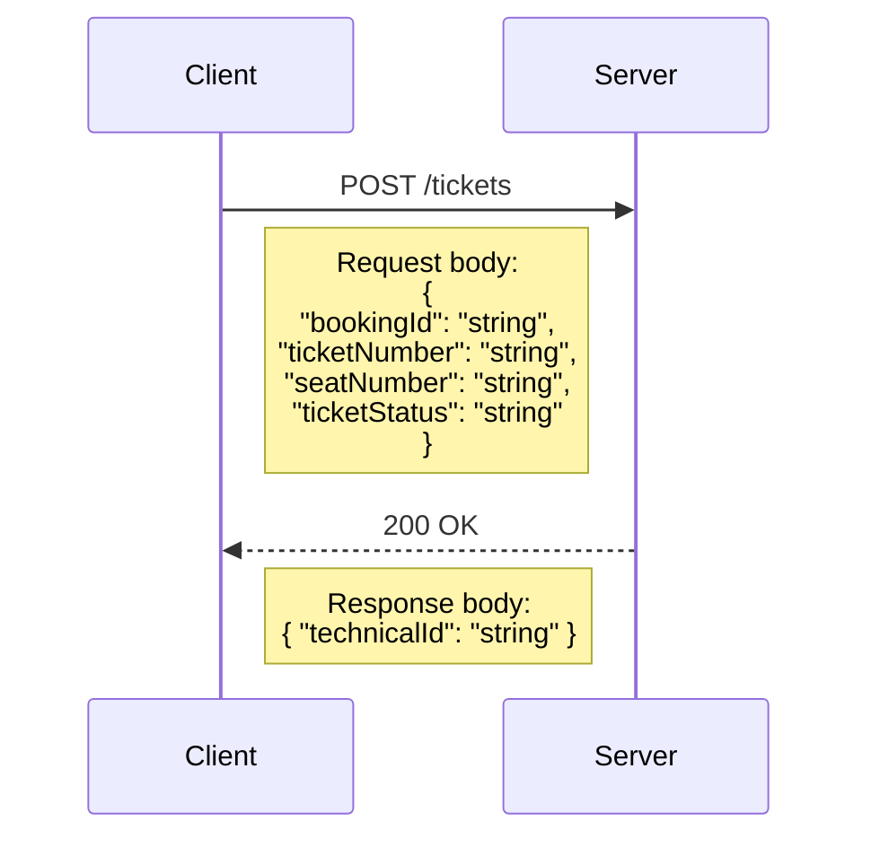

# Functional Requirements

## 1. Entity Definitions

```
Event:
- eventName: String (Name of the event)
- eventType: String (Type of event, e.g., conference, concert)
- eventDate: String (Date and time of the event)
- location: String (Venue or location of the event)
- description: String (Details about the event)
- capacity: Integer (Maximum number of attendees)

Booking:
- eventId: String (Reference to the Event)
- userId: String (Identifier for the user making the booking)
- bookingDate: String (Date and time when the booking was made)
- numberOfTickets: Integer (Number of tickets booked)
- bookingStatus: String (Status of booking, e.g., PENDING, CONFIRMED)

Ticket:
- bookingId: String (Reference to the Booking)
- ticketNumber: String (Unique identifier for the ticket)
- seatNumber: String (Seat assignment if applicable)
- ticketStatus: String (Status of ticket, e.g., ISSUED, CANCELLED)
```

---

## 2. Entity workflows

```
Event workflow:
1. Initial State: Event created with status "DRAFT"
2. Approval: Event details are reviewed and event is "APPROVED"
3. Promotion: Event is promoted (optional automated notifications or marketing)
4. Active: Event is open for bookings
5. Completed: Event date passed, event marked as "COMPLETED"
6. Feedback Collection: Post-event feedback collected (optional extension)

Booking workflow:
1. Initial State: Booking created with status "PENDING"
2. Validation: Check event capacity and ticket availability
3. Payment Processing: Verify payment (can be external)
4. Confirmation: Booking status updated to "CONFIRMED"
5. Waitlist Handling: If event is full, booking moved to "WAITLIST"
6. Cancellation: Booking can be cancelled, status updated to "CANCELLED"

Ticket workflow:
1. Initial State: Ticket created with status "ISSUED"
2. Assignment: Ticket linked to booking and seat (if applicable)
3. Validation: Ticket validated at event entry
4. Transfer (optional): Ticket can be transferred to another user
5. Cancellation/Refund: Ticket status updated to "CANCELLED" or "REFUNDED"
```

#### Event state diagram:

```mermaid
stateDiagram-v2
    [*] --> DRAFT : Event Created
    DRAFT --> APPROVED : Event Approved
    APPROVED --> PROMOTED : Event Promoted
    PROMOTED --> ACTIVE : Open for Bookings
    ACTIVE --> COMPLETED : Event Date Passed
    COMPLETED --> FEEDBACK : Collect Feedback
    FEEDBACK --> [*]
```

#### Booking state diagram:

```mermaid
stateDiagram-v2
    [*] --> PENDING : Booking Created
    PENDING --> VALIDATED : Validate Booking
    VALIDATED --> CONFIRMED : Payment Processed
    VALIDATED --> WAITLIST : No Tickets Available
    CONFIRMED --> CANCELLED : Booking Cancelled
    WAITLIST --> CONFIRMED : Tickets Available
    CANCELLED --> [*]
```

#### Ticket state diagram:

```mermaid
stateDiagram-v2
    [*] --> ISSUED : Ticket Created
    ISSUED --> ASSIGNED : Assigned to Booking/Seat
    ASSIGNED --> VALIDATED : Ticket Validated at Entry
    VALIDATED --> TRANSFERRED : Ticket Transferred
    VALIDATED --> CANCELLED : Ticket Cancelled
    CANCELLED --> [*]
```

---

## 3. API Endpoints Design

- **Event API**
  - POST `/events`  
    - Creates a new Event (triggers Event workflow)  
    - Response: `{ "technicalId": "string" }`
  - GET `/events/{technicalId}`  
    - Retrieves Event details by technicalId

- **Booking API**
  - POST `/bookings`  
    - Creates a new Booking (triggers Booking workflow)  
    - Response: `{ "technicalId": "string" }`
  - GET `/bookings/{technicalId}`  
    - Retrieves Booking details by technicalId

- **Ticket API**
  - POST `/tickets`  
    - Creates a new Ticket (triggers Ticket workflow)  
    - Response: `{ "technicalId": "string" }`
  - GET `/tickets/{technicalId}`  
    - Retrieves Ticket details by technicalId

---

## 4. Request/Response Formats

### Event POST request and response

```mermaid
sequenceDiagram
    participant Client
    participant Server

    Client->>Server: POST /events
    Note right of Client: Request body:
    Note right of Client: {<br> "eventName": "string",<br> "eventType": "string",<br> "eventDate": "string",<br> "location": "string",<br> "description": "string",<br> "capacity": integer<br>}
    Server-->>Client: 200 OK
    Note left of Server: Response body:<br>{ "technicalId": "string" }
```

### Booking POST request and response

```mermaid
sequenceDiagram
    participant Client
    participant Server

    Client->>Server: POST /bookings
    Note right of Client: Request body:<br>{<br> "eventId": "string",<br> "userId": "string",<br> "bookingDate": "string",<br> "numberOfTickets": integer,<br> "bookingStatus": "string"<br>}
    Server-->>Client: 200 OK
    Note left of Server: Response body:<br>{ "technicalId": "string" }
```

### Ticket POST request and response

```mermaid
sequenceDiagram
    participant Client
    participant Server

    Client->>Server: POST /tickets
    Note right of Client: Request body:<br>{<br> "bookingId": "string",<br> "ticketNumber": "string",<br> "seatNumber": "string",<br> "ticketStatus": "string"<br>}
    Server-->>Client: 200 OK
    Note left of Server: Response body:<br>{ "technicalId": "string" }
```

---

**The functional requirements are up to date and reflect the latest logic.**
