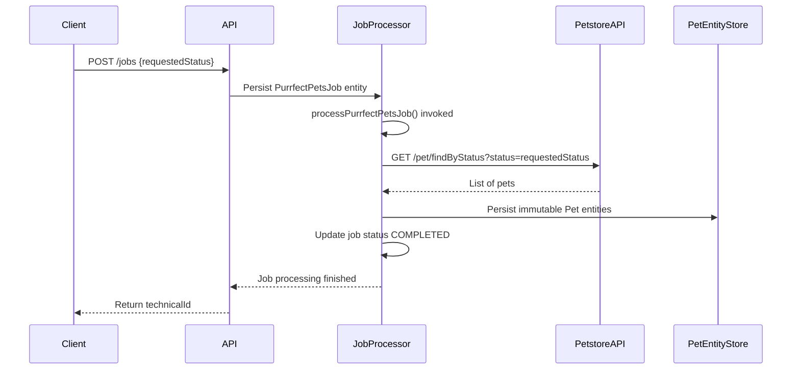
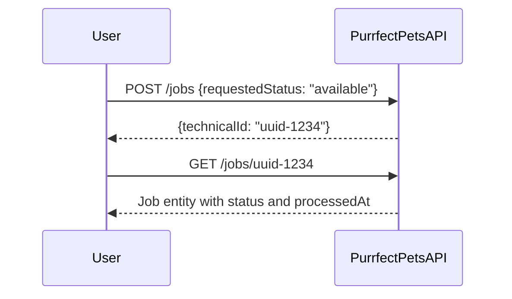

### 1. Entity Definitions

``` 
PurrfectPetsJob:  
- technicalId: String (unique identifier assigned by datastore)  
- requestedStatus: String (status filter for pet ingestion, e.g., "available", "pending", "sold")  
- processedAt: DateTime (timestamp when processing completed)  
- status: StatusEnum (PENDING, PROCESSING, COMPLETED, FAILED)  

Pet:  
- petId: Long (Petstore API pet identifier)  
- name: String (name of the pet)  
- category: String (pet category name)  
- photoUrls: List<String> (images of the pet)  
- tags: List<String> (descriptive tags)  
- status: String (pet status from Petstore: available, pending, sold)  

StoreOrder:  
- orderId: Long (Petstore order identifier)  
- petId: Long (associated pet identifier)  
- quantity: Integer (number of pets ordered)  
- shipDate: DateTime (expected shipping date)  
- status: String (order status)  
- complete: Boolean (order completion flag)  
- status: StatusEnum (PENDING, PROCESSING, COMPLETED, FAILED)  
```  

---

### 2. Process Method Flows

```
processPurrfectPetsJob() Flow:  
1. Initial State: Job created with status = PENDING and requestedStatus filter set  
2. Validation: Validate requestedStatus is one of ["available", "pending", "sold"]  
3. Processing:  
   - Call Petstore API `/pet/findByStatus` with requestedStatus  
   - Persist each returned pet as immutable Pet entities  
4. Completion: Update Job status to COMPLETED or FAILED based on API call success  
5. Notification: Optionally log or trigger downstream actions (e.g., notify user)  

processStoreOrder() Flow:  
1. Initial State: Order created with status = PENDING  
2. Validation: Check required fields (petId, quantity, etc.) are present  
3. Processing: Send order creation request to Petstore API `/store/order`  
4. Completion: Update order status to COMPLETED/FAILED based on API response  
5. Notification: Log outcome or trigger further processing if needed  
```  

---

### 3. API Endpoints Design

| HTTP Method | Path                       | Description                              | Request Body                        | Response                  |
|-------------|----------------------------|--------------------------------------|-----------------------------------|---------------------------|
| POST        | `/jobs`                    | Create a new ingestion job (PurrfectPetsJob) | `{ "requestedStatus": "available" }` | `{ "technicalId": "uuid-1234" }` |
| GET         | `/jobs/{technicalId}`      | Get job status and metadata          |                                   | Full PurrfectPetsJob entity |
| POST        | `/orders`                  | Create a new store order             | StoreOrder fields (without status) | `{ "technicalId": "uuid-5678" }` |
| GET         | `/orders/{technicalId}`    | Get order status                     |                                   | Full StoreOrder entity     |
| GET         | `/pets/{petId}`            | Retrieve pet details by Petstore petId |                                   | Full Pet entity            |

- No update/delete endpoints per EDA principles.
- Pet entities are created only via processing jobs, no direct POST for pets.
- GET by conditions (e.g., list pets by status) can be added if explicitly requested.

---

### 4. Request/Response JSON Examples

**POST /jobs request:**

```json
{
  "requestedStatus": "available"
}
```

**POST /jobs response:**

```json
{
  "technicalId": "uuid-1234"
}
```

**GET /jobs/{technicalId} response:**

```json
{
  "technicalId": "uuid-1234",
  "requestedStatus": "available",
  "processedAt": "2024-06-25T10:15:30Z",
  "status": "COMPLETED"
}
```

**POST /orders request:**

```json
{
  "petId": 12345,
  "quantity": 1,
  "shipDate": "2024-06-30T12:00:00Z",
  "complete": false
}
```

**POST /orders response:**

```json
{
  "technicalId": "uuid-5678"
}
```

**GET /orders/{technicalId} response:**

```json
{
  "orderId": 9876,
  "petId": 12345,
  "quantity": 1,
  "shipDate": "2024-06-30T12:00:00Z",
  "status": "COMPLETED",
  "complete": true,
  "status": "COMPLETED"
}
```

---

### 5. Visual Representations

#### Entity Lifecycle State Diagram for PurrfectPetsJob


```mermaid
stateDiagram-v2
    [*] --> JobCreated
    JobCreated --> Processing : processPurrfectPetsJob()
    Processing --> Completed : success
    Processing --> Failed : error
    Completed --> [*]
    Failed --> [*]
```

#### Event-Driven Processing Chain for PurrfectPetsJob


```mermaid
sequenceDiagram
    participant Client
    participant API
    participant JobProcessor
    participant PetstoreAPI
    participant PetEntityStore

    Client->>API: POST /jobs {requestedStatus}
    API->>JobProcessor: Persist PurrfectPetsJob entity
    JobProcessor->>JobProcessor: processPurrfectPetsJob() invoked
    JobProcessor->>PetstoreAPI: GET /pet/findByStatus?status=requestedStatus
    PetstoreAPI-->>JobProcessor: List of pets
    JobProcessor->>PetEntityStore: Persist immutable Pet entities
    JobProcessor->>JobProcessor: Update job status COMPLETED
    JobProcessor-->>API: Job processing finished
    API-->>Client: Return technicalId
```

#### User Interaction Sequence Flow (Job creation and status retrieval)


```mermaid
sequenceDiagram
    participant User
    participant PurrfectPetsAPI

    User->>PurrfectPetsAPI: POST /jobs {requestedStatus: "available"}
    PurrfectPetsAPI-->>User: {technicalId: "uuid-1234"}
    User->>PurrfectPetsAPI: GET /jobs/uuid-1234
    PurrfectPetsAPI-->>User: Job entity with status and processedAt
```

---

This completes the functional requirements for the "Purrfect Pets" API app based on Event-Driven Architecture principles.  
Please let me know if you would like to extend with additional endpoints or features.