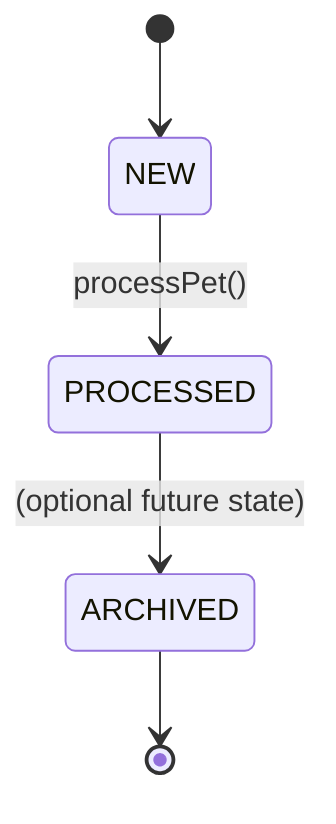
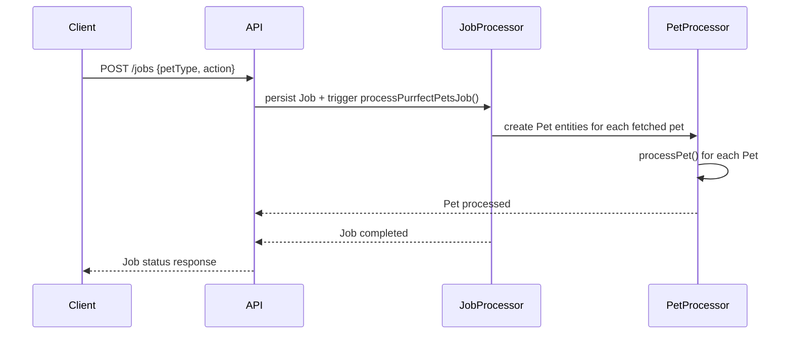

### 1. Entity Definitions

``` 
PurrfectPetsJob:  (Orchestration entity)
- jobId: String (Unique identifier for the job)
- petType: String (Type of pet to process, e.g., cat, dog, all)
- action: String (Action to perform, e.g., fetch, enrich, archive)
- status: StatusEnum (Lifecycle state: PENDING, PROCESSING, COMPLETED, FAILED)
- createdAt: DateTime (Job creation timestamp)

Pet:  (Business domain entity)
- petId: String (Unique identifier from Petstore API)
- name: String (Pet name)
- category: String (Category/type of the pet)
- status: String (Pet availability status)
- photoUrls: List<String> (Photos of the pet)
- status: StatusEnum (Lifecycle state: NEW, PROCESSED, ARCHIVED)
- createdAt: DateTime (Entity creation timestamp)
```

### 2. Process Method Flows

```
processPurrfectPetsJob() Flow:
1. Initial State: Job entity created with status PENDING
2. Validation: Validate petType and action parameters
3. Processing: 
   - If action = fetch → call Petstore API to retrieve pets filtered by petType
   - For each pet fetched, create a new Pet entity with status NEW
4. Completion: Update Job status to COMPLETED or FAILED based on outcome
5. Notification: Log the job result and optionally notify subscribers

processPet() Flow:
1. Initial State: Pet entity created with status NEW
2. Validation: Check pet data completeness and validity
3. Processing: Enrich pet data if needed (e.g., add default photo if missing)
4. Completion: Update Pet status to PROCESSED
5. Notification: Log pet processing completion
```

### 3. API Endpoints Design

- **POST /jobs**  
  Create a new PurrfectPetsJob (triggers `processPurrfectPetsJob()` event)  
  Request JSON:  
  ```json
  {
    "petType": "cat",
    "action": "fetch"
  }
  ```  
  Response JSON:  
  ```json
  {
    "jobId": "job123",
    "status": "PENDING",
    "createdAt": "2024-06-01T12:00:00Z"
  }
  ```

- **GET /pets**  
  Retrieve all processed pets or filter by type/status  
  Query params example: `?petType=cat&status=PROCESSED`  
  Response JSON:  
  ```json
  [
    {
      "petId": "pet456",
      "name": "Whiskers",
      "category": "cat",
      "status": "PROCESSED",
      "photoUrls": ["http://..."],
      "createdAt": "2024-06-01T12:05:00Z"
    }
  ]
  ```

- **POST /pets**  
  (Optional) Create new Pet entries manually (triggers `processPet()` event)  
  Request JSON:  
  ```json
  {
    "petId": "pet789",
    "name": "Fluffy",
    "category": "cat",
    "status": "NEW",
    "photoUrls": []
  }
  ```  
  Response JSON:  
  ```json
  {
    "petId": "pet789",
    "status": "NEW",
    "createdAt": "2024-06-01T12:10:00Z"
  }
  ```

### 4. Mermaid Diagrams

**Entity Lifecycle State Diagram for PurrfectPetsJob**


```mermaid
stateDiagram-v2
    [*] --> PENDING
    PENDING --> PROCESSING : processPurrfectPetsJob()
    PROCESSING --> COMPLETED : success
    PROCESSING --> FAILED : error
    COMPLETED --> [*]
    FAILED --> [*]
```

**Entity Lifecycle State Diagram for Pet**


```mermaid
stateDiagram-v2
    [*] --> NEW
    NEW --> PROCESSED : processPet()
    PROCESSED --> ARCHIVED : (optional future state)
    ARCHIVED --> [*]
```

**Event-Driven Processing Chain**


```mermaid
sequenceDiagram
    participant Client
    participant API
    participant JobProcessor
    participant PetProcessor
    Client->>API: POST /jobs {petType, action}
    API->>JobProcessor: persist Job + trigger processPurrfectPetsJob()
    JobProcessor->>PetProcessor: create Pet entities for each fetched pet
    PetProcessor->>PetProcessor: processPet() for each Pet
    PetProcessor-->>API: Pet processed
    JobProcessor-->>API: Job completed
    API-->>Client: Job status response
```

---

Thank you for confirming! If you need further help, I’m here to assist.