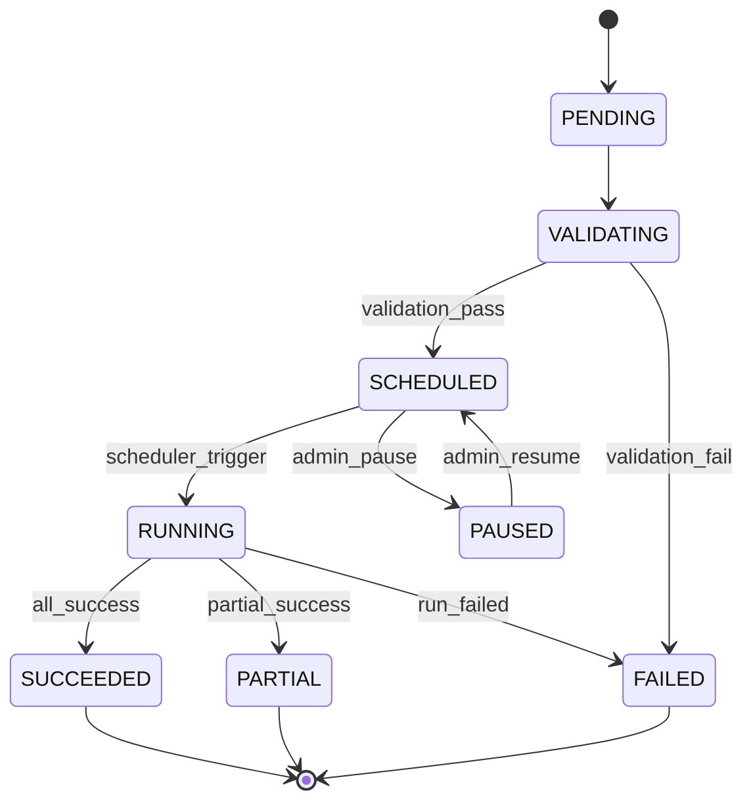
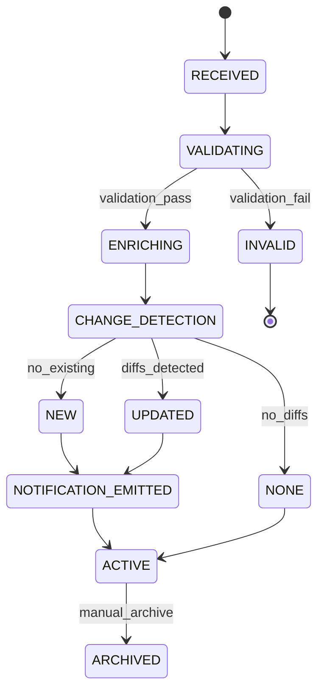
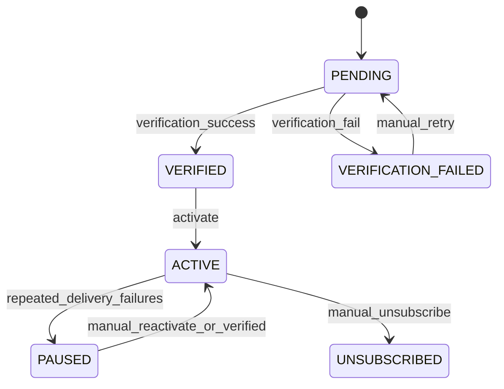

# Functional Requirements (Updated)

Version: 2025-08-18

Purpose
-------
This document defines the functional requirements and up-to-date logic for the ingestion, processing, persistence and notification system that imports laureate records (e.g. Nobel laureates) from OpenDataSoft datasets and notifies subscribers.

Changelog (high level)
----------------------
- Clarified identity model: separation of technicalId (opaque system id) and businessId (source id).
- Explicit enums for statuses and changeType.
- Added ChangeEvent and DeliveryRecord entities and clarified notification semantics (at-least-once delivery, idempotency hints).
- Specified validation rules, retry/backoff behavior and pause thresholds for subscribers.
- Improved runHistory and RunRecord structure.
- Clarified API contract around POSTs returning technicalId only.

1. Entity Definitions
---------------------
Notes:
- Fields marked "system-managed" are set and updated by the platform and are not accepted from public POSTs.
- technicalId: opaque id generated by the system (e.g. job_abc123). businessId: the natural id from the source when available.

1.1 Job
```
Job:
- technicalId: String (system opaque id, generated)
- businessId: String? (optional business id provided by integrator)
- name: String (human-friendly job name)
- sourceUrl: String (OpenDataSoft dataset endpoint)
- schedule: String (cron expression OR natural language schedule; normalized to cron internally)
- scheduleType: enum { CRON, HUMAN } (system-managed; indicates normalized form)
- status: enum { PENDING, VALIDATING, SCHEDULED, RUNNING, SUCCEEDED, FAILED, PAUSED } (system-managed)
- lastRunAt: ISO-8601 timestamp? (system-managed)
- runHistory: Array<RunRecord> (system-managed; most recent first)
- config: Object (ingestion/transform rules, rate limits, optional fields)
- createdAt: ISO-8601 timestamp (system-managed)
- updatedAt: ISO-8601 timestamp (system-managed)
```

RunRecord (used inside Job.runHistory)
```
RunRecord:
- runId: String (opaque id for run)
- runAt: ISO-8601 timestamp
- status: enum { SUCCEEDED, FAILED, PARTIAL }  
- metrics: Object (recordsFetched, recordsPersisted, recordsSkipped, durationMs)
- errors: Array<String> (brief error messages or codes)
```

1.2 Laureate
```
Laureate:
- technicalId: String (system generated)
- businessId: String (id from source when available)  
- fullName: String
- givenName: String? (optional; normalized)
- familyName: String? (optional; normalized)
- year: String (award year)
- category: String (award category)
- country: String? (affiliation country, normalized)
- affiliation: String? (institution text)
- citation: String? (award citation)
- sourceUrl: String? (original record url or dataset record link)
- currentVersion: Integer (system-managed, increases on change)
- changeType: enum { NEW, UPDATED, NONE } (system-managed; NONE indicates no material change)
- lastUpdated: ISO-8601 timestamp (system-managed)
- archived: Boolean (soft delete / archive marker; system-managed)
- normalizedFingerprint: String (system-managed; used for dedup/compare)
- createdAt: ISO-8601 timestamp (system-managed)
```
Notes:
- If incoming record has no businessId, system will attempt a stable businessId generation using normalizedFingerprint.
- If no material differences are detected during ChangeDetection, changeType = NONE and currentVersion unchanged.

1.3 Subscriber
```
Subscriber:
- technicalId: String (system opaque id)
- contact: String (email OR webhook URL OR in-app id)
- contactType: enum { EMAIL, WEBHOOK, IN_APP }
- filters: Object (keys: year[], category[], country[], newOnly: Boolean, updatedOnly: Boolean)
- channels: Array<enum { EMAIL, WEBHOOK, IN_APP }>
- status: enum { PENDING, VERIFIED, ACTIVE, PAUSED, UNSUBSCRIBED, VERIFICATION_FAILED }
- retryPolicy: Object { attempts: Integer, intervalSeconds: Integer, backoff: enum { FIXED, EXPONENTIAL } }
- failureCount: Integer (system-managed; consecutive delivery failures)
- createdAt: ISO-8601 timestamp (system-managed)
- lastNotifiedAt: ISO-8601 timestamp? (system-managed)
- lastDeliveryAt: ISO-8601 timestamp? (system-managed)
- meta: Object (optional free-form for subscriber preferences)
```

1.4 ChangeEvent
```
ChangeEvent:
- eventId: String (opaque id)
- laureateTechnicalId: String (refers to Laureate)
- laureateBusinessId: String?
- changeType: enum { NEW, UPDATED }
- payload: Object (the event payload that will be sent to subscribers)
- createdAt: ISO-8601 timestamp
- status: enum { CREATED, PROCESSING, DELIVERED, PARTIAL, FAILED }
- deliveryRecords: Array<DeliveryRecord> (system-managed)
```

1.5 DeliveryRecord
```
DeliveryRecord:
- deliveryId: String
- subscriberTechnicalId: String
- channels: Array (channels used)
- result: enum { SUCCESS, FAILED, RETRY_SCHEDULED }
- attempt: Integer
- lastAttemptAt: ISO-8601 timestamp
- error: String? (error message or code)
- idempotencyKey: String? (hint to subscriber for dedup semantics)
```

2. Entity Workflows (Updated)
-----------------------------
General notes:
- Processing is event-driven and idempotent where possible.
- All automated transitions are triggered by processors. Manual transitions are exposed via admin API actions.

2.1 Job workflow
States: PENDING -> VALIDATING -> SCHEDULED -> RUNNING -> {SUCCEEDED, FAILED, PARTIAL} (PAUSED able from SCHEDULED or RUNNING)

Steps:
1. Creation: Client POST /jobs -> system creates Job with status=PENDING and returns technicalId only.
2. Validation: Validate schedule, sourceUrl reachability (light check), config schema. If validation fails, status=FAILED and validation errors recorded.
3. Scheduling: If valid, normalize schedule to cron and schedule next runs; status=SCHEDULED.
4. Trigger: Scheduler triggers run -> create RunRecord with runId and Job.status=RUNNING.
5. Execution: Fetch source (paginated), transform & normalize records via FetchAndTransformProcessor and hand to PersistLaureateEventsProcessor. Rate limits from Job.config apply.
6. Partial Success: Some records may fail; errors recorded per-run; status may be PARTIAL and runHistory updated.
7. Finalization: CompleteRunProcessor computes metrics, persists RunRecord to runHistory and sets Job.lastRunAt and Job.status to SUCCEEDED/FAILED/PARTIAL.
8. Notification: Errors of importance or run failure trigger admin notifications; ChangeEvents are emitted per persisted laureate change.

Mermaid (simplified):

```mermaid
stateDiagram-v2
    [*] --> PENDING
    PENDING --> VALIDATING
    VALIDATING --> SCHEDULED : validation_pass
    VALIDATING --> FAILED : validation_fail
    SCHEDULED --> RUNNING : scheduler_trigger
    RUNNING --> SUCCEEDED : all_success
    RUNNING --> PARTIAL : partial_success
    RUNNING --> FAILED : run_failed
    SCHEDULED --> PAUSED : admin_pause
    PAUSED --> SCHEDULED : admin_resume
    SUCCEEDED --> [*]
    PARTIAL --> [*]
    FAILED --> [*]
```

Job required processors / checks
- JobValidationCriterion (check: sourceUrl present and well-formed, schedule is parseable, config schema ok)
- SchedulerTriggerProcessor (schedules and triggers runs)
- FetchAndTransformProcessor (fetches remote pages, enforces rate limits, normalizes records)
- PersistLaureateEventsProcessor (persists laureate; persisting emits ChangeEvent)
- CompleteRunProcessor / FailRunProcessor (finalize run record; compute metrics)

2.2 Laureate workflow
States: RECEIVED -> VALIDATING -> ENRICHING -> CHANGE_DETECTION -> {NEW, UPDATED, NONE} -> NOTIFICATION_EMITTED -> ACTIVE (-> ARCHIVED manual)

Steps:
1. Received: Persisted by Job run into an ingest staging area; state=RECEIVED.
2. Validation: Required fields (fullName, year, category) validated. Invalid records go to INVALID and are not persisted as ACTIVE. They are recorded in run errors.
3. Enrichment: Normalize name parts, resolve affiliation/country where possible (e.g. via lookup); add normalizedFingerprint.
4. Change detection: Compare normalizedFingerprint and salient fields to stored record. If no stored record -> NEW. If stored but material differences -> UPDATED. If differences only in non-material fields (e.g., whitespace), mark NONE.
5. Persistence: For NEW or UPDATED, increment version and persist. Emit ChangeEvent only for NEW/UPDATED unless subscriber preferences indicate otherwise.
6. Post-state: Mark ACTIVE and update lastUpdated and currentVersion. Manual admin can set archived=true -> ARCHIVED.

Mermaid:

```mermaid
stateDiagram-v2
    [*] --> RECEIVED
    RECEIVED --> VALIDATING
    VALIDATING --> INVALID : validation_fail
    VALIDATING --> ENRICHING : validation_pass
    ENRICHING --> CHANGE_DETECTION
    CHANGE_DETECTION --> NEW : no_existing
    CHANGE_DETECTION --> UPDATED : diffs_detected
    CHANGE_DETECTION --> NONE : no_diffs
    NEW --> NOTIFICATION_EMITTED
    UPDATED --> NOTIFICATION_EMITTED
    NOTIFICATION_EMITTED --> ACTIVE
    ACTIVE --> ARCHIVED : manual_archive
    INVALID --> [*]
    NONE --> ACTIVE
```

Laureate required processors
- LaureateValidationCriterion (ensure required fields; produce structured validation errors)
- LaureateEnrichmentProcessor (normalize names, enrich affiliation/country)
- ChangeDetectionProcessor (compare relevant fields and normalizedFingerprint)
- EmitChangeEventProcessor (create ChangeEvent)
- MarkActiveProcessor (set ACTIVE, update version & lastUpdated)

2.3 Subscriber workflow
States: PENDING -> {VERIFIED | VERIFICATION_FAILED} -> ACTIVE -> {PAUSED, UNSUBSCRIBED}

Steps:
1. Creation: POST /subscribers -> creates subscriber with status=PENDING; returns technicalId only.
2. Verification: VerificationProcessor performs handshake depending on contactType: email verification link or webhook challenge-response. On success -> VERIFIED. On repeated handshake failures -> VERIFICATION_FAILED.
3. Activation: After VERIFIED the system may auto-enable to ACTIVE (or wait for admin). On ACTIVE subscriber will receive matching ChangeEvents.
4. Delivery failures: Notifications are delivered according to subscriber.retryPolicy. Consecutive failures increment failureCount. When failureCount >= pauseThreshold (configurable, default 5), subscriber status -> PAUSED.
5. Unsubscribe: Subscriber can unsubscribe manually, status -> UNSUBSCRIBED.

Mermaid:

```mermaid
stateDiagram-v2
    [*] --> PENDING
    PENDING --> VERIFIED : verification_success
    PENDING --> VERIFICATION_FAILED : verification_fail
    VERIFIED --> ACTIVE : activate
    ACTIVE --> PAUSED : repeated_delivery_failures
    ACTIVE --> UNSUBSCRIBED : manual_unsubscribe
    PAUSED --> ACTIVE : manual_reactivate_or_verified
    VERIFICATION_FAILED --> PENDING : manual_retry
```

Subscriber required processors
- VerificationProcessor (send challenge and validate response)
- ActivateSubscriberProcessor
- NotificationMatcherCriterion (matches ChangeEvent to subscriber filters)
- NotificationDeliverProcessor (deliver to channels, record DeliveryRecord)
- DeliveryRetryProcessor (schedules retries, marks subscriber PAUSED on threshold)

3. Processor Pseudocode (Updated)
-------------------------------
Notes: pseudocode focuses on idempotency, batching and error handling.

3.1 FetchAndTransformProcessor
```
class FetchAndTransformProcessor {
  process(Job job, RunRecord run) {
    pageToken = null
    do {
      page = fetchPage(job.sourceUrl, pageToken, job.config)
      for record in page.records {
        try {
          transformed = normalize(record)
          // write to ingest staging or directly persist in idempotent way
          persistLaureateStaging(transformed, run.runId)
        } catch (err) {
          run.errors.add(err.message)
          // continue processing other records
        }
      }
      pageToken = page.nextPageToken
    } while (pageToken)
  }
}
```

3.2 ChangeDetectionProcessor (refined)
```
class ChangeDetectionProcessor {
  process(LaureateIncoming incoming) {
    existing = findByBusinessIdOrFingerprint(incoming.businessId, incoming.normalizedFingerprint)
    if (existing == null) {
      incoming.changeType = NEW
      incoming.currentVersion = 1
      saveNew(incoming)
      emitChangeEvent(incoming, NEW)
    } else {
      if (materialDifferences(existing, incoming)) {
        incoming.changeType = UPDATED
        incoming.currentVersion = existing.currentVersion + 1
        mergeAndSave(existing, incoming)
        emitChangeEvent(existing, UPDATED)
      } else {
        incoming.changeType = NONE
        // update timestamps only
        touch(existing)
      }
    }
  }
}
```
Material differences: defined by configurable set of fields (defaults: fullName, year, category, affiliation, citation).

3.3 NotificationDeliverProcessor (refined)
```
class NotificationDeliverProcessor {
  process(ChangeEvent event) {
    subscribers = findSubscribersMatching(event.payload)
    for sub in subscribers {
      // build channel-specific payload
      payload = buildPayloadForSubscriber(event, sub)
      attempt = 0
      while (attempt < sub.retryPolicy.attempts) {
        attempt++
        result = deliverToChannels(payload, sub.contact, sub.channels)
        recordDelivery(sub, event, attempt, result)
        if (result.success) break
        wait(applyBackoff(sub.retryPolicy, attempt))
      }
      if (!result.success) {
        incrementFailureCount(sub)
        if (sub.failureCount >= pauseThreshold) pauseSubscriber(sub)
      } else {
        resetFailureCount(sub)
      }
    }
  }
}
```
Delivery guarantees and idempotency
- The system attempts at-least-once delivery. Consumers should design idempotent handlers.
- Each DeliveryRecord may include idempotencyKey for consumers to dedupe events.
- System attempts retries according to subscriber.retryPolicy. After threshold subscriber is paused.

4. API Endpoints (Rules and Updated Examples)
---------------------------------------------
Rules summary
- POST endpoints trigger processes and return technicalId only. They do not block until processing finishes.
- GET endpoints return stored results (read-only) and support pagination for listing endpoints.
- Public POST allowed for Job and Subscriber only. Laureates and ChangeEvents are system-created.
- All timestamps are ISO-8601 UTC strings.
- POST requests must be idempotent using Idempotency-Key header (recommended). Server will return same technicalId if duplicate POST detected within idempotency window.

4.1 Create Job (POST)
- URL: POST /jobs
- Request body example:
{
  "name": "Nobel Ingest Daily",
  "sourceUrl": "https://public.opendatasoft.com/.../laureates",
  "schedule": "0 0 * * *",
  "config": { "maxRecordsPerRun": 1000, "rateLimitPerSecond": 5 }
}
- Response body:
{
  "technicalId": "job_abc123"
}
Notes: schedule may be human readable; server will normalize and store scheduleType.

4.2 Get Job by technicalId (GET)
- URL: GET /jobs/{technicalId}
- Response body example:
{
  "technicalId": "job_abc123",
  "businessId": "job-business-1",
  "name": "Nobel Ingest Daily",
  "schedule": "0 0 * * *",
  "status": "SUCCEEDED",
  "lastRunAt": "2025-08-18T10:00:00Z",
  "runHistory": [ { "runId":"run123","runAt":"...","status":"SUCCEEDED","metrics":{...} } ],
  "config": { }
}

4.3 Create Subscriber (POST)
- URL: POST /subscribers
- Request body example:
{
  "contact": "https://webhook.example.com/notify",
  "contactType": "WEBHOOK",
  "filters": { "category":["physics"], "year":["2024"], "newOnly": true },
  "channels": ["WEBHOOK"],
  "retryPolicy": { "attempts":3, "intervalSeconds":60, "backoff":"EXPONENTIAL" }
}
- Response body:
{
  "technicalId": "sub_xyz789"
}
Notes: On creation subscriber.status = PENDING and verification will be attempted.

4.4 Get Subscriber by technicalId (GET)
- URL: GET /subscribers/{technicalId}
- Response body example:
{
  "technicalId": "sub_xyz789",
  "contact": "https://webhook.example.com/notify",
  "filters": { "category":["physics"] },
  "status": "ACTIVE",
  "lastNotifiedAt": "2025-08-18T10:05:00Z"
}

4.5 Get Laureate by technicalId (GET)
- URL: GET /laureates/{technicalId}
- Response body example:
{
  "technicalId":"laureate-2024-1",
  "businessId":"nobel-2024-1",
  "fullName":"Jane Doe",
  "year":"2024",
  "category":"physics",
  "affiliation":"University X",
  "currentVersion":2,
  "lastUpdated":"2025-08-18T10:00:00Z"
}

5. Validation, Matching and Filters
-----------------------------------
- Laureate validation: required fields = {fullName, year, category}.
- Matching semantics: subscribers' filters are interpreted as inclusive matches. Example: if filters.category = ["physics","chemistry"], event.category must be in that set.
- newOnly and updatedOnly booleans: when true, subscribers receive only NEW or only UPDATED change events respectively.
- Matching is applied at ChangeEvent creation time for efficiency.

6. Delivery, Retry and Failure Handling
---------------------------------------
- Delivery attempts follow subscriber.retryPolicy.
- Backoff strategies: FIXED waits intervalSeconds between attempts; EXPONENTIAL doubles interval each attempt.
- If total consecutive failures >= pauseThreshold (configurable, default 5) subscriber transitions to PAUSED automatically and admin is notified.
- Delivery semantics: at-least-once. Each delivery recorded in DeliveryRecord with attempt count and final result.
- Idempotency: include idempotencyKey in payload (ChangeEvent.eventId or explicit key) to allow consumers to dedupe.

7. Observability and Auditing
-----------------------------
- All processor actions emit structured logs and metrics: counts of fetched records, persisted records, failures, latencies.
- RunHistory, ChangeEvents and DeliveryRecords are persisted for audit and replay purposes with retention policy.
- Admin notifications (alerts) emitted for repeated job failures, large error rates, or when subscribers are paused.

8. Retention, Archiving and Deletion
------------------------------------
- Laureate archival: admin may set archived=true to hide from public APIs. Archived records remain in datastore unless purged by retention policy.
- Retention policy: runHistory and delivery logs retained for N days (configurable). Aggregated metrics kept longer.
- Deletion: physical deletion requires explicit admin action and is auditable.

9. Security and Rate Limits
---------------------------
- API requires authentication (e.g. API key / OAuth). Webhook endpoints must support verification challenges.
- Rate limits applied per Job when fetching source and per API client for control plane endpoints.
- Subscriber webhook delivery must validate TLS and support retries.

10. Extensions and Notes
------------------------
- Additional entities can be added (e.g. Organization, Affiliation canonicalized object, SourceDataset metadata).
- ChangeEvent payload can be extended with differ delta when UPDATE occurs; clients may request full or delta payloads.
- System supports idempotent POSTs via Idempotency-Key header to avoid duplicate job/subscriber creation.

Appendix: Example ChangeEvent payload (sample)
---------------------------------------------
{
  "eventId": "evt_001",
  "changeType": "NEW",
  "laureate": {
     "technicalId": "laureate-2024-1",
     "businessId": "nobel-2024-1",
     "fullName": "Jane Doe",
     "year": "2024",
     "category": "physics"
  },
  "occurredAt": "2025-08-18T10:00:00Z"
}

If you want, I can:
- add JSON Schemas for each entity,
- create sequence diagrams for run and delivery flows,
- produce sample HTTP interactions including Idempotency-Key behaviors.


