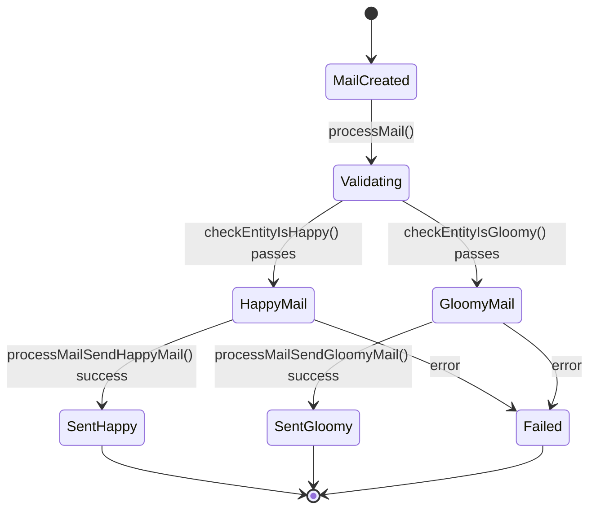
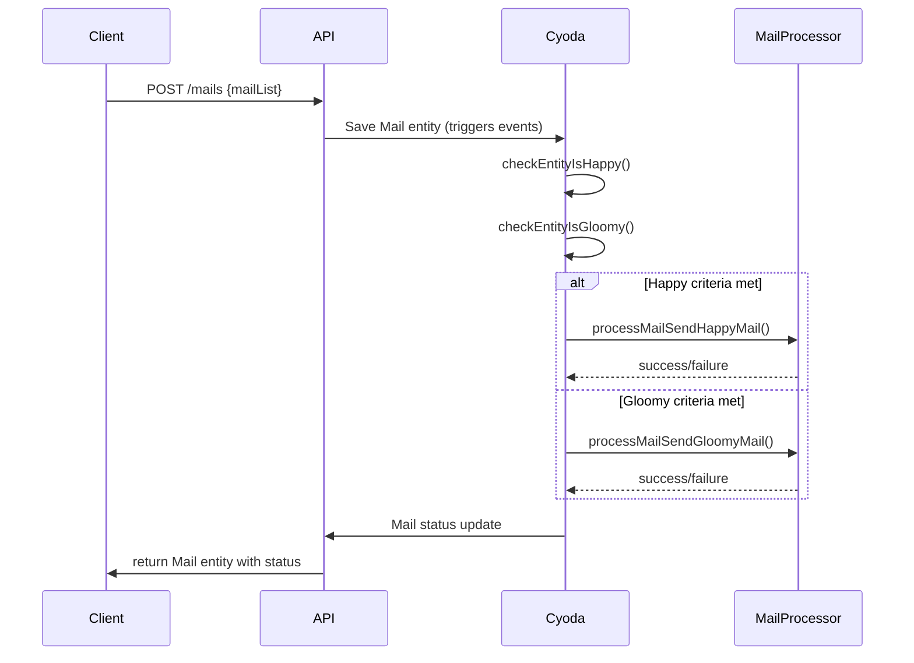

### 1. Entity Definitions
``` 
Mail:
- mailList: List<String> (list of email recipients)
- isHappy: Boolean (mail sentiment determined by criteria)
- status: MailStatusEnum (PENDING, SENT_HAPPY, SENT_GLOOMY, FAILED)
```

### 2. Process Method Flows

```
processMail() Flow:
1. Initial State: Mail created with PENDING status
2. Validation: Trigger checkEntityIsHappy() and checkEntityIsGloomy() criteria events
3. Decision:
   - If checkEntityIsHappy() passes, set isHappy = true and trigger processMailSendHappyMail()
   - Else if checkEntityIsGloomy() passes, set isHappy = false and trigger processMailSendGloomyMail()
4. Processing: Send the mail via corresponding processor
5. Completion: Update status to SENT_HAPPY or SENT_GLOOMY based on processing outcome, or FAILED if error occurs
```

### 3. API Endpoints Design

- POST `/mails` - Create new Mail entity (immutable), triggers criteria validations and sending processors automatically
- GET `/mails/{id}` - Retrieve Mail details including status and recipients

_No update/delete endpoints as per EDA principle._

### 4. Request/Response Formats

**Request:** POST `/mails`
```json
{
  "mailList": ["recipient1@example.com", "recipient2@example.com"]
}
```

**Response:**
```json
{
  "id": "mail-uuid",
  "mailList": ["recipient1@example.com", "recipient2@example.com"],
  "isHappy": true,
  "status": "SENT_HAPPY"
}
```

### Visual Representation


```mermaid
stateDiagram-v2
    [*] --> MailCreated
    MailCreated --> Validating : processMail()
    Validating --> HappyMail : checkEntityIsHappy() passes
    Validating --> GloomyMail : checkEntityIsGloomy() passes
    HappyMail --> SentHappy : processMailSendHappyMail() success
    GloomyMail --> SentGloomy : processMailSendGloomyMail() success
    HappyMail --> Failed : error
    GloomyMail --> Failed : error
    SentHappy --> [*]
    SentGloomy --> [*]
    Failed --> [*]
```


```mermaid
sequenceDiagram
    participant Client
    participant API
    participant Cyoda
    participant MailProcessor

    Client->>API: POST /mails {mailList}
    API->>Cyoda: Save Mail entity (triggers events)
    Cyoda->>Cyoda: checkEntityIsHappy()
    Cyoda->>Cyoda: checkEntityIsGloomy()
    alt Happy criteria met
        Cyoda->>MailProcessor: processMailSendHappyMail()
        MailProcessor-->>Cyoda: success/failure
    else Gloomy criteria met
        Cyoda->>MailProcessor: processMailSendGloomyMail()
        MailProcessor-->>Cyoda: success/failure
    end
    Cyoda->>API: Mail status update
    API->>Client: return Mail entity with status
```

---

You can copy-paste or adjust this as needed. Please let me know if you want to proceed or need further assistance!