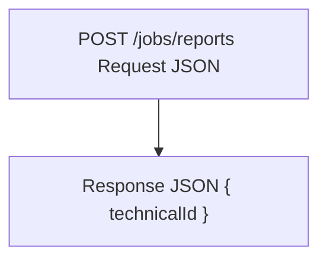
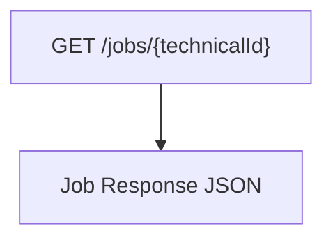
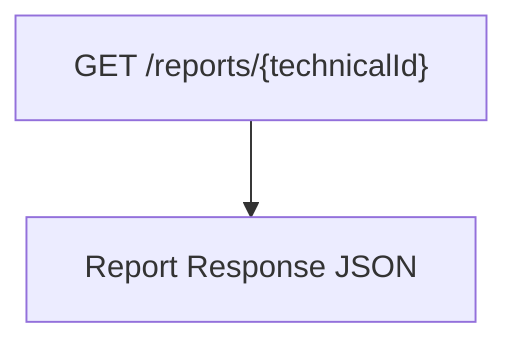
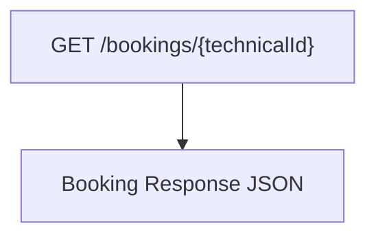

### 1. Entity Definitions
```
ReportJob:
- jobName: String (human name for job)
- initiatedBy: String (user or system)
- filterDateFrom: String (ISO date, optional)
- filterDateTo: String (ISO date, optional)
- minPrice: Number (optional)
- maxPrice: Number (optional)
- depositPaid: Boolean (optional)
- grouping: String (daily weekly monthly, optional)
- presentationType: String (table chart, optional)
- status: String (PENDING IN_PROGRESS COMPLETED FAILED)
- createdAt: String (ISO datetime)
- completedAt: String (ISO datetime, optional)

Booking:
- bookingId: String (source booking id from Restful Booker)
- customerName: String (guest name)
- checkInDate: String (ISO date)
- checkOutDate: String (ISO date)
- totalPrice: Number (total booking price)
- depositPaid: Boolean (deposit indicator)
- status: String (CONFIRMED CANCELLED)
- source: String (e.g., RestfulBooker)
- persistedAt: String (ISO datetime)

Report:
- reportId: String (internal id)
- jobRef: String (ReportJob.jobName or job id)
- periodFrom: String (ISO date)
- periodTo: String (ISO date)
- metrics: Object (totalRevenue avgPrice bookingCount)
- groupingBuckets: Array (group label -> metrics)
- presentationType: String (table chart)
- generatedAt: String (ISO datetime)
- downloadUrl: String (optional)
```

### 2. Entity workflows

ReportJob workflow:
1. Initial State: Job created with PENDING status (manual POST triggers event)
2. Validate: Check filter parameters and business rules (automatic)
3. Fetch Bookings: Trigger FetchBookingsProcessor to retrieve bookings from Restful Booker and persist Booking entities (automatic)
4. Filter & Aggregate: Apply FilterCriterion and AggregateProcessor to produce Report entity (automatic)
5. Complete: Mark job COMPLETED and attach generated Report; on errors mark FAILED (automatic)
6. Notify: Optional manual step to review and publish report (manual)

```mermaid
stateDiagram-v2
    [*] --> "PENDING"
    "PENDING" --> "VALIDATING" : ValidateJobCriterion, automatic
    "VALIDATING" --> "FETCHING" : StartFetchProcessor, automatic
    "FETCHING" --> "AGGREGATING" : FetchBookingsProcessor, automatic
    "AGGREGATING" --> "COMPLETED" : AggregateProcessor, automatic
    "AGGREGATING" --> "FAILED" : OnAggregationErrorProcessor, automatic
    "COMPLETED" --> "NOTIFY" : NotifyUsersProcessor, manual
    "NOTIFY" --> [*]
    "FAILED" --> [*]
```

Required processors and criteria for ReportJob:
- Criteria: ValidateJobCriterion (checks date ranges, price bounds)
- Processors: StartFetchProcessor, FetchBookingsProcessor, AggregateProcessor, OnAggregationErrorProcessor, NotifyUsersProcessor

Booking workflow:
1. Created by FetchBookingsProcessor with status CONFIRMED or CANCELLED
2. Enrichment: EnrichBookingProcessor adds normalized fields (automatic)
3. Persisted: Booking saved and available for queries (automatic)

```mermaid
stateDiagram-v2
    [*] --> "CREATED"
    "CREATED" --> "ENRICHING" : EnrichBookingProcessor, automatic
    "ENRICHING" --> "PERSISTED" : PersistBookingProcessor, automatic
    "PERSISTED" --> [*]
```

Required processors and criteria for Booking:
- Criteria: BookingValidityCriterion (dates/prices sane)
- Processors: EnrichBookingProcessor, PersistBookingProcessor

Report workflow:
1. Generated when AggregateProcessor completes (state GENERATING)
2. ValidateReport: ReportValidationCriterion ensures metrics exist (automatic)
3. Ready: Report persisted with generatedAt and downloadUrl (automatic)
4. Published: optional manual publishing/archival (manual)

```mermaid
stateDiagram-v2
    [*] --> "GENERATING"
    "GENERATING" --> "VALIDATING" : ReportValidationCriterion, automatic
    "VALIDATING" --> "READY" : PersistReportProcessor, automatic
    "READY" --> "PUBLISHED" : ManualPublishAction, manual
    "PUBLISHED" --> [*]
    "READY" --> [*]
```

Required processors and criteria for Report:
- Criteria: ReportValidationCriterion
- Processors: PersistReportProcessor, FormatForPresentationProcessor, ManualPublishAction

### 3. Pseudo code for processor classes

StartFetchProcessor:
```
class StartFetchProcessor {
  process(job) {
    if (!ValidateJobCriterion.check(job)) throw Error
    enqueue FetchBookingsProcessor with job filters
    job.status = IN_PROGRESS
    save(job)
  }
}
```

FetchBookingsProcessor:
```
class FetchBookingsProcessor {
  process(job) {
    results = call RestfulBooker API pages using job filters
    for each item in results:
      if BookingValidityCriterion.check(item):
        enriched = EnrichBookingProcessor.process(item)
        PersistBookingProcessor.process(enriched)
    end
    trigger AggregateProcessor with job reference
  }
}
```

AggregateProcessor:
```
class AggregateProcessor {
  process(job) {
    bookings = query bookings where source = RestfulBooker and match job filters
    aggregate = compute totalRevenue avgPrice bookingCount grouped by job.grouping
    report = build Report object with aggregate
    PersistReportProcessor.process(report)
    job.status = COMPLETED
    job.completedAt = now
    save(job)
  }
}
```

PersistBookingProcessor:
```
class PersistBookingProcessor {
  process(booking) {
    booking.persistedAt = now
    save booking to store
  }
}
```

PersistReportProcessor:
```
class PersistReportProcessor {
  process(report) {
    report.generatedAt = now
    save report
    FormatForPresentationProcessor.process(report)
  }
}
```

### 4. API Endpoints Design Rules

Rules applied:
- Only ReportJob has POST (orchestration). POST returns only technicalId.
- GET by technicalId available for ReportJob, Report, Booking to retrieve stored results.
- No GET by condition unless requested.

Endpoints:
1) Create report job
- POST /jobs/reports
Request JSON:
```json
{
  "jobName":"MonthlyRevenue",
  "initiatedBy":"alice",
  "filterDateFrom":"2025-07-01",
  "filterDateTo":"2025-07-31",
  "minPrice":0,
  "maxPrice":1000,
  "depositPaid":true,
  "grouping":"daily",
  "presentationType":"chart"
}
```
Response JSON (POST must return only technicalId):
```json
{
  "technicalId":"job_abc123"
}
```

Mermaid visualization of request/response:

```mermaid
graph TD
  Request_PostJob["POST /jobs/reports Request JSON"]
  Response_PostJob["Response JSON { technicalId }"]
  Request_PostJob --> Response_PostJob
```

2) Get job status
- GET /jobs/{technicalId}
Response JSON:
```json
{
  "technicalId":"job_abc123",
  "jobName":"MonthlyRevenue",
  "status":"COMPLETED",
  "createdAt":"2025-08-01T08:00:00Z",
  "completedAt":"2025-08-01T08:01:30Z",
  "reportId":"report_xyz789"
}
```

Mermaid:

```mermaid
graph TD
  GetJob["GET /jobs/{technicalId}"]
  JobResp["Job Response JSON"]
  GetJob --> JobResp
```

3) Get report by technicalId
- GET /reports/{technicalId}
Response JSON:
```json
{
  "reportId":"report_xyz789",
  "jobRef":"job_abc123",
  "periodFrom":"2025-07-01",
  "periodTo":"2025-07-31",
  "metrics":{"totalRevenue":12345.67,"avgPrice":234.56,"bookingCount":52},
  "groupingBuckets":[{"label":"2025-07-01","totalRevenue":123.45,"bookingCount":1}],
  "presentationType":"chart",
  "generatedAt":"2025-08-01T08:01:00Z",
  "downloadUrl":"/downloads/report_xyz789.csv"
}
```

Mermaid:

```mermaid
graph TD
  GetReport["GET /reports/{technicalId}"]
  ReportResp["Report Response JSON"]
  GetReport --> ReportResp
```

4) Get booking by technicalId
- GET /bookings/{technicalId}
Response JSON:
```json
{
  "bookingId":"RB_1001",
  "customerName":"John Doe",
  "checkInDate":"2025-07-05",
  "checkOutDate":"2025-07-08",
  "totalPrice":300.00,
  "depositPaid":true,
  "status":"CONFIRMED",
  "persistedAt":"2025-08-01T07:55:00Z"
}
```

Mermaid:

```mermaid
graph TD
  GetBooking["GET /bookings/{technicalId}"]
  BookingResp["Booking Response JSON"]
  GetBooking --> BookingResp
```

Notes / questions for you
- Confirm grouping granularity (day/week/month) and whether partially overlapping bookings count (I assumed partial overlap counts).
- Confirm currency/tax assumptions for totalPrice.
- Do you want scheduled recurring ReportJobs (yes/no)? If yes I will add scheduling states and fields.