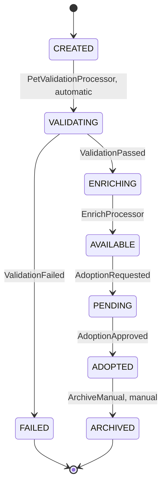
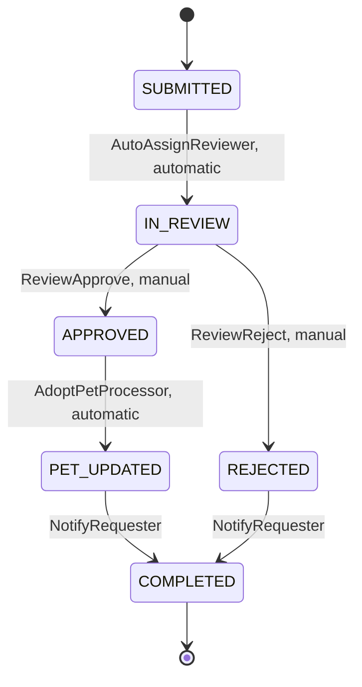
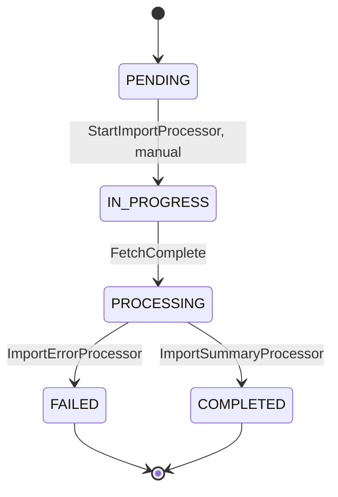
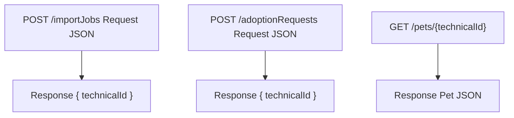

### 1. Entity Definitions
```
Pet:
- petId: string (external Petstore id)
- name: string (pet name)
- species: string (cat/dog/etc)
- breed: string
- age: integer (years/months)
- gender: string
- description: string
- tags: array<string>
- images: array<string> (urls)
- status: string (available pending adopted)
- source: string (Petstore/local)
- createdAt: datetime

AdoptionRequest:
- requestId: string (business id)
- petId: string (links to Pet.petId)
- requesterName: string
- requesterContact: string (email/phone)
- submittedAt: datetime
- status: string (submitted approved rejected cancelled)
- notes: string

ImportJob:
- jobId: string (business id)
- initiatedBy: string (user/admin)
- sourceUrl: string (Petstore endpoint)
- startedAt: datetime
- completedAt: datetime
- status: string (PENDING IN_PROGRESS COMPLETED FAILED)
- importedCount: integer
- errorMessage: string
```

### 2. Entity workflows

Pet workflow:
1. Initial State: CREATED on persistence (from ImportJob processor or manual ingest)
2. Validation: Run PetValidationCriterion (automatic)
3. Enrichment: Enrich images/tags (automatic)
4. Availability: status = AVAILABLE or PENDING (automatic)
5. Adoption: on AdoptionRequest approval set status = ADOPTED (manual by admin action via workflow)
6. Archive: optional removal (manual)

```mermaid
stateDiagram-v2
    [*] --> CREATED
    CREATED --> VALIDATING : PetValidationProcessor, automatic
    VALIDATING --> ENRICHING : ValidationPassed
    VALIDATING --> FAILED : ValidationFailed
    ENRICHING --> AVAILABLE : EnrichProcessor
    AVAILABLE --> PENDING : AdoptionRequested
    PENDING --> ADOPTED : AdoptionApproved
    ADOPTED --> ARCHIVED : ArchiveManual, manual
    FAILED --> [*]
    ARCHIVED --> [*]
```

AdoptionRequest workflow:
1. Submitted: POST creates request (event)
2. Review: Admin reviews (manual)
3. Decision: Approve -> triggers AdoptPetProcessor (automatic) and Notifier; Reject -> set REJECTED
4. Complete: Request closed

```mermaid
stateDiagram-v2
    [*] --> SUBMITTED
    SUBMITTED --> IN_REVIEW : AutoAssignReviewer, automatic
    IN_REVIEW --> APPROVED : ReviewApprove, manual
    IN_REVIEW --> REJECTED : ReviewReject, manual
    APPROVED --> PET_UPDATED : AdoptPetProcessor, automatic
    PET_UPDATED --> COMPLETED : NotifyRequester
    REJECTED --> COMPLETED : NotifyRequester
    COMPLETED --> [*]
```

ImportJob workflow:
1. PENDING (created via POST)
2. IN_PROGRESS: fetch Petstore data (automatic)
3. PROCESSING: upsert Pet entities (each pet persistence triggers Pet workflow)
4. COMPLETED or FAILED

```mermaid
stateDiagram-v2
    [*] --> PENDING
    PENDING --> IN_PROGRESS : StartImportProcessor, manual
    IN_PROGRESS --> PROCESSING : FetchComplete
    PROCESSING --> COMPLETED : ImportSummaryProcessor
    PROCESSING --> FAILED : ImportErrorProcessor
    FAILED --> [*]
    COMPLETED --> [*]
```

Criterion and processor classes (per entity)
- PetValidationCriterion
- PetValidationProcessor (validates fields, marks FAILED if invalid)
- PetEnrichProcessor (fetches images/tags)
- AdoptPetProcessor (sets Pet.status = adopted, records adopter)
- AdoptionAssignReviewerCriterion
- AdoptionNotifyProcessor
- ImportFetchProcessor (calls Petstore, returns payload)
- ImportUpsertProcessor (creates/updates Pet entities)
- ImportSummaryProcessor

### 3. Pseudo code for processor classes
PetValidationProcessor:
```
process(pet):
  if missing required fields or invalid data:
    pet.status = FAILED
  else:
    pet.status = VALIDATED
  save pet
```
ImportFetchProcessor:
```
process(job):
  response = fetch(job.sourceUrl)
  if response.error:
    job.status = FAILED
    job.errorMessage = response.error
    save job
    return
  job.status = PROCESSING
  save job
  for item in response.pets:
    emit persist Pet(item)  // each persistence triggers Pet workflow
  job.importedCount = count
  job.status = COMPLETED
  save job
```
AdoptPetProcessor:
```
process(request):
  pet = findPet(request.petId)
  if pet.status == AVAILABLE:
    pet.status = ADOPTED
    save pet
    request.status = APPROVED
  else:
    request.status = REJECTED
  save request
  NotifyRequester(request)
```

### 4. API Endpoints Design Rules & Request/Response formats

Rules applied:
- POST endpoints return only technicalId (simulated datastore id).
- Orchestration entity ImportJob has POST and GET by technicalId.
- AdoptionRequest is created via POST (user action) and has GET by technicalId.
- Pet is read-only via API (imported by ImportJob). Provide GET list and GET by technicalId.

Endpoints (JSON structures):

POST /importJobs
Request:
{
  "initiatedBy":"string",
  "sourceUrl":"string"
}
Response:
{ "technicalId":"string" }

POST /adoptionRequests
Request:
{
  "petId":"string",
  "requesterName":"string",
  "requesterContact":"string",
  "notes":"string"
}
Response:
{ "technicalId":"string" }

GET /pets/{technicalId}
Response:
{ "petId":"string","name":"string","species":"string","status":"string", ... }

GET /pets
Response: array of Pet objects

GET /importJobs/{technicalId}
Response: ImportJob object

GET /adoptionRequests/{technicalId}
Response: AdoptionRequest object

Mermaid visualization of request/response flows:

```mermaid
graph TD
  POST_ImportJob["POST /importJobs Request JSON"]
  POST_ImportJob --> ImportJobResponse["Response { technicalId }"]
  POST_Adopt["POST /adoptionRequests Request JSON"]
  POST_Adopt --> AdoptResponse["Response { technicalId }"]
  GET_Pet["GET /pets/{technicalId}"]
  GET_Pet --> PetResponse["Response Pet JSON"]
```

If you want, I can expand fields, add User entity, or add GET by condition filters (species/status). Which would you prefer next?